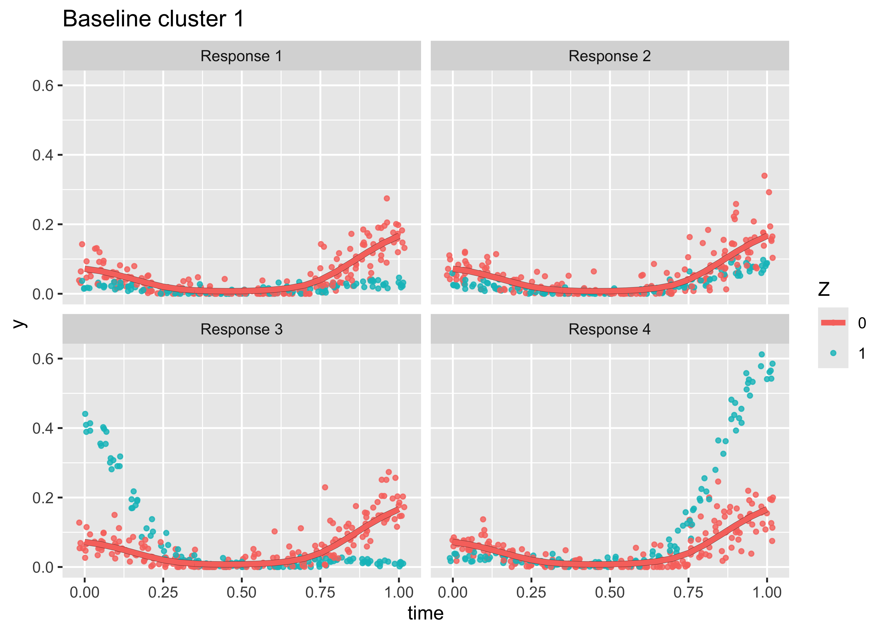
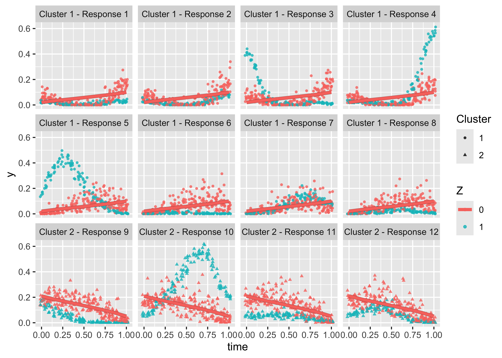

<!-- README.md is generated from README.Rmd. Please edit that file -->

# cleverly

<!-- badges: start -->
<!-- badges: end -->

Cleverly stands for (Cl)ustering with (E)xternal (V)ariabl(e)s in (R)
with (L)ongitudinal (Y)s.

## Installation

You can install the development version of cleverly from
[GitHub](https://github.com/) with:

``` r
# install.packages("pak")
pak::pak("empalmer/cleverly")
library(cleverly)
```

## Example

Simulate data with independence structure, then run cleverly assuming an
independence structure:

``` r
set.seed(127)
sim <- simulation_data(n = 20,
                       range_start = 5000,
                       range_end = 20000,
                       nknots = 3,
                       K = 12,
                       order = 3,
                       user_var = 1000,
                       cor_str = "IND")

Y <- dplyr::select(sim, -c(
  "total_n",
  "Capture.Number",
  "Z"))
Z <- sim$Z

true_cluster <- rep(1:3, each = 4)

res <- cleverly(Y = Y,
                Z = Z,
                subject_ids = individual,
                lp = 0,
                time = time,
                cor_str = "IND",
                theta = 300,
                parralel = F,
                psi_min = 10,
                psi_max = 1400,
                npsi = 3,
                gammas = c(1, 1)) %>%
  get_cluster_diagnostics(true_cluster)
#> [1] "Initializing beta values for psi = 10"
#> [1] "Outer loop iteration: 1"
#>  [1]  1  2  3  4  5  6  7  8  9 10 11 12
#> [1] "Outer loop iteration: 2"
#>  [1]  1  2  3  4  5  6  7  8  9 10 11 12
#> [1] "Outer loop iteration: 3"
#>  [1]  1  2  3  4  5  6  7  8  9 10 11 12
#> [1] "Clusters not changing, exiting"
#> [1] "Initializing beta values for psi = 705"
#> [1] "Outer loop iteration: 1"
#>  [1] 1 1 1 1 2 2 2 2 3 3 3 3
#> [1] "Outer loop iteration: 2"
#>  [1] 1 1 1 1 2 2 2 2 3 3 3 3
#> [1] "Outer loop iteration: 3"
#>  [1] 1 1 1 1 2 2 2 2 3 3 3 3
#> [1] "Clusters not changing, exiting"
#> [1] "Initializing beta values for psi = 1400"
#> [1] "Outer loop iteration: 1"
#>  [1] 1 1 1 1 2 2 2 2 3 3 3 3
#> [1] "Outer loop iteration: 2"
#>  [1] 1 1 1 1 2 2 2 2 3 3 3 3
#> [1] "Outer loop iteration: 3"
#>  [1] 1 1 1 1 2 2 2 2 3 3 3 3
#> [1] "Clusters not changing, exiting"
#> [1] "psi:10, cluster:list(membership = c(1, 2, 3, 4, 5, 6, 7, 8, 9, 10, 11, 12), csize = c(1, 1, 1, 1, 1, 1, 1, 1, 1, 1, 1, 1), no = 12)"
#> [2] "psi:705, cluster:list(membership = c(1, 1, 1, 1, 2, 2, 2, 2, 3, 3, 3, 3), csize = c(4, 4, 4), no = 3)"                              
#> [3] "psi:1400, cluster:list(membership = c(1, 1, 1, 1, 2, 2, 2, 2, 3, 3, 3, 3), csize = c(4, 4, 4), no = 3)"                             
#> [1] "chosen psi: 705, clusterc(1, 1, 1, 1, 2, 2, 2, 2, 3, 3, 3, 3)"
#> [2] "chosen psi: 705, clusterc(4, 4, 4)"                           
#> [3] "chosen psi: 705, cluster3"
```

# Diagnostics:

Since we know the true clusters:

``` r
res$cluster_diagnostics
#>   rand adj_rand jaccard CER nclust
#> 1    1        1       1   0      3
```

We selected the exact right clusters!

Visualize the data + clusters

``` r
plot_clusters(res,
              Z = rep(Z, 12),
              response_names = 1:12, 
              Z_type = "binary")
```



Look at BIC values for the different hyper parameter values tested:

``` r
plot_BIC(res, BIC_type = "BIC", psis = seq(600, 1400, length.out = 1))
```



<!--
This is a basic example which shows you how to solve a common problem:
&#10;
``` r
library(cleverly)
## basic example code
```
&#10;What is special about using `README.Rmd` instead of just `README.md`? You can include R chunks like so:
&#10;
``` r
summary(cars)
#>      speed           dist       
#>  Min.   : 4.0   Min.   :  2.00  
#>  1st Qu.:12.0   1st Qu.: 26.00  
#>  Median :15.0   Median : 36.00  
#>  Mean   :15.4   Mean   : 42.98  
#>  3rd Qu.:19.0   3rd Qu.: 56.00  
#>  Max.   :25.0   Max.   :120.00
```
&#10;You'll still need to render `README.Rmd` regularly, to keep `README.md` up-to-date. `devtools::build_readme()` is handy for this.
&#10;You can also embed plots, for example:
&#10;
&#10;In that case, don't forget to commit and push the resulting figure files, so they display on GitHub and CRAN.
-->
