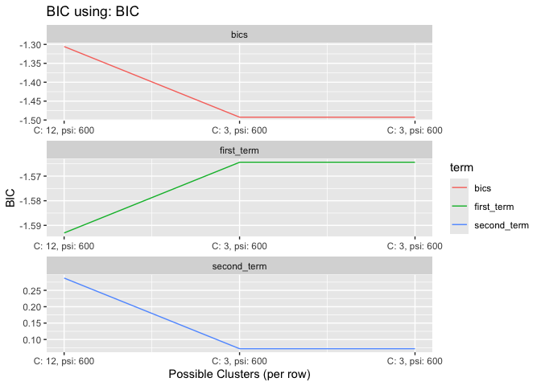

<!-- README.md is generated from README.Rmd. Please edit that file -->

# cleverly

<!-- badges: start -->
<!-- badges: end -->

Cleverly stands for (Cl)ustering with (E)xternal (V)ariabl(e)s in (R)
with (L)ongitudinal (Y)s.

## Installation

You can install the development version of cleverly from
[GitHub](https://github.com/) with:

``` r
# install.packages("pak")
pak::pak("empalmer/cleverly")
#> ℹ Loading metadata database
#> ✔ Loading metadata database ... done
#> 
#> 
#> → Will install 70 packages.
#> → Will update 1 package.
#> → Will download 36 CRAN packages (33.01 MB), cached: 34 (66.56 MB).
#> → Will download 1 package with unknown size.
#> + abind                      1.4-8       ⬇ (65.11 kB)
#> + ash                        1.0-15     🔧 ⬇ (32.27 kB)
#> + bitops                     1.0-9      🔧 ⬇ (32.63 kB)
#> + cleverly      0.0.0.9044 → 0.0.0.9044 👷🏿‍♀️🔧 ⬇ (GitHub: 2d836e6)
#> + cli                        3.6.5      🔧
#> + colorspace                 2.1-1      🔧 ⬇ (2.67 MB)
#> + deSolve                    1.40       🔧 ⬇ (2.63 MB)
#> + digest                     0.6.37     🔧 ⬇ (356.05 kB)
#> + dirmult                    0.1.3-5     ⬇ (74.47 kB)
#> + dplyr                      1.1.4      🔧
#> + evaluate                   1.0.3       ⬇ (101.68 kB)
#> + fansi                      1.0.6      🔧 ⬇ (383.06 kB)
#> + farver                     2.1.2      🔧 ⬇ (1.97 MB)
#> + fda                        6.3.0      
#> + fds                        1.8        
#> + FNN                        1.1.4.1    🔧 ⬇ (130.43 kB)
#> + fossil                     0.4.0       ⬇ (185.02 kB)
#> + furrr                      0.3.1      
#> + future                     1.49.0     
#> + generics                   0.1.4      
#> + ggnewscale                 0.5.1      
#> + ggplot2                    3.5.2      
#> + globals                    0.18.0     
#> + glue                       1.8.0      🔧 ⬇ (173.70 kB)
#> + gridExtra                  2.3         ⬇ (1.11 MB)
#> + gtable                     0.3.6      
#> + hdrcde                     3.4        🔧
#> + highr                      0.11        ⬇ (37.55 kB)
#> + igraph                     2.1.4      🔧
#> + isoband                    0.2.7      🔧 ⬇ (1.87 MB)
#> + kernlab                    0.9-33     🔧 ⬇ (2.32 MB)
#> + knitr                      1.50       
#> + ks                         1.15.1     🔧
#> + labeling                   0.4.3       ⬇ (61.49 kB)
#> + lifecycle                  1.0.4       ⬇ (124.78 kB)
#> + listenv                    0.9.1       ⬇ (106.97 kB)
#> + locfit                     1.5-9.12   🔧
#> + magic                      1.6-1       ⬇ (407.07 kB)
#> + magrittr                   2.0.3      🔧 ⬇ (233.52 kB)
#> + maps                       3.4.2.1    🔧 ⬇ (3.11 MB)
#> + mclust                     6.1.1      🔧 ⬇ (4.27 MB)
#> + multicool                  1.0.1      🔧 ⬇ (618.32 kB)
#> + mvtnorm                    1.3-3      🔧 ⬇ (1.00 MB)
#> + parallelly                 1.44.0     🔧
#> + pcaPP                      2.0-5      🔧 ⬇ (633.07 kB)
#> + pillar                     1.10.2     
#> + pkgconfig                  2.0.3       ⬇ (18.45 kB)
#> + pracma                     2.4.4       ⬇ (1.77 MB)
#> + purrr                      1.0.4      🔧
#> + R6                         2.6.1      
#> + rainbow                    3.8        
#> + RColorBrewer               1.1-3       ⬇ (53.32 kB)
#> + Rcpp                       1.0.14     🔧 ⬇ (3.36 MB)
#> + RcppArmadillo              14.4.3-1   🔧
#> + RCurl                      1.98-1.17  🔧
#> + rlang                      1.1.6      🔧
#> + scales                     1.4.0      
#> + shapefiles                 0.7.2       ⬇ (50.78 kB)
#> + sp                         2.2-0      🔧
#> + stringi                    1.8.7      🔧
#> + stringr                    1.5.1      
#> + tibble                     3.2.1      🔧
#> + tidyr                      1.3.1      🔧 ⬇ (1.32 MB)
#> + tidyselect                 1.2.1      
#> + utf8                       1.2.5      🔧
#> + vctrs                      0.6.5      🔧
#> + viridis                    0.6.5      
#> + viridisLite                0.4.2       ⬇ (1.30 MB)
#> + withr                      3.0.2       ⬇ (222.97 kB)
#> + xfun                       0.52       🔧
#> + yaml                       2.3.10     🔧 ⬇ (217.63 kB)
#> ℹ Getting 36 pkgs (33.01 MB) and 1 pkg with unknown size, 34 (66.56 MB) cached
#> ✔ Cached copy of cleverly 0.0.0.9044 (source) is the latest build
#> ✔ Cached copy of FNN 1.1.4.1 (aarch64-apple-darwin20) is the latest build
#> ✔ Cached copy of RColorBrewer 1.1-3 (aarch64-apple-darwin20) is the latest build
#> ✔ Cached copy of Rcpp 1.0.14 (aarch64-apple-darwin20) is the latest build
#> ✔ Cached copy of abind 1.4-8 (aarch64-apple-darwin20) is the latest build
#> ✔ Cached copy of bitops 1.0-9 (aarch64-apple-darwin20) is the latest build
#> ✔ Cached copy of colorspace 2.1-1 (aarch64-apple-darwin20) is the latest build
#> ✔ Cached copy of deSolve 1.40 (aarch64-apple-darwin20) is the latest build
#> ✔ Cached copy of digest 0.6.37 (aarch64-apple-darwin20) is the latest build
#> ✔ Cached copy of evaluate 1.0.3 (aarch64-apple-darwin20) is the latest build
#> ✔ Cached copy of fansi 1.0.6 (aarch64-apple-darwin20) is the latest build
#> ✔ Cached copy of farver 2.1.2 (aarch64-apple-darwin20) is the latest build
#> ✔ Cached copy of fossil 0.4.0 (aarch64-apple-darwin20) is the latest build
#> ✔ Cached copy of gridExtra 2.3 (aarch64-apple-darwin20) is the latest build
#> ✔ Cached copy of highr 0.11 (aarch64-apple-darwin20) is the latest build
#> ✔ Cached copy of isoband 0.2.7 (aarch64-apple-darwin20) is the latest build
#> ✔ Cached copy of kernlab 0.9-33 (aarch64-apple-darwin20) is the latest build
#> ✔ Cached copy of labeling 0.4.3 (aarch64-apple-darwin20) is the latest build
#> ✔ Cached copy of lifecycle 1.0.4 (aarch64-apple-darwin20) is the latest build
#> ✔ Cached copy of listenv 0.9.1 (aarch64-apple-darwin20) is the latest build
#> ✔ Cached copy of magrittr 2.0.3 (aarch64-apple-darwin20) is the latest build
#> ✔ Cached copy of maps 3.4.2.1 (aarch64-apple-darwin20) is the latest build
#> ✔ Cached copy of mclust 6.1.1 (aarch64-apple-darwin20) is the latest build
#> ✔ Cached copy of multicool 1.0.1 (aarch64-apple-darwin20) is the latest build
#> ✔ Cached copy of mvtnorm 1.3-3 (aarch64-apple-darwin20) is the latest build
#> ✔ Cached copy of pcaPP 2.0-5 (aarch64-apple-darwin20) is the latest build
#> ✔ Cached copy of pkgconfig 2.0.3 (aarch64-apple-darwin20) is the latest build
#> ✔ Cached copy of pracma 2.4.4 (aarch64-apple-darwin20) is the latest build
#> ✔ Cached copy of shapefiles 0.7.2 (aarch64-apple-darwin20) is the latest build
#> ✔ Cached copy of tidyr 1.3.1 (aarch64-apple-darwin20) is the latest build
#> ✔ Cached copy of viridisLite 0.4.2 (aarch64-apple-darwin20) is the latest build
#> ✔ Cached copy of withr 3.0.2 (aarch64-apple-darwin20) is the latest build
#> ✔ Got ash 1.0-15 (aarch64-apple-darwin20) (32.22 kB)
#> ✔ Got magic 1.6-1 (aarch64-apple-darwin20) (406.04 kB)
#> ✔ Got dirmult 0.1.3-5 (aarch64-apple-darwin20) (74.63 kB)
#> ✔ Got generics 0.1.4 (aarch64-apple-darwin20) (81.51 kB)
#> ✔ Got globals 0.18.0 (aarch64-apple-darwin20) (160.06 kB)
#> ✔ Got glue 1.8.0 (aarch64-apple-darwin20) (173.00 kB)
#> ✔ Got yaml 2.3.10 (aarch64-apple-darwin20) (217.14 kB)
#> ✔ Installed cleverly 0.0.0.9044 (github::empalmer/cleverly@2d836e6) (90ms)
#> ✔ Installed FNN 1.1.4.1  (93ms)
#> ✔ Installed R6 2.6.1  (98ms)
#> ✔ Installed RColorBrewer 1.1-3  (114ms)
#> ✔ Installed RCurl 1.98-1.17  (116ms)
#> ✔ Installed abind 1.4-8  (98ms)
#> ✔ Installed ash 1.0-15  (95ms)
#> ✔ Installed RcppArmadillo 14.4.3-1  (145ms)
#> ✔ Installed Rcpp 1.0.14  (146ms)
#> ✔ Installed bitops 1.0-9  (125ms)
#> ✔ Installed cli 3.6.5  (45ms)
#> ✔ Installed colorspace 2.1-1  (33ms)
#> ✔ Installed deSolve 1.40  (32ms)
#> ✔ Installed digest 0.6.37  (29ms)
#> ✔ Installed dirmult 0.1.3-5  (61ms)
#> ✔ Installed dplyr 1.1.4  (63ms)
#> ✔ Installed evaluate 1.0.3  (28ms)
#> ✔ Installed fansi 1.0.6  (26ms)
#> ✔ Installed farver 2.1.2  (28ms)
#> ✔ Installed fda 6.3.0  (27ms)
#> ✔ Installed fds 1.8  (27ms)
#> ✔ Installed fossil 0.4.0  (25ms)
#> ✔ Installed furrr 0.3.1  (26ms)
#> ✔ Installed future 1.49.0  (29ms)
#> ✔ Installed generics 0.1.4  (27ms)
#> ✔ Installed ggnewscale 0.5.1  (45ms)
#> ✔ Installed ggplot2 3.5.2  (34ms)
#> ✔ Installed globals 0.18.0  (30ms)
#> ✔ Installed glue 1.8.0  (27ms)
#> ✔ Installed gridExtra 2.3  (26ms)
#> ✔ Installed gtable 0.3.6  (26ms)
#> ✔ Installed hdrcde 3.4  (27ms)
#> ✔ Installed highr 0.11  (27ms)
#> ✔ Installed isoband 0.2.7  (17ms)
#> ✔ Installed igraph 2.1.4  (61ms)
#> ✔ Installed kernlab 0.9-33  (28ms)
#> ✔ Installed knitr 1.50  (51ms)
#> ✔ Installed ks 1.15.1  (33ms)
#> ✔ Installed labeling 0.4.3  (26ms)
#> ✔ Installed lifecycle 1.0.4  (27ms)
#> ✔ Installed listenv 0.9.1  (27ms)
#> ✔ Installed locfit 1.5-9.12  (26ms)
#> ✔ Installed magic 1.6-1  (25ms)
#> ✔ Installed magrittr 2.0.3  (27ms)
#> ✔ Installed maps 3.4.2.1  (28ms)
#> ✔ Installed mclust 6.1.1  (27ms)
#> ✔ Installed multicool 1.0.1  (28ms)
#> ✔ Installed mvtnorm 1.3-3  (45ms)
#> ✔ Installed parallelly 1.44.0  (28ms)
#> ✔ Installed pcaPP 2.0-5  (27ms)
#> ✔ Installed pillar 1.10.2  (27ms)
#> ✔ Installed pkgconfig 2.0.3  (26ms)
#> ✔ Installed pracma 2.4.4  (26ms)
#> ✔ Installed purrr 1.0.4  (28ms)
#> ✔ Installed rainbow 3.8  (27ms)
#> ✔ Installed rlang 1.1.6  (27ms)
#> ✔ Installed scales 1.4.0  (27ms)
#> ✔ Installed shapefiles 0.7.2  (40ms)
#> ✔ Installed sp 2.2-0  (44ms)
#> ✔ Installed stringr 1.5.1  (14ms)
#> ✔ Installed stringi 1.8.7  (60ms)
#> ✔ Installed tibble 3.2.1  (31ms)
#> ✔ Installed tidyr 1.3.1  (29ms)
#> ✔ Installed tidyselect 1.2.1  (27ms)
#> ✔ Installed utf8 1.2.5  (26ms)
#> ✔ Installed vctrs 0.6.5  (27ms)
#> ✔ Installed viridisLite 0.4.2  (26ms)
#> ✔ Installed viridis 0.6.5  (27ms)
#> ✔ Installed withr 3.0.2  (45ms)
#> ✔ Installed xfun 0.52  (28ms)
#> ✔ Installed yaml 2.3.10  (16ms)
#> ✔ 1 pkg + 79 deps: kept 2, upd 1, added 70, dld 7 (1.14 MB) [6.1s]
library(cleverly)
```

``` r
set.seed(127)
sim <- simulation_data(n = 20,
                       range_start = 5000,
                       range_end = 20000,
                       nknots = 3,
                       K = 12,
                       order = 3,
                       user_var = 1000,
                       cor_str = "IND")

Y <- dplyr::select(sim, -c(
  "total_n",
  "Capture.Number",
  "Z"))
Z <- sim$Z

true_cluster <- rep(1:3, each = 4)

res <- cleverly(Y = Y,
                Z = Z,
                subject_ids = individual,
                lp = 0,
                time = time,
                cor_str = "IND",
                theta = 300,
                parralel = F,
                psi_min = 10,
                psi_max = 1400,
                npsi = 3,
                gammas = c(1, 1)) %>%
  get_cluster_diagnostics(true_cluster)
#> [1] "Initializing beta values for psi = 10"
#> [1] "Outer loop iteration: 1"
#>  [1]  1  2  3  4  5  6  7  8  9 10 11 12
#> [1] "Outer loop iteration: 2"
#>  [1]  1  2  3  4  5  6  7  8  9 10 11 12
#> [1] "Outer loop iteration: 3"
#>  [1]  1  2  3  4  5  6  7  8  9 10 11 12
#> [1] "Clusters not changing, exiting"
#> [1] "Initializing beta values for psi = 705"
#> [1] "Outer loop iteration: 1"
#>  [1] 1 1 1 1 2 2 2 2 3 3 3 3
#> [1] "Outer loop iteration: 2"
#>  [1] 1 1 1 1 2 2 2 2 3 3 3 3
#> [1] "Outer loop iteration: 3"
#>  [1] 1 1 1 1 2 2 2 2 3 3 3 3
#> [1] "Clusters not changing, exiting"
#> [1] "Initializing beta values for psi = 1400"
#> [1] "Outer loop iteration: 1"
#>  [1] 1 1 1 1 2 2 2 2 3 3 3 3
#> [1] "Outer loop iteration: 2"
#>  [1] 1 1 1 1 2 2 2 2 3 3 3 3
#> [1] "Outer loop iteration: 3"
#>  [1] 1 1 1 1 2 2 2 2 3 3 3 3
#> [1] "Clusters not changing, exiting"
#> [1] "psi:10, cluster:list(membership = c(1, 2, 3, 4, 5, 6, 7, 8, 9, 10, 11, 12), csize = c(1, 1, 1, 1, 1, 1, 1, 1, 1, 1, 1, 1), no = 12)"
#> [2] "psi:705, cluster:list(membership = c(1, 1, 1, 1, 2, 2, 2, 2, 3, 3, 3, 3), csize = c(4, 4, 4), no = 3)"                              
#> [3] "psi:1400, cluster:list(membership = c(1, 1, 1, 1, 2, 2, 2, 2, 3, 3, 3, 3), csize = c(4, 4, 4), no = 3)"                             
#> [1] "chosen psi: 705, clusterc(1, 1, 1, 1, 2, 2, 2, 2, 3, 3, 3, 3)"
#> [2] "chosen psi: 705, clusterc(4, 4, 4)"                           
#> [3] "chosen psi: 705, cluster3"
```

# Diagnostics:

``` r
res$cluster_diagnostics
#>   rand adj_rand jaccard CER nclust
#> 1    1        1       1   0      3
plot_clusters(res,
              Z = rep(Z, 12),
              response_names = 1:12, 
              Z_type = "binary")
```


``` r
plot_BIC(res, BIC_type = "BIC", psis = seq(600, 1400, length.out = 1))
```



<!--
This is a basic example which shows you how to solve a common problem:
&#10;
``` r
library(cleverly)
## basic example code
```
&#10;What is special about using `README.Rmd` instead of just `README.md`? You can include R chunks like so:
&#10;
``` r
summary(cars)
#>      speed           dist       
#>  Min.   : 4.0   Min.   :  2.00  
#>  1st Qu.:12.0   1st Qu.: 26.00  
#>  Median :15.0   Median : 36.00  
#>  Mean   :15.4   Mean   : 42.98  
#>  3rd Qu.:19.0   3rd Qu.: 56.00  
#>  Max.   :25.0   Max.   :120.00
```
&#10;You'll still need to render `README.Rmd` regularly, to keep `README.md` up-to-date. `devtools::build_readme()` is handy for this.
&#10;You can also embed plots, for example:
&#10;
&#10;In that case, don't forget to commit and push the resulting figure files, so they display on GitHub and CRAN.
-->
