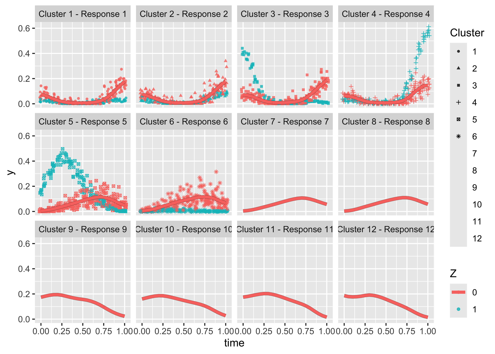
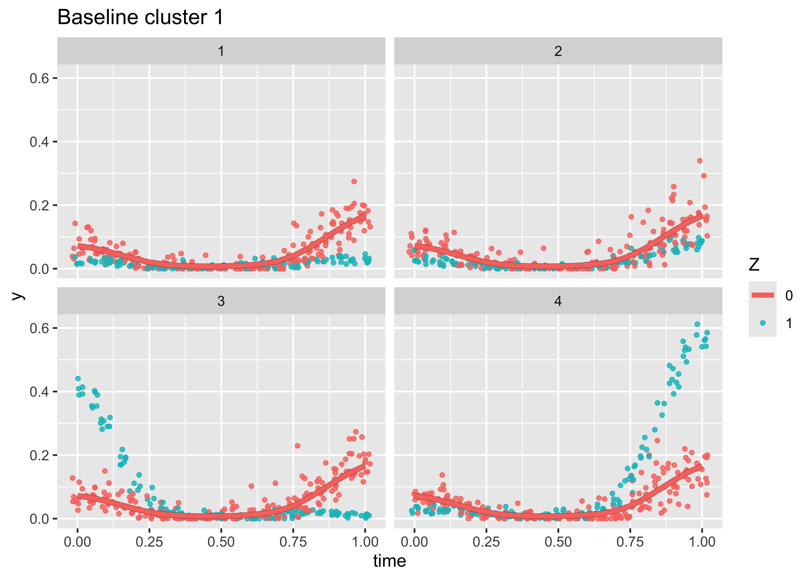
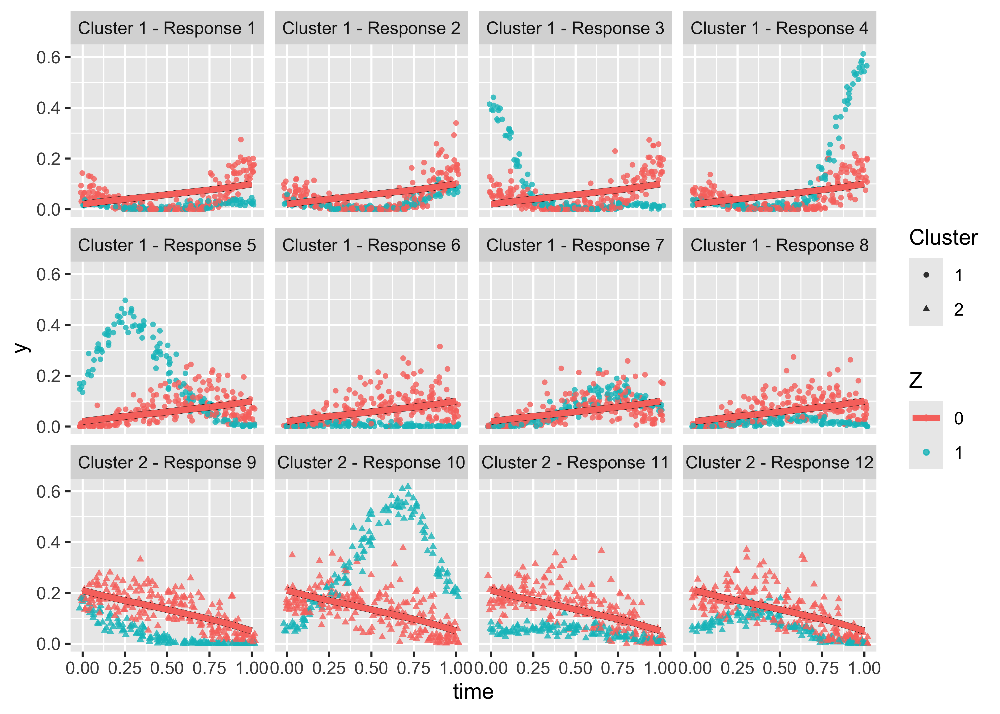
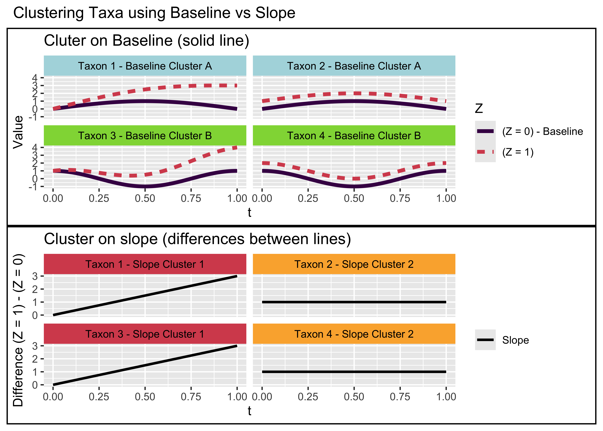

<!-- README.md is generated from README.Rmd. Please edit that file -->

# cleverly

Cleverly stands for (Cl)ustering with (E)xternal (V)ariabl(e)s in (R)
with (L)ongitudinal (Y)s.

# Installation

You can install the development version of `cleverly` from
[GitHub](https://github.com/) with:

``` r
# install.packages("pak")
pak::pak("empalmer/cleverly")
library(cleverly)
```

NOTE! This package is still in development, so be sure to make sure you
have the most up-to-date version.

Check what version you have installed with:

``` r
packageVersion("cleverly") 
```

Then update the package if needed:

``` r
pak::pkg_install("empalmer/cleverly")
```

With package updates, the names and format of the output may change, so
be sure to check the documentation and examples. Clustering results
should not change, but the format of the output may.

# Example usage:

## Simulate example data

Simulate compositional count data with longitudinal independence
structure. This code will simulate 20 samples across 12 responses, using
a binary external variable $Z$. Default arguments to `simulation_data`
simulate 3 baseline clusters with 4 members each.

``` r
set.seed(127)
sim <- simulation_data(n = 20,
                       K = 12,
                       user_var = 1000,
                       cor_str = "IND", 
                       Z_type = "binary")

Y <- sim$Y
Z <- sim$Z

true_cluster <- rep(1:3, each = 4)

head(Y)
#>   time individual Response_1 Response_2 Response_3 Response_4 Response_5
#> 1 0.00          1        293        644        670        347          2
#> 2 0.05          1        808       1609        834       1352         71
#> 3 0.10          1        366        363        228        382         14
#> 4 0.15          1        406        268        297       1221        191
#> 5 0.20          1        852        651        853        467        503
#> 6 0.25          1         22        173        377        195       6759
#>   Response_6 Response_7 Response_8 Response_9 Response_10 Response_11
#> 1         36         17          0       1025         941         769
#> 2        252        227          0       2536        3872        1931
#> 3          0          0        184       1401         832        1130
#> 4       1090        191        143       4871        3308        5108
#> 5        661        344        279       2944        2705        3235
#> 6        172        214        172        666        2355         884
#>   Response_12
#> 1        1088
#> 2        3665
#> 3        1218
#> 4        2004
#> 5        2666
#> 6        1614
head(Z)
#> [1] 0 0 0 0 0 1
```

$Y$ is a data frame of 12 counts with a column of time and a column of
individual. Z is a vector of binary external variables.

## Run algorithm:

We now run the `cleverly` algorithm, specifying the commonly needed
arguments. Here, we specify subject_ids = individual, as individual is
the id column in Y. We could have alternately given a vector of IDs.
Similarly for time. `cleverly` needs to select the ideal tuning
parameter `psi` - so we give a range of `psi_min` to `psi_max`, and a
number (`npsi`) to test (6).

We set `cluster_index` to 0 because we want to cluster on the baseline
values, i.e. when $Z = 0$. If we want to cluster on the slope value,
i.e. the effect of $Z$, we would set `cluster_index` to 1.

``` r
res <- cleverly(Y = Y,
                Z = Z,
                subject_ids = individual,
                time = time,
                cluster_index = 0,
                cor_str = "IND",
                psi_min = 10,
                psi_max = 5000,
                npsi = 3) 
#> [1] "Initializing for psi = 10"
#> [1] "Iteration: 1"
#> [1] "Iteration: 2"
#> [1] "Iteration: 3"
#> [1] "Cluster membership: "
#>  [1]  1  2  3  4  5  6  7  8  9 10 11 12
#> [1] "Clusters not changing, exiting"
#> [1] "Initializing for psi = 2505"
#> [1] "Iteration: 1"
#> [1] "Iteration: 2"
#> [1] "Iteration: 3"
#> [1] "Cluster membership: "
#>  [1] 1 1 1 1 2 2 2 2 3 3 3 3
#> [1] "Clusters not changing, exiting"
#> [1] "Initializing for psi = 5000"
#> [1] "Iteration: 1"
#> [1] "Iteration: 2"
#> [1] "Iteration: 3"
#> [1] "Cluster membership: "
#>  [1] 1 1 1 1 1 1 1 1 1 1 1 1
#> [1] "Clusters not changing, exiting"
#> [1] "Chosen psi (via BIC): 2505"
```

## Results

``` r
names(res)
#>  [1] "clusters"          "y_hat"             "y_hat_init"       
#>  [4] "y_hat_baseline"    "y_hat_refit"       "B"                
#>  [7] "Z"                 "BIC"               "BIC_ra_group"     
#> [10] "error"             "rho"               "phi"              
#> [13] "psi"               "v"                 "beta"             
#> [16] "possible_clusters" "s"
```

## Diagnostics:

Since we know the true clusters, we can look at the Rand index, adjusted
rand index, jaccard index, classification error rate, and number of
clusters:

``` r
get_cluster_diagnostics(res, true_cluster)$cluster_diagnostics
#>   rand adj_rand jaccard CER nclust
#> 1    1        1       1   0      3
```

We selected the exact right clusters!

## Visualizations

Visualize the data + clusters

``` r
plot_clusters(res)
```



Alternatively, if we want to examine a single cluster:

``` r
plot_one_cluster(res, cluster_val = 1)
```



## Simulate example data (continuous, slope)

`cleverly` also works with continuous external variables, and can
additionally cluster on the slope response:

We first simulation data with a continuous external variable, stored in
`sim_cont`, and then run the algorithm.

``` r
Y_cont <- sim_cont$Y
Z_cont <- sim_cont$Z

head(Z_cont)
#> [1] 1.493462 1.169092 2.298965 2.261202 0.015840 2.704212

res_cont <- cleverly(Y = Y_cont,
                     Z = Z_cont,
                     subject_ids = individual,
                     time = time,
                     cluster_index = 1,
                     cor_str = "IND",
                     psi_min = 10,
                     psi_max = 5000,
                     npsi = 3) 
#> [1] "Initializing for psi = 10"
#> [1] "Iteration: 1"
#> [1] "Iteration: 2"
#> [1] "Iteration: 3"
#> [1] "Iteration: 4"
#> [1] "Iteration: 5"
#> [1] "Cluster membership: "
#>  [1]  1  2  3  4  5  6  7  8  9 10 11  9
#> [1] "Clusters not changing, exiting"
#> [1] "Initializing for psi = 2505"
#> [1] "Iteration: 1"
#> [1] "Iteration: 2"
#> [1] "Iteration: 3"
#> [1] "Cluster membership: "
#>  [1] 1 1 1 1 1 1 1 1 1 1 1 1
#> [1] "Clusters not changing, exiting"
#> [1] "Initializing for psi = 5000"
#> [1] "Iteration: 1"
#> [1] "Iteration: 2"
#> [1] "Iteration: 3"
#> [1] "Cluster membership: "
#>  [1] 1 1 1 1 1 1 1 1 1 1 1 1
#> [1] "Clusters not changing, exiting"
#> [1] "Chosen psi (via BIC): 2505"
```

We change `cluster_index` to 1 to indicate that we will cluster based on
the slope.

To plot a slope cluster, we specify `curve_type = "slope"` in the
plotting function. We can additionally pass along the response names, as
it defaults to 1:nresponses as titles. In the case of a continuous
external variable and slope clustering, we also have to pass along the
original counts, which are stored in `Y_counts`.

``` r
# plot_clusters(res_cont,
#               curve_type = "slope",
#               response_names = paste0("Response ", 1:12),
#               Y_counts = Y_cont[,3:14])
```

## Troubleshooting:

### Too small hyper parameter range

``` r
res <- cleverly(Y = Y,
                Z = Z,
                subject_ids = individual,
                time = time,
                cluster_index = 0,
                cor_str = "IND",
                psi_min = 10,
                psi_max = 11,
                npsi = 3) 
#> [1] "Initializing for psi = 10"
#> [1] "Iteration: 1"
#> [1] "Iteration: 2"
#> [1] "Iteration: 3"
#> [1] "Cluster membership: "
#>  [1]  1  2  3  4  5  6  7  8  9 10 11 12
#> [1] "Clusters not changing, exiting"
#> [1] "Initializing for psi = 10.5"
#> [1] "Iteration: 1"
#> [1] "Iteration: 2"
#> [1] "Iteration: 3"
#> [1] "Cluster membership: "
#>  [1]  1  2  3  4  5  6  7  8  9 10 11 12
#> [1] "Clusters not changing, exiting"
#> [1] "Initializing for psi = 11"
#> [1] "Iteration: 1"
#> [1] "Iteration: 2"
#> [1] "Iteration: 3"
#> [1] "Cluster membership: "
#>  [1]  1  2  3  4  5  6  7  8  9 10 11 12
#> [1] "Clusters not changing, exiting"
#> [1] "Chosen psi (via BIC): 10"
#> Warning in cleverly(Y = Y, Z = Z, subject_ids = individual, time = time, :
#> Fewer than 2 unique clusters found. This may indicate that the algorithm was
#> run with too small a npsi or too small a range between psi_min and psi_max.
#> There should be a large enough grid of hyperparameters (psi) to ensure the
#> chosen cluster membership is accurate.
```

We get a warning, increase the range between `psi_min` and `psi_max`, or
increase `npsi`.

### Poorly fit data

``` r
res <- cleverly(Y = Y,
                Z = Z,
                subject_ids = individual,
                time = time,
                cluster_index = 0,
                cor_str = "IND",
                gammas = c(1e4, 1e4),
                psi_min = 500,
                npsi = 1) 
#> [1] "Initializing for psi = 500"
#> [1] "Iteration: 1"
#> [1] "Iteration: 2"
#> [1] "Iteration: 3"
#> [1] "Cluster membership: "
#>  [1] 1 1 1 1 1 1 1 1 2 2 2 2
#> [1] "Clusters not changing, exiting"
#> [1] "Chosen psi (via BIC): 500"
#> Warning in cleverly(Y = Y, Z = Z, subject_ids = individual, time = time, :
#> Fewer than 2 unique clusters found. This may indicate that the algorithm was
#> run with too small a npsi or too small a range between psi_min and psi_max.
#> There should be a large enough grid of hyperparameters (psi) to ensure the
#> chosen cluster membership is accurate.

plot_clusters(res)
```



The tuning parameter `gammas` can be specified, but it is usually fine
to leave it at the default. If you see the overall fit seems bad (in
this case under fit, because gamma is too large), it can be changed.

# Algorithm details

## Toy example clusters:

    #> Warning: The `size` argument of `element_rect()` is deprecated as of ggplot2 3.4.0.
    #> ℹ Please use the `linewidth` argument instead.
    #> This warning is displayed once every 8 hours.
    #> Call `lifecycle::last_lifecycle_warnings()` to see where this warning was
    #> generated.


