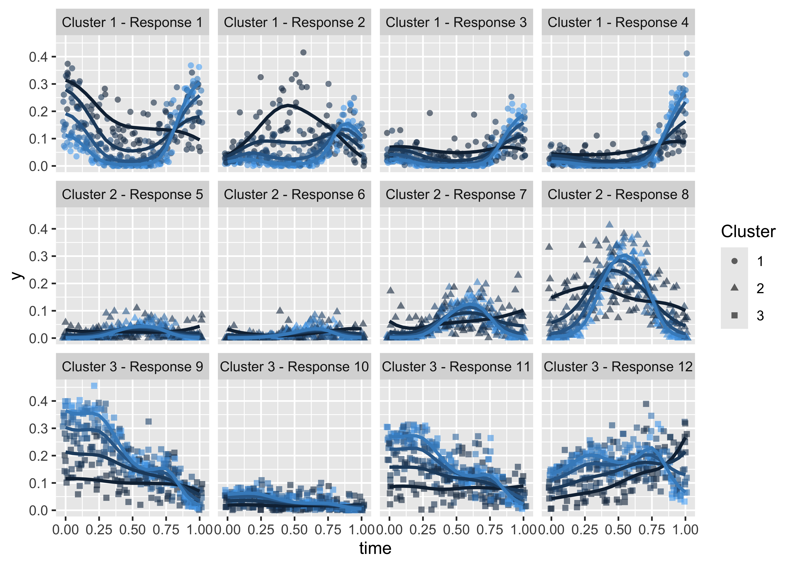

<!-- README.md is generated from README.Rmd. Please edit that file -->

# cleverly

Cleverly stands for (Cl)ustering with (E)xternal (V)ariabl(e)s in (R)
with (L)ongitudinal (Y)s.

# Installation

You can install the development version of `cleverly` from
[GitHub](https://github.com/) with:

``` r
# install.packages("pak")
pak::pak("empalmer/cleverly")
library(cleverly)
```

> ***NOTE:*** This package is still in development, so be sure to make
> sure you have the most up-to-date version.

Check what version you have installed with:

``` r
packageVersion("cleverly") 
```

Then update the package if needed:

``` r
pak::pkg_install("empalmer/cleverly")
```

With package updates, the names and format of the output may change, so
be sure to check the documentation and examples. Clustering results
should not change, but the format of the output may.

# Usage:

> ***NOTE:*** This is a computationally intensive algorithm. Do not be
> surprised if run time exceeds 10 minutes. Run time can be adjusted by
> modifying parameters such as `npsi`, `max_admm_iter`, `max_2_iter`.

## Simulate example data

Simulate compositional count data with longitudinal independence
structure. This code will simulate 20 samples across 12 responses, using
a binary external variable $Z$. Default arguments to `simulation_data`
simulate 3 baseline clusters with 4 members each.

``` r
set.seed(127)
sim <- simulation_data(n = 20,
                       K = 12,
                       user_var = 1000,
                       cor_str = "IND", 
                       Z_type = "binary")

Y <- sim$Y
Z <- sim$Z

true_cluster <- rep(1:3, each = 4)

head(Y)
#>   time individual Response_1 Response_2 Response_3 Response_4 Response_5
#> 1 0.00          1        293        644        670        347          2
#> 2 0.05          1        808       1609        834       1352         71
#> 3 0.10          1        366        363        228        382         14
#> 4 0.15          1        406        268        297       1221        191
#> 5 0.20          1        852        651        853        467        503
#> 6 0.25          1         22        173        377        195       6759
#>   Response_6 Response_7 Response_8 Response_9 Response_10 Response_11
#> 1         36         17          0       1025         941         769
#> 2        252        227          0       2536        3872        1931
#> 3          0          0        184       1401         832        1130
#> 4       1090        191        143       4871        3308        5108
#> 5        661        344        279       2944        2705        3235
#> 6        172        214        172        666        2355         884
#>   Response_12
#> 1        1088
#> 2        3665
#> 3        1218
#> 4        2004
#> 5        2666
#> 6        1614
head(Z)
#> [1] 0 0 0 0 0 1
```

$Y$ is a data frame of 12 counts with a column of time and a column of
individual. Z is a vector of binary external variables.

## Run algorithm:

We now run the `cleverly` algorithm, specifying the commonly needed
arguments. Here, we specify subject_ids = individual, as individual is
the id column in Y. We could have alternately given a vector of IDs.
Similarly for time. `cleverly` needs to select the ideal tuning
parameter `psi` - so we give a range of `psi_min` to `psi_max`, and a
number (`npsi`) to test (6).

We set `cluster_index` to 0 because we want to cluster on the baseline
values, i.e. when $Z = 0$. If we want to cluster on the slope value,
i.e. the effect of $Z$, we would set `cluster_index` to 1.

``` r
res <- cleverly(Y = Y,
                Z = Z,
                subject_ids = individual,
                time = time,
                cluster_index = 0,
                cor_str = "IND",
                psi_min = 10,
                psi_max = 5000,
                npsi = 1) 
#> [1] "Initializing for psi = 10"
#> [1] "Iteration: 1"
#> [1] "Iteration: 2"
#> [1] "Iteration: 3"
#> [1] "Cluster membership: "
#>  [1]  1  2  3  4  5  6  7  8  9 10 11 12
#> [1] "Clusters not changing, exiting"
#> [1] "Chosen psi (via BIC): 10"
#> Warning in cleverly(Y = Y, Z = Z, subject_ids = individual, time = time, :
#> Fewer than 2 unique clusters found. This may indicate that the algorithm was
#> run with too small a npsi or too small a range between psi_min and psi_max.
#> There should be a large enough grid of hyperparameters (psi) to ensure the
#> chosen cluster membership is accurate.

res$y_hat
#>      time Z response         yhat            y   y_hat_init  y_hat_group
#> 1    0.00 0        1 0.0772856455 5.024005e-02 0.0774352685 0.0777930016
#> 2    0.00 0        2 0.0753770443 1.104252e-01 0.0754901379 0.0682633644
#> 3    0.00 0        3 0.0714808752 1.148834e-01 0.0713042026 0.0548527082
#> 4    0.00 0        4 0.0643140537 5.949931e-02 0.0644263175 0.0626441914
#> 5    0.00 0        5 0.0051069114 3.429355e-04 0.0053397548 0.0007883880
#> 6    0.00 0        6 0.0043455880 6.172840e-03 0.0043414690 0.0021116024
#> 7    0.00 0        7 0.0038529844 2.914952e-03 0.0038444763 0.0015026539
#> 8    0.00 0        8 0.0027290120 0.000000e+00 0.0027667373 0.0008895538
#> 9    0.00 0        9 0.1741489326 1.757545e-01 0.1741528158 0.1864437822
#> 10   0.00 0       10 0.1600700244 1.613512e-01 0.1599690739 0.1654167104
#> 11   0.00 0       11 0.1746697608 1.318587e-01 0.1745242649 0.1813831842
#> 12   0.00 0       12 0.1866191678 1.865569e-01 0.1864054816 0.1979108594
#> 13   0.05 0        1 0.0649667871 4.709448e-02 0.0649527066 0.0637057635
#> 14   0.05 0        2 0.0667916316 9.378096e-02 0.0667877659 0.0683393917
#> 15   0.05 0        3 0.0680886122 4.860990e-02 0.0679240938 0.0770292601
#> 16   0.05 0        4 0.0612493627 7.880166e-02 0.0612563416 0.0617525765
#> 17   0.05 0        5 0.0087022231 4.138253e-03 0.0089834387 0.0020491747
#> 18   0.05 0        6 0.0078758544 1.468788e-02 0.0078687893 0.0037378251
#> 19   0.05 0        7 0.0069908594 1.323075e-02 0.0069776231 0.0029378936
#> 20   0.05 0        8 0.0057447131 0.000000e+00 0.0057965505 0.0018684770
#> 21   0.05 0        9 0.1824113715 1.478114e-01 0.1823658462 0.1870429690
#> 22   0.05 0       10 0.1684184479 2.256805e-01 0.1683949086 0.1706286599
#> 23   0.05 0       11 0.1797074380 1.125488e-01 0.1796712875 0.1804197447
#> 24   0.05 0       12 0.1790526989 2.136154e-01 0.1790206482 0.1804882641
#> 25   0.10 0        1 0.0516999412 5.982347e-02 0.0516129395 0.0478290604
#> 26   0.10 0        2 0.0555507503 5.933312e-02 0.0554827041 0.0585929183
#> 27   0.10 0        3 0.0595718290 3.726708e-02 0.0594312320 0.0781311746
#> 28   0.10 0        4 0.0536630514 6.243871e-02 0.0536038900 0.0532687466
#> 29   0.10 0        5 0.0140030985 2.288330e-03 0.0143042046 0.0048810850
#> 30   0.10 0        6 0.0133579066 0.000000e+00 0.0133464084 0.0066845851
#> 31   0.10 0        7 0.0118408448 0.000000e+00 0.0118214075 0.0055903582
#> 32   0.10 0        8 0.0109261220 3.007519e-02 0.0109828049 0.0038672192
#> 33   0.10 0        9 0.1896853555 2.289964e-01 0.1895941158 0.1940632686
#> 34   0.10 0       10 0.1765789421 1.359922e-01 0.1765988920 0.1809183644
#> 35   0.10 0       11 0.1863504532 1.847009e-01 0.1863808096 0.1887036723
#> 36   0.10 0       12 0.1767717056 1.990847e-01 0.1768405917 0.1774695474
#> 37   0.15 0        1 0.0386370836 2.125877e-02 0.0385439683 0.0324201337
#> 38   0.15 0        2 0.0430182017 1.403288e-02 0.0429344519 0.0423686523
#> 39   0.15 0        3 0.0474896242 1.555137e-02 0.0473828701 0.0563688087
#> 40   0.15 0        4 0.0429078516 6.393340e-02 0.0428284796 0.0395975119
#> 41   0.15 0        5 0.0211081242 1.000105e-02 0.0213854414 0.0104926954
#> 42   0.15 0        6 0.0210319834 5.707404e-02 0.0210155025 0.0118936042
#> 43   0.15 0        7 0.0185721901 1.000105e-02 0.0185462380 0.0101954073
#> 44   0.15 0        8 0.0186255049 7.487695e-03 0.0186694893 0.0077667660
#> 45   0.15 0        9 0.1942567046 2.550529e-01 0.1941369226 0.2050636428
#> 46   0.15 0       10 0.1830068216 1.732119e-01 0.1830402834 0.1941808062
#> 47   0.15 0       11 0.1932059268 2.674626e-01 0.1932666658 0.2043717135
#> 48   0.15 0       12 0.1781399834 1.049325e-01 0.1782496872 0.1852802580
#> 49   0.20 0        1 0.0269320593 5.272277e-02 0.0268692637 0.0190666468
#> 50   0.20 0        2 0.0308066396 4.028465e-02 0.0307402111 0.0248311258
#> 51   0.20 0        3 0.0342596710 5.278465e-02 0.0341907605 0.0277987952
#> 52   0.20 0        4 0.0310971868 2.889851e-02 0.0310330974 0.0243763164
#> 53   0.20 0        5 0.0296034283 3.112624e-02 0.0298174941 0.0195622053
#> 54   0.20 0        6 0.0305322265 4.090347e-02 0.0305139929 0.0202331173
#> 55   0.20 0        7 0.0267921259 2.128713e-02 0.0267628551 0.0171260667
#> 56   0.20 0        8 0.0282637436 1.726485e-02 0.0282808304 0.0145458397
#> 57   0.20 0        9 0.1945870171 1.821782e-01 0.1944725832 0.2120821438
#> 58   0.20 0       10 0.1862130329 1.673886e-01 0.1862387675 0.2027447697
#> 59   0.20 0       11 0.1989167416 2.001856e-01 0.1989807110 0.2202582102
#> 60   0.20 0       12 0.1819961274 1.649752e-01 0.1820994332 0.1973747630
#> 61   0.25 1        1 0.0089051006 1.617290e-03 0.0088887594 0.0094353347
#> 62   0.25 1        2 0.0092359523 1.271778e-02 0.0092221142 0.0114389803
#> 63   0.25 1        3 0.0538329518 2.771447e-02 0.0537740108 0.0090880898
#> 64   0.25 1        4 0.0145533155 1.433507e-02 0.0145326855 0.0120520222
#> 65   0.25 1        5 0.4321656728 4.968757e-01 0.4324436419 0.0306757729
#> 66   0.25 1        6 0.0087403016 1.264427e-02 0.0087415170 0.0319160623
#> 67   0.25 1        7 0.0210282494 1.573182e-02 0.0210229205 0.0256971935
#> 68   0.25 1        8 0.0141574330 1.264427e-02 0.0141476989 0.0246366365
#> 69   0.25 1        9 0.0624372899 4.895979e-02 0.0624019070 0.2081979999
#> 70   0.25 1       10 0.2033371575 1.731236e-01 0.2032697052 0.1997099174
#> 71   0.25 1       11 0.0582289055 6.498566e-02 0.0582227668 0.2290874044
#> 72   0.25 1       12 0.1133776701 1.186503e-01 0.1133322728 0.2080645861
#> 73   0.30 0        1 0.0114635794 1.674867e-02 0.0114614315 0.0044507768
#> 74   0.30 0        2 0.0135511403 6.804145e-03 0.0135344649 0.0050257159
#> 75   0.30 0        3 0.0145896907 0.000000e+00 0.0145732455 0.0028796239
#> 76   0.30 0        4 0.0133332210 2.135455e-02 0.0133185758 0.0056420152
#> 77   0.30 0        5 0.0474304837 2.815869e-02 0.0475168870 0.0422196701
#> 78   0.30 0        6 0.0509515255 3.192714e-02 0.0509564190 0.0456677881
#> 79   0.30 0        7 0.0440640481 2.470428e-02 0.0440515608 0.0350742004
#> 80   0.30 0        8 0.0473189626 2.784466e-02 0.0473130395 0.0373593071
#> 81   0.30 0        9 0.1824403991 1.420496e-01 0.1824306106 0.1962217700
#> 82   0.30 0       10 0.1808627142 3.297393e-01 0.1808410620 0.1879942743
#> 83   0.30 0       11 0.2025491843 1.665445e-01 0.2025680995 0.2268790075
#> 84   0.30 0       12 0.1914450510 2.041244e-01 0.1914346039 0.2105858504
#> 85   0.35 0        1 0.0083466510 1.953953e-02 0.0083534424 0.0023244378
#> 86   0.35 0        2 0.0100162047 1.029991e-02 0.0100093666 0.0026196598
#> 87   0.35 0        3 0.0107404944 1.984247e-02 0.0107339691 0.0013255878
#> 88   0.35 0        4 0.0096959309 9.694032e-03 0.0096903581 0.0030228592
#> 89   0.35 0        5 0.0567038870 5.907301e-02 0.0567291726 0.0545640331
#> 90   0.35 0        6 0.0611526570 8.194487e-02 0.0611761173 0.0594508156
#> 91   0.35 0        7 0.0530256183 4.468343e-02 0.0530283415 0.0454672742
#> 92   0.35 0        8 0.0567332483 7.634050e-02 0.0567267805 0.0514822762
#> 93   0.35 0        9 0.1741611158 1.740382e-01 0.1741990745 0.1841167113
#> 94   0.35 0       10 0.1735550021 1.903968e-01 0.1735224792 0.1756341867
#> 95   0.35 0       11 0.1972240366 1.499546e-01 0.1972307669 0.2164280976
#> 96   0.35 0       12 0.1886451539 1.641927e-01 0.1886001314 0.2035640608
#> 97   0.40 1        1 0.0037959628 3.399959e-03 0.0037955314 0.0013652677
#> 98   0.40 1        2 0.0039737079 1.447558e-02 0.0039713715 0.0016456686
#> 99   0.40 1        3 0.0088732802 8.551411e-03 0.0088740225 0.0009005442
#> 100  0.40 1        4 0.0077638552 3.399959e-03 0.0077580538 0.0018828908
#> 101  0.40 1        5 0.3410372331 3.513291e-01 0.3410304010 0.0672642974
#> 102  0.40 1        6 0.0095217188 1.308469e-02 0.0095233435 0.0715265098
#> 103  0.40 1        7 0.0538792633 6.629920e-02 0.0538925910 0.0568634655
#> 104  0.40 1        8 0.0224918993 1.957552e-02 0.0224976508 0.0654896108
#> 105  0.40 1        9 0.0288665595 1.998764e-02 0.0288599975 0.1747144495
#> 106  0.40 1       10 0.3366016693 3.477231e-01 0.3366036737 0.1654272835
#> 107  0.40 1       11 0.0608952339 4.280857e-02 0.0608883107 0.2020102510
#> 108  0.40 1       12 0.1222996166 1.093653e-01 0.1223050526 0.1909097613
#> 109  0.45 1        1 0.0036325133 0.000000e+00 0.0036327420 0.0009095800
#> 110  0.45 1        2 0.0039098128 0.000000e+00 0.0039080564 0.0012565963
#> 111  0.45 1        3 0.0065655029 1.320176e-02 0.0065666114 0.0009106063
#> 112  0.45 1        4 0.0081935109 1.400187e-02 0.0081885347 0.0013751854
#> 113  0.45 1        5 0.2914774230 2.945726e-01 0.2914404592 0.0797727624
#> 114  0.45 1        6 0.0088902488 6.067476e-03 0.0088901249 0.0802126722
#> 115  0.45 1        7 0.0695434150 8.187758e-02 0.0695607881 0.0691984476
#> 116  0.45 1        8 0.0255581944 3.667156e-02 0.0255683978 0.0775618532
#> 117  0.45 1        9 0.0208334328 1.420189e-02 0.0208327405 0.1691061457
#> 118  0.45 1       10 0.3893213966 3.641152e-01 0.3893239436 0.1584324840
#> 119  0.45 1       11 0.0595935244 7.974397e-02 0.0595927914 0.1860711186
#> 120  0.45 1       12 0.1124810251 9.554607e-02 0.1124948098 0.1751925483
#> 121  0.50 1        1 0.0039112690 0.000000e+00 0.0039114955 0.0006912314
#> 122  0.50 1        2 0.0043823465 1.081981e-03 0.0043807002 0.0011728472
#> 123  0.50 1        3 0.0056311980 1.098627e-02 0.0056318584 0.0013782303
#> 124  0.50 1        4 0.0098424405 5.326675e-03 0.0098375978 0.0011843025
#> 125  0.50 1        5 0.2390639661 2.452767e-01 0.2390258890 0.0915277725
#> 126  0.50 1        6 0.0078899947 2.247191e-03 0.0078877949 0.0843183375
#> 127  0.50 1        7 0.0869896475 1.444861e-01 0.0870059352 0.0823994604
#> 128  0.50 1        8 0.0285984433 7.823554e-03 0.0286120108 0.0860045462
#> 129  0.50 1        9 0.0144948644 3.587183e-02 0.0144980330 0.1678886262
#> 130  0.50 1       10 0.4442998125 3.987516e-01 0.4442857500 0.1551517575
#> 131  0.50 1       11 0.0571406323 7.074490e-02 0.0571496836 0.1700852640
#> 132  0.50 1       12 0.0977553854 7.740325e-02 0.0977732516 0.1581976243
#> 133  0.55 0        1 0.0073324531 0.000000e+00 0.0073472610 0.0006654897
#> 134  0.55 0        2 0.0093474558 0.000000e+00 0.0093521058 0.0013650657
#> 135  0.55 0        3 0.0111731837 3.811734e-02 0.0111853109 0.0025956936
#> 136  0.55 0        4 0.0086310026 0.000000e+00 0.0086324457 0.0012659688
#> 137  0.55 0        5 0.0962351959 1.548448e-01 0.0962134702 0.1023598175
#> 138  0.55 0        6 0.0953939987 8.739366e-02 0.0954149486 0.0872854250
#> 139  0.55 0        7 0.0899007156 4.634847e-02 0.0899122262 0.0955854742
#> 140  0.55 0        8 0.0919609572 2.502486e-02 0.0919695014 0.0926991036
#> 141  0.55 0        9 0.1510519034 1.635731e-01 0.1511008758 0.1662604931
#> 142  0.55 0       10 0.1405259877 1.163960e-01 0.1404714700 0.1517450945
#> 143  0.55 0       11 0.1545917008 1.604243e-01 0.1545648501 0.1556004719
#> 144  0.55 0       12 0.1438554454 2.078776e-01 0.1438355345 0.1425719023
#> 145  0.60 1        1 0.0057898692 3.217895e-02 0.0057888565 0.0008994841
#> 146  0.60 1        2 0.0073764180 9.123909e-03 0.0073740514 0.0020166454
#> 147  0.60 1        3 0.0058140276 8.829589e-04 0.0058130339 0.0050457262
#> 148  0.60 1        4 0.0198473400 1.461788e-02 0.0198412378 0.0017642463
#> 149  0.60 1        5 0.1488361044 1.356813e-01 0.1488269888 0.1121651039
#> 150  0.60 1        6 0.0059030415 0.000000e+00 0.0059039308 0.0932744746
#> 151  0.60 1        7 0.1215559487 9.771412e-02 0.1215616623 0.1072992455
#> 152  0.60 1        8 0.0319175473 2.374178e-02 0.0319306606 0.1006044470
#> 153  0.60 1        9 0.0070084194 8.240950e-03 0.0070238571 0.1593531077
#> 154  0.60 1       10 0.5324159357 5.811832e-01 0.5323716693 0.1444479642
#> 155  0.60 1       11 0.0499658111 3.629942e-02 0.0499830958 0.1433537860
#> 156  0.60 1       12 0.0635695371 6.033552e-02 0.0635809558 0.1297757692
#> 157  0.65 0        1 0.0130996548 3.568781e-02 0.0131193848 0.0017023663
#> 158  0.65 0        2 0.0165469415 0.000000e+00 0.0165570963 0.0037717472
#> 159  0.65 0        3 0.0201591677 5.909139e-02 0.0201832951 0.0100973104
#> 160  0.65 0        4 0.0156874347 0.000000e+00 0.0156904088 0.0031970134
#> 161  0.65 0        5 0.1115982087 1.863814e-01 0.1116376643 0.1201187544
#> 162  0.65 0        6 0.1095601288 7.264640e-02 0.1095357553 0.1026262416
#> 163  0.65 0        7 0.1038936119 1.012390e-01 0.1039063161 0.1162550485
#> 164  0.65 0        8 0.1057124607 9.753256e-02 0.1057153502 0.1096527400
#> 165  0.65 0        9 0.1301259004 8.694271e-02 0.1300968426 0.1474378005
#> 166  0.65 0       10 0.1251048691 1.010272e-01 0.1250792829 0.1334812124
#> 167  0.65 0       11 0.1319174123 1.537647e-01 0.1318705724 0.1326583553
#> 168  0.65 0       12 0.1165942092 1.056868e-01 0.1166080311 0.1190014101
#> 169  0.70 0        1 0.0201628579 0.000000e+00 0.0201845500 0.0044667630
#> 170  0.70 0        2 0.0249423610 8.004199e-03 0.0249570309 0.0088423071
#> 171  0.70 0        3 0.0298680096 1.115339e-01 0.0298978692 0.0205955075
#> 172  0.70 0        4 0.0244184531 4.093951e-02 0.0244233924 0.0074585035
#> 173  0.70 0        5 0.1150314983 5.760399e-02 0.1150961747 0.1244691292
#> 174  0.70 0        6 0.1150257129 2.500984e-01 0.1149738842 0.1151069498
#> 175  0.70 0        7 0.1070606188 8.607794e-02 0.1070860722 0.1203678039
#> 176  0.70 0        8 0.1097430418 1.002493e-01 0.1097344703 0.1188380289
#> 177  0.70 0        9 0.1148559698 1.813410e-01 0.1147829176 0.1303787935
#> 178  0.70 0       10 0.1164319848 5.104317e-02 0.1164332193 0.1185533384
#> 179  0.70 0       11 0.1199690785 6.823252e-03 0.1199129835 0.1220844104
#> 180  0.70 0       12 0.1024904136 1.062853e-01 0.1025174360 0.1088384648
#> 181  0.75 0        1 0.0334561193 2.839612e-02 0.0334740596 0.0157228095
#> 182  0.75 0        2 0.0400930501 5.165525e-02 0.0401136215 0.0251429133
#> 183  0.75 0        3 0.0463557700 5.807648e-02 0.0463854552 0.0414324891
#> 184  0.75 0        4 0.0410460662 1.690925e-02 0.0410551876 0.0216769364
#> 185  0.75 0        5 0.1130008033 5.707763e-02 0.1130825240 0.1207611482
#> 186  0.75 0        6 0.1168857859 1.365582e-01 0.1168066350 0.1273529923
#> 187  0.75 0        7 0.1052436624 1.269264e-01 0.1052898009 0.1152415766
#> 188  0.75 0        8 0.1094109298 1.502568e-01 0.1093862348 0.1239201731
#> 189  0.75 0        9 0.0961975540 1.235731e-01 0.0960883681 0.1066281462
#> 190  0.75 0       10 0.1053585668 4.145263e-02 0.1053916820 0.0979285534
#> 191  0.75 0       11 0.1059455211 8.996861e-02 0.1058831851 0.1081192314
#> 192  0.75 0       12 0.0870061711 1.191495e-01 0.0870432461 0.0960730304
#> 193  0.80 1        1 0.0224775104 2.394969e-02 0.0224574863 0.0505125922
#> 194  0.80 1        2 0.0451300241 2.782390e-02 0.0451101706 0.0642157086
#> 195  0.80 1        3 0.0156246929 2.727044e-02 0.0156086526 0.0731937917
#> 196  0.80 1        4 0.2199679723 1.966792e-01 0.2199201910 0.0570939083
#> 197  0.80 1        5 0.0404378273 3.869182e-02 0.0404527825 0.1054974848
#> 198  0.80 1        6 0.0030470141 6.540881e-04 0.0030674333 0.1269785461
#> 199  0.80 1        7 0.1326243531 1.834465e-01 0.1326135735 0.0996845102
#> 200  0.80 1        8 0.0200877047 1.665409e-02 0.0200746011 0.1161105820
#> 201  0.80 1        9 0.0019035002 4.427673e-03 0.0019292369 0.0784578554
#> 202  0.80 1       10 0.4558783728 4.456855e-01 0.4559718456 0.0729869316
#> 203  0.80 1       11 0.0288014456 2.681761e-02 0.0287858857 0.0816195046
#> 204  0.80 1       12 0.0140195826 7.899371e-03 0.0140081408 0.0736485846
#> 205  0.85 0        1 0.0825909567 6.502396e-02 0.0825748570 0.1060375387
#> 206  0.85 0        2 0.0920349465 4.300707e-02 0.0920485154 0.1147927986
#> 207  0.85 0        3 0.0993512953 9.616701e-02 0.0993543161 0.1063796179
#> 208  0.85 0        4 0.0967360801 1.330139e-01 0.0966888057 0.1043175314
#> 209  0.85 0        5 0.0921342270 3.890030e-02 0.0921459262 0.0839777258
#> 210  0.85 0        6 0.1050705376 1.106548e-01 0.1049225318 0.1096825509
#> 211  0.85 0        7 0.0892787966 4.129592e-02 0.0892952478 0.0800955525
#> 212  0.85 0        8 0.0944124560 2.232489e-01 0.0943855216 0.0960640107
#> 213  0.85 0        9 0.0589221807 9.354324e-02 0.0587391075 0.0531688015
#> 214  0.85 0       10 0.0729075223 1.289071e-02 0.0730925094 0.0501051886
#> 215  0.85 0       11 0.0649127253 2.566735e-02 0.0650636684 0.0489539405
#> 216  0.85 0       12 0.0516482759 1.165868e-01 0.0516889930 0.0464247430
#> 217  0.90 0        1 0.1142948834 1.745008e-01 0.1142885034 0.1557758917
#> 218  0.90 0        2 0.1229725064 1.071131e-01 0.1229727828 0.1538246156
#> 219  0.90 0        3 0.1301437498 1.035080e-01 0.1301555234 0.1362334365
#> 220  0.90 0        4 0.1237359666 1.104409e-01 0.1235812901 0.1416089273
#> 221  0.90 0        5 0.0768689697 4.423184e-02 0.0768181535 0.0652354092
#> 222  0.90 0        6 0.0930450677 6.641708e-02 0.0928755209 0.0879064773
#> 223  0.90 0        7 0.0781317010 7.085413e-02 0.0781054582 0.0640238082
#> 224  0.90 0        8 0.0822283438 8.714642e-02 0.0822328963 0.0751620982
#> 225  0.90 0        9 0.0438150081 4.055740e-02 0.0436136603 0.0355404824
#> 226  0.90 0       10 0.0552123562 8.298669e-02 0.0554862826 0.0339322199
#> 227  0.90 0       11 0.0438345126 7.667776e-02 0.0441120366 0.0249847035
#> 228  0.90 0       12 0.0357169348 3.556572e-02 0.0357578920 0.0257719302
#> 229  0.95 0        1 0.1468441750 1.956859e-01 0.1469127824 0.1775249027
#> 230  0.95 0        2 0.1526736170 1.548087e-01 0.1526628540 0.1712823717
#> 231  0.95 0        3 0.1599465217 1.484328e-01 0.1600171018 0.1704071873
#> 232  0.95 0        4 0.1415993248 1.016565e-01 0.1412829914 0.1583170081
#> 233  0.95 0        5 0.0614723434 4.081754e-02 0.0613661459 0.0548198391
#> 234  0.95 0        6 0.0795486293 7.436539e-02 0.0793720033 0.0724633083
#> 235  0.95 0        7 0.0667728376 2.890001e-02 0.0667013710 0.0564371130
#> 236  0.95 0        8 0.0693177064 9.986891e-02 0.0693655800 0.0616487321
#> 237  0.95 0        9 0.0318163144 4.600167e-02 0.0316136526 0.0259760781
#> 238  0.95 0       10 0.0396826299 7.305446e-02 0.0400126247 0.0251287927
#> 239  0.95 0       11 0.0271041687 2.067692e-02 0.0274323613 0.0120279438
#> 240  0.95 0       12 0.0232217317 1.573114e-02 0.0232605315 0.0139667231
#> 241  1.00 0        1 0.1778375033 1.761499e-01 0.1780675676 0.1665179238
#> 242  1.00 0        2 0.1788223205 2.923249e-01 0.1787951764 0.1681509668
#> 243  1.00 0        3 0.1872531094 1.378443e-01 0.1874407488 0.2208997639
#> 244  1.00 0        4 0.1471923431 1.132392e-01 0.1466741392 0.1546651121
#> 245  1.00 0        5 0.0478418732 3.117573e-02 0.0476910600 0.0528751291
#> 246  1.00 0        6 0.0666653310 3.341255e-02 0.0664864095 0.0651858934
#> 247  1.00 0        7 0.0565805336 8.010625e-02 0.0564617528 0.0582106566
#> 248  1.00 0        8 0.0574246388 7.381518e-02 0.0575130723 0.0562419945
#> 249  1.00 0        9 0.0229066078 1.705578e-02 0.0227117001 0.0220258103
#> 250  1.00 0       10 0.0274831108 3.047672e-02 0.0278274228 0.0215916082
#> 251  1.00 0       11 0.0155808313 1.439955e-02 0.0158862970 0.0057951338
#> 252  1.00 0       12 0.0144117973 0.000000e+00 0.0144446535 0.0078400075
#> 253  0.00 0        1 0.0772856455 6.431945e-02 0.0774352685 0.0777930016
#> 254  0.00 0        2 0.0753770443 4.190640e-02 0.0754901379 0.0682633644
#> 255  0.00 0        3 0.0714808752 6.887076e-02 0.0713042026 0.0548527082
#> 256  0.00 0        4 0.0643140537 7.196222e-02 0.0644263175 0.0626441914
#> 257  0.00 0        5 0.0051069114 1.176471e-02 0.0053397548 0.0007883880
#> 258  0.00 0        6 0.0043455880 4.121941e-03 0.0043414690 0.0021116024
#> 259  0.00 0        7 0.0038529844 1.030485e-03 0.0038444763 0.0015026539
#> 260  0.00 0        8 0.0027290120 1.382568e-02 0.0027667373 0.0008895538
#> 261  0.00 0        9 0.1741489326 1.850580e-01 0.1741528158 0.1864437822
#> 262  0.00 0       10 0.1600700244 1.558609e-01 0.1599690739 0.1654167104
#> 263  0.00 0       11 0.1746697608 1.686561e-01 0.1745242649 0.1813831842
#> 264  0.00 0       12 0.1866191678 2.126234e-01 0.1864054816 0.1979108594
#> 265  0.05 1        1 0.0223372571 3.189891e-02 0.0222969096 0.0637057635
#> 266  0.05 1        2 0.0276714464 3.304763e-02 0.0276200783 0.0683393917
#> 267  0.05 1        3 0.3693893566 3.489441e-01 0.3683759773 0.0770292601
#> 268  0.05 1        4 0.0287269471 2.191393e-02 0.0286771379 0.0617525765
#> 269  0.05 1        5 0.2214535681 2.873553e-01 0.2232905820 0.0020491747
#> 270  0.05 1        6 0.0023496757 1.148714e-03 0.0023380705 0.0037378251
#> 271  0.05 1        7 0.0020547901 0.000000e+00 0.0020521129 0.0029378936
#> 272  0.05 1        8 0.0022720695 2.650879e-04 0.0022570130 0.0018684770
#> 273  0.05 1        9 0.1309092568 1.029425e-01 0.1306623557 0.1870429690
#> 274  0.05 1       10 0.0732222036 7.448971e-02 0.0730599525 0.1706286599
#> 275  0.05 1       11 0.0527184909 3.543342e-02 0.0526103250 0.1804197447
#> 276  0.05 1       12 0.0668949382 6.256075e-02 0.0667594851 0.1804882641
#> 277  0.10 1        1 0.0206406337 2.225984e-02 0.0205864751 0.0478290604
#> 278  0.10 1        2 0.0239329559 1.489632e-02 0.0238809808 0.0585929183
#> 279  0.10 1        3 0.2881849818 3.074905e-01 0.2874237901 0.0781311746
#> 280  0.10 1        4 0.0282354138 2.767668e-02 0.0281800164 0.0532687466
#> 281  0.10 1        5 0.2938455545 3.031739e-01 0.2953201873 0.0048810850
#> 282  0.10 1        6 0.0037734748 2.623783e-03 0.0037621932 0.0066845851
#> 283  0.10 1        7 0.0042403035 0.000000e+00 0.0042351579 0.0055903582
#> 284  0.10 1        8 0.0043298551 2.369869e-03 0.0043103056 0.0038672192
#> 285  0.10 1        9 0.1077413643 1.324587e-01 0.1075797065 0.1940632686
#> 286  0.10 1       10 0.0971960296 9.284807e-02 0.0970316449 0.1809183644
#> 287  0.10 1       11 0.0520273617 4.553534e-02 0.0519601296 0.1887036723
#> 288  0.10 1       12 0.0758520714 4.866695e-02 0.0757294126 0.1774695474
#> 289  0.15 0        1 0.0386370836 7.962046e-02 0.0385439683 0.0324201337
#> 290  0.15 0        2 0.0430182017 5.373350e-02 0.0429344519 0.0423686523
#> 291  0.15 0        3 0.0474896242 3.568482e-02 0.0473828701 0.0563688087
#> 292  0.15 0        4 0.0429078516 3.362211e-02 0.0428284796 0.0395975119
#> 293  0.15 0        5 0.0211081242 8.250825e-04 0.0213854414 0.0104926954
#> 294  0.15 0        6 0.0210319834 1.237624e-03 0.0210155025 0.0118936042
#> 295  0.15 0        7 0.0185721901 2.134901e-02 0.0185462380 0.0101954073
#> 296  0.15 0        8 0.0186255049 7.673267e-02 0.0186694893 0.0077667660
#> 297  0.15 0        9 0.1942567046 1.949257e-01 0.1941369226 0.2050636428
#> 298  0.15 0       10 0.1830068216 1.948226e-01 0.1830402834 0.1941808062
#> 299  0.15 0       11 0.1932059268 1.403672e-01 0.1932666658 0.2043717135
#> 300  0.15 0       12 0.1781399834 1.670792e-01 0.1782496872 0.1852802580
#> 301  0.20 0        1 0.0269320593 3.090668e-02 0.0268692637 0.0190666468
#> 302  0.20 0        2 0.0308066396 3.718459e-02 0.0307402111 0.0248311258
#> 303  0.20 0        3 0.0342596710 2.390438e-02 0.0341907605 0.0277987952
#> 304  0.20 0        4 0.0310971868 1.750573e-02 0.0310330974 0.0243763164
#> 305  0.20 0        5 0.0296034283 5.553543e-03 0.0298174941 0.0195622053
#> 306  0.20 0        6 0.0305322265 4.949897e-03 0.0305139929 0.0202331173
#> 307  0.20 0        7 0.0267921259 4.660147e-02 0.0267628551 0.0171260667
#> 308  0.20 0        8 0.0282637436 4.273814e-02 0.0282808304 0.0145458397
#> 309  0.20 0        9 0.1945870171 2.331281e-01 0.1944725832 0.2120821438
#> 310  0.20 0       10 0.1862130329 1.842328e-01 0.1862387675 0.2027447697
#> 311  0.20 0       11 0.1989167416 2.279367e-01 0.1989807110 0.2202582102
#> 312  0.20 0       12 0.1819961274 1.453580e-01 0.1820994332 0.1973747630
#> 313  0.25 0        1 0.0174667302 2.185501e-02 0.0174419367 0.0094353347
#> 314  0.25 0        2 0.0203512950 1.799041e-03 0.0203141417 0.0114389803
#> 315  0.25 0        3 0.0223110593 1.039446e-02 0.0222748617 0.0090880898
#> 316  0.25 0        4 0.0203776571 5.530384e-03 0.0203428502 0.0120520222
#> 317  0.25 0        5 0.0385324957 6.789712e-02 0.0386776944 0.0306757729
#> 318  0.25 0        6 0.0407660870 4.444296e-02 0.0407549425 0.0319160623
#> 319  0.25 0        7 0.0354601643 2.871802e-02 0.0354353823 0.0256971935
#> 320  0.25 0        8 0.0380852512 5.770256e-02 0.0380829441 0.0246366365
#> 321  0.25 0        9 0.1901836695 1.345949e-01 0.1901138130 0.2081979999
#> 322  0.25 0       10 0.1855637691 1.408582e-01 0.1855650975 0.1997099174
#> 323  0.25 0       11 0.2028658840 1.974947e-01 0.2029090222 0.2290874044
#> 324  0.25 0       12 0.1880359374 2.887127e-01 0.1880873137 0.2080645861
#> 325  0.30 0        1 0.0114635794 3.624786e-02 0.0114614315 0.0044507768
#> 326  0.30 0        2 0.0135511403 8.163932e-05 0.0135344649 0.0050257159
#> 327  0.30 0        3 0.0145896907 9.306882e-03 0.0145732455 0.0028796239
#> 328  0.30 0        4 0.0133332210 4.000327e-03 0.0133185758 0.0056420152
#> 329  0.30 0        5 0.0474304837 3.502327e-02 0.0475168870 0.0422196701
#> 330  0.30 0        6 0.0509515255 3.437015e-02 0.0509564190 0.0456677881
#> 331  0.30 0        7 0.0440640481 1.742183e-01 0.0440515608 0.0350742004
#> 332  0.30 0        8 0.0473189626 1.053147e-02 0.0473130395 0.0373593071
#> 333  0.30 0        9 0.1824403991 2.364275e-01 0.1824306106 0.1962217700
#> 334  0.30 0       10 0.1808627142 2.000163e-01 0.1808410620 0.1879942743
#> 335  0.30 0       11 0.2025491843 1.581354e-01 0.2025680995 0.2268790075
#> 336  0.30 0       12 0.1914450510 1.016410e-01 0.1914346039 0.2105858504
#> 337  0.35 0        1 0.0083466510 8.398247e-03 0.0083534424 0.0023244378
#> 338  0.35 0        2 0.0100162047 5.178919e-02 0.0100093666 0.0026196598
#> 339  0.35 0        3 0.0107404944 3.213242e-02 0.0107339691 0.0013255878
#> 340  0.35 0        4 0.0096959309 0.000000e+00 0.0096903581 0.0030228592
#> 341  0.35 0        5 0.0567038870 1.013875e-01 0.0567291726 0.0545640331
#> 342  0.35 0        6 0.0611526570 1.411879e-02 0.0611761173 0.0594508156
#> 343  0.35 0        7 0.0530256183 6.256086e-02 0.0530283415 0.0454672742
#> 344  0.35 0        8 0.0567332483 9.542356e-02 0.0567267805 0.0514822762
#> 345  0.35 0        9 0.1741611158 1.033958e-01 0.1741990745 0.1841167113
#> 346  0.35 0       10 0.1735550021 1.642527e-01 0.1735224792 0.1756341867
#> 347  0.35 0       11 0.1972240366 1.607230e-01 0.1972307669 0.2164280976
#> 348  0.35 0       12 0.1886451539 2.058179e-01 0.1886001314 0.2035640608
#> 349  0.40 0        1 0.0067959616 0.000000e+00 0.0068064406 0.0013652677
#> 350  0.40 0        2 0.0082839478 7.284413e-03 0.0082821003 0.0016456686
#> 351  0.40 0        3 0.0089725940 6.213176e-03 0.0089716575 0.0009005442
#> 352  0.40 0        4 0.0078991580 2.088913e-02 0.0078977505 0.0018828908
#> 353  0.40 0        5 0.0663676177 1.225495e-01 0.0663409175 0.0672642974
#> 354  0.40 0        6 0.0710455216 8.773433e-02 0.0710844825 0.0715265098
#> 355  0.40 0        7 0.0622885255 4.584896e-02 0.0623049923 0.0568634655
#> 356  0.40 0        8 0.0661648589 7.091591e-02 0.0661603610 0.0654896108
#> 357  0.40 0        9 0.1667734974 1.446170e-01 0.1668412972 0.1747144495
#> 358  0.40 0       10 0.1652801575 1.588645e-01 0.1652410215 0.1654272835
#> 359  0.40 0       11 0.1887818819 1.979646e-01 0.1887807377 0.2020102510
#> 360  0.40 0       12 0.1813462781 1.371184e-01 0.1812882414 0.1909097613
#> 361  0.45 0        1 0.0062119799 0.000000e+00 0.0062242572 0.0009095800
#> 362  0.45 0        2 0.0076961257 0.000000e+00 0.0076971099 0.0012565963
#> 363  0.45 0        3 0.0085392776 4.543160e-03 0.0085423675 0.0009106063
#> 364  0.45 0        4 0.0072377367 0.000000e+00 0.0072382481 0.0013751854
#> 365  0.45 0        5 0.0763451709 1.783611e-02 0.0762883086 0.0797727624
#> 366  0.45 0        6 0.0802075297 1.934208e-01 0.0802532299 0.0802126722
#> 367  0.45 0        7 0.0717042903 3.769140e-02 0.0717283165 0.0691984476
#> 368  0.45 0        8 0.0753526030 6.882046e-02 0.0753520325 0.0775618532
#> 369  0.45 0        9 0.1608208492 7.033485e-02 0.1608999049 0.1691061457
#> 370  0.45 0       10 0.1568171713 1.693589e-01 0.1567719506 0.1584324840
#> 371  0.45 0       11 0.1783305404 1.744910e-01 0.1783220432 0.1860711186
#> 372  0.45 0       12 0.1707367253 2.635033e-01 0.1706822311 0.1751925483
#> 373  0.50 1        1 0.0039112690 1.186740e-02 0.0039114955 0.0006912314
#> 374  0.50 1        2 0.0043823465 0.000000e+00 0.0043807002 0.0011728472
#> 375  0.50 1        3 0.0056311980 6.473127e-03 0.0056318584 0.0013782303
#> 376  0.50 1        4 0.0098424405 2.942330e-02 0.0098375978 0.0011843025
#> 377  0.50 1        5 0.2390639661 1.521185e-01 0.2390258890 0.0915277725
#> 378  0.50 1        6 0.0078899947 2.020400e-02 0.0078877949 0.0843183375
#> 379  0.50 1        7 0.0869896475 1.255394e-01 0.0870059352 0.0823994604
#> 380  0.50 1        8 0.0285984433 1.343664e-02 0.0286120108 0.0860045462
#> 381  0.50 1        9 0.0144948644 2.393095e-02 0.0144980330 0.1678886262
#> 382  0.50 1       10 0.4442998125 4.399765e-01 0.4442857500 0.1551517575
#> 383  0.50 1       11 0.0571406323 6.463319e-02 0.0571496836 0.1700852640
#> 384  0.50 1       12 0.0977553854 1.123970e-01 0.0977732516 0.1581976243
#> 385  0.55 0        1 0.0073324531 0.000000e+00 0.0073472610 0.0006654897
#> 386  0.55 0        2 0.0093474558 0.000000e+00 0.0093521058 0.0013650657
#> 387  0.55 0        3 0.0111731837 1.210716e-02 0.0111853109 0.0025956936
#> 388  0.55 0        4 0.0086310026 0.000000e+00 0.0086324457 0.0012659688
#> 389  0.55 0        5 0.0962351959 8.840804e-02 0.0962134702 0.1023598175
#> 390  0.55 0        6 0.0953939987 1.191654e-01 0.0954149486 0.0872854250
#> 391  0.55 0        7 0.0899007156 8.356517e-02 0.0899122262 0.0955854742
#> 392  0.55 0        8 0.0919609572 1.189593e-01 0.0919695014 0.0926991036
#> 393  0.55 0        9 0.1510519034 1.475013e-01 0.1511008758 0.1662604931
#> 394  0.55 0       10 0.1405259877 1.824833e-01 0.1404714700 0.1517450945
#> 395  0.55 0       11 0.1545917008 1.747038e-01 0.1545648501 0.1556004719
#> 396  0.55 0       12 0.1438554454 7.310665e-02 0.1438355345 0.1425719023
#> 397  0.60 0        1 0.0093267064 0.000000e+00 0.0093436864 0.0008994841
#> 398  0.60 0        2 0.0118997838 0.000000e+00 0.0119067251 0.0020166454
#> 399  0.60 0        3 0.0144887928 6.804794e-03 0.0145065452 0.0050457262
#> 400  0.60 0        4 0.0110637499 5.525086e-02 0.0110657164 0.0017642463
#> 401  0.60 0        5 0.1048895757 8.175909e-02 0.1048990906 0.1121651039
#> 402  0.60 0        6 0.1026748222 7.404022e-02 0.1026749024 0.0932744746
#> 403  0.60 0        7 0.0977693430 1.120252e-01 0.0977777082 0.1072992455
#> 404  0.60 0        8 0.0994117526 8.165753e-02 0.0994201220 0.1006044470
#> 405  0.60 0        9 0.1422079937 9.953281e-02 0.1422217383 0.1593531077
#> 406  0.60 0       10 0.1328633035 1.159862e-01 0.1328184605 0.1444479642
#> 407  0.60 0       11 0.1431892650 2.322771e-01 0.1431524284 0.1433537860
#> 408  0.60 0       12 0.1302149115 1.406663e-01 0.1302128765 0.1297757692
#> 409  0.65 0        1 0.0130996548 1.216234e-03 0.0131193848 0.0017023663
#> 410  0.65 0        2 0.0165469415 7.873512e-03 0.0165570963 0.0037717472
#> 411  0.65 0        3 0.0201591677 3.335040e-02 0.0201832951 0.0100973104
#> 412  0.65 0        4 0.0156874347 1.389067e-02 0.0156904088 0.0031970134
#> 413  0.65 0        5 0.1115982087 6.625272e-02 0.1116376643 0.1201187544
#> 414  0.65 0        6 0.1095601288 5.997952e-02 0.1095357553 0.1026262416
#> 415  0.65 0        7 0.1038936119 2.059275e-01 0.1039063161 0.1162550485
#> 416  0.65 0        8 0.1057124607 1.322494e-01 0.1057153502 0.1096527400
#> 417  0.65 0        9 0.1301259004 1.668160e-01 0.1300968426 0.1474378005
#> 418  0.65 0       10 0.1251048691 7.687876e-02 0.1250792829 0.1334812124
#> 419  0.65 0       11 0.1319174123 1.194469e-01 0.1318705724 0.1326583553
#> 420  0.65 0       12 0.1165942092 1.161183e-01 0.1166080311 0.1190014101
#> 421  0.70 1        1 0.0110883983 6.484033e-04 0.0110826222 0.0044667630
#> 422  0.70 1        2 0.0172550649 4.101151e-02 0.0172490041 0.0088423071
#> 423  0.70 1        3 0.0088412959 4.700924e-03 0.0088361068 0.0205955075
#> 424  0.70 1        4 0.0606078170 7.926730e-02 0.0605958808 0.0074585035
#> 425  0.70 1        5 0.0865926477 7.018966e-02 0.0866084925 0.1244691292
#> 426  0.70 1        6 0.0044313163 9.239747e-03 0.0044429778 0.1151069498
#> 427  0.70 1        7 0.1449241247 1.248176e-01 0.1449205797 0.1203678039
#> 428  0.70 1        8 0.0293268046 2.253201e-02 0.0293275378 0.1188380289
#> 429  0.70 1        9 0.0036550113 6.321932e-03 0.0036806557 0.1303787935
#> 430  0.70 1       10 0.5574318892 6.101475e-01 0.5574104761 0.1185533384
#> 431  0.70 1       11 0.0413667586 1.053655e-02 0.0413690689 0.1220844104
#> 432  0.70 1       12 0.0344788716 2.058680e-02 0.0344765977 0.1088384648
#> 433  0.75 1        1 0.0163752005 1.516519e-02 0.0163632179 0.0157228095
#> 434  0.75 1        2 0.0289285150 3.472348e-02 0.0289171219 0.0251429133
#> 435  0.75 1        3 0.0122143594 7.281699e-03 0.0122041213 0.0414324891
#> 436  0.75 1        4 0.1198950540 1.638683e-01 0.1198752864 0.0216769364
#> 437  0.75 1        5 0.0623891029 4.254679e-02 0.0624118459 0.1207611482
#> 438  0.75 1        6 0.0037246226 4.573629e-03 0.0037419432 0.1273529923
#> 439  0.75 1        7 0.1444585520 1.075405e-01 0.1444542429 0.1152415766
#> 440  0.75 1        8 0.0253213764 2.076187e-02 0.0253141829 0.1239201731
#> 441  0.75 1        9 0.0026310007 2.407173e-03 0.0026586273 0.1066281462
#> 442  0.75 1       10 0.5253500624 5.727267e-01 0.5253629958 0.0979285534
#> 443  0.75 1       11 0.0357280377 2.551604e-02 0.0357186195 0.1081192314
#> 444  0.75 1       12 0.0229841162 2.888608e-03 0.0229777950 0.0960730304
#> 445  0.80 0        1 0.0548508499 3.131640e-02 0.0548529026 0.0505125922
#> 446  0.80 0        2 0.0633589145 8.200951e-02 0.0633812669 0.0642157086
#> 447  0.80 0        3 0.0704425335 1.088232e-01 0.0704600556 0.0731937917
#> 448  0.80 0        4 0.0669804848 4.006881e-02 0.0669829810 0.0570939083
#> 449  0.80 0        5 0.1047849940 1.124659e-01 0.1048503425 0.1054974848
#> 450  0.80 0        6 0.1133978991 1.021451e-01 0.1132854190 0.1269785461
#> 451  0.80 0        7 0.0986217016 1.120105e-01 0.0986687948 0.0996845102
#> 452  0.80 0        8 0.1038668491 6.647779e-02 0.1038311298 0.1161105820
#> 453  0.80 0        9 0.0765997106 3.819690e-02 0.0764527787 0.0784578554
#> 454  0.80 0       10 0.0904519922 9.824952e-02 0.0905446813 0.0729869316
#> 455  0.80 0       11 0.0871337868 1.017910e-01 0.0871388208 0.0816195046
#> 456  0.80 0       12 0.0695102836 1.064454e-01 0.0695508270 0.0736485846
#> 457  0.85 0        1 0.0825909567 7.267419e-02 0.0825748570 0.1060375387
#> 458  0.85 0        2 0.0920349465 1.170204e-01 0.0920485154 0.1147927986
#> 459  0.85 0        3 0.0993512953 1.245956e-01 0.0993543161 0.1063796179
#> 460  0.85 0        4 0.0967360801 2.627634e-02 0.0966888057 0.1043175314
#> 461  0.85 0        5 0.0921342270 4.979089e-02 0.0921459262 0.0839777258
#> 462  0.85 0        6 0.1050705376 1.228596e-01 0.1049225318 0.1096825509
#> 463  0.85 0        7 0.0892787966 7.646177e-02 0.0892952478 0.0800955525
#> 464  0.85 0        8 0.0944124560 1.352482e-01 0.0943855216 0.0960640107
#> 465  0.85 0        9 0.0589221807 1.459796e-02 0.0587391075 0.0531688015
#> 466  0.85 0       10 0.0729075223 2.580289e-02 0.0730925094 0.0501051886
#> 467  0.85 0       11 0.0649127253 9.366369e-02 0.0650636684 0.0489539405
#> 468  0.85 0       12 0.0516482759 1.410084e-01 0.0516889930 0.0464247430
#> 469  0.90 1        1 0.0288215556 2.056093e-02 0.0288015922 0.1557758917
#> 470  0.90 1        2 0.0713172621 7.605549e-02 0.0712910333 0.1538246156
#> 471  0.90 1        3 0.0154296998 1.591975e-02 0.0154172125 0.1362334365
#> 472  0.90 1        4 0.4418646162 4.257910e-01 0.4415767927 0.1416089273
#> 473  0.90 1        5 0.0121280315 9.232458e-03 0.0121199672 0.0652354092
#> 474  0.90 1        6 0.0022135618 1.097914e-03 0.0022347182 0.0879064773
#> 475  0.90 1        7 0.0984070757 1.210700e-01 0.0983686162 0.0640238082
#> 476  0.90 1        8 0.0112654374 1.013075e-02 0.0112498801 0.0751620982
#> 477  0.90 1        9 0.0012423339 0.000000e+00 0.0012606008 0.0355404824
#> 478  0.90 1       10 0.2963156004 2.920950e-01 0.2967067599 0.0339322199
#> 479  0.90 1       11 0.0165040833 2.450344e-02 0.0164981768 0.0249847035
#> 480  0.90 1       12 0.0044907423 3.543268e-03 0.0044746501 0.0257719302
#> 481  0.95 1        1 0.0290398744 1.590879e-02 0.0290327623 0.1775249027
#> 482  0.95 1        2 0.0779209109 6.416545e-02 0.0779085071 0.1712823717
#> 483  0.95 1        3 0.0128479062 2.253745e-03 0.0128438831 0.1704071873
#> 484  0.95 1        4 0.5218317531 5.330770e-01 0.5213397859 0.1583170081
#> 485  0.95 1        5 0.0060531778 8.219541e-03 0.0060434100 0.0548198391
#> 486  0.95 1        6 0.0021202464 1.590879e-03 0.0021424041 0.0724633083
#> 487  0.95 1        7 0.0857865178 7.556675e-02 0.0857386040 0.0564371130
#> 488  0.95 1        8 0.0085899866 8.219541e-03 0.0085758030 0.0616487321
#> 489  0.95 1        9 0.0012088195 1.458306e-03 0.0012244765 0.0259760781
#> 490  0.95 1       10 0.2394029676 2.802598e-01 0.2399646364 0.0251287927
#> 491  0.95 1       11 0.0126541533 5.833223e-03 0.0126565785 0.0120279438
#> 492  0.95 1       12 0.0025436865 3.446904e-03 0.0025291492 0.0139667231
#> 493  1.00 0        1 0.1778375033 1.473657e-01 0.1780675676 0.1665179238
#> 494  1.00 0        2 0.1788223205 3.397727e-01 0.1787951764 0.1681509668
#> 495  1.00 0        3 0.1872531094 1.157541e-01 0.1874407488 0.2208997639
#> 496  1.00 0        4 0.1471923431 7.494835e-02 0.1466741392 0.1546651121
#> 497  1.00 0        5 0.0478418732 1.069215e-02 0.0476910600 0.0528751291
#> 498  1.00 0        6 0.0666653310 9.375000e-02 0.0664864095 0.0651858934
#> 499  1.00 0        7 0.0565805336 2.567149e-02 0.0564617528 0.0582106566
#> 500  1.00 0        8 0.0574246388 6.513430e-02 0.0575130723 0.0562419945
#> 501  1.00 0        9 0.0229066078 1.683884e-02 0.0227117001 0.0220258103
#> 502  1.00 0       10 0.0274831108 4.199380e-02 0.0278274228 0.0215916082
#> 503  1.00 0       11 0.0155808313 6.069215e-02 0.0158862970 0.0057951338
#> 504  1.00 0       12 0.0144117973 7.386364e-03 0.0144446535 0.0078400075
#> 505  0.05 1        1 0.0223372571 2.602418e-02 0.0222969096 0.0637057635
#> 506  0.05 1        2 0.0276714464 2.669577e-02 0.0276200783 0.0683393917
#> 507  0.05 1        3 0.3693893566 3.893553e-01 0.3683759773 0.0770292601
#> 508  0.05 1        4 0.0287269471 3.190060e-02 0.0286771379 0.0617525765
#> 509  0.05 1        5 0.2214535681 2.044997e-01 0.2232905820 0.0020491747
#> 510  0.05 1        6 0.0023496757 9.402283e-03 0.0023380705 0.0037378251
#> 511  0.05 1        7 0.0020547901 0.000000e+00 0.0020521129 0.0029378936
#> 512  0.05 1        8 0.0022720695 0.000000e+00 0.0022570130 0.0018684770
#> 513  0.05 1        9 0.1309092568 1.553056e-01 0.1306623557 0.1870429690
#> 514  0.05 1       10 0.0732222036 5.641370e-02 0.0730599525 0.1706286599
#> 515  0.05 1       11 0.0527184909 4.063130e-02 0.0526103250 0.1804197447
#> 516  0.05 1       12 0.0668949382 5.977166e-02 0.0667594851 0.1804882641
#> 517  0.10 1        1 0.0206406337 2.108037e-02 0.0205864751 0.0478290604
#> 518  0.10 1        2 0.0239329559 2.145680e-02 0.0238809808 0.0585929183
#> 519  0.10 1        3 0.2881849818 3.007717e-01 0.2874237901 0.0781311746
#> 520  0.10 1        4 0.0282354138 2.371542e-02 0.0281800164 0.0532687466
#> 521  0.10 1        5 0.2938455545 3.074534e-01 0.2953201873 0.0048810850
#> 522  0.10 1        6 0.0037734748 0.000000e+00 0.0037621932 0.0066845851
#> 523  0.10 1        7 0.0042403035 2.823264e-03 0.0042351579 0.0055903582
#> 524  0.10 1        8 0.0043298551 5.646527e-04 0.0043103056 0.0038672192
#> 525  0.10 1        9 0.1077413643 1.255411e-01 0.1075797065 0.1940632686
#> 526  0.10 1       10 0.0971960296 9.787314e-02 0.0970316449 0.1809183644
#> 527  0.10 1       11 0.0520273617 2.776209e-02 0.0519601296 0.1887036723
#> 528  0.10 1       12 0.0758520714 7.095803e-02 0.0757294126 0.1774695474
#> 529  0.15 0        1 0.0386370836 4.876586e-02 0.0385439683 0.0324201337
#> 530  0.15 0        2 0.0430182017 1.525540e-02 0.0429344519 0.0423686523
#> 531  0.15 0        3 0.0474896242 8.656154e-02 0.0473828701 0.0563688087
#> 532  0.15 0        4 0.0429078516 4.722317e-02 0.0428284796 0.0395975119
#> 533  0.15 0        5 0.0211081242 2.768255e-02 0.0213854414 0.0104926954
#> 534  0.15 0        6 0.0210319834 1.217004e-02 0.0210155025 0.0118936042
#> 535  0.15 0        7 0.0185721901 1.911210e-02 0.0185462380 0.0101954073
#> 536  0.15 0        8 0.0186255049 6.085019e-03 0.0186694893 0.0077667660
#> 537  0.15 0        9 0.1942567046 1.418409e-01 0.1941369226 0.2050636428
#> 538  0.15 0       10 0.1830068216 2.279739e-01 0.1830402834 0.1941808062
#> 539  0.15 0       11 0.1932059268 1.980631e-01 0.1932666658 0.2043717135
#> 540  0.15 0       12 0.1781399834 1.692664e-01 0.1782496872 0.1852802580
#> 541  0.20 1        1 0.0131785197 1.318816e-02 0.0131453020 0.0190666468
#> 542  0.20 1        2 0.0139817123 3.097684e-02 0.0139554965 0.0248311258
#> 543  0.20 1        3 0.1112480384 1.113326e-01 0.1110589632 0.0277987952
#> 544  0.20 1        4 0.0203221429 1.318816e-02 0.0202878776 0.0243763164
#> 545  0.20 1        5 0.4150897667 3.697286e-01 0.4156358777 0.0195622053
#> 546  0.20 1        6 0.0073593561 0.000000e+00 0.0073569200 0.0202331173
#> 547  0.20 1        7 0.0137168340 3.358381e-02 0.0137090019 0.0171260667
#> 548  0.20 1        8 0.0109293395 2.683637e-02 0.0109137568 0.0145458397
#> 549  0.20 1        9 0.0752416695 8.388284e-02 0.0751872815 0.2120821438
#> 550  0.20 1       10 0.1637851831 1.788069e-01 0.1636817909 0.2027447697
#> 551  0.20 1       11 0.0552915469 5.183254e-02 0.0552804401 0.2202582102
#> 552  0.20 1       12 0.0998558907 8.664315e-02 0.0997872918 0.1973747630
#> 553  0.25 0        1 0.0174667302 3.319283e-03 0.0174419367 0.0094353347
#> 554  0.25 0        2 0.0203512950 5.005269e-03 0.0203141417 0.0114389803
#> 555  0.25 0        3 0.0223110593 1.981033e-02 0.0222748617 0.0090880898
#> 556  0.25 0        4 0.0203776571 3.640674e-02 0.0203428502 0.0120520222
#> 557  0.25 0        5 0.0385324957 1.159115e-02 0.0386776944 0.0306757729
#> 558  0.25 0        6 0.0407660870 8.408851e-02 0.0407549425 0.0319160623
#> 559  0.25 0        7 0.0354601643 4.104320e-02 0.0354353823 0.0256971935
#> 560  0.25 0        8 0.0380852512 1.601686e-02 0.0380829441 0.0246366365
#> 561  0.25 0        9 0.1901836695 1.550053e-01 0.1901138130 0.2081979999
#> 562  0.25 0       10 0.1855637691 2.145416e-01 0.1855650975 0.1997099174
#> 563  0.25 0       11 0.2028658840 2.086934e-01 0.2029090222 0.2290874044
#> 564  0.25 0       12 0.1880359374 2.044784e-01 0.1880873137 0.2080645861
#> 565  0.35 1        1 0.0044802993 1.012918e-02 0.0044781036 0.0023244378
#> 566  0.35 1        2 0.0046181898 4.403993e-03 0.0046144483 0.0026196598
#> 567  0.35 1        3 0.0139538650 8.807986e-04 0.0139516814 0.0013255878
#> 568  0.35 1        4 0.0084056267 2.246036e-02 0.0083978098 0.0030228592
#> 569  0.35 1        5 0.3843703401 3.809454e-01 0.3844252389 0.0545640331
#> 570  0.35 1        6 0.0097302979 1.541398e-02 0.0097327949 0.0594508156
#> 571  0.35 1        7 0.0406078131 2.686436e-02 0.0406143755 0.0454672742
#> 572  0.35 1        8 0.0195647993 9.101585e-03 0.0195653012 0.0514822762
#> 573  0.35 1        9 0.0387045342 6.620669e-02 0.0386897503 0.1841167113
#> 574  0.35 1       10 0.2882340151 3.016735e-01 0.2882191206 0.1756341867
#> 575  0.35 1       11 0.0611987938 6.209630e-02 0.0611887539 0.2164280976
#> 576  0.35 1       12 0.1261314258 9.982384e-02 0.1261226215 0.2035640608
#> 577  0.45 1        1 0.0036325133 0.000000e+00 0.0036327420 0.0009095800
#> 578  0.45 1        2 0.0039098128 0.000000e+00 0.0039080564 0.0012565963
#> 579  0.45 1        3 0.0065655029 7.187350e-03 0.0065666114 0.0009106063
#> 580  0.45 1        4 0.0081935109 2.555502e-03 0.0081885347 0.0013751854
#> 581  0.45 1        5 0.2914774230 2.829686e-01 0.2914404592 0.0797727624
#> 582  0.45 1        6 0.0088902488 0.000000e+00 0.0088901249 0.0802126722
#> 583  0.45 1        7 0.0695434150 7.485492e-02 0.0695607881 0.0691984476
#> 584  0.45 1        8 0.0255581944 1.059469e-02 0.0255683978 0.0775618532
#> 585  0.45 1        9 0.0208334328 6.229037e-03 0.0208327405 0.1691061457
#> 586  0.45 1       10 0.3893213966 4.094128e-01 0.3893239436 0.1584324840
#> 587  0.45 1       11 0.0595935244 2.773785e-02 0.0595927914 0.1860711186
#> 588  0.45 1       12 0.1124810251 1.784592e-01 0.1124948098 0.1751925483
#> 589  0.50 0        1 0.0063859634 0.000000e+00 0.0063994024 0.0006912314
#> 590  0.50 0        2 0.0080460807 0.000000e+00 0.0080489594 0.0011728472
#> 591  0.50 0        3 0.0092749253 2.309656e-02 0.0092821497 0.0013782303
#> 592  0.50 0        4 0.0074719203 0.000000e+00 0.0074731127 0.0011843025
#> 593  0.50 0        5 0.0864700383 4.497447e-02 0.0864186579 0.0915277725
#> 594  0.50 0        6 0.0881510369 4.810817e-02 0.0881894397 0.0843183375
#> 595  0.50 0        7 0.0810352188 5.118384e-02 0.0810555859 0.0823994604
#> 596  0.50 0        8 0.0839512269 1.286560e-01 0.0839558538 0.0860045462
#> 597  0.50 0        9 0.1564494116 2.084494e-01 0.1565215221 0.1678886262
#> 598  0.50 0       10 0.1485021086 1.598770e-01 0.1484495028 0.1551517575
#> 599  0.50 0       11 0.1665454906 1.671890e-01 0.1665283783 0.1700852640
#> 600  0.50 0       12 0.1577165787 1.684656e-01 0.1576774353 0.1581976243
#> 601  0.55 0        1 0.0073324531 0.000000e+00 0.0073472610 0.0006654897
#> 602  0.55 0        2 0.0093474558 5.675369e-04 0.0093521058 0.0013650657
#> 603  0.55 0        3 0.0111731837 0.000000e+00 0.0111853109 0.0025956936
#> 604  0.55 0        4 0.0086310026 0.000000e+00 0.0086324457 0.0012659688
#> 605  0.55 0        5 0.0962351959 9.972434e-02 0.0962134702 0.1023598175
#> 606  0.55 0        6 0.0953939987 7.750932e-02 0.0954149486 0.0872854250
#> 607  0.55 0        7 0.0899007156 9.113021e-02 0.0899122262 0.0955854742
#> 608  0.55 0        8 0.0919609572 9.307605e-02 0.0919695014 0.0926991036
#> 609  0.55 0        9 0.1510519034 2.040701e-01 0.1511008758 0.1662604931
#> 610  0.55 0       10 0.1405259877 9.331928e-02 0.1404714700 0.1517450945
#> 611  0.55 0       11 0.1545917008 1.768283e-01 0.1545648501 0.1556004719
#> 612  0.55 0       12 0.1438554454 1.637749e-01 0.1438355345 0.1425719023
#> 613  0.60 0        1 0.0093267064 7.751014e-04 0.0093436864 0.0008994841
#> 614  0.60 0        2 0.0118997838 5.419747e-02 0.0119067251 0.0020166454
#> 615  0.60 0        3 0.0144887928 1.024922e-01 0.0145065452 0.0050457262
#> 616  0.60 0        4 0.0110637499 1.037443e-02 0.0110657164 0.0017642463
#> 617  0.60 0        5 0.1048895757 1.113165e-01 0.1048990906 0.1121651039
#> 618  0.60 0        6 0.1026748222 9.623181e-02 0.1026749024 0.0932744746
#> 619  0.60 0        7 0.0977693430 7.518483e-02 0.0977777082 0.1072992455
#> 620  0.60 0        8 0.0994117526 7.339614e-02 0.0994201220 0.1006044470
#> 621  0.60 0        9 0.1422079937 1.207966e-01 0.1422217383 0.1593531077
#> 622  0.60 0       10 0.1328633035 2.194133e-01 0.1328184605 0.1444479642
#> 623  0.60 0       11 0.1431892650 5.801336e-02 0.1431524284 0.1433537860
#> 624  0.60 0       12 0.1302149115 7.780825e-02 0.1302128765 0.1297757692
#> 625  0.65 1        1 0.0077787758 2.090060e-02 0.0077761823 0.0017023663
#> 626  0.65 1        2 0.0108552071 4.638056e-03 0.0108516791 0.0037717472
#> 627  0.65 1        3 0.0068485682 0.000000e+00 0.0068460850 0.0100973104
#> 628  0.65 1        4 0.0330149554 1.690835e-02 0.0330069470 0.0031970134
#> 629  0.65 1        5 0.1147878522 1.107262e-01 0.1147927836 0.1201187544
#> 630  0.65 1        6 0.0051256112 2.307286e-02 0.0051314257 0.1026262416
#> 631  0.65 1        7 0.1357375686 1.516468e-01 0.1357379827 0.1162550485
#> 632  0.65 1        8 0.0314287570 3.704573e-02 0.0314368835 0.1096527400
#> 633  0.65 1        9 0.0050265517 1.074385e-02 0.0050479357 0.1474378005
#> 634  0.65 1       10 0.5554874977 5.396583e-01 0.5554472624 0.1334812124
#> 635  0.65 1       11 0.0458938485 5.342570e-02 0.0459058247 0.1326583553
#> 636  0.65 1       12 0.0480148066 3.123349e-02 0.0480190083 0.1190014101
#> 637  0.70 1        1 0.0110883983 7.823613e-03 0.0110826222 0.0044667630
#> 638  0.70 1        2 0.0172550649 1.991465e-02 0.0172490041 0.0088423071
#> 639  0.70 1        3 0.0088412959 0.000000e+00 0.0088361068 0.0205955075
#> 640  0.70 1        4 0.0606078170 1.046705e-01 0.0605958808 0.0074585035
#> 641  0.70 1        5 0.0865926477 1.076339e-01 0.0866084925 0.1244691292
#> 642  0.70 1        6 0.0044313163 0.000000e+00 0.0044429778 0.1151069498
#> 643  0.70 1        7 0.1449241247 1.550498e-01 0.1449205797 0.1203678039
#> 644  0.70 1        8 0.0293268046 2.667141e-02 0.0293275378 0.1188380289
#> 645  0.70 1        9 0.0036550113 1.185396e-02 0.0036806557 0.1303787935
#> 646  0.70 1       10 0.5574318892 4.932432e-01 0.5574104761 0.1185533384
#> 647  0.70 1       11 0.0413667586 1.955903e-02 0.0413690689 0.1220844104
#> 648  0.70 1       12 0.0344788716 5.357990e-02 0.0344765977 0.1088384648
#> 649  0.75 0        1 0.0334561193 4.407231e-02 0.0334740596 0.0157228095
#> 650  0.75 0        2 0.0400930501 1.702635e-02 0.0401136215 0.0251429133
#> 651  0.75 0        3 0.0463557700 2.375280e-02 0.0463854552 0.0414324891
#> 652  0.75 0        4 0.0410460662 1.401345e-03 0.0410551876 0.0216769364
#> 653  0.75 0        5 0.1130008033 9.522141e-02 0.1130825240 0.1207611482
#> 654  0.75 0        6 0.1168857859 2.078195e-01 0.1168066350 0.1273529923
#> 655  0.75 0        7 0.1052436624 1.734165e-01 0.1052898009 0.1152415766
#> 656  0.75 0        8 0.1094109298 4.659473e-02 0.1093862348 0.1239201731
#> 657  0.75 0        9 0.0961975540 4.890695e-02 0.0960883681 0.1066281462
#> 658  0.75 0       10 0.1053585668 8.919563e-02 0.1053916820 0.0979285534
#> 659  0.75 0       11 0.1059455211 1.991312e-01 0.1058831851 0.1081192314
#> 660  0.75 0       12 0.0870061711 5.346132e-02 0.0870432461 0.0960730304
#> 661  0.80 1        1 0.0224775104 2.111774e-02 0.0224574863 0.0505125922
#> 662  0.80 1        2 0.0451300241 4.212403e-02 0.0451101706 0.0642157086
#> 663  0.80 1        3 0.0156246929 2.044910e-02 0.0156086526 0.0731937917
#> 664  0.80 1        4 0.2199679723 2.246615e-01 0.2199201910 0.0570939083
#> 665  0.80 1        5 0.0404378273 1.755168e-02 0.0404527825 0.1054974848
#> 666  0.80 1        6 0.0030470141 1.002953e-03 0.0030674333 0.1269785461
#> 667  0.80 1        7 0.1326243531 1.589124e-01 0.1326135735 0.0996845102
#> 668  0.80 1        8 0.0200877047 1.014097e-02 0.0200746011 0.1161105820
#> 669  0.80 1        9 0.0019035002 0.000000e+00 0.0019292369 0.0784578554
#> 670  0.80 1       10 0.4558783728 4.775171e-01 0.4559718456 0.0729869316
#> 671  0.80 1       11 0.0288014456 1.621441e-02 0.0287858857 0.0816195046
#> 672  0.80 1       12 0.0140195826 1.030813e-02 0.0140081408 0.0736485846
#> 673  0.85 0        1 0.0825909567 1.291454e-01 0.0825748570 0.1060375387
#> 674  0.85 0        2 0.0920349465 1.275510e-02 0.0920485154 0.1147927986
#> 675  0.85 0        3 0.0993512953 9.241071e-02 0.0993543161 0.1063796179
#> 676  0.85 0        4 0.0967360801 1.450255e-01 0.0966888057 0.1043175314
#> 677  0.85 0        5 0.0921342270 6.135204e-02 0.0921459262 0.0839777258
#> 678  0.85 0        6 0.1050705376 1.073342e-01 0.1049225318 0.1096825509
#> 679  0.85 0        7 0.0892787966 1.975128e-01 0.0892952478 0.0800955525
#> 680  0.85 0        8 0.0944124560 5.848214e-02 0.0943855216 0.0960640107
#> 681  0.85 0        9 0.0589221807 3.239796e-02 0.0587391075 0.0531688015
#> 682  0.85 0       10 0.0729075223 1.025510e-01 0.0730925094 0.0501051886
#> 683  0.85 0       11 0.0649127253 2.391582e-02 0.0650636684 0.0489539405
#> 684  0.85 0       12 0.0516482759 3.711735e-02 0.0516889930 0.0464247430
#> 685  0.90 0        1 0.1142948834 1.475891e-01 0.1142885034 0.1557758917
#> 686  0.90 0        2 0.1229725064 8.336710e-02 0.1229727828 0.1538246156
#> 687  0.90 0        3 0.1301437498 1.247974e-01 0.1301555234 0.1362334365
#> 688  0.90 0        4 0.1237359666 1.730146e-01 0.1235812901 0.1416089273
#> 689  0.90 0        5 0.0768689697 9.339546e-02 0.0768181535 0.0652354092
#> 690  0.90 0        6 0.0930450677 3.140194e-02 0.0928755209 0.0879064773
#> 691  0.90 0        7 0.0781317010 2.714749e-02 0.0781054582 0.0640238082
#> 692  0.90 0        8 0.0822283438 6.503241e-02 0.0822328963 0.0751620982
#> 693  0.90 0        9 0.0438150081 1.900324e-01 0.0436136603 0.0355404824
#> 694  0.90 0       10 0.0552123562 2.410859e-02 0.0554862826 0.0339322199
#> 695  0.90 0       11 0.0438345126 8.812804e-03 0.0441120366 0.0249847035
#> 696  0.90 0       12 0.0357169348 3.130065e-02 0.0357578920 0.0257719302
#> 697  1.00 1        1 0.0284001451 2.614620e-02 0.0284124710 0.1665179238
#> 698  1.00 1        2 0.0813510730 8.819739e-02 0.0813643240 0.1681509668
#> 699  1.00 1        3 0.0099761245 9.942920e-03 0.0099805161 0.2208997639
#> 700  1.00 1        4 0.5725447085 5.853434e-01 0.5718088426 0.1546651121
#> 701  1.00 1        5 0.0029795991 3.498435e-03 0.0029711054 0.0528751291
#> 702  1.00 1        6 0.0023031654 0.000000e+00 0.0023284624 0.0651858934
#> 703  1.00 1        7 0.0790907897 7.457190e-02 0.0790325424 0.0582106566
#> 704  1.00 1        8 0.0069552697 0.000000e+00 0.0069423307 0.0562419945
#> 705  1.00 1        9 0.0013969845 6.444485e-03 0.0014104591 0.0220258103
#> 706  1.00 1       10 0.2032229454 1.981219e-01 0.2039716341 0.0215916082
#> 707  1.00 1       11 0.0102666847 7.733382e-03 0.0102774207 0.0057951338
#> 708  1.00 1       12 0.0015125104 0.000000e+00 0.0014998916 0.0078400075
#> 709  0.00 0        1 0.0772856455 1.425945e-01 0.0774352685 0.0777930016
#> 710  0.00 0        2 0.0753770443 5.317752e-02 0.0754901379 0.0682633644
#> 711  0.00 0        3 0.0714808752 5.409664e-02 0.0713042026 0.0548527082
#> 712  0.00 0        4 0.0643140537 6.512605e-02 0.0644263175 0.0626441914
#> 713  0.00 0        5 0.0051069114 0.000000e+00 0.0053397548 0.0007883880
#> 714  0.00 0        6 0.0043455880 1.838235e-03 0.0043414690 0.0021116024
#> 715  0.00 0        7 0.0038529844 7.484244e-03 0.0038444763 0.0015026539
#> 716  0.00 0        8 0.0027290120 1.050420e-03 0.0027667373 0.0008895538
#> 717  0.00 0        9 0.1741489326 1.808036e-01 0.1741528158 0.1864437822
#> 718  0.00 0       10 0.1600700244 1.385242e-01 0.1599690739 0.1654167104
#> 719  0.00 0       11 0.1746697608 1.575630e-01 0.1745242649 0.1813831842
#> 720  0.00 0       12 0.1866191678 1.977416e-01 0.1864054816 0.1979108594
#> 721  0.05 0        1 0.0649667871 9.176471e-02 0.0649527066 0.0637057635
#> 722  0.05 0        2 0.0667916316 7.701961e-02 0.0667877659 0.0683393917
#> 723  0.05 0        3 0.0680886122 3.396078e-02 0.0679240938 0.0770292601
#> 724  0.05 0        4 0.0612493627 5.584314e-02 0.0612563416 0.0617525765
#> 725  0.05 0        5 0.0087022231 0.000000e+00 0.0089834387 0.0020491747
#> 726  0.05 0        6 0.0078758544 2.415686e-02 0.0078687893 0.0037378251
#> 727  0.05 0        7 0.0069908594 5.725490e-03 0.0069776231 0.0029378936
#> 728  0.05 0        8 0.0057447131 4.156863e-03 0.0057965505 0.0018684770
#> 729  0.05 0        9 0.1824113715 1.897255e-01 0.1823658462 0.1870429690
#> 730  0.05 0       10 0.1684184479 1.392941e-01 0.1683949086 0.1706286599
#> 731  0.05 0       11 0.1797074380 1.713725e-01 0.1796712875 0.1804197447
#> 732  0.05 0       12 0.1790526989 2.069804e-01 0.1790206482 0.1804882641
#> 733  0.15 1        1 0.0174149169 2.059322e-02 0.0173655639 0.0324201337
#> 734  0.15 1        2 0.0191760266 1.567797e-02 0.0191347983 0.0423686523
#> 735  0.15 1        3 0.1943241554 1.895763e-01 0.1938839008 0.0563688087
#> 736  0.15 1        4 0.0253089202 3.220339e-02 0.0252603741 0.0395975119
#> 737  0.15 1        5 0.3644671205 3.739831e-01 0.3654592360 0.0104926954
#> 738  0.15 1        6 0.0055539872 3.813559e-03 0.0055460720 0.0118936042
#> 739  0.15 1        7 0.0080317811 1.059322e-02 0.0080242182 0.0101954073
#> 740  0.15 1        8 0.0073527575 1.440678e-03 0.0073325168 0.0077667660
#> 741  0.15 1        9 0.0901151774 6.118644e-02 0.0900174254 0.2050636428
#> 742  0.15 1       10 0.1278729190 1.413559e-01 0.1277277672 0.1941808062
#> 743  0.15 1       11 0.0531761033 5.067797e-02 0.0531416858 0.2043717135
#> 744  0.15 1       12 0.0872061350 9.889831e-02 0.0871064416 0.1852802580
#> 745  0.20 0        1 0.0269320593 8.490896e-03 0.0268692637 0.0190666468
#> 746  0.20 0        2 0.0308066396 4.026611e-02 0.0307402111 0.0248311258
#> 747  0.20 0        3 0.0342596710 5.540966e-02 0.0341907605 0.0277987952
#> 748  0.20 0        4 0.0310971868 3.046218e-02 0.0310330974 0.0243763164
#> 749  0.20 0        5 0.0296034283 6.127451e-03 0.0298174941 0.0195622053
#> 750  0.20 0        6 0.0305322265 1.242997e-02 0.0305139929 0.0202331173
#> 751  0.20 0        7 0.0267921259 1.260504e-02 0.0267628551 0.0171260667
#> 752  0.20 0        8 0.0282637436 2.547269e-02 0.0282808304 0.0145458397
#> 753  0.20 0        9 0.1945870171 2.279412e-01 0.1944725832 0.2120821438
#> 754  0.20 0       10 0.1862130329 7.326681e-02 0.1862387675 0.2027447697
#> 755  0.20 0       11 0.1989167416 2.626926e-01 0.1989807110 0.2202582102
#> 756  0.20 0       12 0.1819961274 2.448354e-01 0.1820994332 0.1973747630
#> 757  0.25 1        1 0.0089051006 1.828362e-03 0.0088887594 0.0094353347
#> 758  0.25 1        2 0.0092359523 4.570906e-03 0.0092221142 0.0114389803
#> 759  0.25 1        3 0.0538329518 6.090732e-02 0.0537740108 0.0090880898
#> 760  0.25 1        4 0.0145533155 3.291052e-02 0.0145326855 0.0120520222
#> 761  0.25 1        5 0.4321656728 3.892127e-01 0.4324436419 0.0306757729
#> 762  0.25 1        6 0.0087403016 1.005599e-02 0.0087415170 0.0319160623
#> 763  0.25 1        7 0.0210282494 3.656725e-02 0.0210229205 0.0256971935
#> 764  0.25 1        8 0.0141574330 8.798994e-03 0.0141476989 0.0246366365
#> 765  0.25 1        9 0.0624372899 7.324877e-02 0.0624019070 0.2081979999
#> 766  0.25 1       10 0.2033371575 1.850074e-01 0.2032697052 0.1997099174
#> 767  0.25 1       11 0.0582289055 5.187979e-02 0.0582227668 0.2290874044
#> 768  0.25 1       12 0.1133776701 1.450120e-01 0.1133322728 0.2080645861
#> 769  0.30 0        1 0.0114635794 1.045970e-03 0.0114614315 0.0044507768
#> 770  0.30 0        2 0.0135511403 4.863762e-03 0.0135344649 0.0050257159
#> 771  0.30 0        3 0.0145896907 1.840908e-02 0.0145732455 0.0028796239
#> 772  0.30 0        4 0.0133332210 1.276084e-02 0.0133185758 0.0056420152
#> 773  0.30 0        5 0.0474304837 3.415093e-02 0.0475168870 0.0422196701
#> 774  0.30 0        6 0.0509515255 2.829350e-02 0.0509564190 0.0456677881
#> 775  0.30 0        7 0.0440640481 3.995607e-02 0.0440515608 0.0350742004
#> 776  0.30 0        8 0.0473189626 5.627321e-02 0.0473130395 0.0373593071
#> 777  0.30 0        9 0.1824403991 6.840646e-02 0.1824306106 0.1962217700
#> 778  0.30 0       10 0.1808627142 1.382250e-01 0.1808410620 0.1879942743
#> 779  0.30 0       11 0.2025491843 2.576225e-01 0.2025680995 0.2268790075
#> 780  0.30 0       12 0.1914450510 3.399927e-01 0.1914346039 0.2105858504
#> 781  0.40 0        1 0.0067959616 1.662234e-03 0.0068064406 0.0013652677
#> 782  0.40 0        2 0.0082839478 1.218972e-03 0.0082821003 0.0016456686
#> 783  0.40 0        3 0.0089725940 8.865248e-04 0.0089716575 0.0009005442
#> 784  0.40 0        4 0.0078991580 4.543440e-03 0.0078977505 0.0018828908
#> 785  0.40 0        5 0.0663676177 1.021720e-01 0.0663409175 0.0672642974
#> 786  0.40 0        6 0.0710455216 2.138741e-02 0.0710844825 0.0715265098
#> 787  0.40 0        7 0.0622885255 3.640293e-02 0.0623049923 0.0568634655
#> 788  0.40 0        8 0.0661648589 1.592974e-01 0.0661603610 0.0654896108
#> 789  0.40 0        9 0.1667734974 9.718528e-02 0.1668412972 0.1747144495
#> 790  0.40 0       10 0.1652801575 1.220080e-01 0.1652410215 0.1654272835
#> 791  0.40 0       11 0.1887818819 1.445590e-01 0.1887807377 0.2020102510
#> 792  0.40 0       12 0.1813462781 3.086769e-01 0.1812882414 0.1909097613
#> 793  0.45 1        1 0.0036325133 0.000000e+00 0.0036327420 0.0009095800
#> 794  0.45 1        2 0.0039098128 9.180791e-04 0.0039080564 0.0012565963
#> 795  0.45 1        3 0.0065655029 2.259887e-03 0.0065666114 0.0009106063
#> 796  0.45 1        4 0.0081935109 1.094633e-02 0.0081885347 0.0013751854
#> 797  0.45 1        5 0.2914774230 2.295904e-01 0.2914404592 0.0797727624
#> 798  0.45 1        6 0.0088902488 4.590395e-03 0.0088901249 0.0802126722
#> 799  0.45 1        7 0.0695434150 6.730226e-02 0.0695607881 0.0691984476
#> 800  0.45 1        8 0.0255581944 4.858757e-02 0.0255683978 0.0775618532
#> 801  0.45 1        9 0.0208334328 1.412429e-03 0.0208327405 0.1691061457
#> 802  0.45 1       10 0.3893213966 4.513418e-01 0.3893239436 0.1584324840
#> 803  0.45 1       11 0.0595935244 5.706215e-02 0.0595927914 0.1860711186
#> 804  0.45 1       12 0.1124810251 1.259887e-01 0.1124948098 0.1751925483
#> 805  0.60 0        1 0.0093267064 3.174809e-03 0.0093436864 0.0008994841
#> 806  0.60 0        2 0.0118997838 0.000000e+00 0.0119067251 0.0020166454
#> 807  0.60 0        3 0.0144887928 2.740702e-02 0.0145065452 0.0050457262
#> 808  0.60 0        4 0.0110637499 1.101464e-03 0.0110657164 0.0017642463
#> 809  0.60 0        5 0.1048895757 8.260982e-02 0.1048990906 0.1121651039
#> 810  0.60 0        6 0.1026748222 5.449009e-02 0.1026749024 0.0932744746
#> 811  0.60 0        7 0.0977693430 7.444603e-02 0.0977777082 0.1072992455
#> 812  0.60 0        8 0.0994117526 1.111831e-01 0.0994201220 0.1006044470
#> 813  0.60 0        9 0.1422079937 1.790851e-01 0.1422217383 0.1593531077
#> 814  0.60 0       10 0.1328633035 1.716341e-01 0.1328184605 0.1444479642
#> 815  0.60 0       11 0.1431892650 1.308799e-01 0.1431524284 0.1433537860
#> 816  0.60 0       12 0.1302149115 1.639886e-01 0.1302128765 0.1297757692
#> 817  0.70 0        1 0.0201628579 0.000000e+00 0.0201845500 0.0044667630
#> 818  0.70 0        2 0.0249423610 1.727909e-02 0.0249570309 0.0088423071
#> 819  0.70 0        3 0.0298680096 8.165646e-03 0.0298978692 0.0205955075
#> 820  0.70 0        4 0.0244184531 1.603966e-03 0.0244233924 0.0074585035
#> 821  0.70 0        5 0.1150314983 1.426801e-01 0.1150961747 0.1244691292
#> 822  0.70 0        6 0.1150257129 9.930009e-02 0.1149738842 0.1151069498
#> 823  0.70 0        7 0.1070606188 5.971129e-02 0.1070860722 0.1203678039
#> 824  0.70 0        8 0.1097430418 1.804462e-01 0.1097344703 0.1188380289
#> 825  0.70 0        9 0.1148559698 7.261592e-02 0.1147829176 0.1303787935
#> 826  0.70 0       10 0.1164319848 1.598134e-01 0.1164332193 0.1185533384
#> 827  0.70 0       11 0.1199690785 1.143920e-01 0.1199129835 0.1220844104
#> 828  0.70 0       12 0.1024904136 1.439924e-01 0.1025174360 0.1088384648
#> 829  0.75 1        1 0.0163752005 1.988891e-02 0.0163632179 0.0157228095
#> 830  0.75 1        2 0.0289285150 2.383085e-02 0.0289171219 0.0251429133
#> 831  0.75 1        3 0.0122143594 9.496506e-03 0.0122041213 0.0414324891
#> 832  0.75 1        4 0.1198950540 8.176551e-02 0.1198752864 0.0216769364
#> 833  0.75 1        5 0.0623891029 8.039181e-02 0.0624118459 0.1207611482
#> 834  0.75 1        6 0.0037246226 1.075076e-03 0.0037419432 0.1273529923
#> 835  0.75 1        7 0.1444585520 1.405363e-01 0.1444542429 0.1152415766
#> 836  0.75 1        8 0.0253213764 2.819089e-02 0.0253141829 0.1239201731
#> 837  0.75 1        9 0.0026310007 1.433435e-03 0.0026586273 0.1066281462
#> 838  0.75 1       10 0.5253500624 5.512154e-01 0.5253629958 0.0979285534
#> 839  0.75 1       11 0.0357280377 5.136475e-02 0.0357186195 0.1081192314
#> 840  0.75 1       12 0.0229841162 1.081049e-02 0.0229777950 0.0960730304
#> 841  0.80 0        1 0.0548508499 3.273116e-02 0.0548529026 0.0505125922
#> 842  0.80 0        2 0.0633589145 3.836441e-02 0.0633812669 0.0642157086
#> 843  0.80 0        3 0.0704425335 1.263598e-01 0.0704600556 0.0731937917
#> 844  0.80 0        4 0.0669804848 2.768065e-02 0.0669829810 0.0570939083
#> 845  0.80 0        5 0.1047849940 1.475330e-01 0.1048503425 0.1054974848
#> 846  0.80 0        6 0.1133978991 1.304390e-01 0.1132854190 0.1269785461
#> 847  0.80 0        7 0.0986217016 1.041181e-01 0.0986687948 0.0996845102
#> 848  0.80 0        8 0.1038668491 1.005245e-01 0.1038311298 0.1161105820
#> 849  0.80 0        9 0.0765997106 5.167055e-02 0.0764527787 0.0784578554
#> 850  0.80 0       10 0.0904519922 2.972028e-02 0.0905446813 0.0729869316
#> 851  0.80 0       11 0.0871337868 1.827894e-01 0.0871388208 0.0816195046
#> 852  0.80 0       12 0.0695102836 2.806915e-02 0.0695508270 0.0736485846
#> 853  0.90 1        1 0.0288215556 4.092468e-02 0.0288015922 0.1557758917
#> 854  0.90 1        2 0.0713172621 5.862183e-02 0.0712910333 0.1538246156
#> 855  0.90 1        3 0.0154296998 2.289570e-02 0.0154172125 0.1362334365
#> 856  0.90 1        4 0.4418646162 4.376728e-01 0.4415767927 0.1416089273
#> 857  0.90 1        5 0.0121280315 1.117133e-02 0.0121199672 0.0652354092
#> 858  0.90 1        6 0.0022135618 0.000000e+00 0.0022347182 0.0879064773
#> 859  0.90 1        7 0.0984070757 8.007964e-02 0.0983686162 0.0640238082
#> 860  0.90 1        8 0.0112654374 1.028647e-02 0.0112498801 0.0751620982
#> 861  0.90 1        9 0.0012423339 0.000000e+00 0.0012606008 0.0355404824
#> 862  0.90 1       10 0.2963156004 3.254065e-01 0.2967067599 0.0339322199
#> 863  0.90 1       11 0.0165040833 1.227740e-02 0.0164981768 0.0249847035
#> 864  0.90 1       12 0.0044907423 6.636434e-04 0.0044746501 0.0257719302
#> 865  0.95 0        1 0.1468441750 1.894610e-01 0.1469127824 0.1775249027
#> 866  0.95 0        2 0.1526736170 1.554994e-01 0.1526628540 0.1712823717
#> 867  0.95 0        3 0.1599465217 2.734168e-01 0.1600171018 0.1704071873
#> 868  0.95 0        4 0.1415993248 3.838639e-02 0.1412829914 0.1583170081
#> 869  0.95 0        5 0.0614723434 7.476152e-02 0.0613661459 0.0548198391
#> 870  0.95 0        6 0.0795486293 5.867142e-02 0.0793720033 0.0724633083
#> 871  0.95 0        7 0.0667728376 5.125848e-02 0.0667013710 0.0564371130
#> 872  0.95 0        8 0.0693177064 2.453741e-02 0.0693655800 0.0616487321
#> 873  0.95 0        9 0.0318163144 3.844386e-02 0.0316136526 0.0259760781
#> 874  0.95 0       10 0.0396826299 2.516952e-02 0.0400126247 0.0251287927
#> 875  0.95 0       11 0.0271041687 2.649121e-02 0.0274323613 0.0120279438
#> 876  0.95 0       12 0.0232217317 4.390300e-02 0.0232605315 0.0139667231
#> 877  1.00 0        1 0.1778375033 1.581702e-01 0.1780675676 0.1665179238
#> 878  1.00 0        2 0.1788223205 1.571011e-01 0.1787951764 0.1681509668
#> 879  1.00 0        3 0.1872531094 1.856853e-01 0.1874407488 0.2208997639
#> 880  1.00 0        4 0.1471923431 1.739815e-01 0.1466741392 0.1546651121
#> 881  1.00 0        5 0.0478418732 6.977268e-02 0.0476910600 0.0528751291
#> 882  1.00 0        6 0.0666653310 5.266712e-02 0.0664864095 0.0651858934
#> 883  1.00 0        7 0.0565805336 6.735314e-02 0.0564617528 0.0582106566
#> 884  1.00 0        8 0.0574246388 4.332658e-02 0.0575130723 0.0562419945
#> 885  1.00 0        9 0.0229066078 1.153500e-02 0.0227117001 0.0220258103
#> 886  1.00 0       10 0.0274831108 5.812514e-02 0.0278274228 0.0215916082
#> 887  1.00 0       11 0.0155808313 1.074724e-02 0.0158862970 0.0057951338
#> 888  1.00 0       12 0.0144117973 1.153500e-02 0.0144446535 0.0078400075
#> 889  0.00 1        1 0.0225598341 1.434849e-02 0.0225513604 0.0777930016
#> 890  0.00 1        2 0.0302941823 2.578493e-02 0.0302578411 0.0682633644
#> 891  0.00 1        3 0.4182731044 4.408323e-01 0.4171990661 0.0548527082
#> 892  0.00 1        4 0.0272429178 2.557315e-02 0.0272094196 0.0626441914
#> 893  0.00 1        5 0.1594568128 1.345899e-01 0.1614606011 0.0007883880
#> 894  0.00 1        6 0.0013705608 0.000000e+00 0.0013606012 0.0021116024
#> 895  0.00 1        7 0.0009341518 1.641341e-03 0.0009330255 0.0015026539
#> 896  0.00 1        8 0.0010858981 0.000000e+00 0.0010760362 0.0008895538
#> 897  0.00 1        9 0.1652173507 1.651930e-01 0.1648476591 0.1864437822
#> 898  0.00 1       10 0.0558798770 6.485943e-02 0.0557287250 0.1654167104
#> 899  0.00 1       11 0.0565462829 5.543496e-02 0.0563810831 0.1813831842
#> 900  0.00 1       12 0.0611390273 7.174247e-02 0.0609945815 0.1979108594
#> 901  0.05 0        1 0.0649667871 1.296544e-01 0.0649527066 0.0637057635
#> 902  0.05 0        2 0.0667916316 4.563681e-02 0.0667877659 0.0683393917
#> 903  0.05 0        3 0.0680886122 7.275158e-02 0.0679240938 0.0770292601
#> 904  0.05 0        4 0.0612493627 5.174718e-02 0.0612563416 0.0617525765
#> 905  0.05 0        5 0.0087022231 1.336643e-03 0.0089834387 0.0020491747
#> 906  0.05 0        6 0.0078758544 2.577812e-02 0.0078687893 0.0037378251
#> 907  0.05 0        7 0.0069908594 0.000000e+00 0.0069776231 0.0029378936
#> 908  0.05 0        8 0.0057447131 9.738400e-03 0.0057965505 0.0018684770
#> 909  0.05 0        9 0.1824113715 2.018331e-01 0.1823658462 0.1870429690
#> 910  0.05 0       10 0.1684184479 1.363376e-01 0.1683949086 0.1706286599
#> 911  0.05 0       11 0.1797074380 1.770097e-01 0.1796712875 0.1804197447
#> 912  0.05 0       12 0.1790526989 1.481764e-01 0.1790206482 0.1804882641
#> 913  0.10 0        1 0.0516999412 1.533085e-02 0.0516129395 0.0478290604
#> 914  0.10 0        2 0.0555507503 6.149250e-02 0.0554827041 0.0585929183
#> 915  0.10 0        3 0.0595718290 6.712885e-02 0.0594312320 0.0781311746
#> 916  0.10 0        4 0.0536630514 6.684703e-02 0.0536038900 0.0532687466
#> 917  0.10 0        5 0.0140030985 2.254537e-03 0.0143042046 0.0048810850
#> 918  0.10 0        6 0.0133579066 1.600721e-02 0.0133464084 0.0066845851
#> 919  0.10 0        7 0.0118408448 3.719986e-03 0.0118214075 0.0055903582
#> 920  0.10 0        8 0.0109261220 2.254537e-04 0.0109828049 0.0038672192
#> 921  0.10 0        9 0.1896853555 2.769135e-01 0.1895941158 0.1940632686
#> 922  0.10 0       10 0.1765789421 1.721903e-01 0.1765988920 0.1809183644
#> 923  0.10 0       11 0.1863504532 1.879157e-01 0.1863808096 0.1887036723
#> 924  0.10 0       12 0.1767717056 1.299741e-01 0.1768405917 0.1774695474
#> 925  0.15 1        1 0.0174149169 1.212329e-02 0.0173655639 0.0324201337
#> 926  0.15 1        2 0.0191760266 2.321918e-02 0.0191347983 0.0423686523
#> 927  0.15 1        3 0.1943241554 1.693836e-01 0.1938839008 0.0563688087
#> 928  0.15 1        4 0.0253089202 2.794521e-02 0.0252603741 0.0395975119
#> 929  0.15 1        5 0.3644671205 3.823973e-01 0.3654592360 0.0104926954
#> 930  0.15 1        6 0.0055539872 2.684932e-02 0.0055460720 0.0118936042
#> 931  0.15 1        7 0.0080317811 1.232877e-03 0.0080242182 0.0101954073
#> 932  0.15 1        8 0.0073527575 3.082192e-03 0.0073325168 0.0077667660
#> 933  0.15 1        9 0.0901151774 7.986301e-02 0.0900174254 0.2050636428
#> 934  0.15 1       10 0.1278729190 1.227397e-01 0.1277277672 0.1941808062
#> 935  0.15 1       11 0.0531761033 4.171233e-02 0.0531416858 0.2043717135
#> 936  0.15 1       12 0.0872061350 1.094521e-01 0.0871064416 0.1852802580
#> 937  0.20 1        1 0.0131785197 1.127542e-02 0.0131453020 0.0190666468
#> 938  0.20 1        2 0.0139817123 3.117683e-02 0.0139554965 0.0248311258
#> 939  0.20 1        3 0.1112480384 8.656808e-02 0.1110589632 0.0277987952
#> 940  0.20 1        4 0.0203221429 3.247073e-02 0.0202878776 0.0243763164
#> 941  0.20 1        5 0.4150897667 4.025878e-01 0.4156358777 0.0195622053
#> 942  0.20 1        6 0.0073593561 3.820086e-03 0.0073569200 0.0202331173
#> 943  0.20 1        7 0.0137168340 2.008626e-02 0.0137090019 0.0171260667
#> 944  0.20 1        8 0.0109293395 5.298829e-03 0.0109137568 0.0145458397
#> 945  0.20 1        9 0.0752416695 6.580407e-02 0.0751872815 0.2120821438
#> 946  0.20 1       10 0.1637851831 1.412816e-01 0.1636817909 0.2027447697
#> 947  0.20 1       11 0.0552915469 8.829328e-02 0.0552804401 0.2202582102
#> 948  0.20 1       12 0.0998558907 1.113370e-01 0.0997872918 0.1973747630
#> 949  0.25 0        1 0.0174667302 9.889974e-04 0.0174419367 0.0094353347
#> 950  0.25 0        2 0.0203512950 6.317221e-02 0.0203141417 0.0114389803
#> 951  0.25 0        3 0.0223110593 1.236247e-04 0.0222748617 0.0090880898
#> 952  0.25 0        4 0.0203776571 2.682655e-02 0.0203428502 0.0120520222
#> 953  0.25 0        5 0.0385324957 3.362591e-02 0.0386776944 0.0306757729
#> 954  0.25 0        6 0.0407660870 9.407838e-02 0.0407549425 0.0319160623
#> 955  0.25 0        7 0.0354601643 4.141427e-02 0.0354353823 0.0256971935
#> 956  0.25 0        8 0.0380852512 6.317221e-02 0.0380829441 0.0246366365
#> 957  0.25 0        9 0.1901836695 1.336383e-01 0.1901138130 0.2081979999
#> 958  0.25 0       10 0.1855637691 1.197923e-01 0.1855650975 0.1997099174
#> 959  0.25 0       11 0.2028658840 1.366053e-01 0.2029090222 0.2290874044
#> 960  0.25 0       12 0.1880359374 2.865620e-01 0.1880873137 0.2080645861
#> 961  0.30 1        1 0.0059727519 2.691003e-03 0.0059663476 0.0044507768
#> 962  0.30 1        2 0.0061375567 6.669007e-03 0.0061306710 0.0050257159
#> 963  0.30 1        3 0.0255335389 1.953902e-02 0.0255192994 0.0028796239
#> 964  0.30 1        4 0.0103982463 1.708202e-02 0.0103861668 0.0056420152
#> 965  0.30 1        5 0.4173123003 3.945244e-01 0.4174606999 0.0422196701
#> 966  0.30 1        6 0.0094876427 5.850006e-03 0.0094898990 0.0456677881
#> 967  0.30 1        7 0.0297736390 3.662104e-02 0.0297732336 0.0350742004
#> 968  0.30 1        8 0.0168224799 2.340002e-02 0.0168174824 0.0373593071
#> 969  0.30 1        9 0.0502196111 4.212004e-02 0.0501943323 0.1962217700
#> 970  0.30 1       10 0.2444596691 2.409032e-01 0.2444174944 0.1879942743
#> 971  0.30 1       11 0.0604908654 7.020007e-02 0.0604806075 0.2268790075
#> 972  0.30 1       12 0.1233916987 1.404001e-01 0.1233637661 0.2105858504
#> 973  0.35 1        1 0.0044802993 6.108597e-03 0.0044781036 0.0023244378
#> 974  0.35 1        2 0.0046181898 5.542986e-03 0.0046144483 0.0026196598
#> 975  0.35 1        3 0.0139538650 1.770362e-02 0.0139516814 0.0013255878
#> 976  0.35 1        4 0.0084056267 3.393665e-03 0.0083978098 0.0030228592
#> 977  0.35 1        5 0.3843703401 3.954751e-01 0.3844252389 0.0545640331
#> 978  0.35 1        6 0.0097302979 3.619910e-03 0.0097327949 0.0594508156
#> 979  0.35 1        7 0.0406078131 2.364253e-02 0.0406143755 0.0454672742
#> 980  0.35 1        8 0.0195647993 2.126697e-02 0.0195653012 0.0514822762
#> 981  0.35 1        9 0.0387045342 1.634615e-02 0.0386897503 0.1841167113
#> 982  0.35 1       10 0.2882340151 3.194570e-01 0.2882191206 0.1756341867
#> 983  0.35 1       11 0.0611987938 6.317873e-02 0.0611887539 0.2164280976
#> 984  0.35 1       12 0.1261314258 1.242647e-01 0.1261226215 0.2035640608
#> 985  0.45 0        1 0.0062119799 0.000000e+00 0.0062242572 0.0009095800
#> 986  0.45 0        2 0.0076961257 1.075642e-02 0.0076971099 0.0012565963
#> 987  0.45 0        3 0.0085392776 5.783021e-04 0.0085423675 0.0009106063
#> 988  0.45 0        4 0.0072377367 2.775850e-03 0.0072382481 0.0013751854
#> 989  0.45 0        5 0.0763451709 1.252602e-01 0.0762883086 0.0797727624
#> 990  0.45 0        6 0.0802075297 1.020125e-01 0.0802532299 0.0802126722
#> 991  0.45 0        7 0.0717042903 9.969928e-02 0.0717283165 0.0691984476
#> 992  0.45 0        8 0.0753526030 3.585473e-02 0.0753520325 0.0775618532
#> 993  0.45 0        9 0.1608208492 2.269257e-01 0.1608999049 0.1691061457
#> 994  0.45 0       10 0.1568171713 5.852417e-02 0.1567719506 0.1584324840
#> 995  0.45 0       11 0.1783305404 5.621096e-02 0.1783220432 0.1860711186
#> 996  0.45 0       12 0.1707367253 2.814018e-01 0.1706822311 0.1751925483
#> 997  0.50 1        1 0.0039112690 0.000000e+00 0.0039114955 0.0006912314
#> 998  0.50 1        2 0.0043823465 0.000000e+00 0.0043807002 0.0011728472
#> 999  0.50 1        3 0.0056311980 9.803922e-04 0.0056318584 0.0013782303
#> 1000 0.50 1        4 0.0098424405 2.731092e-03 0.0098375978 0.0011843025
#> 1001 0.50 1        5 0.2390639661 2.526611e-01 0.2390258890 0.0915277725
#> 1002 0.50 1        6 0.0078899947 2.275910e-02 0.0078877949 0.0843183375
#> 1003 0.50 1        7 0.0869896475 5.469188e-02 0.0870059352 0.0823994604
#> 1004 0.50 1        8 0.0285984433 4.383754e-02 0.0286120108 0.0860045462
#> 1005 0.50 1        9 0.0144948644 4.201681e-03 0.0144980330 0.1678886262
#> 1006 0.50 1       10 0.4442998125 5.072129e-01 0.4442857500 0.1551517575
#> 1007 0.50 1       11 0.0571406323 4.278711e-02 0.0571496836 0.1700852640
#> 1008 0.50 1       12 0.0977553854 6.813725e-02 0.0977732516 0.1581976243
#> 1009 0.60 0        1 0.0093267064 0.000000e+00 0.0093436864 0.0008994841
#> 1010 0.60 0        2 0.0118997838 1.024209e-02 0.0119067251 0.0020166454
#> 1011 0.60 0        3 0.0144887928 4.241672e-03 0.0145065452 0.0050457262
#> 1012 0.60 0        4 0.0110637499 3.620939e-02 0.0110657164 0.0017642463
#> 1013 0.60 0        5 0.1048895757 9.228223e-02 0.1048990906 0.1121651039
#> 1014 0.60 0        6 0.1026748222 9.373060e-02 0.1026749024 0.0932744746
#> 1015 0.60 0        7 0.0977693430 8.214360e-02 0.0977777082 0.1072992455
#> 1016 0.60 0        8 0.0994117526 6.424581e-02 0.0994201220 0.1006044470
#> 1017 0.60 0        9 0.1422079937 2.223257e-01 0.1422217383 0.1593531077
#> 1018 0.60 0       10 0.1328633035 1.928409e-01 0.1328184605 0.1444479642
#> 1019 0.60 0       11 0.1431892650 5.793503e-02 0.1431524284 0.1433537860
#> 1020 0.60 0       12 0.1302149115 1.438030e-01 0.1302128765 0.1297757692
#> 1021 0.75 0        1 0.0334561193 3.007003e-02 0.0334740596 0.0157228095
#> 1022 0.75 0        2 0.0400930501 7.963751e-03 0.0401136215 0.0251429133
#> 1023 0.75 0        3 0.0463557700 2.869697e-02 0.0463854552 0.0414324891
#> 1024 0.75 0        4 0.0410460662 1.194563e-01 0.0410551876 0.0216769364
#> 1025 0.75 0        5 0.1130008033 2.221612e-01 0.1130825240 0.1207611482
#> 1026 0.75 0        6 0.1168857859 5.574626e-02 0.1168066350 0.1273529923
#> 1027 0.75 0        7 0.1052436624 1.130029e-01 0.1052898009 0.1152415766
#> 1028 0.75 0        8 0.1094109298 1.182205e-01 0.1093862348 0.1239201731
#> 1029 0.75 0        9 0.0961975540 8.114788e-02 0.0960883681 0.1066281462
#> 1030 0.75 0       10 0.1053585668 8.059865e-02 0.1053916820 0.0979285534
#> 1031 0.75 0       11 0.1059455211 1.062749e-01 0.1058831851 0.1081192314
#> 1032 0.75 0       12 0.0870061711 3.666072e-02 0.0870432461 0.0960730304
#> 1033 0.80 1        1 0.0224775104 3.071433e-02 0.0224574863 0.0505125922
#> 1034 0.80 1        2 0.0451300241 2.319506e-02 0.0451101706 0.0642157086
#> 1035 0.80 1        3 0.0156246929 1.471994e-02 0.0156086526 0.0731937917
#> 1036 0.80 1        4 0.2199679723 2.173581e-01 0.2199201910 0.0570939083
#> 1037 0.80 1        5 0.0404378273 7.098706e-02 0.0404527825 0.1054974848
#> 1038 0.80 1        6 0.0030470141 0.000000e+00 0.0030674333 0.1269785461
#> 1039 0.80 1        7 0.1326243531 1.403173e-01 0.1326135735 0.0996845102
#> 1040 0.80 1        8 0.0200877047 1.988148e-02 0.0200746011 0.1161105820
#> 1041 0.80 1        9 0.0019035002 0.000000e+00 0.0019292369 0.0784578554
#> 1042 0.80 1       10 0.4558783728 4.370739e-01 0.4559718456 0.0729869316
#> 1043 0.80 1       11 0.0288014456 2.778309e-02 0.0287858857 0.0816195046
#> 1044 0.80 1       12 0.0140195826 1.796980e-02 0.0140081408 0.0736485846
#> 1045 0.85 0        1 0.0825909567 2.242026e-02 0.0825748570 0.1060375387
#> 1046 0.85 0        2 0.0920349465 5.155952e-02 0.0920485154 0.1147927986
#> 1047 0.85 0        3 0.0993512953 1.164863e-01 0.0993543161 0.1063796179
#> 1048 0.85 0        4 0.0967360801 1.024825e-01 0.0966888057 0.1043175314
#> 1049 0.85 0        5 0.0921342270 1.216493e-01 0.0921459262 0.0839777258
#> 1050 0.85 0        6 0.1050705376 6.747295e-02 0.1049225318 0.1096825509
#> 1051 0.85 0        7 0.0892787966 7.115072e-02 0.0892952478 0.0800955525
#> 1052 0.85 0        8 0.0944124560 6.577551e-02 0.0943855216 0.0960640107
#> 1053 0.85 0        9 0.0589221807 1.090600e-01 0.0587391075 0.0531688015
#> 1054 0.85 0       10 0.0729075223 1.862225e-01 0.0730925094 0.0501051886
#> 1055 0.85 0       11 0.0649127253 4.420397e-02 0.0650636684 0.0489539405
#> 1056 0.85 0       12 0.0516482759 4.151637e-02 0.0516889930 0.0464247430
#> 1057 0.90 1        1 0.0288215556 3.862043e-02 0.0288015922 0.1557758917
#> 1058 0.90 1        2 0.0713172621 9.764647e-02 0.0712910333 0.1538246156
#> 1059 0.90 1        3 0.0154296998 1.502253e-02 0.0154172125 0.1362334365
#> 1060 0.90 1        4 0.4418646162 3.928393e-01 0.4415767927 0.1416089273
#> 1061 0.90 1        5 0.0121280315 1.358287e-02 0.0121199672 0.0652354092
#> 1062 0.90 1        6 0.0022135618 2.566350e-03 0.0022347182 0.0879064773
#> 1063 0.90 1        7 0.0984070757 1.208688e-01 0.0983686162 0.0640238082
#> 1064 0.90 1        8 0.0112654374 4.757136e-03 0.0112498801 0.0751620982
#> 1065 0.90 1        9 0.0012423339 0.000000e+00 0.0012606008 0.0355404824
#> 1066 0.90 1       10 0.2963156004 2.822984e-01 0.2967067599 0.0339322199
#> 1067 0.90 1       11 0.0165040833 2.372308e-02 0.0164981768 0.0249847035
#> 1068 0.90 1       12 0.0044907423 8.074612e-03 0.0044746501 0.0257719302
#> 1069 0.95 1        1 0.0290398744 2.458286e-02 0.0290327623 0.1775249027
#> 1070 0.95 1        2 0.0779209109 8.177302e-02 0.0779085071 0.1712823717
#> 1071 0.95 1        3 0.0128479062 1.872373e-02 0.0128438831 0.1704071873
#> 1072 0.95 1        4 0.5218317531 4.934403e-01 0.5213397859 0.1583170081
#> 1073 0.95 1        5 0.0060531778 1.018978e-03 0.0060434100 0.0548198391
#> 1074 0.95 1        6 0.0021202464 5.222265e-03 0.0021424041 0.0724633083
#> 1075 0.95 1        7 0.0857865178 8.215514e-02 0.0857386040 0.0564371130
#> 1076 0.95 1        8 0.0085899866 1.159088e-02 0.0085758030 0.0616487321
#> 1077 0.95 1        9 0.0012088195 1.273723e-04 0.0012244765 0.0259760781
#> 1078 0.95 1       10 0.2394029676 2.730862e-01 0.2399646364 0.0251287927
#> 1079 0.95 1       11 0.0126541533 6.241243e-03 0.0126565785 0.0120279438
#> 1080 0.95 1       12 0.0025436865 2.037957e-03 0.0025291492 0.0139667231
#> 1081 1.00 0        1 0.1778375033 1.319778e-01 0.1780675676 0.1665179238
#> 1082 1.00 0        2 0.1788223205 1.647719e-01 0.1787951764 0.1681509668
#> 1083 1.00 0        3 0.1872531094 1.472089e-01 0.1874407488 0.2208997639
#> 1084 1.00 0        4 0.1471923431 1.929019e-01 0.1466741392 0.1546651121
#> 1085 1.00 0        5 0.0478418732 4.627605e-02 0.0476910600 0.0528751291
#> 1086 1.00 0        6 0.0666653310 4.081038e-02 0.0664864095 0.0651858934
#> 1087 1.00 0        7 0.0565805336 1.750474e-01 0.0564617528 0.0582106566
#> 1088 1.00 0        8 0.0574246388 1.902055e-02 0.0575130723 0.0562419945
#> 1089 1.00 0        9 0.0229066078 3.767672e-02 0.0227117001 0.0220258103
#> 1090 1.00 0       10 0.0274831108 4.882670e-03 0.0278274228 0.0215916082
#> 1091 1.00 0       11 0.0155808313 3.191955e-02 0.0158862970 0.0057951338
#> 1092 1.00 0       12 0.0144117973 7.506194e-03 0.0144446535 0.0078400075
#> 1093 0.00 0        1 0.0772856455 3.851112e-02 0.0774352685 0.0777930016
#> 1094 0.00 0        2 0.0753770443 8.362875e-02 0.0754901379 0.0682633644
#> 1095 0.00 0        3 0.0714808752 1.277796e-01 0.0713042026 0.0548527082
#> 1096 0.00 0        4 0.0643140537 1.756365e-02 0.0644263175 0.0626441914
#> 1097 0.00 0        5 0.0051069114 1.998066e-02 0.0053397548 0.0007883880
#> 1098 0.00 0        6 0.0043455880 1.772478e-03 0.0043414690 0.0021116024
#> 1099 0.00 0        7 0.0038529844 0.000000e+00 0.0038444763 0.0015026539
#> 1100 0.00 0        8 0.0027290120 4.834032e-04 0.0027667373 0.0008895538
#> 1101 0.00 0        9 0.1741489326 2.143087e-01 0.1741528158 0.1864437822
#> 1102 0.00 0       10 0.1600700244 1.445375e-01 0.1599690739 0.1654167104
#> 1103 0.00 0       11 0.1746697608 1.406703e-01 0.1745242649 0.1813831842
#> 1104 0.00 0       12 0.1866191678 2.107638e-01 0.1864054816 0.1979108594
#> 1105 0.05 0        1 0.0649667871 2.763043e-02 0.0649527066 0.0637057635
#> 1106 0.05 0        2 0.0667916316 4.021851e-02 0.0667877659 0.0683393917
#> 1107 0.05 0        3 0.0680886122 6.254453e-02 0.0679240938 0.0770292601
#> 1108 0.05 0        4 0.0612493627 7.663685e-02 0.0612563416 0.0617525765
#> 1109 0.05 0        5 0.0087022231 3.800174e-03 0.0089834387 0.0020491747
#> 1110 0.05 0        6 0.0078758544 0.000000e+00 0.0078687893 0.0037378251
#> 1111 0.05 0        7 0.0069908594 0.000000e+00 0.0069776231 0.0029378936
#> 1112 0.05 0        8 0.0057447131 3.008471e-03 0.0057965505 0.0018684770
#> 1113 0.05 0        9 0.1824113715 1.597657e-01 0.1823658462 0.1870429690
#> 1114 0.05 0       10 0.1684184479 3.484285e-01 0.1683949086 0.1706286599
#> 1115 0.05 0       11 0.1797074380 1.643575e-01 0.1796712875 0.1804197447
#> 1116 0.05 0       12 0.1790526989 1.136094e-01 0.1790206482 0.1804882641
#> 1117 0.10 1        1 0.0206406337 1.222322e-02 0.0205864751 0.0478290604
#> 1118 0.10 1        2 0.0239329559 3.174197e-02 0.0238809808 0.0585929183
#> 1119 0.10 1        3 0.2881849818 2.813900e-01 0.2874237901 0.0781311746
#> 1120 0.10 1        4 0.0282354138 1.996672e-02 0.0281800164 0.0532687466
#> 1121 0.10 1        5 0.2938455545 2.952131e-01 0.2953201873 0.0048810850
#> 1122 0.10 1        6 0.0037734748 1.407910e-03 0.0037621932 0.0066845851
#> 1123 0.10 1        7 0.0042403035 6.399590e-05 0.0042351579 0.0055903582
#> 1124 0.10 1        8 0.0043298551 4.479713e-03 0.0043103056 0.0038672192
#> 1125 0.10 1        9 0.1077413643 1.498784e-01 0.1075797065 0.1940632686
#> 1126 0.10 1       10 0.0971960296 6.559580e-02 0.0970316449 0.1809183644
#> 1127 0.10 1       11 0.0520273617 5.458851e-02 0.0519601296 0.1887036723
#> 1128 0.10 1       12 0.0758520714 8.345066e-02 0.0757294126 0.1774695474
#> 1129 0.15 1        1 0.0174149169 2.388988e-02 0.0173655639 0.0324201337
#> 1130 0.15 1        2 0.0191760266 4.111901e-02 0.0191347983 0.0423686523
#> 1131 0.15 1        3 0.1943241554 1.948490e-01 0.1938839008 0.0563688087
#> 1132 0.15 1        4 0.0253089202 3.978686e-02 0.0252603741 0.0395975119
#> 1133 0.15 1        5 0.3644671205 3.195382e-01 0.3654592360 0.0104926954
#> 1134 0.15 1        6 0.0055539872 1.074600e-02 0.0055460720 0.0118936042
#> 1135 0.15 1        7 0.0080317811 1.412078e-02 0.0080242182 0.0101954073
#> 1136 0.15 1        8 0.0073527575 0.000000e+00 0.0073325168 0.0077667660
#> 1137 0.15 1        9 0.0901151774 5.204263e-02 0.0900174254 0.2050636428
#> 1138 0.15 1       10 0.1278729190 1.616341e-01 0.1277277672 0.1941808062
#> 1139 0.15 1       11 0.0531761033 6.216696e-02 0.0531416858 0.2043717135
#> 1140 0.15 1       12 0.0872061350 8.010657e-02 0.0871064416 0.1852802580
#> 1141 0.20 1        1 0.0131785197 7.420190e-03 0.0131453020 0.0190666468
#> 1142 0.20 1        2 0.0139817123 1.150417e-02 0.0139554965 0.0248311258
#> 1143 0.20 1        3 0.1112480384 8.990509e-02 0.1110589632 0.0277987952
#> 1144 0.20 1        4 0.0203221429 1.098648e-02 0.0202878776 0.0243763164
#> 1145 0.20 1        5 0.4150897667 4.311188e-01 0.4156358777 0.0195622053
#> 1146 0.20 1        6 0.0073593561 2.991084e-03 0.0073569200 0.0202331173
#> 1147 0.20 1        7 0.0137168340 1.230946e-02 0.0137090019 0.0171260667
#> 1148 0.20 1        8 0.0109293395 3.681334e-03 0.0109137568 0.0145458397
#> 1149 0.20 1        9 0.0752416695 9.709520e-02 0.0751872815 0.2120821438
#> 1150 0.20 1       10 0.1637851831 1.582974e-01 0.1636817909 0.2027447697
#> 1151 0.20 1       11 0.0552915469 5.562266e-02 0.0552804401 0.2202582102
#> 1152 0.20 1       12 0.0998558907 1.190682e-01 0.0997872918 0.1973747630
#> 1153 0.25 0        1 0.0174667302 0.000000e+00 0.0174419367 0.0094353347
#> 1154 0.25 0        2 0.0203512950 1.848015e-02 0.0203141417 0.0114389803
#> 1155 0.25 0        3 0.0223110593 8.121323e-03 0.0222748617 0.0090880898
#> 1156 0.25 0        4 0.0203776571 1.325930e-03 0.0203428502 0.0120520222
#> 1157 0.25 0        5 0.0385324957 3.265103e-02 0.0386776944 0.0306757729
#> 1158 0.25 0        6 0.0407660870 8.369935e-03 0.0407549425 0.0319160623
#> 1159 0.25 0        7 0.0354601643 2.320378e-02 0.0354353823 0.0256971935
#> 1160 0.25 0        8 0.0380852512 6.961134e-03 0.0380829441 0.0246366365
#> 1161 0.25 0        9 0.1901836695 2.018729e-01 0.1901138130 0.2081979999
#> 1162 0.25 0       10 0.1855637691 2.487777e-01 0.1855650975 0.1997099174
#> 1163 0.25 0       11 0.2028658840 3.139969e-01 0.2029090222 0.2290874044
#> 1164 0.25 0       12 0.1880359374 1.362393e-01 0.1880873137 0.2080645861
#> 1165 0.30 0        1 0.0114635794 2.602359e-04 0.0114614315 0.0044507768
#> 1166 0.30 0        2 0.0135511403 6.072172e-04 0.0135344649 0.0050257159
#> 1167 0.30 0        3 0.0145896907 2.385496e-02 0.0145732455 0.0028796239
#> 1168 0.30 0        4 0.0133332210 0.000000e+00 0.0133185758 0.0056420152
#> 1169 0.30 0        5 0.0474304837 2.784525e-02 0.0475168870 0.0422196701
#> 1170 0.30 0        6 0.0509515255 1.408744e-01 0.0509564190 0.0456677881
#> 1171 0.30 0        7 0.0440640481 1.734906e-02 0.0440515608 0.0350742004
#> 1172 0.30 0        8 0.0473189626 1.448647e-02 0.0473130395 0.0373593071
#> 1173 0.30 0        9 0.1824403991 2.532096e-01 0.1824306106 0.1962217700
#> 1174 0.30 0       10 0.1808627142 1.483345e-01 0.1808410620 0.1879942743
#> 1175 0.30 0       11 0.2025491843 1.613463e-01 0.2025680995 0.2268790075
#> 1176 0.30 0       12 0.1914450510 2.118321e-01 0.1914346039 0.2105858504
#> 1177 0.35 0        1 0.0083466510 1.155624e-03 0.0083534424 0.0023244378
#> 1178 0.35 0        2 0.0100162047 1.797637e-02 0.0100093666 0.0026196598
#> 1179 0.35 0        3 0.0107404944 3.852080e-03 0.0107339691 0.0013255878
#> 1180 0.35 0        4 0.0096959309 1.540832e-03 0.0096903581 0.0030228592
#> 1181 0.35 0        5 0.0567038870 4.750899e-02 0.0567291726 0.0545640331
#> 1182 0.35 0        6 0.0611526570 1.444530e-01 0.0611761173 0.0594508156
#> 1183 0.35 0        7 0.0530256183 2.311248e-02 0.0530283415 0.0454672742
#> 1184 0.35 0        8 0.0567332483 2.645095e-02 0.0567267805 0.0514822762
#> 1185 0.35 0        9 0.1741611158 2.218798e-01 0.1741990745 0.1841167113
#> 1186 0.35 0       10 0.1735550021 2.898048e-01 0.1735224792 0.1756341867
#> 1187 0.35 0       11 0.1972240366 1.064458e-01 0.1972307669 0.2164280976
#> 1188 0.35 0       12 0.1886451539 1.158192e-01 0.1886001314 0.2035640608
#> 1189 0.40 0        1 0.0067959616 1.216693e-03 0.0068064406 0.0013652677
#> 1190 0.40 0        2 0.0082839478 2.920063e-03 0.0082821003 0.0016456686
#> 1191 0.40 0        3 0.0089725940 8.516851e-04 0.0089716575 0.0009005442
#> 1192 0.40 0        4 0.0078991580 0.000000e+00 0.0078977505 0.0018828908
#> 1193 0.40 0        5 0.0663676177 1.437523e-01 0.0663409175 0.0672642974
#> 1194 0.40 0        6 0.0710455216 2.409052e-02 0.0710844825 0.0715265098
#> 1195 0.40 0        7 0.0622885255 2.220465e-02 0.0623049923 0.0568634655
#> 1196 0.40 0        8 0.0661648589 3.126901e-02 0.0661603610 0.0654896108
#> 1197 0.40 0        9 0.1667734974 2.346393e-01 0.1668412972 0.1747144495
#> 1198 0.40 0       10 0.1652801575 2.008760e-01 0.1652410215 0.1654272835
#> 1199 0.40 0       11 0.1887818819 1.770288e-01 0.1887807377 0.2020102510
#> 1200 0.40 0       12 0.1813462781 1.611510e-01 0.1812882414 0.1909097613
#> 1201 0.45 1        1 0.0036325133 4.198593e-04 0.0036327420 0.0009095800
#> 1202 0.45 1        2 0.0039098128 2.729086e-03 0.0039080564 0.0012565963
#> 1203 0.45 1        3 0.0065655029 0.000000e+00 0.0065666114 0.0009106063
#> 1204 0.45 1        4 0.0081935109 8.922011e-03 0.0081885347 0.0013751854
#> 1205 0.45 1        5 0.2914774230 2.958959e-01 0.2914404592 0.0797727624
#> 1206 0.45 1        6 0.0088902488 2.729086e-03 0.0088901249 0.0802126722
#> 1207 0.45 1        7 0.0695434150 6.240160e-02 0.0695607881 0.0691984476
#> 1208 0.45 1        8 0.0255581944 1.563976e-02 0.0255683978 0.0775618532
#> 1209 0.45 1        9 0.0208334328 2.597880e-02 0.0208327405 0.1691061457
#> 1210 0.45 1       10 0.3893213966 4.126693e-01 0.3893239436 0.1584324840
#> 1211 0.45 1       11 0.0595935244 6.770232e-02 0.0595927914 0.1860711186
#> 1212 0.45 1       12 0.1124810251 1.049124e-01 0.1124948098 0.1751925483
#> 1213 0.50 1        1 0.0039112690 1.895668e-03 0.0039114955 0.0006912314
#> 1214 0.50 1        2 0.0043823465 0.000000e+00 0.0043807002 0.0011728472
#> 1215 0.50 1        3 0.0056311980 2.597767e-03 0.0056318584 0.0013782303
#> 1216 0.50 1        4 0.0098424405 2.738187e-03 0.0098375978 0.0011843025
#> 1217 0.50 1        5 0.2390639661 1.471600e-01 0.2390258890 0.0915277725
#> 1218 0.50 1        6 0.0078899947 1.621849e-02 0.0078877949 0.0843183375
#> 1219 0.50 1        7 0.0869896475 1.050341e-01 0.0870059352 0.0823994604
#> 1220 0.50 1        8 0.0285984433 1.158464e-02 0.0286120108 0.0860045462
#> 1221 0.50 1        9 0.0144948644 2.120340e-02 0.0144980330 0.1678886262
#> 1222 0.50 1       10 0.4442998125 5.098645e-01 0.4442857500 0.1551517575
#> 1223 0.50 1       11 0.0571406323 7.020993e-02 0.0571496836 0.1700852640
#> 1224 0.50 1       12 0.0977553854 1.114934e-01 0.0977732516 0.1581976243
#> 1225 0.55 0        1 0.0073324531 1.537452e-02 0.0073472610 0.0006654897
#> 1226 0.55 0        2 0.0093474558 1.687447e-03 0.0093521058 0.0013650657
#> 1227 0.55 0        3 0.0111731837 2.868660e-02 0.0111853109 0.0025956936
#> 1228 0.55 0        4 0.0086310026 5.249836e-03 0.0086324457 0.0012659688
#> 1229 0.55 0        5 0.0962351959 5.915440e-02 0.0962134702 0.1023598175
#> 1230 0.55 0        6 0.0953939987 2.138371e-01 0.0954149486 0.0872854250
#> 1231 0.55 0        7 0.0899007156 1.295585e-01 0.0899122262 0.0955854742
#> 1232 0.55 0        8 0.0919609572 6.787288e-02 0.0919695014 0.0926991036
#> 1233 0.55 0        9 0.1510519034 1.070592e-01 0.1511008758 0.1662604931
#> 1234 0.55 0       10 0.1405259877 2.606169e-02 0.1404714700 0.1517450945
#> 1235 0.55 0       11 0.1545917008 1.640574e-01 0.1545648501 0.1556004719
#> 1236 0.55 0       12 0.1438554454 1.814006e-01 0.1438355345 0.1425719023
#> 1237 0.60 0        1 0.0093267064 4.556241e-03 0.0093436864 0.0008994841
#> 1238 0.60 0        2 0.0118997838 5.315615e-03 0.0119067251 0.0020166454
#> 1239 0.60 0        3 0.0144887928 6.739440e-03 0.0145065452 0.0050457262
#> 1240 0.60 0        4 0.0110637499 0.000000e+00 0.0110657164 0.0017642463
#> 1241 0.60 0        5 0.1048895757 7.650688e-02 0.1048990906 0.1121651039
#> 1242 0.60 0        6 0.1026748222 1.991457e-01 0.1026749024 0.0932744746
#> 1243 0.60 0        7 0.0977693430 5.334599e-02 0.0977777082 0.1072992455
#> 1244 0.60 0        8 0.0994117526 1.391552e-01 0.0994201220 0.1006044470
#> 1245 0.60 0        9 0.1422079937 1.865211e-01 0.1422217383 0.1593531077
#> 1246 0.60 0       10 0.1328633035 5.619364e-02 0.1328184605 0.1444479642
#> 1247 0.60 0       11 0.1431892650 1.913621e-01 0.1431524284 0.1433537860
#> 1248 0.60 0       12 0.1302149115 8.115804e-02 0.1302128765 0.1297757692
#> 1249 0.65 0        1 0.0130996548 2.123142e-03 0.0131193848 0.0017023663
#> 1250 0.65 0        2 0.0165469415 8.581033e-02 0.0165570963 0.0037717472
#> 1251 0.65 0        3 0.0201591677 1.592357e-03 0.0201832951 0.0100973104
#> 1252 0.65 0        4 0.0156874347 6.475584e-02 0.0156904088 0.0031970134
#> 1253 0.65 0        5 0.1115982087 3.883581e-02 0.1116376643 0.1201187544
#> 1254 0.65 0        6 0.1095601288 1.282732e-01 0.1095357553 0.1026262416
#> 1255 0.65 0        7 0.1038936119 9.332979e-02 0.1039063161 0.1162550485
#> 1256 0.65 0        8 0.1057124607 7.634466e-02 0.1057153502 0.1096527400
#> 1257 0.65 0        9 0.1301259004 2.580502e-01 0.1300968426 0.1474378005
#> 1258 0.65 0       10 0.1251048691 7.165605e-03 0.1250792829 0.1334812124
#> 1259 0.65 0       11 0.1319174123 7.793701e-02 0.1318705724 0.1326583553
#> 1260 0.65 0       12 0.1165942092 1.657820e-01 0.1166080311 0.1190014101
#> 1261 0.70 1        1 0.0110883983 3.399183e-02 0.0110826222 0.0044667630
#> 1262 0.70 1        2 0.0172550649 0.000000e+00 0.0172490041 0.0088423071
#> 1263 0.70 1        3 0.0088412959 0.000000e+00 0.0088361068 0.0205955075
#> 1264 0.70 1        4 0.0606078170 4.679395e-02 0.0605958808 0.0074585035
#> 1265 0.70 1        5 0.0865926477 6.544532e-02 0.0866084925 0.1244691292
#> 1266 0.70 1        6 0.0044313163 8.829048e-03 0.0044429778 0.1151069498
#> 1267 0.70 1        7 0.1449241247 1.234963e-01 0.1449205797 0.1203678039
#> 1268 0.70 1        8 0.0293268046 7.008057e-02 0.0293275378 0.1188380289
#> 1269 0.70 1        9 0.0036550113 0.000000e+00 0.0036806557 0.1303787935
#> 1270 0.70 1       10 0.5574318892 5.549056e-01 0.5574104761 0.1185533384
#> 1271 0.70 1       11 0.0413667586 4.094471e-02 0.0413690689 0.1220844104
#> 1272 0.70 1       12 0.0344788716 5.551264e-02 0.0344765977 0.1088384648
#> 1273 0.75 0        1 0.0334561193 3.602305e-03 0.0334740596 0.0157228095
#> 1274 0.75 0        2 0.0400930501 5.385447e-02 0.0401136215 0.0251429133
#> 1275 0.75 0        3 0.0463557700 6.114914e-02 0.0463854552 0.0414324891
#> 1276 0.75 0        4 0.0410460662 7.546830e-02 0.0410551876 0.0216769364
#> 1277 0.75 0        5 0.1130008033 4.097622e-02 0.1130825240 0.1207611482
#> 1278 0.75 0        6 0.1168857859 1.661563e-01 0.1168066350 0.1273529923
#> 1279 0.75 0        7 0.1052436624 3.206052e-02 0.1052898009 0.1152415766
#> 1280 0.75 0        8 0.1094109298 1.167147e-01 0.1093862348 0.1239201731
#> 1281 0.75 0        9 0.0961975540 4.115634e-02 0.0960883681 0.1066281462
#> 1282 0.75 0       10 0.1053585668 2.044308e-01 0.1053916820 0.0979285534
#> 1283 0.75 0       11 0.1059455211 1.948847e-01 0.1058831851 0.1081192314
#> 1284 0.75 0       12 0.0870061711 9.546110e-03 0.0870432461 0.0960730304
#> 1285 0.80 1        1 0.0224775104 1.843020e-02 0.0224574863 0.0505125922
#> 1286 0.80 1        2 0.0451300241 6.490987e-02 0.0451101706 0.0642157086
#> 1287 0.80 1        3 0.0156246929 1.697518e-02 0.0156086526 0.0731937917
#> 1288 0.80 1        4 0.2199679723 1.911729e-01 0.2199201910 0.0570939083
#> 1289 0.80 1        5 0.0404378273 2.352275e-02 0.0404527825 0.1054974848
#> 1290 0.80 1        6 0.0030470141 6.466737e-04 0.0030674333 0.1269785461
#> 1291 0.80 1        7 0.1326243531 1.606176e-01 0.1326135735 0.0996845102
#> 1292 0.80 1        8 0.0200877047 1.366098e-02 0.0200746011 0.1161105820
#> 1293 0.80 1        9 0.0019035002 5.658395e-04 0.0019292369 0.0784578554
#> 1294 0.80 1       10 0.4558783728 4.593000e-01 0.4559718456 0.0729869316
#> 1295 0.80 1       11 0.0288014456 4.300380e-02 0.0287858857 0.0816195046
#> 1296 0.80 1       12 0.0140195826 7.194245e-03 0.0140081408 0.0736485846
#> 1297 0.85 0        1 0.0825909567 5.388794e-02 0.0825748570 0.1060375387
#> 1298 0.85 0        2 0.0920349465 1.114923e-01 0.0920485154 0.1147927986
#> 1299 0.85 0        3 0.0993512953 1.127787e-01 0.0993543161 0.1063796179
#> 1300 0.85 0        4 0.0967360801 1.265009e-01 0.0966888057 0.1043175314
#> 1301 0.85 0        5 0.0921342270 2.014008e-01 0.0921459262 0.0839777258
#> 1302 0.85 0        6 0.1050705376 8.890795e-02 0.1049225318 0.1096825509
#> 1303 0.85 0        7 0.0892787966 5.860492e-03 0.0892952478 0.0800955525
#> 1304 0.85 0        8 0.0944124560 1.219268e-01 0.0943855216 0.0960640107
#> 1305 0.85 0        9 0.0589221807 1.843911e-02 0.0587391075 0.0531688015
#> 1306 0.85 0       10 0.0729075223 1.815323e-02 0.0730925094 0.0501051886
#> 1307 0.85 0       11 0.0649127253 1.174957e-01 0.0650636684 0.0489539405
#> 1308 0.85 0       12 0.0516482759 2.315609e-02 0.0516889930 0.0464247430
#> 1309 0.90 0        1 0.1142948834 1.666667e-01 0.1142885034 0.1557758917
#> 1310 0.90 0        2 0.1229725064 2.584610e-01 0.1229727828 0.1538246156
#> 1311 0.90 0        3 0.1301437498 1.432728e-01 0.1301555234 0.1362334365
#> 1312 0.90 0        4 0.1237359666 1.585322e-01 0.1235812901 0.1416089273
#> 1313 0.90 0        5 0.0768689697 1.294383e-02 0.0768181535 0.0652354092
#> 1314 0.90 0        6 0.0930450677 3.716898e-02 0.0928755209 0.0879064773
#> 1315 0.90 0        7 0.0781317010 7.754423e-02 0.0781054582 0.0640238082
#> 1316 0.90 0        8 0.0822283438 9.678185e-03 0.0822328963 0.0751620982
#> 1317 0.90 0        9 0.0438150081 3.936587e-02 0.0436136603 0.0355404824
#> 1318 0.90 0       10 0.0552123562 2.927206e-02 0.0554862826 0.0339322199
#> 1319 0.90 0       11 0.0438345126 4.922218e-02 0.0441120366 0.0249847035
#> 1320 0.90 0       12 0.0357169348 1.787199e-02 0.0357578920 0.0257719302
#> 1321 0.95 1        1 0.0290398744 2.667141e-02 0.0290327623 0.1775249027
#> 1322 0.95 1        2 0.0779209109 7.681366e-02 0.0779085071 0.1712823717
#> 1323 0.95 1        3 0.0128479062 1.550498e-02 0.0128438831 0.1704071873
#> 1324 0.95 1        4 0.5218317531 5.580370e-01 0.5213397859 0.1583170081
#> 1325 0.95 1        5 0.0060531778 6.756757e-03 0.0060434100 0.0548198391
#> 1326 0.95 1        6 0.0021202464 0.000000e+00 0.0021424041 0.0724633083
#> 1327 0.95 1        7 0.0857865178 9.381223e-02 0.0857386040 0.0564371130
#> 1328 0.95 1        8 0.0085899866 6.472262e-03 0.0085758030 0.0616487321
#> 1329 0.95 1        9 0.0012088195 0.000000e+00 0.0012244765 0.0259760781
#> 1330 0.95 1       10 0.2394029676 2.059033e-01 0.2399646364 0.0251287927
#> 1331 0.95 1       11 0.0126541533 1.002845e-02 0.0126565785 0.0120279438
#> 1332 0.95 1       12 0.0025436865 0.000000e+00 0.0025291492 0.0139667231
#> 1333 1.00 1        1 0.0284001451 1.829097e-02 0.0284124710 0.1665179238
#> 1334 1.00 1        2 0.0813510730 8.068226e-02 0.0813643240 0.1681509668
#> 1335 1.00 1        3 0.0099761245 9.145486e-03 0.0099805161 0.2208997639
#> 1336 1.00 1        4 0.5725447085 5.409303e-01 0.5718088426 0.1546651121
#> 1337 1.00 1        5 0.0029795991 8.640521e-03 0.0029711054 0.0528751291
#> 1338 1.00 1        6 0.0023031654 0.000000e+00 0.0023284624 0.0651858934
#> 1339 1.00 1        7 0.0790907897 9.117433e-02 0.0790325424 0.0582106566
#> 1340 1.00 1        8 0.0069552697 1.369018e-02 0.0069423307 0.0562419945
#> 1341 1.00 1        9 0.0013969845 3.085900e-03 0.0014104591 0.0220258103
#> 1342 1.00 1       10 0.2032229454 2.202211e-01 0.2039716341 0.0215916082
#> 1343 1.00 1       11 0.0102666847 1.206306e-02 0.0102774207 0.0057951338
#> 1344 1.00 1       12 0.0015125104 2.075969e-03 0.0014998916 0.0078400075
#> 1345 0.05 0        1 0.0649667871 8.818448e-02 0.0649527066 0.0637057635
#> 1346 0.05 0        2 0.0667916316 6.872981e-02 0.0667877659 0.0683393917
#> 1347 0.05 0        3 0.0680886122 6.459851e-02 0.0679240938 0.0770292601
#> 1348 0.05 0        4 0.0612493627 6.512431e-02 0.0612563416 0.0617525765
#> 1349 0.05 0        5 0.0087022231 4.657102e-03 0.0089834387 0.0020491747
#> 1350 0.05 0        6 0.0078758544 0.000000e+00 0.0078687893 0.0037378251
#> 1351 0.05 0        7 0.0069908594 0.000000e+00 0.0069776231 0.0029378936
#> 1352 0.05 0        8 0.0057447131 1.126718e-03 0.0057965505 0.0018684770
#> 1353 0.05 0        9 0.1824113715 1.761436e-01 0.1823658462 0.1870429690
#> 1354 0.05 0       10 0.1684184479 1.753925e-01 0.1683949086 0.1706286599
#> 1355 0.05 0       11 0.1797074380 1.471494e-01 0.1796712875 0.1804197447
#> 1356 0.05 0       12 0.1790526989 2.088936e-01 0.1790206482 0.1804882641
#> 1357 0.10 0        1 0.0516999412 3.025775e-02 0.0516129395 0.0478290604
#> 1358 0.10 0        2 0.0555507503 4.283402e-02 0.0554827041 0.0585929183
#> 1359 0.10 0        3 0.0595718290 5.335575e-02 0.0594312320 0.0781311746
#> 1360 0.10 0        4 0.0536630514 1.372183e-01 0.0536038900 0.0532687466
#> 1361 0.10 0        5 0.0140030985 1.263853e-02 0.0143042046 0.0048810850
#> 1362 0.10 0        6 0.0133579066 1.189142e-02 0.0133464084 0.0066845851
#> 1363 0.10 0        7 0.0118408448 1.743245e-03 0.0118214075 0.0055903582
#> 1364 0.10 0        8 0.0109261220 1.288756e-02 0.0109828049 0.0038672192
#> 1365 0.10 0        9 0.1896853555 1.750716e-01 0.1895941158 0.1940632686
#> 1366 0.10 0       10 0.1765789421 1.367202e-01 0.1765988920 0.1809183644
#> 1367 0.10 0       11 0.1863504532 1.932512e-01 0.1863808096 0.1887036723
#> 1368 0.10 0       12 0.1767717056 1.921305e-01 0.1768405917 0.1774695474
#> 1369 0.15 1        1 0.0174149169 1.870898e-02 0.0173655639 0.0324201337
#> 1370 0.15 1        2 0.0191760266 1.286888e-02 0.0191347983 0.0423686523
#> 1371 0.15 1        3 0.1943241554 2.177374e-01 0.1938839008 0.0563688087
#> 1372 0.15 1        4 0.0253089202 2.429066e-02 0.0252603741 0.0395975119
#> 1373 0.15 1        5 0.3644671205 3.628094e-01 0.3654592360 0.0104926954
#> 1374 0.15 1        6 0.0055539872 3.152618e-03 0.0055460720 0.0118936042
#> 1375 0.15 1        7 0.0080317811 9.664582e-03 0.0080242182 0.0101954073
#> 1376 0.15 1        8 0.0073527575 1.100832e-02 0.0073325168 0.0077667660
#> 1377 0.15 1        9 0.0901151774 9.928162e-02 0.0900174254 0.2050636428
#> 1378 0.15 1       10 0.1278729190 1.141661e-01 0.1277277672 0.1941808062
#> 1379 0.15 1       11 0.0531761033 7.302703e-02 0.0531416858 0.2043717135
#> 1380 0.15 1       12 0.0872061350 5.328441e-02 0.0871064416 0.1852802580
#> 1381 0.20 0        1 0.0269320593 4.497630e-02 0.0268692637 0.0190666468
#> 1382 0.20 0        2 0.0308066396 4.740432e-02 0.0307402111 0.0248311258
#> 1383 0.20 0        3 0.0342596710 2.965661e-02 0.0341907605 0.0277987952
#> 1384 0.20 0        4 0.0310971868 2.312406e-04 0.0310330974 0.0243763164
#> 1385 0.20 0        5 0.0296034283 3.011909e-02 0.0298174941 0.0195622053
#> 1386 0.20 0        6 0.0305322265 1.994450e-02 0.0305139929 0.0202331173
#> 1387 0.20 0        7 0.0267921259 3.988900e-02 0.0267628551 0.0171260667
#> 1388 0.20 0        8 0.0282637436 5.844606e-02 0.0282808304 0.0145458397
#> 1389 0.20 0        9 0.1945870171 1.396115e-01 0.1944725832 0.2120821438
#> 1390 0.20 0       10 0.1862130329 2.212394e-01 0.1862387675 0.2027447697
#> 1391 0.20 0       11 0.1989167416 2.478321e-01 0.1989807110 0.2202582102
#> 1392 0.20 0       12 0.1819961274 1.206498e-01 0.1820994332 0.1973747630
#> 1393 0.30 0        1 0.0114635794 2.006106e-02 0.0114614315 0.0044507768
#> 1394 0.30 0        2 0.0135511403 1.817125e-02 0.0135344649 0.0050257159
#> 1395 0.30 0        3 0.0145896907 5.146097e-02 0.0145732455 0.0028796239
#> 1396 0.30 0        4 0.0133332210 6.250909e-03 0.0133185758 0.0056420152
#> 1397 0.30 0        5 0.0474304837 4.666376e-02 0.0475168870 0.0422196701
#> 1398 0.30 0        6 0.0509515255 8.402384e-02 0.0509564190 0.0456677881
#> 1399 0.30 0        7 0.0440640481 2.485826e-02 0.0440515608 0.0350742004
#> 1400 0.30 0        8 0.0473189626 2.820177e-02 0.0473130395 0.0373593071
#> 1401 0.30 0        9 0.1824403991 1.578718e-01 0.1824306106 0.1962217700
#> 1402 0.30 0       10 0.1808627142 1.469690e-01 0.1808410620 0.1879942743
#> 1403 0.30 0       11 0.2025491843 2.259049e-01 0.2025680995 0.2268790075
#> 1404 0.30 0       12 0.1914450510 1.895624e-01 0.1914346039 0.2105858504
#> 1405 0.35 1        1 0.0044802993 2.746615e-02 0.0044781036 0.0023244378
#> 1406 0.35 1        2 0.0046181898 1.160542e-03 0.0046144483 0.0026196598
#> 1407 0.35 1        3 0.0139538650 7.543520e-03 0.0139516814 0.0013255878
#> 1408 0.35 1        4 0.0084056267 7.156673e-03 0.0083978098 0.0030228592
#> 1409 0.35 1        5 0.3843703401 3.823985e-01 0.3844252389 0.0545640331
#> 1410 0.35 1        6 0.0097302979 7.736944e-04 0.0097327949 0.0594508156
#> 1411 0.35 1        7 0.0406078131 1.740812e-02 0.0406143755 0.0454672742
#> 1412 0.35 1        8 0.0195647993 1.624758e-02 0.0195653012 0.0514822762
#> 1413 0.35 1        9 0.0387045342 4.352031e-02 0.0386897503 0.1841167113
#> 1414 0.35 1       10 0.2882340151 2.814313e-01 0.2882191206 0.1756341867
#> 1415 0.35 1       11 0.0611987938 8.259188e-02 0.0611887539 0.2164280976
#> 1416 0.35 1       12 0.1261314258 1.323017e-01 0.1261226215 0.2035640608
#> 1417 0.40 0        1 0.0067959616 1.523676e-03 0.0068064406 0.0013652677
#> 1418 0.40 0        2 0.0082839478 3.516174e-03 0.0082821003 0.0016456686
#> 1419 0.40 0        3 0.0089725940 0.000000e+00 0.0089716575 0.0009005442
#> 1420 0.40 0        4 0.0078991580 1.640881e-03 0.0078977505 0.0018828908
#> 1421 0.40 0        5 0.0663676177 6.352555e-02 0.0663409175 0.0672642974
#> 1422 0.40 0        6 0.0710455216 3.844351e-02 0.0710844825 0.0715265098
#> 1423 0.40 0        7 0.0622885255 4.301453e-02 0.0623049923 0.0568634655
#> 1424 0.40 0        8 0.0661648589 1.143929e-01 0.0661603610 0.0654896108
#> 1425 0.40 0        9 0.1667734974 1.596343e-01 0.1668412972 0.1747144495
#> 1426 0.40 0       10 0.1652801575 3.223160e-01 0.1652410215 0.1654272835
#> 1427 0.40 0       11 0.1887818819 1.174402e-01 0.1887807377 0.2020102510
#> 1428 0.40 0       12 0.1813462781 1.345523e-01 0.1812882414 0.1909097613
#> 1429 0.45 1        1 0.0036325133 0.000000e+00 0.0036327420 0.0009095800
#> 1430 0.45 1        2 0.0039098128 4.453745e-03 0.0039080564 0.0012565963
#> 1431 0.45 1        3 0.0065655029 3.112256e-03 0.0065666114 0.0009106063
#> 1432 0.45 1        4 0.0081935109 0.000000e+00 0.0081885347 0.0013751854
#> 1433 0.45 1        5 0.2914774230 2.923911e-01 0.2914404592 0.0797727624
#> 1434 0.45 1        6 0.0088902488 3.541533e-03 0.0088901249 0.0802126722
#> 1435 0.45 1        7 0.0695434150 9.867997e-02 0.0695607881 0.0691984476
#> 1436 0.45 1        8 0.0255581944 2.956643e-02 0.0255683978 0.0775618532
#> 1437 0.45 1        9 0.0208334328 1.261000e-02 0.0208327405 0.1691061457
#> 1438 0.45 1       10 0.3893213966 3.388603e-01 0.3893239436 0.1584324840
#> 1439 0.45 1       11 0.0595935244 1.197682e-01 0.0595927914 0.1860711186
#> 1440 0.45 1       12 0.1124810251 9.701653e-02 0.1124948098 0.1751925483
#> 1441 0.50 1        1 0.0039112690 1.560691e-03 0.0039114955 0.0006912314
#> 1442 0.50 1        2 0.0043823465 3.222071e-03 0.0043807002 0.0011728472
#> 1443 0.50 1        3 0.0056311980 1.535518e-02 0.0056318584 0.0013782303
#> 1444 0.50 1        4 0.0098424405 1.404622e-02 0.0098375978 0.0011843025
#> 1445 0.50 1        5 0.2390639661 2.131601e-01 0.2390258890 0.0915277725
#> 1446 0.50 1        6 0.0078899947 1.157932e-02 0.0078877949 0.0843183375
#> 1447 0.50 1        7 0.0869896475 7.788350e-02 0.0870059352 0.0823994604
#> 1448 0.50 1        8 0.0285984433 4.113175e-02 0.0286120108 0.0860045462
#> 1449 0.50 1        9 0.0144948644 5.789659e-03 0.0144980330 0.1678886262
#> 1450 0.50 1       10 0.4442998125 4.146906e-01 0.4442857500 0.1551517575
#> 1451 0.50 1       11 0.0571406323 7.597040e-02 0.0571496836 0.1700852640
#> 1452 0.50 1       12 0.0977553854 1.256104e-01 0.0977732516 0.1581976243
#> 1453 0.55 0        1 0.0073324531 1.667188e-03 0.0073472610 0.0006654897
#> 1454 0.55 0        2 0.0093474558 1.250391e-03 0.0093521058 0.0013650657
#> 1455 0.55 0        3 0.0111731837 0.000000e+00 0.0111853109 0.0025956936
#> 1456 0.55 0        4 0.0086310026 7.971241e-03 0.0086324457 0.0012659688
#> 1457 0.55 0        5 0.0962351959 1.222778e-01 0.0962134702 0.1023598175
#> 1458 0.55 0        6 0.0953939987 3.615713e-02 0.0954149486 0.0872854250
#> 1459 0.55 0        7 0.0899007156 1.325414e-01 0.0899122262 0.0955854742
#> 1460 0.55 0        8 0.0919609572 2.031885e-02 0.0919695014 0.0926991036
#> 1461 0.55 0        9 0.1510519034 1.572366e-01 0.1511008758 0.1662604931
#> 1462 0.55 0       10 0.1405259877 1.942795e-01 0.1404714700 0.1517450945
#> 1463 0.55 0       11 0.1545917008 1.375951e-01 0.1545648501 0.1556004719
#> 1464 0.55 0       12 0.1438554454 1.887048e-01 0.1438355345 0.1425719023
#> 1465 0.60 1        1 0.0057898692 0.000000e+00 0.0057888565 0.0008994841
#> 1466 0.60 1        2 0.0073764180 1.396136e-02 0.0073740514 0.0020166454
#> 1467 0.60 1        3 0.0058140276 1.269214e-03 0.0058130339 0.0050457262
#> 1468 0.60 1        4 0.0198473400 1.988436e-02 0.0198412378 0.0017642463
#> 1469 0.60 1        5 0.1488361044 1.587928e-01 0.1488269888 0.1121651039
#> 1470 0.60 1        6 0.0059030415 1.847412e-02 0.0059039308 0.0932744746
#> 1471 0.60 1        7 0.1215559487 1.411649e-01 0.1215616623 0.1072992455
#> 1472 0.60 1        8 0.0319175473 3.342265e-02 0.0319306606 0.1006044470
#> 1473 0.60 1        9 0.0070084194 0.000000e+00 0.0070238571 0.1593531077
#> 1474 0.60 1       10 0.5324159357 5.295445e-01 0.5323716693 0.1444479642
#> 1475 0.60 1       11 0.0499658111 3.751234e-02 0.0499830958 0.1433537860
#> 1476 0.60 1       12 0.0635695371 4.597377e-02 0.0635809558 0.1297757692
#> 1477 0.65 1        1 0.0077787758 1.270297e-02 0.0077761823 0.0017023663
#> 1478 0.65 1        2 0.0108552071 1.690314e-03 0.0108516791 0.0037717472
#> 1479 0.65 1        3 0.0068485682 6.146596e-04 0.0068460850 0.0100973104
#> 1480 0.65 1        4 0.0330149554 2.883778e-02 0.0330069470 0.0031970134
#> 1481 0.65 1        5 0.1147878522 1.341495e-01 0.1147927836 0.1201187544
#> 1482 0.65 1        6 0.0051256112 2.561082e-03 0.0051314257 0.1026262416
#> 1483 0.65 1        7 0.1357375686 1.168366e-01 0.1357379827 0.1162550485
#> 1484 0.65 1        8 0.0314287570 2.448394e-02 0.0314368835 0.1096527400
#> 1485 0.65 1        9 0.0050265517 9.424781e-03 0.0050479357 0.1474378005
#> 1486 0.65 1       10 0.5554874977 5.385955e-01 0.5554472624 0.1334812124
#> 1487 0.65 1       11 0.0458938485 6.489781e-02 0.0459058247 0.1326583553
#> 1488 0.65 1       12 0.0480148066 6.520514e-02 0.0480190083 0.1190014101
#> 1489 0.70 0        1 0.0201628579 5.675691e-02 0.0201845500 0.0044667630
#> 1490 0.70 0        2 0.0249423610 5.356832e-02 0.0249570309 0.0088423071
#> 1491 0.70 0        3 0.0298680096 1.814598e-02 0.0298978692 0.0205955075
#> 1492 0.70 0        4 0.0244184531 4.174155e-03 0.0244233924 0.0074585035
#> 1493 0.70 0        5 0.1150314983 6.939533e-02 0.1150961747 0.1244691292
#> 1494 0.70 0        6 0.1150257129 1.968810e-01 0.1149738842 0.1151069498
#> 1495 0.70 0        7 0.1070606188 1.120065e-01 0.1070860722 0.1203678039
#> 1496 0.70 0        8 0.1097430418 6.435156e-02 0.1097344703 0.1188380289
#> 1497 0.70 0        9 0.1148559698 1.059192e-01 0.1147829176 0.1303787935
#> 1498 0.70 0       10 0.1164319848 3.553829e-02 0.1164332193 0.1185533384
#> 1499 0.70 0       11 0.1199690785 1.305583e-01 0.1199129835 0.1220844104
#> 1500 0.70 0       12 0.1024904136 1.527045e-01 0.1025174360 0.1088384648
#> 1501 0.75 1        1 0.0163752005 3.759595e-03 0.0163632179 0.0157228095
#> 1502 0.75 1        2 0.0289285150 6.412198e-02 0.0289171219 0.0251429133
#> 1503 0.75 1        3 0.0122143594 1.399405e-02 0.0122041213 0.0414324891
#> 1504 0.75 1        4 0.1198950540 1.189494e-01 0.1198752864 0.0216769364
#> 1505 0.75 1        5 0.0623891029 4.871808e-02 0.0624118459 0.1207611482
#> 1506 0.75 1        6 0.0037246226 4.908360e-03 0.0037419432 0.1273529923
#> 1507 0.75 1        7 0.1444585520 1.457887e-01 0.1444542429 0.1152415766
#> 1508 0.75 1        8 0.0253213764 7.205890e-03 0.0253141829 0.1239201731
#> 1509 0.75 1        9 0.0026310007 1.096548e-03 0.0026586273 0.1066281462
#> 1510 0.75 1       10 0.5253500624 5.316694e-01 0.5253629958 0.0979285534
#> 1511 0.75 1       11 0.0357280377 4.448854e-02 0.0357186195 0.1081192314
#> 1512 0.75 1       12 0.0229841162 1.529946e-02 0.0229777950 0.0960730304
#> 1513 0.80 0        1 0.0548508499 1.167476e-01 0.0548529026 0.0505125922
#> 1514 0.80 0        2 0.0633589145 9.815064e-03 0.0633812669 0.0642157086
#> 1515 0.80 0        3 0.0704425335 7.144333e-02 0.0704600556 0.0731937917
#> 1516 0.80 0        4 0.0669804848 5.666908e-02 0.0669829810 0.0570939083
#> 1517 0.80 0        5 0.1047849940 8.818060e-02 0.1048503425 0.1054974848
#> 1518 0.80 0        6 0.1133978991 7.485277e-02 0.1132854190 0.1269785461
#> 1519 0.80 0        7 0.0986217016 8.296312e-02 0.0986687948 0.0996845102
#> 1520 0.80 0        8 0.1038668491 7.712574e-02 0.1038311298 0.1161105820
#> 1521 0.80 0        9 0.0765997106 4.649241e-02 0.0764527787 0.0784578554
#> 1522 0.80 0       10 0.0904519922 1.741915e-01 0.0905446813 0.0729869316
#> 1523 0.80 0       11 0.0871337868 1.055378e-01 0.0871388208 0.0816195046
#> 1524 0.80 0       12 0.0695102836 9.598099e-02 0.0695508270 0.0736485846
#> 1525 0.85 0        1 0.0825909567 7.392787e-02 0.0825748570 0.1060375387
#> 1526 0.85 0        2 0.0920349465 1.232131e-01 0.0920485154 0.1147927986
#> 1527 0.85 0        3 0.0993512953 4.324421e-02 0.0993543161 0.1063796179
#> 1528 0.85 0        4 0.0967360801 1.770441e-02 0.0966888057 0.1043175314
#> 1529 0.85 0        5 0.0921342270 9.246965e-02 0.0921459262 0.0839777258
#> 1530 0.85 0        6 0.1050705376 1.576649e-01 0.1049225318 0.1096825509
#> 1531 0.85 0        7 0.0892787966 4.731144e-02 0.0892952478 0.0800955525
#> 1532 0.85 0        8 0.0944124560 5.981219e-02 0.0943855216 0.0960640107
#> 1533 0.85 0        9 0.0589221807 1.507267e-02 0.0587391075 0.0531688015
#> 1534 0.85 0       10 0.0729075223 1.464202e-01 0.0730925094 0.0501051886
#> 1535 0.85 0       11 0.0649127253 4.749088e-02 0.0650636684 0.0489539405
#> 1536 0.85 0       12 0.0516482759 1.756684e-01 0.0516889930 0.0464247430
#> 1537 0.90 0        1 0.1142948834 7.960438e-02 0.1142885034 0.1557758917
#> 1538 0.90 0        2 0.1229725064 6.059151e-02 0.1229727828 0.1538246156
#> 1539 0.90 0        3 0.1301437498 1.356827e-01 0.1301555234 0.1362334365
#> 1540 0.90 0        4 0.1237359666 1.684271e-01 0.1235812901 0.1416089273
#> 1541 0.90 0        5 0.0768689697 1.357788e-01 0.0768181535 0.0652354092
#> 1542 0.90 0        6 0.0930450677 9.708085e-02 0.0928755209 0.0879064773
#> 1543 0.90 0        7 0.0781317010 8.901479e-02 0.0781054582 0.0640238082
#> 1544 0.90 0        8 0.0822283438 1.042827e-01 0.0822328963 0.0751620982
#> 1545 0.90 0        9 0.0438150081 8.690225e-02 0.0436136603 0.0355404824
#> 1546 0.90 0       10 0.0552123562 4.033032e-03 0.0554862826 0.0339322199
#> 1547 0.90 0       11 0.0438345126 2.899942e-02 0.0441120366 0.0249847035
#> 1548 0.90 0       12 0.0357169348 9.602458e-03 0.0357578920 0.0257719302
#> 1549 0.95 0        1 0.1468441750 1.438079e-01 0.1469127824 0.1775249027
#> 1550 0.95 0        2 0.1526736170 1.185889e-01 0.1526628540 0.1712823717
#> 1551 0.95 0        3 0.1599465217 1.276958e-01 0.1600171018 0.1704071873
#> 1552 0.95 0        4 0.1415993248 1.483613e-01 0.1412829914 0.1583170081
#> 1553 0.95 0        5 0.0614723434 2.932199e-02 0.0613661459 0.0548198391
#> 1554 0.95 0        6 0.0795486293 2.777083e-02 0.0793720033 0.0724633083
#> 1555 0.95 0        7 0.0667728376 8.831624e-02 0.0667013710 0.0564371130
#> 1556 0.95 0        8 0.0693177064 1.306980e-01 0.0693655800 0.0616487321
#> 1557 0.95 0        9 0.0318163144 4.548411e-02 0.0316136526 0.0259760781
#> 1558 0.95 0       10 0.0396826299 7.770828e-02 0.0400126247 0.0251287927
#> 1559 0.95 0       11 0.0271041687 5.819365e-02 0.0274323613 0.0120279438
#> 1560 0.95 0       12 0.0232217317 4.053040e-03 0.0232605315 0.0139667231
#> 1561 1.00 0        1 0.1778375033 1.726672e-01 0.1780675676 0.1665179238
#> 1562 1.00 0        2 0.1788223205 1.760470e-01 0.1787951764 0.1681509668
#> 1563 1.00 0        3 0.1872531094 1.723733e-01 0.1874407488 0.2208997639
#> 1564 1.00 0        4 0.1471923431 1.547392e-01 0.1466741392 0.1546651121
#> 1565 1.00 0        5 0.0478418732 3.850110e-02 0.0476910600 0.0528751291
#> 1566 1.00 0        6 0.0666653310 3.967671e-02 0.0664864095 0.0651858934
#> 1567 1.00 0        7 0.0565805336 4.775900e-02 0.0564617528 0.0582106566
#> 1568 1.00 0        8 0.0574246388 9.684056e-02 0.0575130723 0.0562419945
#> 1569 1.00 0        9 0.0229066078 3.071271e-02 0.0227117001 0.0220258103
#> 1570 1.00 0       10 0.0274831108 5.069802e-02 0.0278274228 0.0215916082
#> 1571 1.00 0       11 0.0155808313 2.057311e-03 0.0158862970 0.0057951338
#> 1572 1.00 0       12 0.0144117973 1.792799e-02 0.0144446535 0.0078400075
#> 1573 0.05 0        1 0.0649667871 4.734848e-02 0.0649527066 0.0637057635
#> 1574 0.05 0        2 0.0667916316 1.207665e-01 0.0667877659 0.0683393917
#> 1575 0.05 0        3 0.0680886122 9.870766e-02 0.0679240938 0.0770292601
#> 1576 0.05 0        4 0.0612493627 5.236185e-02 0.0612563416 0.0617525765
#> 1577 0.05 0        5 0.0087022231 6.127451e-03 0.0089834387 0.0020491747
#> 1578 0.05 0        6 0.0078758544 3.787879e-03 0.0078687893 0.0037378251
#> 1579 0.05 0        7 0.0069908594 1.247772e-02 0.0069776231 0.0029378936
#> 1580 0.05 0        8 0.0057447131 2.005348e-03 0.0057965505 0.0018684770
#> 1581 0.05 0        9 0.1824113715 1.849376e-01 0.1823658462 0.1870429690
#> 1582 0.05 0       10 0.1684184479 1.762478e-01 0.1683949086 0.1706286599
#> 1583 0.05 0       11 0.1797074380 1.589795e-01 0.1796712875 0.1804197447
#> 1584 0.05 0       12 0.1790526989 1.362522e-01 0.1790206482 0.1804882641
#> 1585 0.20 0        1 0.0269320593 1.150860e-02 0.0268692637 0.0190666468
#> 1586 0.20 0        2 0.0308066396 3.397116e-02 0.0307402111 0.0248311258
#> 1587 0.20 0        3 0.0342596710 5.976151e-02 0.0341907605 0.0277987952
#> 1588 0.20 0        4 0.0310971868 1.636162e-02 0.0310330974 0.0243763164
#> 1589 0.20 0        5 0.0296034283 4.464781e-02 0.0298174941 0.0195622053
#> 1590 0.20 0        6 0.0305322265 2.468109e-02 0.0305139929 0.0202331173
#> 1591 0.20 0        7 0.0267921259 2.204659e-02 0.0267628551 0.0171260667
#> 1592 0.20 0        8 0.0282637436 1.386578e-04 0.0282808304 0.0145458397
#> 1593 0.20 0        9 0.1945870171 1.235441e-01 0.1944725832 0.2120821438
#> 1594 0.20 0       10 0.1862130329 3.261231e-01 0.1862387675 0.2027447697
#> 1595 0.20 0       11 0.1989167416 1.529395e-01 0.1989807110 0.2202582102
#> 1596 0.20 0       12 0.1819961274 1.842762e-01 0.1820994332 0.1973747630
#> 1597 0.25 0        1 0.0174667302 2.998413e-03 0.0174419367 0.0094353347
#> 1598 0.25 0        2 0.0203512950 1.234640e-02 0.0203141417 0.0114389803
#> 1599 0.25 0        3 0.0223110593 6.702334e-03 0.0222748617 0.0090880898
#> 1600 0.25 0        4 0.0203776571 1.616791e-02 0.0203428502 0.0120520222
#> 1601 0.25 0        5 0.0385324957 3.762714e-02 0.0386776944 0.0306757729
#> 1602 0.25 0        6 0.0407660870 2.539832e-02 0.0407549425 0.0319160623
#> 1603 0.25 0        7 0.0354601643 2.880828e-03 0.0354353823 0.0256971935
#> 1604 0.25 0        8 0.0380852512 9.171615e-03 0.0380829441 0.0246366365
#> 1605 0.25 0        9 0.1901836695 1.861368e-01 0.1901138130 0.2081979999
#> 1606 0.25 0       10 0.1855637691 2.375213e-01 0.1855650975 0.1997099174
#> 1607 0.25 0       11 0.2028658840 2.426950e-01 0.2029090222 0.2290874044
#> 1608 0.25 0       12 0.1880359374 2.203539e-01 0.1880873137 0.2080645861
#> 1609 0.35 0        1 0.0083466510 0.000000e+00 0.0083534424 0.0023244378
#> 1610 0.35 0        2 0.0100162047 7.011394e-04 0.0100093666 0.0026196598
#> 1611 0.35 0        3 0.0107404944 0.000000e+00 0.0107339691 0.0013255878
#> 1612 0.35 0        4 0.0096959309 1.489921e-02 0.0096903581 0.0030228592
#> 1613 0.35 0        5 0.0567038870 3.751096e-02 0.0567291726 0.0545640331
#> 1614 0.35 0        6 0.0611526570 1.095530e-01 0.0611761173 0.0594508156
#> 1615 0.35 0        7 0.0530256183 2.892200e-02 0.0530283415 0.0454672742
#> 1616 0.35 0        8 0.0567332483 4.872918e-02 0.0567267805 0.0514822762
#> 1617 0.35 0        9 0.1741611158 1.595092e-01 0.1741990745 0.1841167113
#> 1618 0.35 0       10 0.1735550021 2.853637e-01 0.1735224792 0.1756341867
#> 1619 0.35 0       11 0.1972240366 1.737073e-01 0.1972307669 0.2164280976
#> 1620 0.35 0       12 0.1886451539 1.411043e-01 0.1886001314 0.2035640608
#> 1621 0.40 0        1 0.0067959616 0.000000e+00 0.0068064406 0.0013652677
#> 1622 0.40 0        2 0.0082839478 0.000000e+00 0.0082821003 0.0016456686
#> 1623 0.40 0        3 0.0089725940 0.000000e+00 0.0089716575 0.0009005442
#> 1624 0.40 0        4 0.0078991580 2.284579e-02 0.0078977505 0.0018828908
#> 1625 0.40 0        5 0.0663676177 7.797368e-02 0.0663409175 0.0672642974
#> 1626 0.40 0        6 0.0710455216 5.525205e-02 0.0710844825 0.0715265098
#> 1627 0.40 0        7 0.0622885255 1.850012e-02 0.0623049923 0.0568634655
#> 1628 0.40 0        8 0.0661648589 9.063819e-03 0.0661603610 0.0654896108
#> 1629 0.40 0        9 0.1667734974 2.529178e-01 0.1668412972 0.1747144495
#> 1630 0.40 0       10 0.1652801575 1.717159e-01 0.1652410215 0.1654272835
#> 1631 0.40 0       11 0.1887818819 1.463869e-01 0.1887807377 0.2020102510
#> 1632 0.40 0       12 0.1813462781 2.453439e-01 0.1812882414 0.1909097613
#> 1633 0.55 0        1 0.0073324531 0.000000e+00 0.0073472610 0.0006654897
#> 1634 0.55 0        2 0.0093474558 8.644800e-03 0.0093521058 0.0013650657
#> 1635 0.55 0        3 0.0111731837 4.322400e-03 0.0111853109 0.0025956936
#> 1636 0.55 0        4 0.0086310026 2.351894e-02 0.0086324457 0.0012659688
#> 1637 0.55 0        5 0.0962351959 3.801170e-02 0.0962134702 0.1023598175
#> 1638 0.55 0        6 0.0953939987 1.130816e-01 0.0954149486 0.0872854250
#> 1639 0.55 0        7 0.0899007156 7.646834e-02 0.0899122262 0.0955854742
#> 1640 0.55 0        8 0.0919609572 1.480422e-01 0.0919695014 0.0926991036
#> 1641 0.55 0        9 0.1510519034 1.877702e-01 0.1511008758 0.1662604931
#> 1642 0.55 0       10 0.1405259877 1.158785e-01 0.1404714700 0.1517450945
#> 1643 0.55 0       11 0.1545917008 2.215230e-01 0.1545648501 0.1556004719
#> 1644 0.55 0       12 0.1438554454 6.273837e-02 0.1438355345 0.1425719023
#> 1645 0.60 1        1 0.0057898692 1.990812e-03 0.0057888565 0.0008994841
#> 1646 0.60 1        2 0.0073764180 8.575804e-03 0.0073740514 0.0020166454
#> 1647 0.60 1        3 0.0058140276 0.000000e+00 0.0058130339 0.0050457262
#> 1648 0.60 1        4 0.0198473400 1.255743e-02 0.0198412378 0.0017642463
#> 1649 0.60 1        5 0.1488361044 9.969372e-02 0.1488269888 0.1121651039
#> 1650 0.60 1        6 0.0059030415 0.000000e+00 0.0059039308 0.0932744746
#> 1651 0.60 1        7 0.1215559487 1.586524e-01 0.1215616623 0.1072992455
#> 1652 0.60 1        8 0.0319175473 6.554364e-02 0.0319306606 0.1006044470
#> 1653 0.60 1        9 0.0070084194 7.656968e-03 0.0070238571 0.1593531077
#> 1654 0.60 1       10 0.5324159357 5.373660e-01 0.5323716693 0.1444479642
#> 1655 0.60 1       11 0.0499658111 3.889740e-02 0.0499830958 0.1433537860
#> 1656 0.60 1       12 0.0635695371 6.906585e-02 0.0635809558 0.1297757692
#> 1657 0.65 0        1 0.0130996548 0.000000e+00 0.0131193848 0.0017023663
#> 1658 0.65 0        2 0.0165469415 2.954695e-03 0.0165570963 0.0037717472
#> 1659 0.65 0        3 0.0201591677 6.730138e-03 0.0201832951 0.0100973104
#> 1660 0.65 0        4 0.0156874347 0.000000e+00 0.0156904088 0.0031970134
#> 1661 0.65 0        5 0.1115982087 2.265266e-02 0.1116376643 0.1201187544
#> 1662 0.65 0        6 0.1095601288 2.429416e-02 0.1095357553 0.1026262416
#> 1663 0.65 0        7 0.1038936119 7.616546e-02 0.1039063161 0.1162550485
#> 1664 0.65 0        8 0.1057124607 6.172029e-02 0.1057153502 0.1096527400
#> 1665 0.65 0        9 0.1301259004 1.002955e-01 0.1300968426 0.1474378005
#> 1666 0.65 0       10 0.1251048691 3.127052e-01 0.1250792829 0.1334812124
#> 1667 0.65 0       11 0.1319174123 6.155614e-02 0.1318705724 0.1326583553
#> 1668 0.65 0       12 0.1165942092 3.309258e-01 0.1166080311 0.1190014101
#> 1669 0.75 0        1 0.0334561193 2.796331e-02 0.0334740596 0.0157228095
#> 1670 0.75 0        2 0.0400930501 3.464244e-02 0.0401136215 0.0251429133
#> 1671 0.75 0        3 0.0463557700 3.713599e-02 0.0463854552 0.0414324891
#> 1672 0.75 0        4 0.0410460662 1.360762e-01 0.0410551876 0.0216769364
#> 1673 0.75 0        5 0.1130008033 4.621961e-02 0.1130825240 0.1207611482
#> 1674 0.75 0        6 0.1168857859 8.353371e-02 0.1168066350 0.1273529923
#> 1675 0.75 0        7 0.1052436624 1.507703e-01 0.1052898009 0.1152415766
#> 1676 0.75 0        8 0.1094109298 1.075786e-01 0.1093862348 0.1239201731
#> 1677 0.75 0        9 0.0961975540 7.222371e-02 0.0960883681 0.1066281462
#> 1678 0.75 0       10 0.1053585668 1.994835e-02 0.1053916820 0.0979285534
#> 1679 0.75 0       11 0.1059455211 1.459614e-01 0.1058831851 0.1081192314
#> 1680 0.75 0       12 0.0870061711 1.379464e-01 0.0870432461 0.0960730304
#> 1681 0.80 0        1 0.0548508499 7.669397e-02 0.0548529026 0.0505125922
#> 1682 0.80 0        2 0.0633589145 3.816083e-02 0.0633812669 0.0642157086
#> 1683 0.80 0        3 0.0704425335 1.333768e-01 0.0704600556 0.0731937917
#> 1684 0.80 0        4 0.0669804848 3.248325e-02 0.0669829810 0.0570939083
#> 1685 0.80 0        5 0.1047849940 1.835443e-01 0.1048503425 0.1054974848
#> 1686 0.80 0        6 0.1133978991 9.763589e-02 0.1132854190 0.1269785461
#> 1687 0.80 0        7 0.0986217016 1.272338e-01 0.0986687948 0.0996845102
#> 1688 0.80 0        8 0.1038668491 9.959047e-02 0.1038311298 0.1161105820
#> 1689 0.80 0        9 0.0765997106 6.031273e-02 0.0764527787 0.0784578554
#> 1690 0.80 0       10 0.0904519922 5.174981e-02 0.0905446813 0.0729869316
#> 1691 0.80 0       11 0.0871337868 7.762472e-02 0.0871388208 0.0816195046
#> 1692 0.80 0       12 0.0695102836 2.159345e-02 0.0695508270 0.0736485846
#> 1693 0.90 0        1 0.1142948834 9.863534e-02 0.1142885034 0.1557758917
#> 1694 0.90 0        2 0.1229725064 2.221454e-01 0.1229727828 0.1538246156
#> 1695 0.90 0        3 0.1301437498 5.890482e-02 0.1301555234 0.1362334365
#> 1696 0.90 0        4 0.1237359666 1.449300e-01 0.1235812901 0.1416089273
#> 1697 0.90 0        5 0.0768689697 1.114182e-01 0.0768181535 0.0652354092
#> 1698 0.90 0        6 0.0930450677 8.360684e-02 0.0928755209 0.0879064773
#> 1699 0.90 0        7 0.0781317010 1.133184e-01 0.0781054582 0.0640238082
#> 1700 0.90 0        8 0.0822283438 3.247538e-02 0.0822328963 0.0751620982
#> 1701 0.90 0        9 0.0438150081 2.504750e-02 0.0436136603 0.0355404824
#> 1702 0.90 0       10 0.0552123562 1.295561e-02 0.0554862826 0.0339322199
#> 1703 0.90 0       11 0.0438345126 6.356884e-02 0.0441120366 0.0249847035
#> 1704 0.90 0       12 0.0357169348 3.299361e-02 0.0357578920 0.0257719302
#> 1705 0.95 0        1 0.1468441750 2.051398e-01 0.1469127824 0.1775249027
#> 1706 0.95 0        2 0.1526736170 9.935752e-02 0.1526628540 0.1712823717
#> 1707 0.95 0        3 0.1599465217 1.487648e-01 0.1600171018 0.1704071873
#> 1708 0.95 0        4 0.1415993248 1.422496e-01 0.1412829914 0.1583170081
#> 1709 0.95 0        5 0.0614723434 6.913402e-02 0.0613661459 0.0548198391
#> 1710 0.95 0        6 0.0795486293 7.212017e-02 0.0793720033 0.0724633083
#> 1711 0.95 0        7 0.0667728376 7.447290e-02 0.0667013710 0.0564371130
#> 1712 0.95 0        8 0.0693177064 7.583024e-02 0.0693655800 0.0616487321
#> 1713 0.95 0        9 0.0318163144 1.438784e-02 0.0316136526 0.0259760781
#> 1714 0.95 0       10 0.0396826299 3.909148e-02 0.0400126247 0.0251287927
#> 1715 0.95 0       11 0.0271041687 2.578952e-02 0.0274323613 0.0120279438
#> 1716 0.95 0       12 0.0232217317 3.366211e-02 0.0232605315 0.0139667231
#> 1717 1.00 0        1 0.1778375033 2.005559e-01 0.1780675676 0.1665179238
#> 1718 1.00 0        2 0.1788223205 1.521427e-01 0.1787951764 0.1681509668
#> 1719 1.00 0        3 0.1872531094 2.027972e-01 0.1874407488 0.2208997639
#> 1720 1.00 0        4 0.1471923431 1.567151e-01 0.1466741392 0.1546651121
#> 1721 1.00 0        5 0.0478418732 7.468173e-02 0.0476910600 0.0528751291
#> 1722 1.00 0        6 0.0666653310 6.257845e-02 0.0664864095 0.0651858934
#> 1723 1.00 0        7 0.0565805336 4.823382e-02 0.0564617528 0.0582106566
#> 1724 1.00 0        8 0.0574246388 2.250314e-02 0.0575130723 0.0562419945
#> 1725 1.00 0        9 0.0229066078 1.963421e-02 0.0227117001 0.0220258103
#> 1726 1.00 0       10 0.0274831108 2.779272e-02 0.0278274228 0.0215916082
#> 1727 1.00 0       11 0.0155808313 6.186122e-03 0.0158862970 0.0057951338
#> 1728 1.00 0       12 0.0144117973 2.617895e-02 0.0144446535 0.0078400075
#> 1729 0.00 1        1 0.0225598341 1.739130e-02 0.0225513604 0.0777930016
#> 1730 0.00 1        2 0.0302941823 2.416149e-02 0.0302578411 0.0682633644
#> 1731 0.00 1        3 0.4182731044 3.923602e-01 0.4171990661 0.0548527082
#> 1732 0.00 1        4 0.0272429178 3.236025e-02 0.0272094196 0.0626441914
#> 1733 0.00 1        5 0.1594568128 1.474534e-01 0.1614606011 0.0007883880
#> 1734 0.00 1        6 0.0013705608 3.105590e-03 0.0013606012 0.0021116024
#> 1735 0.00 1        7 0.0009341518 3.105590e-04 0.0009330255 0.0015026539
#> 1736 0.00 1        8 0.0010858981 0.000000e+00 0.0010760362 0.0008895538
#> 1737 0.00 1        9 0.1652173507 1.836025e-01 0.1648476591 0.1864437822
#> 1738 0.00 1       10 0.0558798770 4.875776e-02 0.0557287250 0.1654167104
#> 1739 0.00 1       11 0.0565462829 8.422360e-02 0.0563810831 0.1813831842
#> 1740 0.00 1       12 0.0611390273 6.627329e-02 0.0609945815 0.1979108594
#> 1741 0.05 0        1 0.0649667871 6.904595e-02 0.0649527066 0.0637057635
#> 1742 0.05 0        2 0.0667916316 1.175647e-01 0.0667877659 0.0683393917
#> 1743 0.05 0        3 0.0680886122 5.574994e-02 0.0679240938 0.0770292601
#> 1744 0.05 0        4 0.0612493627 3.172382e-02 0.0612563416 0.0617525765
#> 1745 0.05 0        5 0.0087022231 0.000000e+00 0.0089834387 0.0020491747
#> 1746 0.05 0        6 0.0078758544 2.845813e-02 0.0078687893 0.0037378251
#> 1747 0.05 0        7 0.0069908594 1.749475e-02 0.0069776231 0.0029378936
#> 1748 0.05 0        8 0.0057447131 0.000000e+00 0.0057965505 0.0018684770
#> 1749 0.05 0        9 0.1824113715 2.320970e-01 0.1823658462 0.1870429690
#> 1750 0.05 0       10 0.1684184479 1.189643e-01 0.1683949086 0.1706286599
#> 1751 0.05 0       11 0.1797074380 1.562864e-01 0.1796712875 0.1804197447
#> 1752 0.05 0       12 0.1790526989 1.726149e-01 0.1790206482 0.1804882641
#> 1753 0.10 0        1 0.0516999412 8.182606e-02 0.0516129395 0.0478290604
#> 1754 0.10 0        2 0.0555507503 7.204361e-02 0.0554827041 0.0585929183
#> 1755 0.10 0        3 0.0595718290 4.366434e-02 0.0594312320 0.0781311746
#> 1756 0.10 0        4 0.0536630514 9.140470e-02 0.0536038900 0.0532687466
#> 1757 0.10 0        5 0.0140030985 1.115810e-02 0.0143042046 0.0048810850
#> 1758 0.10 0        6 0.0133579066 8.661538e-04 0.0133464084 0.0066845851
#> 1759 0.10 0        7 0.0118408448 6.266877e-03 0.0118214075 0.0055903582
#> 1760 0.10 0        8 0.0109261220 6.012126e-03 0.0109828049 0.0038672192
#> 1761 0.10 0        9 0.1896853555 2.321292e-01 0.1895941158 0.1940632686
#> 1762 0.10 0       10 0.1765789421 1.583023e-01 0.1765988920 0.1809183644
#> 1763 0.10 0       11 0.1863504532 1.673205e-01 0.1863808096 0.1887036723
#> 1764 0.10 0       12 0.1767717056 1.290060e-01 0.1768405917 0.1774695474
#> 1765 0.15 1        1 0.0174149169 2.699309e-02 0.0173655639 0.0324201337
#> 1766 0.15 1        2 0.0191760266 2.291274e-02 0.0191347983 0.0423686523
#> 1767 0.15 1        3 0.1943241554 1.699623e-01 0.1938839008 0.0563688087
#> 1768 0.15 1        4 0.0253089202 1.804771e-02 0.0252603741 0.0395975119
#> 1769 0.15 1        5 0.3644671205 3.645637e-01 0.3654592360 0.0104926954
#> 1770 0.15 1        6 0.0055539872 0.000000e+00 0.0055460720 0.0118936042
#> 1771 0.15 1        7 0.0080317811 2.667922e-03 0.0080242182 0.0101954073
#> 1772 0.15 1        8 0.0073527575 1.773384e-02 0.0073325168 0.0077667660
#> 1773 0.15 1        9 0.0901151774 4.723792e-02 0.0900174254 0.2050636428
#> 1774 0.15 1       10 0.1278729190 1.729441e-01 0.1277277672 0.1941808062
#> 1775 0.15 1       11 0.0531761033 6.983679e-02 0.0531416858 0.2043717135
#> 1776 0.15 1       12 0.0872061350 8.709981e-02 0.0871064416 0.1852802580
#> 1777 0.20 0        1 0.0269320593 5.038277e-02 0.0268692637 0.0190666468
#> 1778 0.20 0        2 0.0308066396 3.640733e-02 0.0307402111 0.0248311258
#> 1779 0.20 0        3 0.0342596710 1.611180e-02 0.0341907605 0.0277987952
#> 1780 0.20 0        4 0.0310971868 8.990564e-03 0.0310330974 0.0243763164
#> 1781 0.20 0        5 0.0296034283 5.607976e-03 0.0298174941 0.0195622053
#> 1782 0.20 0        6 0.0305322265 4.851344e-02 0.0305139929 0.0202331173
#> 1783 0.20 0        7 0.0267921259 6.142069e-03 0.0267628551 0.0171260667
#> 1784 0.20 0        8 0.0282637436 5.100588e-02 0.0282808304 0.0145458397
#> 1785 0.20 0        9 0.1945870171 2.576998e-01 0.1944725832 0.2120821438
#> 1786 0.20 0       10 0.1862130329 1.753605e-01 0.1862387675 0.2027447697
#> 1787 0.20 0       11 0.1989167416 1.837280e-01 0.1989807110 0.2202582102
#> 1788 0.20 0       12 0.1819961274 1.600498e-01 0.1820994332 0.1973747630
#> 1789 0.30 0        1 0.0114635794 4.905896e-03 0.0114614315 0.0044507768
#> 1790 0.30 0        2 0.0135511403 2.024797e-02 0.0135344649 0.0050257159
#> 1791 0.30 0        3 0.0145896907 0.000000e+00 0.0145732455 0.0028796239
#> 1792 0.30 0        4 0.0133332210 3.701722e-02 0.0133185758 0.0056420152
#> 1793 0.30 0        5 0.0474304837 6.502542e-02 0.0475168870 0.0422196701
#> 1794 0.30 0        6 0.0509515255 2.069396e-02 0.0509564190 0.0456677881
#> 1795 0.30 0        7 0.0440640481 3.567924e-03 0.0440515608 0.0350742004
#> 1796 0.30 0        8 0.0473189626 5.164571e-02 0.0473130395 0.0373593071
#> 1797 0.30 0        9 0.1824403991 2.060476e-01 0.1824306106 0.1962217700
#> 1798 0.30 0       10 0.1808627142 1.460173e-01 0.1808410620 0.1879942743
#> 1799 0.30 0       11 0.2025491843 2.615289e-01 0.2025680995 0.2268790075
#> 1800 0.30 0       12 0.1914450510 1.833021e-01 0.1914346039 0.2105858504
#> 1801 0.35 0        1 0.0083466510 2.871452e-03 0.0083534424 0.0023244378
#> 1802 0.35 0        2 0.0100162047 0.000000e+00 0.0100093666 0.0026196598
#> 1803 0.35 0        3 0.0107404944 0.000000e+00 0.0107339691 0.0013255878
#> 1804 0.35 0        4 0.0096959309 9.348915e-03 0.0096903581 0.0030228592
#> 1805 0.35 0        5 0.0567038870 8.313856e-02 0.0567291726 0.0545640331
#> 1806 0.35 0        6 0.0611526570 3.198664e-02 0.0611761173 0.0594508156
#> 1807 0.35 0        7 0.0530256183 8.881469e-03 0.0530283415 0.0454672742
#> 1808 0.35 0        8 0.0567332483 1.943239e-02 0.0567267805 0.0514822762
#> 1809 0.35 0        9 0.1741611158 2.335893e-01 0.1741990745 0.1841167113
#> 1810 0.35 0       10 0.1735550021 2.349249e-01 0.1735224792 0.1756341867
#> 1811 0.35 0       11 0.1972240366 1.750250e-01 0.1972307669 0.2164280976
#> 1812 0.35 0       12 0.1886451539 2.008013e-01 0.1886001314 0.2035640608
#> 1813 0.40 1        1 0.0037959628 0.000000e+00 0.0037955314 0.0013652677
#> 1814 0.40 1        2 0.0039737079 0.000000e+00 0.0039713715 0.0016456686
#> 1815 0.40 1        3 0.0088732802 0.000000e+00 0.0088740225 0.0009005442
#> 1816 0.40 1        4 0.0077638552 3.201220e-03 0.0077580538 0.0018828908
#> 1817 0.40 1        5 0.3410372331 4.019817e-01 0.3410304010 0.0672642974
#> 1818 0.40 1        6 0.0095217188 3.201220e-03 0.0095233435 0.0715265098
#> 1819 0.40 1        7 0.0538792633 3.368902e-02 0.0538925910 0.0568634655
#> 1820 0.40 1        8 0.0224918993 1.585366e-02 0.0224976508 0.0654896108
#> 1821 0.40 1        9 0.0288665595 8.231707e-03 0.0288599975 0.1747144495
#> 1822 0.40 1       10 0.3366016693 3.353659e-01 0.3366036737 0.1654272835
#> 1823 0.40 1       11 0.0608952339 4.329268e-02 0.0608883107 0.2020102510
#> 1824 0.40 1       12 0.1222996166 1.551829e-01 0.1223050526 0.1909097613
#> 1825 0.45 0        1 0.0062119799 2.710680e-03 0.0062242572 0.0009095800
#> 1826 0.45 0        2 0.0076961257 2.650443e-03 0.0076971099 0.0012565963
#> 1827 0.45 0        3 0.0085392776 0.000000e+00 0.0085423675 0.0009106063
#> 1828 0.45 0        4 0.0072377367 8.372990e-03 0.0072382481 0.0013751854
#> 1829 0.45 0        5 0.0763451709 1.686645e-02 0.0762883086 0.0797727624
#> 1830 0.45 0        6 0.0802075297 9.469309e-02 0.0802532299 0.0802126722
#> 1831 0.45 0        7 0.0717042903 5.650262e-02 0.0717283165 0.0691984476
#> 1832 0.45 0        8 0.0753526030 3.433528e-02 0.0753520325 0.0775618532
#> 1833 0.45 0        9 0.1608208492 1.618577e-01 0.1608999049 0.1691061457
#> 1834 0.45 0       10 0.1568171713 2.108307e-01 0.1567719506 0.1584324840
#> 1835 0.45 0       11 0.1783305404 2.213120e-01 0.1783220432 0.1860711186
#> 1836 0.45 0       12 0.1707367253 1.898681e-01 0.1706822311 0.1751925483
#> 1837 0.50 0        1 0.0063859634 1.446632e-03 0.0063994024 0.0006912314
#> 1838 0.50 0        2 0.0080460807 3.270646e-03 0.0080489594 0.0011728472
#> 1839 0.50 0        3 0.0092749253 0.000000e+00 0.0092821497 0.0013782303
#> 1840 0.50 0        4 0.0074719203 3.585131e-03 0.0074731127 0.0011843025
#> 1841 0.50 0        5 0.0864700383 1.167369e-01 0.0864186579 0.0915277725
#> 1842 0.50 0        6 0.0881510369 1.105730e-01 0.0881894397 0.0843183375
#> 1843 0.50 0        7 0.0810352188 1.078055e-01 0.0810555859 0.0823994604
#> 1844 0.50 0        8 0.0839512269 5.497201e-02 0.0839558538 0.0860045462
#> 1845 0.50 0        9 0.1564494116 2.007673e-01 0.1565215221 0.1678886262
#> 1846 0.50 0       10 0.1485021086 4.289578e-02 0.1484495028 0.1551517575
#> 1847 0.50 0       11 0.1665454906 1.145984e-01 0.1665283783 0.1700852640
#> 1848 0.50 0       12 0.1577165787 2.433486e-01 0.1576774353 0.1581976243
#> 1849 0.60 0        1 0.0093267064 0.000000e+00 0.0093436864 0.0008994841
#> 1850 0.60 0        2 0.0118997838 1.954766e-02 0.0119067251 0.0020166454
#> 1851 0.60 0        3 0.0144887928 2.907916e-03 0.0145065452 0.0050457262
#> 1852 0.60 0        4 0.0110637499 1.033926e-02 0.0110657164 0.0017642463
#> 1853 0.60 0        5 0.1048895757 8.594507e-02 0.1048990906 0.1121651039
#> 1854 0.60 0        6 0.1026748222 2.100162e-03 0.1026749024 0.0932744746
#> 1855 0.60 0        7 0.0977693430 3.457189e-02 0.0977777082 0.1072992455
#> 1856 0.60 0        8 0.0994117526 2.739903e-01 0.0994201220 0.1006044470
#> 1857 0.60 0        9 0.1422079937 1.605816e-01 0.1422217383 0.1593531077
#> 1858 0.60 0       10 0.1328633035 7.253635e-02 0.1328184605 0.1444479642
#> 1859 0.60 0       11 0.1431892650 1.938611e-01 0.1431524284 0.1433537860
#> 1860 0.60 0       12 0.1302149115 1.436187e-01 0.1302128765 0.1297757692
#> 1861 0.65 1        1 0.0077787758 2.787647e-03 0.0077761823 0.0017023663
#> 1862 0.65 1        2 0.0108552071 2.033342e-02 0.0108516791 0.0037717472
#> 1863 0.65 1        3 0.0068485682 1.093195e-03 0.0068460850 0.0100973104
#> 1864 0.65 1        4 0.0330149554 2.213720e-02 0.0330069470 0.0031970134
#> 1865 0.65 1        5 0.1147878522 1.216726e-01 0.1147927836 0.1201187544
#> 1866 0.65 1        6 0.0051256112 6.887128e-03 0.0051314257 0.1026262416
#> 1867 0.65 1        7 0.1357375686 1.421153e-01 0.1357379827 0.1162550485
#> 1868 0.65 1        8 0.0314287570 3.274119e-02 0.0314368835 0.1096527400
#> 1869 0.65 1        9 0.0050265517 1.967751e-03 0.0050479357 0.1474378005
#> 1870 0.65 1       10 0.5554874977 5.347363e-01 0.5554472624 0.1334812124
#> 1871 0.65 1       11 0.0458938485 6.799672e-02 0.0459058247 0.1326583553
#> 1872 0.65 1       12 0.0480148066 4.553157e-02 0.0480190083 0.1190014101
#> 1873 0.70 0        1 0.0201628579 2.538219e-02 0.0201845500 0.0044667630
#> 1874 0.70 0        2 0.0249423610 0.000000e+00 0.0249570309 0.0088423071
#> 1875 0.70 0        3 0.0298680096 4.259540e-02 0.0298978692 0.0205955075
#> 1876 0.70 0        4 0.0244184531 1.196172e-02 0.0244233924 0.0074585035
#> 1877 0.70 0        5 0.1150314983 9.388493e-02 0.1150961747 0.1244691292
#> 1878 0.70 0        6 0.1150257129 8.653285e-02 0.1149738842 0.1151069498
#> 1879 0.70 0        7 0.1070606188 1.021123e-01 0.1070860722 0.1203678039
#> 1880 0.70 0        8 0.1097430418 9.312639e-02 0.1097344703 0.1188380289
#> 1881 0.70 0        9 0.1148559698 6.943634e-02 0.1147829176 0.1303787935
#> 1882 0.70 0       10 0.1164319848 6.803594e-02 0.1164332193 0.1185533384
#> 1883 0.70 0       11 0.1199690785 2.525966e-01 0.1199129835 0.1220844104
#> 1884 0.70 0       12 0.1024904136 1.543354e-01 0.1025174360 0.1088384648
#> 1885 0.75 1        1 0.0163752005 1.268331e-02 0.0163632179 0.0157228095
#> 1886 0.75 1        2 0.0289285150 4.112168e-02 0.0289171219 0.0251429133
#> 1887 0.75 1        3 0.0122143594 4.062624e-03 0.0122041213 0.0414324891
#> 1888 0.75 1        4 0.1198950540 1.679548e-01 0.1198752864 0.0216769364
#> 1889 0.75 1        5 0.0623891029 8.719778e-02 0.0624118459 0.1207611482
#> 1890 0.75 1        6 0.0037246226 2.080856e-03 0.0037419432 0.1273529923
#> 1891 0.75 1        7 0.1444585520 1.004756e-01 0.1444542429 0.1152415766
#> 1892 0.75 1        8 0.0253213764 3.606817e-02 0.0253141829 0.1239201731
#> 1893 0.75 1        9 0.0026310007 0.000000e+00 0.0026586273 0.1066281462
#> 1894 0.75 1       10 0.5253500624 5.078280e-01 0.5253629958 0.0979285534
#> 1895 0.75 1       11 0.0357280377 3.795085e-02 0.0357186195 0.1081192314
#> 1896 0.75 1       12 0.0229841162 2.576298e-03 0.0229777950 0.0960730304
#> 1897 0.80 0        1 0.0548508499 5.030801e-02 0.0548529026 0.0505125922
#> 1898 0.80 0        2 0.0633589145 4.502787e-02 0.0633812669 0.0642157086
#> 1899 0.80 0        3 0.0704425335 3.358756e-02 0.0704600556 0.0731937917
#> 1900 0.80 0        4 0.0669804848 3.182752e-02 0.0669829810 0.0570939083
#> 1901 0.80 0        5 0.1047849940 2.004987e-01 0.1048503425 0.1054974848
#> 1902 0.80 0        6 0.1133978991 7.142857e-02 0.1132854190 0.1269785461
#> 1903 0.80 0        7 0.0986217016 8.961572e-02 0.0986687948 0.0996845102
#> 1904 0.80 0        8 0.1038668491 2.062188e-01 0.1038311298 0.1161105820
#> 1905 0.80 0        9 0.0765997106 6.057495e-02 0.0764527787 0.0784578554
#> 1906 0.80 0       10 0.0904519922 5.529481e-02 0.0905446813 0.0729869316
#> 1907 0.80 0       11 0.0871337868 9.680258e-02 0.0871388208 0.0816195046
#> 1908 0.80 0       12 0.0695102836 5.881490e-02 0.0695508270 0.0736485846
#> 1909 0.85 0        1 0.0825909567 8.715540e-02 0.0825748570 0.1060375387
#> 1910 0.85 0        2 0.0920349465 1.551598e-01 0.0920485154 0.1147927986
#> 1911 0.85 0        3 0.0993512953 4.946328e-02 0.0993543161 0.1063796179
#> 1912 0.85 0        4 0.0967360801 4.574286e-02 0.0966888057 0.1043175314
#> 1913 0.85 0        5 0.0921342270 4.677970e-02 0.0921459262 0.0839777258
#> 1914 0.85 0        6 0.1050705376 2.085875e-02 0.1049225318 0.1096825509
#> 1915 0.85 0        7 0.0892787966 1.266162e-01 0.0892952478 0.0800955525
#> 1916 0.85 0        8 0.0944124560 5.714808e-02 0.0943855216 0.0960640107
#> 1917 0.85 0        9 0.0589221807 7.617712e-02 0.0587391075 0.0531688015
#> 1918 0.85 0       10 0.0729075223 1.272262e-01 0.0730925094 0.0501051886
#> 1919 0.85 0       11 0.0649127253 1.602220e-01 0.0650636684 0.0489539405
#> 1920 0.85 0       12 0.0516482759 4.745060e-02 0.0516889930 0.0464247430
#> 1921 0.90 0        1 0.1142948834 1.428157e-01 0.1142885034 0.1557758917
#> 1922 0.90 0        2 0.1229725064 1.439031e-01 0.1229727828 0.1538246156
#> 1923 0.90 0        3 0.1301437498 1.565898e-01 0.1301555234 0.1362334365
#> 1924 0.90 0        4 0.1237359666 5.560389e-02 0.1235812901 0.1416089273
#> 1925 0.90 0        5 0.0768689697 4.204727e-02 0.0768181535 0.0652354092
#> 1926 0.90 0        6 0.0930450677 1.723213e-01 0.0928755209 0.0879064773
#> 1927 0.90 0        7 0.0781317010 4.385965e-02 0.0781054582 0.0640238082
#> 1928 0.90 0        8 0.0822283438 1.761635e-02 0.0822328963 0.0751620982
#> 1929 0.90 0        9 0.0438150081 1.856604e-01 0.0436136603 0.0355404824
#> 1930 0.90 0       10 0.0552123562 2.269103e-02 0.0554862826 0.0339322199
#> 1931 0.90 0       11 0.0438345126 3.624764e-03 0.0441120366 0.0249847035
#> 1932 0.90 0       12 0.0357169348 1.326664e-02 0.0357578920 0.0257719302
#> 1933 0.00 0        1 0.0772856455 9.329500e-02 0.0774352685 0.0777930016
#> 1934 0.00 0        2 0.0753770443 9.898446e-02 0.0754901379 0.0682633644
#> 1935 0.00 0        3 0.0714808752 2.648966e-02 0.0713042026 0.0548527082
#> 1936 0.00 0        4 0.0643140537 3.572740e-02 0.0644263175 0.0626441914
#> 1937 0.00 0        5 0.0051069114 0.000000e+00 0.0053397548 0.0007883880
#> 1938 0.00 0        6 0.0043455880 1.064481e-02 0.0043414690 0.0021116024
#> 1939 0.00 0        7 0.0038529844 1.284718e-03 0.0038444763 0.0015026539
#> 1940 0.00 0        8 0.0027290120 9.665973e-03 0.0027667373 0.0008895538
#> 1941 0.00 0        9 0.1741489326 1.348954e-01 0.1741528158 0.1864437822
#> 1942 0.00 0       10 0.1600700244 1.725804e-01 0.1599690739 0.1654167104
#> 1943 0.00 0       11 0.1746697608 2.195032e-01 0.1745242649 0.1813831842
#> 1944 0.00 0       12 0.1866191678 1.969289e-01 0.1864054816 0.1979108594
#> 1945 0.05 1        1 0.0223372571 2.371568e-02 0.0222969096 0.0637057635
#> 1946 0.05 1        2 0.0276714464 2.117710e-02 0.0276200783 0.0683393917
#> 1947 0.05 1        3 0.3693893566 3.543323e-01 0.3683759773 0.0770292601
#> 1948 0.05 1        4 0.0287269471 2.498497e-02 0.0286771379 0.0617525765
#> 1949 0.05 1        5 0.2214535681 2.152448e-01 0.2232905820 0.0020491747
#> 1950 0.05 1        6 0.0023496757 5.477988e-03 0.0023380705 0.0037378251
#> 1951 0.05 1        7 0.0020547901 5.477988e-03 0.0020521129 0.0029378936
#> 1952 0.05 1        8 0.0022720695 0.000000e+00 0.0022570130 0.0018684770
#> 1953 0.05 1        9 0.1309092568 1.217850e-01 0.1306623557 0.1870429690
#> 1954 0.05 1       10 0.0732222036 8.323869e-02 0.0730599525 0.1706286599
#> 1955 0.05 1       11 0.0527184909 6.533503e-02 0.0526103250 0.1804197447
#> 1956 0.05 1       12 0.0668949382 7.923041e-02 0.0667594851 0.1804882641
#> 1957 0.10 0        1 0.0516999412 3.501094e-02 0.0516129395 0.0478290604
#> 1958 0.10 0        2 0.0555507503 5.284464e-02 0.0554827041 0.0585929183
#> 1959 0.10 0        3 0.0595718290 7.330416e-02 0.0594312320 0.0781311746
#> 1960 0.10 0        4 0.0536630514 7.341357e-02 0.0536038900 0.0532687466
#> 1961 0.10 0        5 0.0140030985 0.000000e+00 0.0143042046 0.0048810850
#> 1962 0.10 0        6 0.0133579066 1.597374e-02 0.0133464084 0.0066845851
#> 1963 0.10 0        7 0.0118408448 4.485777e-03 0.0118214075 0.0055903582
#> 1964 0.10 0        8 0.0109261220 2.516411e-03 0.0109828049 0.0038672192
#> 1965 0.10 0        9 0.1896853555 2.585339e-01 0.1895941158 0.1940632686
#> 1966 0.10 0       10 0.1765789421 1.688184e-01 0.1765988920 0.1809183644
#> 1967 0.10 0       11 0.1863504532 1.084245e-01 0.1863808096 0.1887036723
#> 1968 0.10 0       12 0.1767717056 2.066740e-01 0.1768405917 0.1774695474
#> 1969 0.15 1        1 0.0174149169 2.117086e-02 0.0173655639 0.0324201337
#> 1970 0.15 1        2 0.0191760266 9.193917e-03 0.0191347983 0.0423686523
#> 1971 0.15 1        3 0.1943241554 1.931220e-01 0.1938839008 0.0563688087
#> 1972 0.15 1        4 0.0253089202 3.468840e-02 0.0252603741 0.0395975119
#> 1973 0.15 1        5 0.3644671205 3.297883e-01 0.3654592360 0.0104926954
#> 1974 0.15 1        6 0.0055539872 7.206043e-03 0.0055460720 0.0118936042
#> 1975 0.15 1        7 0.0080317811 1.391512e-03 0.0080242182 0.0101954073
#> 1976 0.15 1        8 0.0073527575 1.078422e-02 0.0073325168 0.0077667660
#> 1977 0.15 1        9 0.0901151774 1.184276e-01 0.0900174254 0.2050636428
#> 1978 0.15 1       10 0.1278729190 1.351754e-01 0.1277277672 0.1941808062
#> 1979 0.15 1       11 0.0531761033 3.861445e-02 0.0531416858 0.2043717135
#> 1980 0.15 1       12 0.0872061350 1.004373e-01 0.0871064416 0.1852802580
#> 1981 0.20 0        1 0.0269320593 3.579448e-02 0.0268692637 0.0190666468
#> 1982 0.20 0        2 0.0308066396 2.014265e-02 0.0307402111 0.0248311258
#> 1983 0.20 0        3 0.0342596710 7.819311e-02 0.0341907605 0.0277987952
#> 1984 0.20 0        4 0.0310971868 2.945450e-02 0.0310330974 0.0243763164
#> 1985 0.20 0        5 0.0296034283 5.798441e-02 0.0298174941 0.0195622053
#> 1986 0.20 0        6 0.0305322265 9.972263e-03 0.0305139929 0.0202331173
#> 1987 0.20 0        7 0.0267921259 1.301017e-02 0.0267628551 0.0171260667
#> 1988 0.20 0        8 0.0282637436 7.330604e-03 0.0282808304 0.0145458397
#> 1989 0.20 0        9 0.1945870171 1.454233e-01 0.1944725832 0.2120821438
#> 1990 0.20 0       10 0.1862130329 1.520935e-01 0.1862387675 0.2027447697
#> 1991 0.20 0       11 0.1989167416 2.090213e-01 0.1989807110 0.2202582102
#> 1992 0.20 0       12 0.1819961274 2.415797e-01 0.1820994332 0.1973747630
#> 1993 0.25 1        1 0.0089051006 1.233322e-02 0.0088887594 0.0094353347
#> 1994 0.25 1        2 0.0092359523 0.000000e+00 0.0092221142 0.0114389803
#> 1995 0.25 1        3 0.0538329518 6.334791e-02 0.0537740108 0.0090880898
#> 1996 0.25 1        4 0.0145533155 1.188474e-02 0.0145326855 0.0120520222
#> 1997 0.25 1        5 0.4321656728 4.091266e-01 0.4324436419 0.0306757729
#> 1998 0.25 1        6 0.0087403016 1.065142e-02 0.0087415170 0.0319160623
#> 1999 0.25 1        7 0.0210282494 6.727212e-04 0.0210229205 0.0256971935
#> 2000 0.25 1        8 0.0141574330 1.681803e-02 0.0141476989 0.0246366365
#> 2001 0.25 1        9 0.0624372899 9.922637e-02 0.0624019070 0.2081979999
#> 2002 0.25 1       10 0.2033371575 2.274919e-01 0.2032697052 0.1997099174
#> 2003 0.25 1       11 0.0582289055 5.931158e-02 0.0582227668 0.2290874044
#> 2004 0.25 1       12 0.1133776701 8.913555e-02 0.1133322728 0.2080645861
#> 2005 0.30 0        1 0.0114635794 0.000000e+00 0.0114614315 0.0044507768
#> 2006 0.30 0        2 0.0135511403 1.440922e-03 0.0135344649 0.0050257159
#> 2007 0.30 0        3 0.0145896907 7.204611e-04 0.0145732455 0.0028796239
#> 2008 0.30 0        4 0.0133332210 9.766250e-03 0.0133185758 0.0056420152
#> 2009 0.30 0        5 0.0474304837 5.291386e-02 0.0475168870 0.0422196701
#> 2010 0.30 0        6 0.0509515255 2.601665e-02 0.0509564190 0.0456677881
#> 2011 0.30 0        7 0.0440640481 7.845021e-02 0.0440515608 0.0350742004
#> 2012 0.30 0        8 0.0473189626 1.172751e-01 0.0473130395 0.0373593071
#> 2013 0.30 0        9 0.1824403991 9.550112e-02 0.1824306106 0.1962217700
#> 2014 0.30 0       10 0.1808627142 1.074288e-01 0.1808410620 0.1879942743
#> 2015 0.30 0       11 0.2025491843 1.396093e-01 0.2025680995 0.2268790075
#> 2016 0.30 0       12 0.1914450510 3.708774e-01 0.1914346039 0.2105858504
#> 2017 0.35 0        1 0.0083466510 0.000000e+00 0.0083534424 0.0023244378
#> 2018 0.35 0        2 0.0100162047 0.000000e+00 0.0100093666 0.0026196598
#> 2019 0.35 0        3 0.0107404944 5.488731e-03 0.0107339691 0.0013255878
#> 2020 0.35 0        4 0.0096959309 0.000000e+00 0.0096903581 0.0030228592
#> 2021 0.35 0        5 0.0567038870 4.869789e-02 0.0567291726 0.0545640331
#> 2022 0.35 0        6 0.0611526570 6.014247e-02 0.0611761173 0.0594508156
#> 2023 0.35 0        7 0.0530256183 1.296275e-01 0.0530283415 0.0454672742
#> 2024 0.35 0        8 0.0567332483 1.518160e-02 0.0567267805 0.0514822762
#> 2025 0.35 0        9 0.1741611158 3.321266e-01 0.1741990745 0.1841167113
#> 2026 0.35 0       10 0.1735550021 8.443303e-02 0.1735224792 0.1756341867
#> 2027 0.35 0       11 0.1972240366 1.101250e-01 0.1972307669 0.2164280976
#> 2028 0.35 0       12 0.1886451539 2.141773e-01 0.1886001314 0.2035640608
#> 2029 0.40 0        1 0.0067959616 2.176235e-02 0.0068064406 0.0013652677
#> 2030 0.40 0        2 0.0082839478 1.615487e-02 0.0082821003 0.0016456686
#> 2031 0.40 0        3 0.0089725940 0.000000e+00 0.0089716575 0.0009005442
#> 2032 0.40 0        4 0.0078991580 8.678238e-03 0.0078977505 0.0018828908
#> 2033 0.40 0        5 0.0663676177 4.773031e-02 0.0663409175 0.0672642974
#> 2034 0.40 0        6 0.0710455216 6.348465e-02 0.0710844825 0.0715265098
#> 2035 0.40 0        7 0.0622885255 3.364486e-02 0.0623049923 0.0568634655
#> 2036 0.40 0        8 0.0661648589 1.455274e-01 0.0661603610 0.0654896108
#> 2037 0.40 0        9 0.1667734974 2.443925e-01 0.1668412972 0.1747144495
#> 2038 0.40 0       10 0.1652801575 1.855808e-01 0.1652410215 0.1654272835
#> 2039 0.40 0       11 0.1887818819 8.257677e-02 0.1887807377 0.2020102510
#> 2040 0.40 0       12 0.1813462781 1.504673e-01 0.1812882414 0.1909097613
#> 2041 0.45 0        1 0.0062119799 4.251540e-02 0.0062242572 0.0009095800
#> 2042 0.45 0        2 0.0076961257 6.430602e-02 0.0076971099 0.0012565963
#> 2043 0.45 0        3 0.0085392776 2.108006e-02 0.0085423675 0.0009106063
#> 2044 0.45 0        4 0.0072377367 6.276646e-03 0.0072382481 0.0013751854
#> 2045 0.45 0        5 0.0763451709 3.481762e-02 0.0762883086 0.0797727624
#> 2046 0.45 0        6 0.0802075297 1.158219e-01 0.0802532299 0.0802126722
#> 2047 0.45 0        7 0.0717042903 4.369967e-02 0.0717283165 0.0691984476
#> 2048 0.45 0        8 0.0753526030 5.376599e-02 0.0753520325 0.0775618532
#> 2049 0.45 0        9 0.1608208492 1.888915e-01 0.1608999049 0.1691061457
#> 2050 0.45 0       10 0.1568171713 1.634297e-01 0.1567719506 0.1584324840
#> 2051 0.45 0       11 0.1783305404 1.701800e-01 0.1783220432 0.1860711186
#> 2052 0.45 0       12 0.1707367253 9.521554e-02 0.1706822311 0.1751925483
#> 2053 0.50 1        1 0.0039112690 2.691537e-03 0.0039114955 0.0006912314
#> 2054 0.50 1        2 0.0043823465 1.558588e-02 0.0043807002 0.0011728472
#> 2055 0.50 1        3 0.0056311980 0.000000e+00 0.0056318584 0.0013782303
#> 2056 0.50 1        4 0.0098424405 2.359790e-02 0.0098375978 0.0011843025
#> 2057 0.50 1        5 0.2390639661 2.080621e-01 0.2390258890 0.0915277725
#> 2058 0.50 1        6 0.0078899947 1.940411e-03 0.0078877949 0.0843183375
#> 2059 0.50 1        7 0.0869896475 7.611417e-02 0.0870059352 0.0823994604
#> 2060 0.50 1        8 0.0285984433 2.322233e-02 0.0286120108 0.0860045462
#> 2061 0.50 1        9 0.0144948644 1.959189e-02 0.0144980330 0.1678886262
#> 2062 0.50 1       10 0.4442998125 5.225964e-01 0.4442857500 0.1551517575
#> 2063 0.50 1       11 0.0571406323 3.805709e-02 0.0571496836 0.1700852640
#> 2064 0.50 1       12 0.0977553854 6.854031e-02 0.0977732516 0.1581976243
#> 2065 0.55 0        1 0.0073324531 0.000000e+00 0.0073472610 0.0006654897
#> 2066 0.55 0        2 0.0093474558 3.215434e-03 0.0093521058 0.0013650657
#> 2067 0.55 0        3 0.0111731837 3.751340e-03 0.0111853109 0.0025956936
#> 2068 0.55 0        4 0.0086310026 4.180064e-03 0.0086324457 0.0012659688
#> 2069 0.55 0        5 0.0962351959 2.690247e-02 0.0962134702 0.1023598175
#> 2070 0.55 0        6 0.0953939987 1.734191e-01 0.0954149486 0.0872854250
#> 2071 0.55 0        7 0.0899007156 1.135048e-01 0.0899122262 0.0955854742
#> 2072 0.55 0        8 0.0919609572 1.382637e-01 0.0919695014 0.0926991036
#> 2073 0.55 0        9 0.1510519034 1.669882e-01 0.1511008758 0.1662604931
#> 2074 0.55 0       10 0.1405259877 1.755627e-01 0.1404714700 0.1517450945
#> 2075 0.55 0       11 0.1545917008 5.562701e-02 0.1545648501 0.1556004719
#> 2076 0.55 0       12 0.1438554454 1.385852e-01 0.1438355345 0.1425719023
#> 2077 0.60 0        1 0.0093267064 5.500140e-03 0.0093436864 0.0008994841
#> 2078 0.60 0        2 0.0118997838 1.678009e-03 0.0119067251 0.0020166454
#> 2079 0.60 0        3 0.0144887928 7.084926e-03 0.0145065452 0.0050457262
#> 2080 0.60 0        4 0.0110637499 2.423790e-03 0.0110657164 0.0017642463
#> 2081 0.60 0        5 0.1048895757 1.597837e-01 0.1048990906 0.1121651039
#> 2082 0.60 0        6 0.1026748222 1.004009e-01 0.1026749024 0.0932744746
#> 2083 0.60 0        7 0.0977693430 1.684534e-01 0.0977777082 0.1072992455
#> 2084 0.60 0        8 0.0994117526 7.923930e-02 0.0994201220 0.1006044470
#> 2085 0.60 0        9 0.1422079937 1.525124e-01 0.1422217383 0.1593531077
#> 2086 0.60 0       10 0.1328633035 1.025450e-01 0.1328184605 0.1444479642
#> 2087 0.60 0       11 0.1431892650 1.663093e-01 0.1431524284 0.1433537860
#> 2088 0.60 0       12 0.1302149115 5.406917e-02 0.1302128765 0.1297757692
#> 2089 0.65 1        1 0.0077787758 5.697674e-03 0.0077761823 0.0017023663
#> 2090 0.65 1        2 0.0108552071 1.151163e-02 0.0108516791 0.0037717472
#> 2091 0.65 1        3 0.0068485682 8.139535e-03 0.0068460850 0.0100973104
#> 2092 0.65 1        4 0.0330149554 3.174419e-02 0.0330069470 0.0031970134
#> 2093 0.65 1        5 0.1147878522 1.066279e-01 0.1147927836 0.1201187544
#> 2094 0.65 1        6 0.0051256112 3.255814e-03 0.0051314257 0.1026262416
#> 2095 0.65 1        7 0.1357375686 8.406977e-02 0.1357379827 0.1162550485
#> 2096 0.65 1        8 0.0314287570 4.000000e-02 0.0314368835 0.1096527400
#> 2097 0.65 1        9 0.0050265517 1.686047e-02 0.0050479357 0.1474378005
#> 2098 0.65 1       10 0.5554874977 5.694186e-01 0.5554472624 0.1334812124
#> 2099 0.65 1       11 0.0458938485 6.325581e-02 0.0459058247 0.1326583553
#> 2100 0.65 1       12 0.0480148066 5.941860e-02 0.0480190083 0.1190014101
#> 2101 0.70 0        1 0.0201628579 1.609770e-02 0.0201845500 0.0044667630
#> 2102 0.70 0        2 0.0249423610 3.594227e-02 0.0249570309 0.0088423071
#> 2103 0.70 0        3 0.0298680096 7.632528e-03 0.0298978692 0.0205955075
#> 2104 0.70 0        4 0.0244184531 1.110186e-03 0.0244233924 0.0074585035
#> 2105 0.70 0        5 0.1150314983 8.506800e-02 0.1150961747 0.1244691292
#> 2106 0.70 0        6 0.1150257129 1.053289e-01 0.1149738842 0.1151069498
#> 2107 0.70 0        7 0.1070606188 7.833750e-02 0.1070860722 0.1203678039
#> 2108 0.70 0        8 0.1097430418 1.001943e-01 0.1097344703 0.1188380289
#> 2109 0.70 0        9 0.1148559698 7.937830e-02 0.1147829176 0.1303787935
#> 2110 0.70 0       10 0.1164319848 1.606300e-01 0.1164332193 0.1185533384
#> 2111 0.70 0       11 0.1199690785 9.644740e-02 0.1199129835 0.1220844104
#> 2112 0.70 0       12 0.1024904136 2.338329e-01 0.1025174360 0.1088384648
#> 2113 0.75 1        1 0.0163752005 8.695185e-03 0.0163632179 0.0157228095
#> 2114 0.75 1        2 0.0289285150 2.715904e-02 0.0289171219 0.0251429133
#> 2115 0.75 1        3 0.0122143594 7.514358e-04 0.0122041213 0.0414324891
#> 2116 0.75 1        4 0.1198950540 1.334335e-01 0.1198752864 0.0216769364
#> 2117 0.75 1        5 0.0623891029 9.087006e-02 0.0624118459 0.1207611482
#> 2118 0.75 1        6 0.0037246226 3.113091e-03 0.0037419432 0.1273529923
#> 2119 0.75 1        7 0.1444585520 1.893081e-01 0.1444542429 0.1152415766
#> 2120 0.75 1        8 0.0253213764 9.231925e-03 0.0253141829 0.1239201731
#> 2121 0.75 1        9 0.0026310007 2.683699e-04 0.0026586273 0.1066281462
#> 2122 0.75 1       10 0.5253500624 4.947668e-01 0.5253629958 0.0979285534
#> 2123 0.75 1       11 0.0357280377 2.474371e-02 0.0357186195 0.1081192314
#> 2124 0.75 1       12 0.0229841162 1.765874e-02 0.0229777950 0.0960730304
#> 2125 0.80 0        1 0.0548508499 8.719120e-03 0.0548529026 0.0505125922
#> 2126 0.80 0        2 0.0633589145 6.276382e-02 0.0633812669 0.0642157086
#> 2127 0.80 0        3 0.0704425335 3.411529e-02 0.0704600556 0.0731937917
#> 2128 0.80 0        4 0.0669804848 2.001246e-01 0.0669829810 0.0570939083
#> 2129 0.80 0        5 0.1047849940 9.196595e-02 0.1048503425 0.1054974848
#> 2130 0.80 0        6 0.1133978991 6.186423e-02 0.1132854190 0.1269785461
#> 2131 0.80 0        7 0.0986217016 1.486402e-01 0.0986687948 0.0996845102
#> 2132 0.80 0        8 0.1038668491 6.165663e-02 0.1038311298 0.1161105820
#> 2133 0.80 0        9 0.0765997106 1.154937e-01 0.0764527787 0.0784578554
#> 2134 0.80 0       10 0.0904519922 1.167393e-01 0.0905446813 0.0729869316
#> 2135 0.80 0       11 0.0871337868 8.386963e-02 0.0871388208 0.0816195046
#> 2136 0.80 0       12 0.0695102836 1.404747e-02 0.0695508270 0.0736485846
#> 2137 0.85 0        1 0.0825909567 8.343838e-02 0.0825748570 0.1060375387
#> 2138 0.85 0        2 0.0920349465 7.443424e-02 0.0920485154 0.1147927986
#> 2139 0.85 0        3 0.0993512953 9.028153e-02 0.0993543161 0.1063796179
#> 2140 0.85 0        4 0.0967360801 9.952578e-02 0.0966888057 0.1043175314
#> 2141 0.85 0        5 0.0921342270 1.908878e-02 0.0921459262 0.0839777258
#> 2142 0.85 0        6 0.1050705376 1.284591e-01 0.1049225318 0.1096825509
#> 2143 0.85 0        7 0.0892787966 6.506993e-02 0.0892952478 0.0800955525
#> 2144 0.85 0        8 0.0944124560 1.596134e-01 0.0943855216 0.0960640107
#> 2145 0.85 0        9 0.0589221807 2.407107e-02 0.0587391075 0.0531688015
#> 2146 0.85 0       10 0.0729075223 1.920884e-01 0.0730925094 0.0501051886
#> 2147 0.85 0       11 0.0649127253 5.102347e-03 0.0650636684 0.0489539405
#> 2148 0.85 0       12 0.0516482759 5.882706e-02 0.0516889930 0.0464247430
#> 2149 0.90 0        1 0.1142948834 1.419009e-01 0.1142885034 0.1557758917
#> 2150 0.90 0        2 0.1229725064 1.427190e-01 0.1229727828 0.1538246156
#> 2151 0.90 0        3 0.1301437498 1.710546e-01 0.1301555234 0.1362334365
#> 2152 0.90 0        4 0.1237359666 7.875948e-02 0.1235812901 0.1416089273
#> 2153 0.90 0        5 0.0768689697 4.335862e-02 0.0768181535 0.0652354092
#> 2154 0.90 0        6 0.0930450677 1.775249e-01 0.0928755209 0.0879064773
#> 2155 0.90 0        7 0.0781317010 2.060092e-02 0.0781054582 0.0640238082
#> 2156 0.90 0        8 0.0822283438 9.824483e-02 0.0822328963 0.0751620982
#> 2157 0.90 0        9 0.0438150081 2.751748e-03 0.0436136603 0.0355404824
#> 2158 0.90 0       10 0.0552123562 2.840994e-02 0.0554862826 0.0339322199
#> 2159 0.90 0       11 0.0438345126 7.228916e-02 0.0441120366 0.0249847035
#> 2160 0.90 0       12 0.0357169348 2.238584e-02 0.0357578920 0.0257719302
#> 2161 0.95 0        1 0.1468441750 1.903289e-01 0.1469127824 0.1775249027
#> 2162 0.95 0        2 0.1526736170 1.189051e-01 0.1526628540 0.1712823717
#> 2163 0.95 0        3 0.1599465217 2.509920e-01 0.1600171018 0.1704071873
#> 2164 0.95 0        4 0.1415993248 1.530029e-01 0.1412829914 0.1583170081
#> 2165 0.95 0        5 0.0614723434 1.150044e-02 0.0613661459 0.0548198391
#> 2166 0.95 0        6 0.0795486293 2.461497e-02 0.0793720033 0.0724633083
#> 2167 0.95 0        7 0.0667728376 3.100410e-02 0.0667013710 0.0564371130
#> 2168 0.95 0        8 0.0693177064 7.182729e-02 0.0693655800 0.0616487321
#> 2169 0.95 0        9 0.0318163144 3.846930e-02 0.0316136526 0.0259760781
#> 2170 0.95 0       10 0.0396826299 3.564463e-02 0.0400126247 0.0251287927
#> 2171 0.95 0       11 0.0271041687 2.683435e-02 0.0274323613 0.0120279438
#> 2172 0.95 0       12 0.0232217317 4.687605e-02 0.0232605315 0.0139667231
#> 2173 1.00 1        1 0.0284001451 3.234254e-02 0.0284124710 0.1665179238
#> 2174 1.00 1        2 0.0813510730 6.795862e-02 0.0813643240 0.1681509668
#> 2175 1.00 1        3 0.0099761245 6.939898e-03 0.0099805161 0.2208997639
#> 2176 1.00 1        4 0.5725447085 5.652743e-01 0.5718088426 0.1546651121
#> 2177 1.00 1        5 0.0029795991 0.000000e+00 0.0029711054 0.0528751291
#> 2178 1.00 1        6 0.0023031654 5.761425e-03 0.0023284624 0.0651858934
#> 2179 1.00 1        7 0.0790907897 8.655231e-02 0.0790325424 0.0582106566
#> 2180 1.00 1        8 0.0069552697 7.856488e-04 0.0069423307 0.0562419945
#> 2181 1.00 1        9 0.0013969845 6.547073e-03 0.0014104591 0.0220258103
#> 2182 1.00 1       10 0.2032229454 2.133037e-01 0.2039716341 0.0215916082
#> 2183 1.00 1       11 0.0102666847 1.453450e-02 0.0102774207 0.0057951338
#> 2184 1.00 1       12 0.0015125104 0.000000e+00 0.0014998916 0.0078400075
#> 2185 0.05 0        1 0.0649667871 6.606675e-02 0.0649527066 0.0637057635
#> 2186 0.05 0        2 0.0667916316 2.836314e-02 0.0667877659 0.0683393917
#> 2187 0.05 0        3 0.0680886122 5.296731e-02 0.0679240938 0.0770292601
#> 2188 0.05 0        4 0.0612493627 4.898052e-02 0.0612563416 0.0617525765
#> 2189 0.05 0        5 0.0087022231 0.000000e+00 0.0089834387 0.0020491747
#> 2190 0.05 0        6 0.0078758544 2.164256e-03 0.0078687893 0.0037378251
#> 2191 0.05 0        7 0.0069908594 4.431029e-02 0.0069776231 0.0029378936
#> 2192 0.05 0        8 0.0057447131 1.936439e-03 0.0057965505 0.0018684770
#> 2193 0.05 0        9 0.1824113715 2.396628e-01 0.1823658462 0.1870429690
#> 2194 0.05 0       10 0.1684184479 1.603827e-01 0.1683949086 0.1706286599
#> 2195 0.05 0       11 0.1797074380 1.749630e-01 0.1796712875 0.1804197447
#> 2196 0.05 0       12 0.1790526989 1.802028e-01 0.1790206482 0.1804882641
#> 2197 0.10 0        1 0.0516999412 3.723591e-02 0.0516129395 0.0478290604
#> 2198 0.10 0        2 0.0555507503 8.147543e-02 0.0554827041 0.0585929183
#> 2199 0.10 0        3 0.0595718290 8.264270e-02 0.0594312320 0.0781311746
#> 2200 0.10 0        4 0.0536630514 9.244776e-02 0.0536038900 0.0532687466
#> 2201 0.10 0        5 0.0140030985 2.801447e-03 0.0143042046 0.0048810850
#> 2202 0.10 0        6 0.0133579066 0.000000e+00 0.0133464084 0.0066845851
#> 2203 0.10 0        7 0.0118408448 2.206140e-02 0.0118214075 0.0055903582
#> 2204 0.10 0        8 0.0109261220 2.299521e-02 0.0109828049 0.0038672192
#> 2205 0.10 0        9 0.1896853555 1.720556e-01 0.1895941158 0.1940632686
#> 2206 0.10 0       10 0.1765789421 1.217462e-01 0.1765988920 0.1809183644
#> 2207 0.10 0       11 0.1863504532 2.172289e-01 0.1863808096 0.1887036723
#> 2208 0.10 0       12 0.1767717056 1.473094e-01 0.1768405917 0.1774695474
#> 2209 0.20 1        1 0.0131785197 1.167365e-02 0.0131453020 0.0190666468
#> 2210 0.20 1        2 0.0139817123 7.158981e-03 0.0139554965 0.0248311258
#> 2211 0.20 1        3 0.1112480384 1.376975e-01 0.1110589632 0.0277987952
#> 2212 0.20 1        4 0.0203221429 1.786520e-02 0.0202878776 0.0243763164
#> 2213 0.20 1        5 0.4150897667 4.112222e-01 0.4156358777 0.0195622053
#> 2214 0.20 1        6 0.0073593561 1.070622e-02 0.0073569200 0.0202331173
#> 2215 0.20 1        7 0.0137168340 1.599484e-02 0.0137090019 0.0171260667
#> 2216 0.20 1        8 0.0109293395 1.231861e-02 0.0109137568 0.0145458397
#> 2217 0.20 1        9 0.0752416695 7.597549e-02 0.0751872815 0.2120821438
#> 2218 0.20 1       10 0.1637851831 1.480168e-01 0.1636817909 0.2027447697
#> 2219 0.20 1       11 0.0552915469 4.147049e-02 0.0552804401 0.2202582102
#> 2220 0.20 1       12 0.0998558907 1.099000e-01 0.0997872918 0.1973747630
#> 2221 0.30 1        1 0.0059727519 5.336993e-04 0.0059663476 0.0044507768
#> 2222 0.30 1        2 0.0061375567 2.744739e-03 0.0061306710 0.0050257159
#> 2223 0.30 1        3 0.0255335389 5.100640e-02 0.0255192994 0.0028796239
#> 2224 0.30 1        4 0.0103982463 3.781641e-02 0.0103861668 0.0056420152
#> 2225 0.30 1        5 0.4173123003 3.989783e-01 0.4174606999 0.0422196701
#> 2226 0.30 1        6 0.0094876427 2.439768e-03 0.0094898990 0.0456677881
#> 2227 0.30 1        7 0.0297736390 2.218664e-02 0.0297732336 0.0350742004
#> 2228 0.30 1        8 0.0168224799 1.959439e-02 0.0168174824 0.0373593071
#> 2229 0.30 1        9 0.0502196111 6.777981e-02 0.0501943323 0.1962217700
#> 2230 0.30 1       10 0.2444596691 1.970875e-01 0.2444174944 0.1879942743
#> 2231 0.30 1       11 0.0604908654 8.348582e-02 0.0604806075 0.2268790075
#> 2232 0.30 1       12 0.1233916987 1.163464e-01 0.1233637661 0.2105858504
#> 2233 0.35 0        1 0.0083466510 2.744871e-02 0.0083534424 0.0023244378
#> 2234 0.35 0        2 0.0100162047 2.874892e-02 0.0100093666 0.0026196598
#> 2235 0.35 0        3 0.0107404944 4.984109e-02 0.0107339691 0.0013255878
#> 2236 0.35 0        4 0.0096959309 1.054608e-02 0.0096903581 0.0030228592
#> 2237 0.35 0        5 0.0567038870 6.645478e-02 0.0567291726 0.0545640331
#> 2238 0.35 0        6 0.0611526570 7.440046e-02 0.0611761173 0.0594508156
#> 2239 0.35 0        7 0.0530256183 2.354811e-02 0.0530283415 0.0454672742
#> 2240 0.35 0        8 0.0567332483 5.374169e-02 0.0567267805 0.0514822762
#> 2241 0.35 0        9 0.1741611158 1.311760e-01 0.1741990745 0.1841167113
#> 2242 0.35 0       10 0.1735550021 1.359434e-01 0.1735224792 0.1756341867
#> 2243 0.35 0       11 0.1972240366 2.861890e-01 0.1972307669 0.2164280976
#> 2244 0.35 0       12 0.1886451539 1.119619e-01 0.1886001314 0.2035640608
#> 2245 0.40 0        1 0.0067959616 2.018018e-03 0.0068064406 0.0013652677
#> 2246 0.40 0        2 0.0082839478 1.441441e-04 0.0082821003 0.0016456686
#> 2247 0.40 0        3 0.0089725940 0.000000e+00 0.0089716575 0.0009005442
#> 2248 0.40 0        4 0.0078991580 0.000000e+00 0.0078977505 0.0018828908
#> 2249 0.40 0        5 0.0663676177 1.138739e-02 0.0663409175 0.0672642974
#> 2250 0.40 0        6 0.0710455216 3.985586e-02 0.0710844825 0.0715265098
#> 2251 0.40 0        7 0.0622885255 1.029910e-01 0.0623049923 0.0568634655
#> 2252 0.40 0        8 0.0661648589 1.233153e-01 0.0661603610 0.0654896108
#> 2253 0.40 0        9 0.1667734974 1.911351e-01 0.1668412972 0.1747144495
#> 2254 0.40 0       10 0.1652801575 5.758559e-02 0.1652410215 0.1654272835
#> 2255 0.40 0       11 0.1887818819 3.069550e-01 0.1887807377 0.2020102510
#> 2256 0.40 0       12 0.1813462781 1.646126e-01 0.1812882414 0.1909097613
#> 2257 0.45 1        1 0.0036325133 1.158916e-02 0.0036327420 0.0009095800
#> 2258 0.45 1        2 0.0039098128 1.303781e-03 0.0039080564 0.0012565963
#> 2259 0.45 1        3 0.0065655029 1.144430e-02 0.0065666114 0.0009106063
#> 2260 0.45 1        4 0.0081935109 1.419673e-02 0.0081885347 0.0013751854
#> 2261 0.45 1        5 0.2914774230 3.767927e-01 0.2914404592 0.0797727624
#> 2262 0.45 1        6 0.0088902488 7.822686e-03 0.0088901249 0.0802126722
#> 2263 0.45 1        7 0.0695434150 6.431986e-02 0.0695607881 0.0691984476
#> 2264 0.45 1        8 0.0255581944 2.115022e-02 0.0255683978 0.0775618532
#> 2265 0.45 1        9 0.0208334328 3.940316e-02 0.0208327405 0.1691061457
#> 2266 0.45 1       10 0.3893213966 2.827756e-01 0.3893239436 0.1584324840
#> 2267 0.45 1       11 0.0595935244 5.113719e-02 0.0595927914 0.1860711186
#> 2268 0.45 1       12 0.1124810251 1.180646e-01 0.1124948098 0.1751925483
#> 2269 0.50 1        1 0.0039112690 1.212268e-03 0.0039114955 0.0006912314
#> 2270 0.50 1        2 0.0043823465 0.000000e+00 0.0043807002 0.0011728472
#> 2271 0.50 1        3 0.0056311980 1.333495e-03 0.0056318584 0.0013782303
#> 2272 0.50 1        4 0.0098424405 2.424536e-03 0.0098375978 0.0011843025
#> 2273 0.50 1        5 0.2390639661 1.775973e-01 0.2390258890 0.0915277725
#> 2274 0.50 1        6 0.0078899947 1.248636e-02 0.0078877949 0.0843183375
#> 2275 0.50 1        7 0.0869896475 9.443569e-02 0.0870059352 0.0823994604
#> 2276 0.50 1        8 0.0285984433 3.927749e-02 0.0286120108 0.0860045462
#> 2277 0.50 1        9 0.0144948644 1.236514e-02 0.0144980330 0.1678886262
#> 2278 0.50 1       10 0.4442998125 4.173839e-01 0.4442857500 0.1551517575
#> 2279 0.50 1       11 0.0571406323 6.255304e-02 0.0571496836 0.1700852640
#> 2280 0.50 1       12 0.0977553854 1.789308e-01 0.0977732516 0.1581976243
#> 2281 0.55 1        1 0.0046045146 5.405967e-03 0.0046043083 0.0006654897
#> 2282 0.55 1        2 0.0054523201 0.000000e+00 0.0054504769 0.0013650657
#> 2283 0.55 1        3 0.0054474141 6.861420e-03 0.0054473525 0.0025956936
#> 2284 0.55 1        4 0.0132600745 9.668365e-03 0.0132548904 0.0012659688
#> 2285 0.55 1        5 0.1900906053 2.844371e-01 0.1900660821 0.1023598175
#> 2286 0.55 1        6 0.0068165687 1.600998e-02 0.0068143837 0.0872854250
#> 2287 0.55 1        7 0.1048121624 8.857470e-02 0.1048234870 0.0955854742
#> 2288 0.55 1        8 0.0309324416 2.640607e-02 0.0309473651 0.0926991036
#> 2289 0.55 1        9 0.0099765653 3.950515e-03 0.0099851263 0.1662604931
#> 2290 0.55 1       10 0.4942704215 4.729182e-01 0.4942358716 0.1517450945
#> 2291 0.55 1       11 0.0537587826 2.193575e-02 0.0537755226 0.1556004719
#> 2292 0.55 1       12 0.0805781293 6.383200e-02 0.0805951335 0.1425719023
#> 2293 0.70 1        1 0.0110883983 5.464757e-03 0.0110826222 0.0044667630
#> 2294 0.70 1        2 0.0172550649 7.792339e-03 0.0172490041 0.0088423071
#> 2295 0.70 1        3 0.0088412959 1.588828e-02 0.0088361068 0.0205955075
#> 2296 0.70 1        4 0.0606078170 5.955574e-02 0.0605958808 0.0074585035
#> 2297 0.70 1        5 0.0865926477 1.090927e-01 0.0866084925 0.1244691292
#> 2298 0.70 1        6 0.0044313163 2.934777e-03 0.0044429778 0.1151069498
#> 2299 0.70 1        7 0.1449241247 1.491676e-01 0.1449205797 0.1203678039
#> 2300 0.70 1        8 0.0293268046 2.276982e-02 0.0293275378 0.1188380289
#> 2301 0.70 1        9 0.0036550113 0.000000e+00 0.0036806557 0.1303787935
#> 2302 0.70 1       10 0.5574318892 5.541669e-01 0.5574104761 0.1185533384
#> 2303 0.70 1       11 0.0413667586 3.931589e-02 0.0413690689 0.1220844104
#> 2304 0.70 1       12 0.0344788716 3.385114e-02 0.0344765977 0.1088384648
#> 2305 0.75 0        1 0.0334561193 2.259596e-02 0.0334740596 0.0157228095
#> 2306 0.75 0        2 0.0400930501 7.005778e-02 0.0401136215 0.0251429133
#> 2307 0.75 0        3 0.0463557700 2.293644e-01 0.0463854552 0.0414324891
#> 2308 0.75 0        4 0.0410460662 8.357408e-03 0.0410551876 0.0216769364
#> 2309 0.75 0        5 0.1130008033 1.637433e-01 0.1130825240 0.1207611482
#> 2310 0.75 0        6 0.1168857859 9.915394e-02 0.1168066350 0.1273529923
#> 2311 0.75 0        7 0.1052436624 2.899298e-02 0.1052898009 0.1152415766
#> 2312 0.75 0        8 0.1094109298 8.151052e-02 0.1093862348 0.1239201731
#> 2313 0.75 0        9 0.0961975540 5.396203e-02 0.0960883681 0.1066281462
#> 2314 0.75 0       10 0.1053585668 3.146925e-02 0.1053916820 0.0979285534
#> 2315 0.75 0       11 0.1059455211 6.314486e-02 0.1058831851 0.1081192314
#> 2316 0.75 0       12 0.0870061711 1.476475e-01 0.0870432461 0.0960730304
#> 2317 0.80 1        1 0.0224775104 2.507225e-02 0.0224574863 0.0505125922
#> 2318 0.80 1        2 0.0451300241 3.819417e-02 0.0451101706 0.0642157086
#> 2319 0.80 1        3 0.0156246929 2.101070e-02 0.0156086526 0.0731937917
#> 2320 0.80 1        4 0.2199679723 2.554870e-01 0.2199201910 0.0570939083
#> 2321 0.80 1        5 0.0404378273 4.709834e-02 0.0404527825 0.1054974848
#> 2322 0.80 1        6 0.0030470141 9.372803e-04 0.0030674333 0.1269785461
#> 2323 0.80 1        7 0.1326243531 1.231743e-01 0.1326135735 0.0996845102
#> 2324 0.80 1        8 0.0200877047 1.679294e-02 0.0200746011 0.1161105820
#> 2325 0.80 1        9 0.0019035002 1.405920e-03 0.0019292369 0.0784578554
#> 2326 0.80 1       10 0.4558783728 4.140436e-01 0.4559718456 0.0729869316
#> 2327 0.80 1       11 0.0288014456 2.710302e-02 0.0287858857 0.0816195046
#> 2328 0.80 1       12 0.0140195826 2.968054e-02 0.0140081408 0.0736485846
#> 2329 0.90 0        1 0.1142948834 4.222181e-02 0.1142885034 0.1557758917
#> 2330 0.90 0        2 0.1229725064 1.452430e-01 0.1229727828 0.1538246156
#> 2331 0.90 0        3 0.1301437498 1.552824e-01 0.1301555234 0.1362334365
#> 2332 0.90 0        4 0.1237359666 9.973729e-02 0.1235812901 0.1416089273
#> 2333 0.90 0        5 0.0768689697 7.018202e-02 0.0768181535 0.0652354092
#> 2334 0.90 0        6 0.0930450677 3.149747e-01 0.0928755209 0.0879064773
#> 2335 0.90 0        7 0.0781317010 7.102646e-02 0.0781054582 0.0640238082
#> 2336 0.90 0        8 0.0822283438 3.818728e-02 0.0822328963 0.0751620982
#> 2337 0.90 0        9 0.0438150081 8.632014e-03 0.0436136603 0.0355404824
#> 2338 0.90 0       10 0.0552123562 1.970351e-03 0.0554862826 0.0339322199
#> 2339 0.90 0       11 0.0438345126 2.617752e-02 0.0441120366 0.0249847035
#> 2340 0.90 0       12 0.0357169348 2.636517e-02 0.0357578920 0.0257719302
#> 2341 0.95 0        1 0.1468441750 1.294586e-01 0.1469127824 0.1775249027
#> 2342 0.95 0        2 0.1526736170 1.622952e-01 0.1526628540 0.1712823717
#> 2343 0.95 0        3 0.1599465217 2.511631e-01 0.1600171018 0.1704071873
#> 2344 0.95 0        4 0.1415993248 1.920976e-01 0.1412829914 0.1583170081
#> 2345 0.95 0        5 0.0614723434 6.810060e-02 0.0613661459 0.0548198391
#> 2346 0.95 0        6 0.0795486293 7.558492e-02 0.0793720033 0.0724633083
#> 2347 0.95 0        7 0.0667728376 1.072079e-02 0.0667013710 0.0564371130
#> 2348 0.95 0        8 0.0693177064 7.592206e-02 0.0693655800 0.0616487321
#> 2349 0.95 0        9 0.0318163144 7.754029e-03 0.0316136526 0.0259760781
#> 2350 0.95 0       10 0.0396826299 1.550806e-03 0.0400126247 0.0251287927
#> 2351 0.95 0       11 0.0271041687 3.641022e-03 0.0274323613 0.0120279438
#> 2352 0.95 0       12 0.0232217317 2.171128e-02 0.0232605315 0.0139667231
#> 2353 1.00 0        1 0.1778375033 1.664957e-01 0.1780675676 0.1665179238
#> 2354 1.00 0        2 0.1788223205 1.034058e-01 0.1787951764 0.1681509668
#> 2355 1.00 0        3 0.1872531094 1.971686e-01 0.1874407488 0.2208997639
#> 2356 1.00 0        4 0.1471923431 1.952195e-01 0.1466741392 0.1546651121
#> 2357 1.00 0        5 0.0478418732 2.913418e-02 0.0476910600 0.0528751291
#> 2358 1.00 0        6 0.0666653310 5.960197e-02 0.0664864095 0.0651858934
#> 2359 1.00 0        7 0.0565805336 4.441937e-02 0.0564617528 0.0582106566
#> 2360 1.00 0        8 0.0574246388 8.535084e-02 0.0575130723 0.0562419945
#> 2361 1.00 0        9 0.0229066078 3.539188e-02 0.0227117001 0.0220258103
#> 2362 1.00 0       10 0.0274831108 8.340172e-02 0.0278274228 0.0215916082
#> 2363 1.00 0       11 0.0155808313 0.000000e+00 0.0158862970 0.0057951338
#> 2364 1.00 0       12 0.0144117973 4.103406e-04 0.0144446535 0.0078400075
#> 2365 0.00 0        1 0.0772856455 3.119777e-02 0.0774352685 0.0777930016
#> 2366 0.00 0        2 0.0753770443 4.094708e-02 0.0754901379 0.0682633644
#> 2367 0.00 0        3 0.0714808752 6.559889e-02 0.0713042026 0.0548527082
#> 2368 0.00 0        4 0.0643140537 3.676880e-02 0.0644263175 0.0626441914
#> 2369 0.00 0        5 0.0051069114 1.044568e-02 0.0053397548 0.0007883880
#> 2370 0.00 0        6 0.0043455880 1.768802e-02 0.0043414690 0.0021116024
#> 2371 0.00 0        7 0.0038529844 1.253482e-03 0.0038444763 0.0015026539
#> 2372 0.00 0        8 0.0027290120 0.000000e+00 0.0027667373 0.0008895538
#> 2373 0.00 0        9 0.1741489326 1.782730e-01 0.1741528158 0.1864437822
#> 2374 0.00 0       10 0.1600700244 2.183844e-01 0.1599690739 0.1654167104
#> 2375 0.00 0       11 0.1746697608 2.200557e-01 0.1745242649 0.1813831842
#> 2376 0.00 0       12 0.1866191678 1.793872e-01 0.1864054816 0.1979108594
#> 2377 0.05 0        1 0.0649667871 9.480894e-02 0.0649527066 0.0637057635
#> 2378 0.05 0        2 0.0667916316 8.594088e-02 0.0667877659 0.0683393917
#> 2379 0.05 0        3 0.0680886122 7.483778e-02 0.0679240938 0.0770292601
#> 2380 0.05 0        4 0.0612493627 4.808940e-02 0.0612563416 0.0617525765
#> 2381 0.05 0        5 0.0087022231 1.586157e-03 0.0089834387 0.0020491747
#> 2382 0.05 0        6 0.0078758544 1.369863e-02 0.0078687893 0.0037378251
#> 2383 0.05 0        7 0.0069908594 2.429704e-02 0.0069776231 0.0029378936
#> 2384 0.05 0        8 0.0057447131 0.000000e+00 0.0057965505 0.0018684770
#> 2385 0.05 0        9 0.1824113715 1.682048e-01 0.1823658462 0.1870429690
#> 2386 0.05 0       10 0.1684184479 1.801009e-01 0.1683949086 0.1706286599
#> 2387 0.05 0       11 0.1797074380 8.644557e-02 0.1796712875 0.1804197447
#> 2388 0.05 0       12 0.1790526989 2.219899e-01 0.1790206482 0.1804882641
#> 2389 0.10 1        1 0.0206406337 2.117476e-02 0.0205864751 0.0478290604
#> 2390 0.10 1        2 0.0239329559 8.012070e-03 0.0238809808 0.0585929183
#> 2391 0.10 1        3 0.2881849818 3.131471e-01 0.2874237901 0.0781311746
#> 2392 0.10 1        4 0.0282354138 2.955101e-02 0.0281800164 0.0532687466
#> 2393 0.10 1        5 0.2938455545 2.937412e-01 0.2953201873 0.0048810850
#> 2394 0.10 1        6 0.0037734748 6.711409e-03 0.0037621932 0.0066845851
#> 2395 0.10 1        7 0.0042403035 1.664846e-03 0.0042351579 0.0055903582
#> 2396 0.10 1        8 0.0043298551 1.425524e-02 0.0043103056 0.0038672192
#> 2397 0.10 1        9 0.1077413643 8.407471e-02 0.1075797065 0.1940632686
#> 2398 0.10 1       10 0.0971960296 1.032204e-01 0.0970316449 0.1809183644
#> 2399 0.10 1       11 0.0520273617 5.088185e-02 0.0519601296 0.1887036723
#> 2400 0.10 1       12 0.0758520714 7.356537e-02 0.0757294126 0.1774695474
#> 2401 0.20 0        1 0.0269320593 1.018993e-02 0.0268692637 0.0190666468
#> 2402 0.20 0        2 0.0308066396 3.414426e-03 0.0307402111 0.0248311258
#> 2403 0.20 0        3 0.0342596710 1.851259e-02 0.0341907605 0.0277987952
#> 2404 0.20 0        4 0.0310971868 2.155356e-02 0.0310330974 0.0243763164
#> 2405 0.20 0        5 0.0296034283 1.659198e-02 0.0298174941 0.0195622053
#> 2406 0.20 0        6 0.0305322265 6.850192e-02 0.0305139929 0.0202331173
#> 2407 0.20 0        7 0.0267921259 3.745198e-02 0.0267628551 0.0171260667
#> 2408 0.20 0        8 0.0282637436 5.335041e-04 0.0282808304 0.0145458397
#> 2409 0.20 0        9 0.1945870171 1.989970e-01 0.1944725832 0.2120821438
#> 2410 0.20 0       10 0.1862130329 2.387964e-01 0.1862387675 0.2027447697
#> 2411 0.20 0       11 0.1989167416 2.250320e-01 0.1989807110 0.2202582102
#> 2412 0.20 0       12 0.1819961274 1.604247e-01 0.1820994332 0.1973747630
#> 2413 0.30 0        1 0.0114635794 6.696429e-03 0.0114614315 0.0044507768
#> 2414 0.30 0        2 0.0135511403 2.480159e-03 0.0135344649 0.0050257159
#> 2415 0.30 0        3 0.0145896907 4.464286e-03 0.0145732455 0.0028796239
#> 2416 0.30 0        4 0.0133332210 3.844246e-03 0.0133185758 0.0056420152
#> 2417 0.30 0        5 0.0474304837 1.252480e-01 0.0475168870 0.0422196701
#> 2418 0.30 0        6 0.0509515255 1.463294e-02 0.0509564190 0.0456677881
#> 2419 0.30 0        7 0.0440640481 4.377480e-02 0.0440515608 0.0350742004
#> 2420 0.30 0        8 0.0473189626 1.081349e-01 0.0473130395 0.0373593071
#> 2421 0.30 0        9 0.1824403991 1.000744e-01 0.1824306106 0.1962217700
#> 2422 0.30 0       10 0.1808627142 1.887401e-01 0.1808410620 0.1879942743
#> 2423 0.30 0       11 0.2025491843 2.001488e-01 0.2025680995 0.2268790075
#> 2424 0.30 0       12 0.1914450510 2.017609e-01 0.1914346039 0.2105858504
#> 2425 0.35 1        1 0.0044802993 0.000000e+00 0.0044781036 0.0023244378
#> 2426 0.35 1        2 0.0046181898 1.149976e-02 0.0046144483 0.0026196598
#> 2427 0.35 1        3 0.0139538650 3.372065e-02 0.0139516814 0.0013255878
#> 2428 0.35 1        4 0.0084056267 6.528510e-03 0.0083978098 0.0030228592
#> 2429 0.35 1        5 0.3843703401 3.753594e-01 0.3844252389 0.0545640331
#> 2430 0.35 1        6 0.0097302979 8.984188e-03 0.0097327949 0.0594508156
#> 2431 0.35 1        7 0.0406078131 3.240297e-02 0.0406143755 0.0454672742
#> 2432 0.35 1        8 0.0195647993 1.191902e-02 0.0195653012 0.0514822762
#> 2433 0.35 1        9 0.0387045342 3.803306e-02 0.0386897503 0.1841167113
#> 2434 0.35 1       10 0.2882340151 2.567082e-01 0.2882191206 0.1756341867
#> 2435 0.35 1       11 0.0611987938 6.810014e-02 0.0611887539 0.2164280976
#> 2436 0.35 1       12 0.1261314258 1.567441e-01 0.1261226215 0.2035640608
#> 2437 0.45 0        1 0.0062119799 3.052209e-03 0.0062242572 0.0009095800
#> 2438 0.45 0        2 0.0076961257 4.016064e-03 0.0076971099 0.0012565963
#> 2439 0.45 0        3 0.0085392776 0.000000e+00 0.0085423675 0.0009106063
#> 2440 0.45 0        4 0.0072377367 5.461847e-03 0.0072382481 0.0013751854
#> 2441 0.45 0        5 0.0763451709 1.608032e-01 0.0762883086 0.0797727624
#> 2442 0.45 0        6 0.0802075297 6.714859e-02 0.0802532299 0.0802126722
#> 2443 0.45 0        7 0.0717042903 1.297992e-01 0.0717283165 0.0691984476
#> 2444 0.45 0        8 0.0753526030 3.502008e-02 0.0753520325 0.0775618532
#> 2445 0.45 0        9 0.1608208492 1.784739e-01 0.1608999049 0.1691061457
#> 2446 0.45 0       10 0.1568171713 1.616064e-01 0.1567719506 0.1584324840
#> 2447 0.45 0       11 0.1783305404 1.563052e-01 0.1783220432 0.1860711186
#> 2448 0.45 0       12 0.1707367253 9.831325e-02 0.1706822311 0.1751925483
#> 2449 0.50 0        1 0.0063859634 7.595177e-04 0.0063994024 0.0006912314
#> 2450 0.50 0        2 0.0080460807 0.000000e+00 0.0080489594 0.0011728472
#> 2451 0.50 0        3 0.0092749253 2.088674e-03 0.0092821497 0.0013782303
#> 2452 0.50 0        4 0.0074719203 1.993734e-03 0.0074731127 0.0011843025
#> 2453 0.50 0        5 0.0864700383 9.940188e-02 0.0864186579 0.0915277725
#> 2454 0.50 0        6 0.0881510369 1.762081e-01 0.0881894397 0.0843183375
#> 2455 0.50 0        7 0.0810352188 2.125700e-01 0.0810555859 0.0823994604
#> 2456 0.50 0        8 0.0839512269 7.452767e-02 0.0839558538 0.0860045462
#> 2457 0.50 0        9 0.1564494116 1.656698e-01 0.1565215221 0.1678886262
#> 2458 0.50 0       10 0.1485021086 6.370455e-02 0.1484495028 0.1551517575
#> 2459 0.50 0       11 0.1665454906 1.481060e-01 0.1665283783 0.1700852640
#> 2460 0.50 0       12 0.1577165787 5.497009e-02 0.1576774353 0.1581976243
#> 2461 0.75 0        1 0.0334561193 1.429094e-01 0.0334740596 0.0157228095
#> 2462 0.75 0        2 0.0400930501 1.052632e-01 0.0401136215 0.0251429133
#> 2463 0.75 0        3 0.0463557700 6.451023e-02 0.0463854552 0.0414324891
#> 2464 0.75 0        4 0.0410460662 3.581871e-02 0.0410551876 0.0216769364
#> 2465 0.75 0        5 0.1130008033 4.678363e-02 0.1130825240 0.1207611482
#> 2466 0.75 0        6 0.1168857859 6.633772e-02 0.1168066350 0.1273529923
#> 2467 0.75 0        7 0.1052436624 1.266447e-01 0.1052898009 0.1152415766
#> 2468 0.75 0        8 0.1094109298 7.858187e-02 0.1093862348 0.1239201731
#> 2469 0.75 0        9 0.0961975540 1.520468e-01 0.0960883681 0.1066281462
#> 2470 0.75 0       10 0.1053585668 2.247807e-02 0.1053916820 0.0979285534
#> 2471 0.75 0       11 0.1059455211 8.296784e-02 0.1058831851 0.1081192314
#> 2472 0.75 0       12 0.0870061711 7.565789e-02 0.0870432461 0.0960730304
#> 2473 0.85 1        1 0.0268348933 2.255639e-02 0.0268108001 0.1060375387
#> 2474 0.85 1        2 0.0602832246 6.804891e-02 0.0602560216 0.1147927986
#> 2475 0.85 1        3 0.0167012311 1.663249e-02 0.0166839122 0.1063796179
#> 2476 0.85 1        4 0.3359671689 3.643199e-01 0.3358329733 0.1043175314
#> 2477 0.85 1        5 0.0231627297 2.772082e-02 0.0231628810 0.0839777258
#> 2478 0.85 1        6 0.0025331000 0.000000e+00 0.0025541694 0.1096825509
#> 2479 0.85 1        7 0.1153875726 8.202324e-02 0.1153619976 0.0800955525
#> 2480 0.85 1        8 0.0151632386 1.503759e-02 0.0151474997 0.0960640107
#> 2481 0.85 1        9 0.0014656607 0.000000e+00 0.0014875046 0.0531688015
#> 2482 0.85 1       10 0.3724422726 3.823954e-01 0.3726719601 0.0501051886
#> 2483 0.85 1       11 0.0220148857 1.594896e-02 0.0220018599 0.0489539405
#> 2484 0.85 1       12 0.0080440222 5.316321e-03 0.0080284205 0.0464247430
#> 2485 0.90 0        1 0.1142948834 1.171743e-01 0.1142885034 0.1557758917
#> 2486 0.90 0        2 0.1229725064 2.335915e-01 0.1229727828 0.1538246156
#> 2487 0.90 0        3 0.1301437498 7.471900e-02 0.1301555234 0.1362334365
#> 2488 0.90 0        4 0.1237359666 1.019160e-01 0.1235812901 0.1416089273
#> 2489 0.90 0        5 0.0768689697 2.585755e-02 0.0768181535 0.0652354092
#> 2490 0.90 0        6 0.0930450677 1.076233e-01 0.0928755209 0.0879064773
#> 2491 0.90 0        7 0.0781317010 3.802924e-02 0.0781054582 0.0640238082
#> 2492 0.90 0        8 0.0822283438 1.094869e-02 0.0822328963 0.0751620982
#> 2493 0.90 0        9 0.0438150081 7.768913e-02 0.0436136603 0.0355404824
#> 2494 0.90 0       10 0.0552123562 2.364452e-02 0.0554862826 0.0339322199
#> 2495 0.90 0       11 0.0438345126 1.599208e-01 0.0441120366 0.0249847035
#> 2496 0.90 0       12 0.0357169348 2.888591e-02 0.0357578920 0.0257719302
#> 2497 0.95 0        1 0.1468441750 1.535862e-01 0.1469127824 0.1775249027
#> 2498 0.95 0        2 0.1526736170 1.252267e-01 0.1526628540 0.1712823717
#> 2499 0.95 0        3 0.1599465217 2.044518e-01 0.1600171018 0.1704071873
#> 2500 0.95 0        4 0.1415993248 1.826051e-01 0.1412829914 0.1583170081
#> 2501 0.95 0        5 0.0614723434 3.767519e-02 0.0613661459 0.0548198391
#> 2502 0.95 0        6 0.0795486293 2.093982e-02 0.0793720033 0.0724633083
#> 2503 0.95 0        7 0.0667728376 8.804617e-02 0.0667013710 0.0564371130
#> 2504 0.95 0        8 0.0693177064 1.558120e-02 0.0693655800 0.0616487321
#> 2505 0.95 0        9 0.0318163144 3.627370e-02 0.0316136526 0.0259760781
#> 2506 0.95 0       10 0.0396826299 8.408904e-03 0.0400126247 0.0251287927
#> 2507 0.95 0       11 0.0271041687 5.004122e-02 0.0274323613 0.0120279438
#> 2508 0.95 0       12 0.0232217317 7.716406e-02 0.0232605315 0.0139667231
#> 2509 1.00 0        1 0.1778375033 1.979150e-01 0.1780675676 0.1665179238
#> 2510 1.00 0        2 0.1788223205 1.383097e-01 0.1787951764 0.1681509668
#> 2511 1.00 0        3 0.1872531094 2.567245e-01 0.1874407488 0.2208997639
#> 2512 1.00 0        4 0.1471923431 1.262932e-01 0.1466741392 0.1546651121
#> 2513 1.00 0        5 0.0478418732 1.083877e-01 0.0476910600 0.0528751291
#> 2514 1.00 0        6 0.0666653310 7.003024e-02 0.0664864095 0.0651858934
#> 2515 1.00 0        7 0.0565805336 4.655419e-02 0.0564617528 0.0582106566
#> 2516 1.00 0        8 0.0574246388 3.382142e-02 0.0575130723 0.0562419945
#> 2517 1.00 0        9 0.0229066078 1.034538e-02 0.0227117001 0.0220258103
#> 2518 1.00 0       10 0.0274831108 7.878402e-03 0.0278274228 0.0215916082
#> 2519 1.00 0       11 0.0155808313 0.000000e+00 0.0158862970 0.0057951338
#> 2520 1.00 0       12 0.0144117973 3.740251e-03 0.0144446535 0.0078400075
#> 2521 0.00 0        1 0.0772856455 4.627267e-02 0.0774352685 0.0777930016
#> 2522 0.00 0        2 0.0753770443 5.332438e-02 0.0754901379 0.0682633644
#> 2523 0.00 0        3 0.0714808752 5.366017e-02 0.0713042026 0.0548527082
#> 2524 0.00 0        4 0.0643140537 8.529214e-02 0.0644263175 0.0626441914
#> 2525 0.00 0        5 0.0051069114 0.000000e+00 0.0053397548 0.0007883880
#> 2526 0.00 0        6 0.0043455880 3.693754e-03 0.0043414690 0.0021116024
#> 2527 0.00 0        7 0.0038529844 1.128274e-02 0.0038444763 0.0015026539
#> 2528 0.00 0        8 0.0027290120 1.094694e-02 0.0027667373 0.0008895538
#> 2529 0.00 0        9 0.1741489326 1.678979e-01 0.1741528158 0.1864437822
#> 2530 0.00 0       10 0.1600700244 1.591001e-01 0.1599690739 0.1654167104
#> 2531 0.00 0       11 0.1746697608 2.123573e-01 0.1745242649 0.1813831842
#> 2532 0.00 0       12 0.1866191678 1.961719e-01 0.1864054816 0.1979108594
#> 2533 0.05 0        1 0.0649667871 1.313570e-01 0.0649527066 0.0637057635
#> 2534 0.05 0        2 0.0667916316 5.920195e-02 0.0667877659 0.0683393917
#> 2535 0.05 0        3 0.0680886122 9.736590e-02 0.0679240938 0.0770292601
#> 2536 0.05 0        4 0.0612493627 7.250283e-02 0.0612563416 0.0617525765
#> 2537 0.05 0        5 0.0087022231 5.302964e-03 0.0089834387 0.0020491747
#> 2538 0.05 0        6 0.0078758544 7.910980e-03 0.0078687893 0.0037378251
#> 2539 0.05 0        7 0.0069908594 4.868295e-03 0.0069776231 0.0029378936
#> 2540 0.05 0        8 0.0057447131 7.824046e-04 0.0057965505 0.0018684770
#> 2541 0.05 0        9 0.1824113715 1.302269e-01 0.1823658462 0.1870429690
#> 2542 0.05 0       10 0.1684184479 1.499609e-01 0.1683949086 0.1706286599
#> 2543 0.05 0       11 0.1797074380 2.010780e-01 0.1796712875 0.1804197447
#> 2544 0.05 0       12 0.1790526989 1.394419e-01 0.1790206482 0.1804882641
#> 2545 0.10 0        1 0.0516999412 4.953447e-02 0.0516129395 0.0478290604
#> 2546 0.10 0        2 0.0555507503 7.532169e-02 0.0554827041 0.0585929183
#> 2547 0.10 0        3 0.0595718290 2.442724e-02 0.0594312320 0.0781311746
#> 2548 0.10 0        4 0.0536630514 1.064442e-01 0.0536038900 0.0532687466
#> 2549 0.10 0        5 0.0140030985 2.144576e-03 0.0143042046 0.0048810850
#> 2550 0.10 0        6 0.0133579066 8.369076e-03 0.0133464084 0.0066845851
#> 2551 0.10 0        7 0.0118408448 4.550685e-03 0.0118214075 0.0055903582
#> 2552 0.10 0        8 0.0109261220 3.818391e-03 0.0109828049 0.0038672192
#> 2553 0.10 0        9 0.1896853555 2.431740e-01 0.1895941158 0.1940632686
#> 2554 0.10 0       10 0.1765789421 1.265300e-01 0.1765988920 0.1809183644
#> 2555 0.10 0       11 0.1863504532 1.822366e-01 0.1863808096 0.1887036723
#> 2556 0.10 0       12 0.1767717056 1.734491e-01 0.1768405917 0.1774695474
#> 2557 0.15 1        1 0.0174149169 7.802631e-03 0.0173655639 0.0324201337
#> 2558 0.15 1        2 0.0191760266 1.523371e-02 0.0191347983 0.0423686523
#> 2559 0.15 1        3 0.1943241554 1.777514e-01 0.1938839008 0.0563688087
#> 2560 0.15 1        4 0.0253089202 1.151817e-02 0.0252603741 0.0395975119
#> 2561 0.15 1        5 0.3644671205 3.585495e-01 0.3654592360 0.0104926954
#> 2562 0.15 1        6 0.0055539872 6.836591e-03 0.0055460720 0.0118936042
#> 2563 0.15 1        7 0.0080317811 4.087092e-03 0.0080242182 0.0101954073
#> 2564 0.15 1        8 0.0073527575 5.201754e-03 0.0073325168 0.0077667660
#> 2565 0.15 1        9 0.0901151774 1.087910e-01 0.0900174254 0.2050636428
#> 2566 0.15 1       10 0.1278729190 1.644497e-01 0.1277277672 0.1941808062
#> 2567 0.15 1       11 0.0531761033 5.848257e-02 0.0531416858 0.2043717135
#> 2568 0.15 1       12 0.0872061350 8.129598e-02 0.0871064416 0.1852802580
#> 2569 0.20 0        1 0.0269320593 6.618426e-03 0.0268692637 0.0190666468
#> 2570 0.20 0        2 0.0308066396 2.735616e-02 0.0307402111 0.0248311258
#> 2571 0.20 0        3 0.0342596710 1.941405e-03 0.0341907605 0.0277987952
#> 2572 0.20 0        4 0.0310971868 4.527003e-02 0.0310330974 0.0243763164
#> 2573 0.20 0        5 0.0296034283 4.218143e-02 0.0298174941 0.0195622053
#> 2574 0.20 0        6 0.0305322265 1.747264e-02 0.0305139929 0.0202331173
#> 2575 0.20 0        7 0.0267921259 4.059301e-03 0.0267628551 0.0171260667
#> 2576 0.20 0        8 0.0282637436 6.000706e-03 0.0282808304 0.0145458397
#> 2577 0.20 0        9 0.1945870171 1.886693e-01 0.1944725832 0.2120821438
#> 2578 0.20 0       10 0.1862130329 2.655312e-01 0.1862387675 0.2027447697
#> 2579 0.20 0       11 0.1989167416 3.007413e-01 0.1989807110 0.2202582102
#> 2580 0.20 0       12 0.1819961274 9.415814e-02 0.1820994332 0.1973747630
#> 2581 0.25 0        1 0.0174667302 1.884065e-02 0.0174419367 0.0094353347
#> 2582 0.25 0        2 0.0203512950 3.442936e-02 0.0203141417 0.0114389803
#> 2583 0.25 0        3 0.0223110593 7.154287e-02 0.0222748617 0.0090880898
#> 2584 0.25 0        4 0.0203776571 1.703402e-03 0.0203428502 0.0120520222
#> 2585 0.25 0        5 0.0385324957 2.431219e-02 0.0386776944 0.0306757729
#> 2586 0.25 0        6 0.0407660870 2.431219e-02 0.0407549425 0.0319160623
#> 2587 0.25 0        7 0.0354601643 3.313890e-02 0.0354353823 0.0256971935
#> 2588 0.25 0        8 0.0380852512 2.999019e-02 0.0380829441 0.0246366365
#> 2589 0.25 0        9 0.1901836695 2.477675e-01 0.1901138130 0.2081979999
#> 2590 0.25 0       10 0.1855637691 1.946007e-01 0.1855650975 0.1997099174
#> 2591 0.25 0       11 0.2028658840 1.449956e-01 0.2029090222 0.2290874044
#> 2592 0.25 0       12 0.1880359374 1.743664e-01 0.1880873137 0.2080645861
#> 2593 0.35 1        1 0.0044802993 7.220674e-03 0.0044781036 0.0023244378
#> 2594 0.35 1        2 0.0046181898 0.000000e+00 0.0046144483 0.0026196598
#> 2595 0.35 1        3 0.0139538650 1.646820e-02 0.0139516814 0.0013255878
#> 2596 0.35 1        4 0.0084056267 0.000000e+00 0.0083978098 0.0030228592
#> 2597 0.35 1        5 0.3843703401 4.152521e-01 0.3844252389 0.0545640331
#> 2598 0.35 1        6 0.0097302979 1.254117e-02 0.0097327949 0.0594508156
#> 2599 0.35 1        7 0.0406078131 4.218394e-02 0.0406143755 0.0454672742
#> 2600 0.35 1        8 0.0195647993 5.307829e-02 0.0195653012 0.0514822762
#> 2601 0.35 1        9 0.0387045342 3.014948e-02 0.0386897503 0.1841167113
#> 2602 0.35 1       10 0.2882340151 2.368888e-01 0.2882191206 0.1756341867
#> 2603 0.35 1       11 0.0611987938 5.092475e-02 0.0611887539 0.2164280976
#> 2604 0.35 1       12 0.1261314258 1.352926e-01 0.1261226215 0.2035640608
#> 2605 0.45 1        1 0.0036325133 5.744725e-04 0.0036327420 0.0009095800
#> 2606 0.45 1        2 0.0039098128 1.566743e-03 0.0039080564 0.0012565963
#> 2607 0.45 1        3 0.0065655029 6.475872e-03 0.0065666114 0.0009106063
#> 2608 0.45 1        4 0.0081935109 0.000000e+00 0.0081885347 0.0013751854
#> 2609 0.45 1        5 0.2914774230 3.135576e-01 0.2914404592 0.0797727624
#> 2610 0.45 1        6 0.0088902488 1.216837e-02 0.0088901249 0.0802126722
#> 2611 0.45 1        7 0.0695434150 7.959056e-02 0.0695607881 0.0691984476
#> 2612 0.45 1        8 0.0255581944 3.227491e-02 0.0255683978 0.0775618532
#> 2613 0.45 1        9 0.0208334328 2.203886e-02 0.0208327405 0.1691061457
#> 2614 0.45 1       10 0.3893213966 3.848966e-01 0.3893239436 0.1584324840
#> 2615 0.45 1       11 0.0595935244 6.423647e-02 0.0595927914 0.1860711186
#> 2616 0.45 1       12 0.1124810251 8.261959e-02 0.1124948098 0.1751925483
#> 2617 0.50 1        1 0.0039112690 5.500928e-04 0.0039114955 0.0006912314
#> 2618 0.50 1        2 0.0043823465 9.351578e-03 0.0043807002 0.0011728472
#> 2619 0.50 1        3 0.0056311980 9.626624e-04 0.0056318584 0.0013782303
#> 2620 0.50 1        4 0.0098424405 3.300557e-03 0.0098375978 0.0011843025
#> 2621 0.50 1        5 0.2390639661 3.193289e-01 0.2390258890 0.0915277725
#> 2622 0.50 1        6 0.0078899947 1.265214e-02 0.0078877949 0.0843183375
#> 2623 0.50 1        7 0.0869896475 7.144331e-02 0.0870059352 0.0823994604
#> 2624 0.50 1        8 0.0285984433 9.764148e-03 0.0286120108 0.0860045462
#> 2625 0.50 1        9 0.0144948644 3.004882e-02 0.0144980330 0.1678886262
#> 2626 0.50 1       10 0.4442998125 3.849962e-01 0.4442857500 0.1551517575
#> 2627 0.50 1       11 0.0571406323 5.370281e-02 0.0571496836 0.1700852640
#> 2628 0.50 1       12 0.0977553854 1.038988e-01 0.0977732516 0.1581976243
#> 2629 0.55 1        1 0.0046045146 1.881838e-02 0.0046043083 0.0006654897
#> 2630 0.55 1        2 0.0054523201 1.677608e-03 0.0054504769 0.0013650657
#> 2631 0.55 1        3 0.0054474141 0.000000e+00 0.0054473525 0.0025956936
#> 2632 0.55 1        4 0.0132600745 1.823487e-03 0.0132548904 0.0012659688
#> 2633 0.55 1        5 0.1900906053 1.816193e-01 0.1900660821 0.1023598175
#> 2634 0.55 1        6 0.0068165687 7.002188e-03 0.0068143837 0.0872854250
#> 2635 0.55 1        7 0.1048121624 1.066375e-01 0.1048234870 0.0955854742
#> 2636 0.55 1        8 0.0309324416 2.997812e-02 0.0309473651 0.0926991036
#> 2637 0.55 1        9 0.0099765653 4.084610e-03 0.0099851263 0.1662604931
#> 2638 0.55 1       10 0.4942704215 5.226842e-01 0.4942358716 0.1517450945
#> 2639 0.55 1       11 0.0537587826 6.177972e-02 0.0537755226 0.1556004719
#> 2640 0.55 1       12 0.0805781293 6.389497e-02 0.0805951335 0.1425719023
#> 2641 0.60 0        1 0.0093267064 2.714176e-03 0.0093436864 0.0008994841
#> 2642 0.60 0        2 0.0118997838 5.184773e-02 0.0119067251 0.0020166454
#> 2643 0.60 0        3 0.0144887928 0.000000e+00 0.0145065452 0.0050457262
#> 2644 0.60 0        4 0.0110637499 1.043914e-02 0.0110657164 0.0017642463
#> 2645 0.60 0        5 0.1048895757 2.341847e-01 0.1048990906 0.1121651039
#> 2646 0.60 0        6 0.1026748222 5.205651e-02 0.1026749024 0.0932744746
#> 2647 0.60 0        7 0.0977693430 1.035563e-01 0.0977777082 0.1072992455
#> 2648 0.60 0        8 0.0994117526 1.121164e-01 0.0994201220 0.1006044470
#> 2649 0.60 0        9 0.1422079937 1.051569e-01 0.1422217383 0.1593531077
#> 2650 0.60 0       10 0.1328633035 1.336906e-01 0.1328184605 0.1444479642
#> 2651 0.60 0       11 0.1431892650 1.049482e-01 0.1431524284 0.1433537860
#> 2652 0.60 0       12 0.1302149115 8.928944e-02 0.1302128765 0.1297757692
#> 2653 0.65 1        1 0.0077787758 6.235232e-03 0.0077761823 0.0017023663
#> 2654 0.65 1        2 0.0108552071 1.699921e-02 0.0108516791 0.0037717472
#> 2655 0.65 1        3 0.0068485682 6.235232e-03 0.0068460850 0.0100973104
#> 2656 0.65 1        4 0.0330149554 4.522184e-02 0.0330069470 0.0031970134
#> 2657 0.65 1        5 0.1147878522 1.208979e-01 0.1147927836 0.1201187544
#> 2658 0.65 1        6 0.0051256112 0.000000e+00 0.0051314257 0.1026262416
#> 2659 0.65 1        7 0.1357375686 1.245734e-01 0.1357379827 0.1162550485
#> 2660 0.65 1        8 0.0314287570 3.156997e-02 0.0314368835 0.1096527400
#> 2661 0.65 1        9 0.0050265517 2.559727e-03 0.0050479357 0.1474378005
#> 2662 0.65 1       10 0.5554874977 5.429247e-01 0.5554472624 0.1334812124
#> 2663 0.65 1       11 0.0458938485 5.519821e-02 0.0459058247 0.1326583553
#> 2664 0.65 1       12 0.0480148066 4.758467e-02 0.0480190083 0.1190014101
#> 2665 0.70 1        1 0.0110883983 1.360658e-02 0.0110826222 0.0044667630
#> 2666 0.70 1        2 0.0172550649 2.175374e-02 0.0172490041 0.0088423071
#> 2667 0.70 1        3 0.0088412959 2.880900e-02 0.0088361068 0.0205955075
#> 2668 0.70 1        4 0.0606078170 5.199059e-02 0.0605958808 0.0074585035
#> 2669 0.70 1        5 0.0865926477 5.912985e-02 0.0866084925 0.1244691292
#> 2670 0.70 1        6 0.0044313163 0.000000e+00 0.0044429778 0.1151069498
#> 2671 0.70 1        7 0.1449241247 1.621871e-01 0.1449205797 0.1203678039
#> 2672 0.70 1        8 0.0293268046 3.552831e-02 0.0293275378 0.1188380289
#> 2673 0.70 1        9 0.0036550113 4.199563e-04 0.0036806557 0.1303787935
#> 2674 0.70 1       10 0.5574318892 5.876869e-01 0.5574104761 0.1185533384
#> 2675 0.70 1       11 0.0413667586 2.099782e-02 0.0413690689 0.1220844104
#> 2676 0.70 1       12 0.0344788716 1.789014e-02 0.0344765977 0.1088384648
#> 2677 0.75 0        1 0.0334561193 1.827841e-02 0.0334740596 0.0157228095
#> 2678 0.75 0        2 0.0400930501 1.632408e-01 0.0401136215 0.0251429133
#> 2679 0.75 0        3 0.0463557700 5.439251e-03 0.0463854552 0.0414324891
#> 2680 0.75 0        4 0.0410460662 6.767440e-03 0.0410551876 0.0216769364
#> 2681 0.75 0        5 0.1130008033 1.803807e-01 0.1130825240 0.1207611482
#> 2682 0.75 0        6 0.1168857859 1.374992e-01 0.1168066350 0.1273529923
#> 2683 0.75 0        7 0.1052436624 1.007526e-01 0.1052898009 0.1152415766
#> 2684 0.75 0        8 0.1094109298 1.314907e-01 0.1093862348 0.1239201731
#> 2685 0.75 0        9 0.0961975540 3.067485e-02 0.0960883681 0.1066281462
#> 2686 0.75 0       10 0.1053585668 1.449624e-01 0.1053916820 0.0979285534
#> 2687 0.75 0       11 0.1059455211 5.173613e-02 0.1058831851 0.1081192314
#> 2688 0.75 0       12 0.0870061711 2.877743e-02 0.0870432461 0.0960730304
#> 2689 0.80 0        1 0.0548508499 5.527835e-02 0.0548529026 0.0505125922
#> 2690 0.80 0        2 0.0633589145 1.858918e-02 0.0633812669 0.0642157086
#> 2691 0.80 0        3 0.0704425335 3.140593e-02 0.0704600556 0.0731937917
#> 2692 0.80 0        4 0.0669804848 9.734860e-02 0.0669829810 0.0570939083
#> 2693 0.80 0        5 0.1047849940 8.648860e-02 0.1048503425 0.1054974848
#> 2694 0.80 0        6 0.1133978991 2.177869e-01 0.1132854190 0.1269785461
#> 2695 0.80 0        7 0.0986217016 6.760591e-02 0.0986687948 0.0996845102
#> 2696 0.80 0        8 0.1038668491 1.190686e-01 0.1038311298 0.1161105820
#> 2697 0.80 0        9 0.0765997106 1.407886e-01 0.0764527787 0.0784578554
#> 2698 0.80 0       10 0.0904519922 9.822914e-02 0.0905446813 0.0729869316
#> 2699 0.80 0       11 0.0871337868 4.989727e-02 0.0871388208 0.0816195046
#> 2700 0.80 0       12 0.0695102836 1.751296e-02 0.0695508270 0.0736485846
#> 2701 0.85 1        1 0.0268348933 2.894356e-02 0.0268108001 0.1060375387
#> 2702 0.85 1        2 0.0602832246 7.832851e-02 0.0602560216 0.1147927986
#> 2703 0.85 1        3 0.0167012311 2.116498e-02 0.0166839122 0.1063796179
#> 2704 0.85 1        4 0.3359671689 3.259768e-01 0.3358329733 0.1043175314
#> 2705 0.85 1        5 0.0231627297 2.387844e-02 0.0231628810 0.0839777258
#> 2706 0.85 1        6 0.0025331000 8.683068e-03 0.0025541694 0.1096825509
#> 2707 0.85 1        7 0.1153875726 1.150507e-01 0.1153619976 0.0800955525
#> 2708 0.85 1        8 0.0151632386 1.899421e-02 0.0151474997 0.0960640107
#> 2709 0.85 1        9 0.0014656607 7.235890e-04 0.0014875046 0.0531688015
#> 2710 0.85 1       10 0.3724422726 3.551013e-01 0.3726719601 0.0501051886
#> 2711 0.85 1       11 0.0220148857 1.664255e-02 0.0220018599 0.0489539405
#> 2712 0.85 1       12 0.0080440222 6.512301e-03 0.0080284205 0.0464247430
#> 2713 0.90 0        1 0.1142948834 1.848870e-01 0.1142885034 0.1557758917
#> 2714 0.90 0        2 0.1229725064 1.051854e-01 0.1229727828 0.1538246156
#> 2715 0.90 0        3 0.1301437498 8.657113e-02 0.1301555234 0.1362334365
#> 2716 0.90 0        4 0.1237359666 8.369035e-02 0.1235812901 0.1416089273
#> 2717 0.90 0        5 0.0768689697 9.898065e-02 0.0768181535 0.0652354092
#> 2718 0.90 0        6 0.0930450677 8.834392e-02 0.0928755209 0.0879064773
#> 2719 0.90 0        7 0.0781317010 5.229724e-02 0.0781054582 0.0640238082
#> 2720 0.90 0        8 0.0822283438 1.247599e-01 0.0822328963 0.0751620982
#> 2721 0.90 0        9 0.0438150081 9.609987e-02 0.0436136603 0.0355404824
#> 2722 0.90 0       10 0.0552123562 8.273009e-03 0.0554862826 0.0339322199
#> 2723 0.90 0       11 0.0438345126 2.843847e-02 0.0441120366 0.0249847035
#> 2724 0.90 0       12 0.0357169348 4.247304e-02 0.0357578920 0.0257719302
#> 2725 0.95 1        1 0.0290398744 1.505174e-02 0.0290327623 0.1775249027
#> 2726 0.95 1        2 0.0779209109 7.789276e-02 0.0779085071 0.1712823717
#> 2727 0.95 1        3 0.0128479062 1.015992e-02 0.0128438831 0.1704071873
#> 2728 0.95 1        4 0.5218317531 5.396049e-01 0.5213397859 0.1583170081
#> 2729 0.95 1        5 0.0060531778 1.599247e-03 0.0060434100 0.0548198391
#> 2730 0.95 1        6 0.0021202464 1.222954e-03 0.0021424041 0.0724633083
#> 2731 0.95 1        7 0.0857865178 8.297272e-02 0.0857386040 0.0564371130
#> 2732 0.95 1        8 0.0085899866 1.110066e-02 0.0085758030 0.0616487321
#> 2733 0.95 1        9 0.0012088195 1.881468e-04 0.0012244765 0.0259760781
#> 2734 0.95 1       10 0.2394029676 2.444967e-01 0.2399646364 0.0251287927
#> 2735 0.95 1       11 0.0126541533 1.571025e-02 0.0126565785 0.0120279438
#> 2736 0.95 1       12 0.0025436865 0.000000e+00 0.0025291492 0.0139667231
#> 2737 1.00 1        1 0.0284001451 4.630624e-02 0.0284124710 0.1665179238
#> 2738 1.00 1        2 0.0813510730 5.979234e-02 0.0813643240 0.1681509668
#> 2739 1.00 1        3 0.0099761245 1.145721e-02 0.0099805161 0.2208997639
#> 2740 1.00 1        4 0.5725447085 5.781119e-01 0.5718088426 0.1546651121
#> 2741 1.00 1        5 0.0029795991 3.102996e-03 0.0029711054 0.0528751291
#> 2742 1.00 1        6 0.0023031654 1.909536e-03 0.0023284624 0.0651858934
#> 2743 1.00 1        7 0.0790907897 6.456618e-02 0.0790325424 0.0582106566
#> 2744 1.00 1        8 0.0069552697 7.996181e-03 0.0069423307 0.0562419945
#> 2745 1.00 1        9 0.0013969845 0.000000e+00 0.0014104591 0.0220258103
#> 2746 1.00 1       10 0.2032229454 2.067072e-01 0.2039716341 0.0215916082
#> 2747 1.00 1       11 0.0102666847 1.885667e-02 0.0102774207 0.0057951338
#> 2748 1.00 1       12 0.0015125104 1.193460e-03 0.0014998916 0.0078400075
#> 2749 0.10 0        1 0.0516999412 6.002163e-02 0.0516129395 0.0478290604
#> 2750 0.10 0        2 0.0555507503 9.120404e-02 0.0554827041 0.0585929183
#> 2751 0.10 0        3 0.0595718290 1.119322e-01 0.0594312320 0.0781311746
#> 2752 0.10 0        4 0.0536630514 6.038212e-02 0.0536038900 0.0532687466
#> 2753 0.10 0        5 0.0140030985 3.028118e-02 0.0143042046 0.0048810850
#> 2754 0.10 0        6 0.0133579066 9.552992e-03 0.0133464084 0.0066845851
#> 2755 0.10 0        7 0.0118408448 0.000000e+00 0.0118214075 0.0055903582
#> 2756 0.10 0        8 0.0109261220 0.000000e+00 0.0109828049 0.0038672192
#> 2757 0.10 0        9 0.1896853555 1.744773e-01 0.1895941158 0.1940632686
#> 2758 0.10 0       10 0.1765789421 1.234679e-01 0.1765988920 0.1809183644
#> 2759 0.10 0       11 0.1863504532 1.751983e-01 0.1863808096 0.1887036723
#> 2760 0.10 0       12 0.1767717056 1.634823e-01 0.1768405917 0.1774695474
#> 2761 0.20 0        1 0.0269320593 7.912880e-03 0.0268692637 0.0190666468
#> 2762 0.20 0        2 0.0308066396 3.180821e-02 0.0307402111 0.0248311258
#> 2763 0.20 0        3 0.0342596710 2.890943e-02 0.0341907605 0.0277987952
#> 2764 0.20 0        4 0.0310971868 4.763397e-02 0.0310330974 0.0243763164
#> 2765 0.20 0        5 0.0296034283 1.112504e-02 0.0298174941 0.0195622053
#> 2766 0.20 0        6 0.0305322265 3.172987e-02 0.0305139929 0.0202331173
#> 2767 0.20 0        7 0.0267921259 6.447822e-02 0.0267628551 0.0171260667
#> 2768 0.20 0        8 0.0282637436 3.415857e-02 0.0282808304 0.0145458397
#> 2769 0.20 0        9 0.1945870171 1.103886e-01 0.1944725832 0.2120821438
#> 2770 0.20 0       10 0.1862130329 1.608430e-01 0.1862387675 0.2027447697
#> 2771 0.20 0       11 0.1989167416 2.585396e-01 0.1989807110 0.2202582102
#> 2772 0.20 0       12 0.1819961274 2.124726e-01 0.1820994332 0.1973747630
#> 2773 0.25 0        1 0.0174667302 4.845703e-03 0.0174419367 0.0094353347
#> 2774 0.25 0        2 0.0203512950 1.700247e-03 0.0203141417 0.0114389803
#> 2775 0.25 0        3 0.0223110593 2.711893e-02 0.0222748617 0.0090880898
#> 2776 0.25 0        4 0.0203776571 4.930715e-03 0.0203428502 0.0120520222
#> 2777 0.25 0        5 0.0385324957 6.885998e-03 0.0386776944 0.0306757729
#> 2778 0.25 0        6 0.0407660870 1.912777e-02 0.0407549425 0.0319160623
#> 2779 0.25 0        7 0.0354601643 8.713763e-02 0.0354353823 0.0256971935
#> 2780 0.25 0        8 0.0380852512 1.870271e-02 0.0380829441 0.0246366365
#> 2781 0.25 0        9 0.1901836695 1.497917e-01 0.1901138130 0.2081979999
#> 2782 0.25 0       10 0.1855637691 3.553515e-01 0.1855650975 0.1997099174
#> 2783 0.25 0       11 0.2028658840 1.452011e-01 0.2029090222 0.2290874044
#> 2784 0.25 0       12 0.1880359374 1.792060e-01 0.1880873137 0.2080645861
#> 2785 0.30 1        1 0.0059727519 0.000000e+00 0.0059663476 0.0044507768
#> 2786 0.30 1        2 0.0061375567 0.000000e+00 0.0061306710 0.0050257159
#> 2787 0.30 1        3 0.0255335389 1.524978e-02 0.0255192994 0.0028796239
#> 2788 0.30 1        4 0.0103982463 0.000000e+00 0.0103861668 0.0056420152
#> 2789 0.30 1        5 0.4173123003 4.639790e-01 0.4174606999 0.0422196701
#> 2790 0.30 1        6 0.0094876427 1.875548e-02 0.0094898990 0.0456677881
#> 2791 0.30 1        7 0.0297736390 4.592463e-02 0.0297732336 0.0350742004
#> 2792 0.30 1        8 0.0168224799 3.505697e-03 0.0168174824 0.0373593071
#> 2793 0.30 1        9 0.0502196111 5.398773e-02 0.0501943323 0.1962217700
#> 2794 0.30 1       10 0.2444596691 2.578440e-01 0.2444174944 0.1879942743
#> 2795 0.30 1       11 0.0604908654 5.276074e-02 0.0604806075 0.2268790075
#> 2796 0.30 1       12 0.1233916987 8.799299e-02 0.1233637661 0.2105858504
#> 2797 0.35 1        1 0.0044802993 2.309736e-03 0.0044781036 0.0023244378
#> 2798 0.35 1        2 0.0046181898 1.732302e-04 0.0046144483 0.0026196598
#> 2799 0.35 1        3 0.0139538650 2.067213e-02 0.0139516814 0.0013255878
#> 2800 0.35 1        4 0.0084056267 1.460908e-02 0.0083978098 0.0030228592
#> 2801 0.35 1        5 0.3843703401 3.984871e-01 0.3844252389 0.0545640331
#> 2802 0.35 1        6 0.0097302979 2.540709e-03 0.0097327949 0.0594508156
#> 2803 0.35 1        7 0.0406078131 4.140201e-02 0.0406143755 0.0454672742
#> 2804 0.35 1        8 0.0195647993 2.656196e-03 0.0195653012 0.0514822762
#> 2805 0.35 1        9 0.0387045342 6.063056e-02 0.0386897503 0.1841167113
#> 2806 0.35 1       10 0.2882340151 2.990530e-01 0.2882191206 0.1756341867
#> 2807 0.35 1       11 0.0611987938 2.921815e-02 0.0611887539 0.2164280976
#> 2808 0.35 1       12 0.1261314258 1.282481e-01 0.1261226215 0.2035640608
#> 2809 0.40 1        1 0.0037959628 3.977725e-04 0.0037955314 0.0013652677
#> 2810 0.40 1        2 0.0039737079 1.193317e-03 0.0039713715 0.0016456686
#> 2811 0.40 1        3 0.0088732802 1.024264e-02 0.0088740225 0.0009005442
#> 2812 0.40 1        4 0.0077638552 1.650756e-02 0.0077580538 0.0018828908
#> 2813 0.40 1        5 0.3410372331 2.726730e-01 0.3410304010 0.0672642974
#> 2814 0.40 1        6 0.0095217188 3.719173e-02 0.0095233435 0.0715265098
#> 2815 0.40 1        7 0.0538792633 5.896977e-02 0.0538925910 0.0568634655
#> 2816 0.40 1        8 0.0224918993 6.066030e-03 0.0224976508 0.0654896108
#> 2817 0.40 1        9 0.0288665595 2.326969e-02 0.0288599975 0.1747144495
#> 2818 0.40 1       10 0.3366016693 3.816627e-01 0.3366036737 0.1654272835
#> 2819 0.40 1       11 0.0608952339 7.179793e-02 0.0608883107 0.2020102510
#> 2820 0.40 1       12 0.1222996166 1.200278e-01 0.1223050526 0.1909097613
#> 2821 0.50 1        1 0.0039112690 8.347503e-03 0.0039114955 0.0006912314
#> 2822 0.50 1        2 0.0043823465 7.574586e-03 0.0043807002 0.0011728472
#> 2823 0.50 1        3 0.0056311980 1.283042e-02 0.0056318584 0.0013782303
#> 2824 0.50 1        4 0.0098424405 2.751584e-02 0.0098375978 0.0011843025
#> 2825 0.50 1        5 0.2390639661 2.779409e-01 0.2390258890 0.0915277725
#> 2826 0.50 1        6 0.0078899947 0.000000e+00 0.0078877949 0.0843183375
#> 2827 0.50 1        7 0.0869896475 8.826712e-02 0.0870059352 0.0823994604
#> 2828 0.50 1        8 0.0285984433 4.050085e-02 0.0286120108 0.0860045462
#> 2829 0.50 1        9 0.0144948644 0.000000e+00 0.0144980330 0.1678886262
#> 2830 0.50 1       10 0.4442998125 4.012985e-01 0.4442857500 0.1551517575
#> 2831 0.50 1       11 0.0571406323 5.132169e-02 0.0571496836 0.1700852640
#> 2832 0.50 1       12 0.0977553854 8.440254e-02 0.0977732516 0.1581976243
#> 2833 0.60 0        1 0.0093267064 9.978283e-04 0.0093436864 0.0008994841
#> 2834 0.60 0        2 0.0118997838 7.630451e-04 0.0119067251 0.0020166454
#> 2835 0.60 0        3 0.0144887928 2.629571e-02 0.0145065452 0.0050457262
#> 2836 0.60 0        4 0.0110637499 0.000000e+00 0.0110657164 0.0017642463
#> 2837 0.60 0        5 0.1048895757 7.196103e-02 0.1048990906 0.1121651039
#> 2838 0.60 0        6 0.1026748222 1.375242e-01 0.1026749024 0.0932744746
#> 2839 0.60 0        7 0.0977693430 1.016611e-01 0.0977777082 0.1072992455
#> 2840 0.60 0        8 0.0994117526 3.650878e-02 0.0994201220 0.1006044470
#> 2841 0.60 0        9 0.1422079937 1.554264e-01 0.1422217383 0.1593531077
#> 2842 0.60 0       10 0.1328633035 2.286788e-01 0.1328184605 0.1444479642
#> 2843 0.60 0       11 0.1431892650 7.184363e-02 0.1431524284 0.1433537860
#> 2844 0.60 0       12 0.1302149115 1.683395e-01 0.1302128765 0.1297757692
#> 2845 0.65 0        1 0.0130996548 1.095029e-02 0.0131193848 0.0017023663
#> 2846 0.65 0        2 0.0165469415 8.239822e-03 0.0165570963 0.0037717472
#> 2847 0.65 0        3 0.0201591677 7.806147e-03 0.0201832951 0.0100973104
#> 2848 0.65 0        4 0.0156874347 6.174446e-02 0.0156904088 0.0031970134
#> 2849 0.65 0        5 0.1115982087 2.443216e-01 0.1116376643 0.1201187544
#> 2850 0.65 0        6 0.1095601288 4.510218e-02 0.1095357553 0.1026262416
#> 2851 0.65 0        7 0.1038936119 3.686236e-02 0.1039063161 0.1162550485
#> 2852 0.65 0        8 0.1057124607 9.882366e-02 0.1057153502 0.1096527400
#> 2853 0.65 0        9 0.1301259004 1.467447e-01 0.1300968426 0.1474378005
#> 2854 0.65 0       10 0.1251048691 1.061419e-01 0.1250792829 0.1334812124
#> 2855 0.65 0       11 0.1319174123 1.644170e-01 0.1318705724 0.1326583553
#> 2856 0.65 0       12 0.1165942092 6.884588e-02 0.1166080311 0.1190014101
#> 2857 0.70 0        1 0.0201628579 0.000000e+00 0.0201845500 0.0044667630
#> 2858 0.70 0        2 0.0249423610 1.126423e-02 0.0249570309 0.0088423071
#> 2859 0.70 0        3 0.0298680096 3.463152e-02 0.0298978692 0.0205955075
#> 2860 0.70 0        4 0.0244184531 9.466747e-03 0.0244233924 0.0074585035
#> 2861 0.70 0        5 0.1150314983 1.744757e-01 0.1150961747 0.1244691292
#> 2862 0.70 0        6 0.1150257129 2.067106e-01 0.1149738842 0.1151069498
#> 2863 0.70 0        7 0.1070606188 1.245057e-01 0.1070860722 0.1203678039
#> 2864 0.70 0        8 0.1097430418 1.183942e-01 0.1097344703 0.1188380289
#> 2865 0.70 0        9 0.1148559698 4.289994e-02 0.1147829176 0.1303787935
#> 2866 0.70 0       10 0.1164319848 1.170761e-01 0.1164332193 0.1185533384
#> 2867 0.70 0       11 0.1199690785 4.469742e-02 0.1199129835 0.1220844104
#> 2868 0.70 0       12 0.1024904136 1.158778e-01 0.1025174360 0.1088384648
#> 2869 0.80 0        1 0.0548508499 3.264781e-02 0.0548529026 0.0505125922
#> 2870 0.80 0        2 0.0633589145 4.383033e-02 0.0633812669 0.0642157086
#> 2871 0.80 0        3 0.0704425335 7.532134e-02 0.0704600556 0.0731937917
#> 2872 0.80 0        4 0.0669804848 7.904884e-02 0.0669829810 0.0570939083
#> 2873 0.80 0        5 0.1047849940 4.460154e-02 0.1048503425 0.1054974848
#> 2874 0.80 0        6 0.1133978991 5.526992e-02 0.1132854190 0.1269785461
#> 2875 0.80 0        7 0.0986217016 2.582262e-01 0.0986687948 0.0996845102
#> 2876 0.80 0        8 0.1038668491 1.191517e-01 0.1038311298 0.1161105820
#> 2877 0.80 0        9 0.0765997106 1.616967e-01 0.0764527787 0.0784578554
#> 2878 0.80 0       10 0.0904519922 4.395887e-02 0.0905446813 0.0729869316
#> 2879 0.80 0       11 0.0871337868 5.899743e-02 0.0871388208 0.0816195046
#> 2880 0.80 0       12 0.0695102836 2.724936e-02 0.0695508270 0.0736485846
#> 2881 0.85 0        1 0.0825909567 3.852833e-02 0.0825748570 0.1060375387
#> 2882 0.85 0        2 0.0920349465 7.694812e-02 0.0920485154 0.1147927986
#> 2883 0.85 0        3 0.0993512953 6.251357e-02 0.0993543161 0.1063796179
#> 2884 0.85 0        4 0.0967360801 1.597026e-01 0.0966888057 0.1043175314
#> 2885 0.85 0        5 0.0921342270 1.187324e-01 0.0921459262 0.0839777258
#> 2886 0.85 0        6 0.1050705376 1.185696e-01 0.1049225318 0.1096825509
#> 2887 0.85 0        7 0.0892787966 7.016497e-02 0.0892952478 0.0800955525
#> 2888 0.85 0        8 0.0944124560 6.072281e-02 0.0943855216 0.0960640107
#> 2889 0.85 0        9 0.0589221807 9.138268e-02 0.0587391075 0.0531688015
#> 2890 0.85 0       10 0.0729075223 2.089212e-02 0.0730925094 0.0501051886
#> 2891 0.85 0       11 0.0649127253 1.061971e-01 0.0650636684 0.0489539405
#> 2892 0.85 0       12 0.0516482759 7.564576e-02 0.0516889930 0.0464247430
#> 2893 0.90 1        1 0.0288215556 3.795427e-02 0.0288015922 0.1557758917
#> 2894 0.90 1        2 0.0713172621 5.183436e-02 0.0712910333 0.1538246156
#> 2895 0.90 1        3 0.0154296998 1.025168e-02 0.0154172125 0.1362334365
#> 2896 0.90 1        4 0.4418646162 4.553937e-01 0.4415767927 0.1416089273
#> 2897 0.90 1        5 0.0121280315 2.724184e-02 0.0121199672 0.0652354092
#> 2898 0.90 1        6 0.0022135618 0.000000e+00 0.0022347182 0.0879064773
#> 2899 0.90 1        7 0.0984070757 9.934919e-02 0.0983686162 0.0640238082
#> 2900 0.90 1        8 0.0112654374 1.232506e-02 0.0112498801 0.0751620982
#> 2901 0.90 1        9 0.0012423339 4.607499e-04 0.0012606008 0.0355404824
#> 2902 0.90 1       10 0.2963156004 2.761044e-01 0.2967067599 0.0339322199
#> 2903 0.90 1       11 0.0165040833 2.228877e-02 0.0164981768 0.0249847035
#> 2904 0.90 1       12 0.0044907423 6.796061e-03 0.0044746501 0.0257719302
#> 2905 0.95 0        1 0.1468441750 1.101483e-01 0.1469127824 0.1775249027
#> 2906 0.95 0        2 0.1526736170 2.081854e-01 0.1526628540 0.1712823717
#> 2907 0.95 0        3 0.1599465217 1.423053e-01 0.1600171018 0.1704071873
#> 2908 0.95 0        4 0.1415993248 1.324911e-01 0.1412829914 0.1583170081
#> 2909 0.95 0        5 0.0614723434 4.760910e-02 0.0613661459 0.0548198391
#> 2910 0.95 0        6 0.0795486293 1.061808e-01 0.0793720033 0.0724633083
#> 2911 0.95 0        7 0.0667728376 2.839841e-02 0.0667013710 0.0564371130
#> 2912 0.95 0        8 0.0693177064 1.803090e-01 0.0693655800 0.0616487321
#> 2913 0.95 0        9 0.0318163144 2.056797e-02 0.0316136526 0.0259760781
#> 2914 0.95 0       10 0.0396826299 5.846732e-03 0.0400126247 0.0251287927
#> 2915 0.95 0       11 0.0271041687 5.324702e-03 0.0274323613 0.0120279438
#> 2916 0.95 0       12 0.0232217317 1.263312e-02 0.0232605315 0.0139667231
#> 2917 1.00 1        1 0.0284001451 3.201048e-02 0.0284124710 0.1665179238
#> 2918 1.00 1        2 0.0813510730 7.955822e-02 0.0813643240 0.1681509668
#> 2919 1.00 1        3 0.0099761245 1.198053e-02 0.0099805161 0.2208997639
#> 2920 1.00 1        4 0.5725447085 5.423063e-01 0.5718088426 0.1546651121
#> 2921 1.00 1        5 0.0029795991 5.990266e-03 0.0029711054 0.0528751291
#> 2922 1.00 1        6 0.0023031654 9.359790e-03 0.0023284624 0.0651858934
#> 2923 1.00 1        7 0.0790907897 8.873081e-02 0.0790325424 0.0582106566
#> 2924 1.00 1        8 0.0069552697 8.423811e-03 0.0069423307 0.0562419945
#> 2925 1.00 1        9 0.0013969845 1.123175e-03 0.0014104591 0.0220258103
#> 2926 1.00 1       10 0.2032229454 2.046050e-01 0.2039716341 0.0215916082
#> 2927 1.00 1       11 0.0102666847 7.487832e-03 0.0102774207 0.0057951338
#> 2928 1.00 1       12 0.0015125104 8.423811e-03 0.0014998916 0.0078400075
#> 2929 0.10 1        1 0.0206406337 1.805190e-02 0.0205864751 0.0478290604
#> 2930 0.10 1        2 0.0239329559 3.810956e-02 0.0238809808 0.0585929183
#> 2931 0.10 1        3 0.2881849818 2.903347e-01 0.2874237901 0.0781311746
#> 2932 0.10 1        4 0.0282354138 2.093519e-02 0.0281800164 0.0532687466
#> 2933 0.10 1        5 0.2938455545 3.070076e-01 0.2953201873 0.0048810850
#> 2934 0.10 1        6 0.0037734748 1.253604e-03 0.0037621932 0.0066845851
#> 2935 0.10 1        7 0.0042403035 1.090636e-02 0.0042351579 0.0055903582
#> 2936 0.10 1        8 0.0043298551 3.008650e-03 0.0043103056 0.0038672192
#> 2937 0.10 1        9 0.1077413643 1.279930e-01 0.1075797065 0.1940632686
#> 2938 0.10 1       10 0.0971960296 7.546697e-02 0.0970316449 0.1809183644
#> 2939 0.10 1       11 0.0520273617 4.475367e-02 0.0519601296 0.1887036723
#> 2940 0.10 1       12 0.0758520714 6.217876e-02 0.0757294126 0.1774695474
#> 2941 0.15 0        1 0.0386370836 4.754436e-02 0.0385439683 0.0324201337
#> 2942 0.15 0        2 0.0430182017 1.097932e-02 0.0429344519 0.0423686523
#> 2943 0.15 0        3 0.0474896242 7.646309e-02 0.0473828701 0.0563688087
#> 2944 0.15 0        4 0.0429078516 6.273895e-02 0.0428284796 0.0395975119
#> 2945 0.15 0        5 0.0211081242 3.048721e-02 0.0213854414 0.0104926954
#> 2946 0.15 0        6 0.0210319834 7.940398e-03 0.0210155025 0.0118936042
#> 2947 0.15 0        7 0.0185721901 5.920988e-02 0.0185462380 0.0101954073
#> 2948 0.15 0        8 0.0186255049 1.225370e-02 0.0186694893 0.0077667660
#> 2949 0.15 0        9 0.1942567046 2.809528e-01 0.1941369226 0.2050636428
#> 2950 0.15 0       10 0.1830068216 1.208705e-01 0.1830402834 0.1941808062
#> 2951 0.15 0       11 0.1932059268 1.711597e-01 0.1932666658 0.2043717135
#> 2952 0.15 0       12 0.1781399834 1.194001e-01 0.1782496872 0.1852802580
#> 2953 0.35 1        1 0.0044802993 5.536131e-03 0.0044781036 0.0023244378
#> 2954 0.35 1        2 0.0046181898 3.642191e-03 0.0046144483 0.0026196598
#> 2955 0.35 1        3 0.0139538650 9.469697e-03 0.0139516814 0.0013255878
#> 2956 0.35 1        4 0.0084056267 3.496503e-03 0.0083978098 0.0030228592
#> 2957 0.35 1        5 0.3843703401 3.489219e-01 0.3844252389 0.0545640331
#> 2958 0.35 1        6 0.0097302979 1.995921e-02 0.0097327949 0.0594508156
#> 2959 0.35 1        7 0.0406078131 2.811772e-02 0.0406143755 0.0454672742
#> 2960 0.35 1        8 0.0195647993 3.175991e-02 0.0195653012 0.0514822762
#> 2961 0.35 1        9 0.0387045342 7.313520e-02 0.0386897503 0.1841167113
#> 2962 0.35 1       10 0.2882340151 2.572844e-01 0.2882191206 0.1756341867
#> 2963 0.35 1       11 0.0611987938 5.346737e-02 0.0611887539 0.2164280976
#> 2964 0.35 1       12 0.1261314258 1.652098e-01 0.1261226215 0.2035640608
#> 2965 0.40 0        1 0.0067959616 0.000000e+00 0.0068064406 0.0013652677
#> 2966 0.40 0        2 0.0082839478 0.000000e+00 0.0082821003 0.0016456686
#> 2967 0.40 0        3 0.0089725940 0.000000e+00 0.0089716575 0.0009005442
#> 2968 0.40 0        4 0.0078991580 1.864926e-02 0.0078977505 0.0018828908
#> 2969 0.40 0        5 0.0663676177 2.637538e-02 0.0663409175 0.0672642974
#> 2970 0.40 0        6 0.0710455216 5.634741e-02 0.0710844825 0.0715265098
#> 2971 0.40 0        7 0.0622885255 1.478620e-02 0.0623049923 0.0568634655
#> 2972 0.40 0        8 0.0661648589 1.665113e-02 0.0661603610 0.0654896108
#> 2973 0.40 0        9 0.1667734974 2.084721e-01 0.1668412972 0.1747144495
#> 2974 0.40 0       10 0.1652801575 1.963501e-01 0.1652410215 0.1654272835
#> 2975 0.40 0       11 0.1887818819 1.964833e-01 0.1887807377 0.2020102510
#> 2976 0.40 0       12 0.1813462781 2.658852e-01 0.1812882414 0.1909097613
#> 2977 0.50 0        1 0.0063859634 4.952640e-04 0.0063994024 0.0006912314
#> 2978 0.50 0        2 0.0080460807 1.361976e-03 0.0080489594 0.0011728472
#> 2979 0.50 0        3 0.0092749253 4.952640e-03 0.0092821497 0.0013782303
#> 2980 0.50 0        4 0.0074719203 4.209744e-03 0.0074731127 0.0011843025
#> 2981 0.50 0        5 0.0864700383 1.691327e-01 0.0864186579 0.0915277725
#> 2982 0.50 0        6 0.0881510369 9.125240e-02 0.0881894397 0.0843183375
#> 2983 0.50 0        7 0.0810352188 1.269114e-01 0.0810555859 0.0823994604
#> 2984 0.50 0        8 0.0839512269 8.896180e-02 0.0839558538 0.0860045462
#> 2985 0.50 0        9 0.1564494116 2.025630e-01 0.1565215221 0.1678886262
#> 2986 0.50 0       10 0.1485021086 4.612146e-02 0.1484495028 0.1551517575
#> 2987 0.50 0       11 0.1665454906 1.844239e-01 0.1665283783 0.1700852640
#> 2988 0.50 0       12 0.1577165787 7.961369e-02 0.1576774353 0.1581976243
#> 2989 0.55 0        1 0.0073324531 4.485078e-03 0.0073472610 0.0006654897
#> 2990 0.55 0        2 0.0093474558 0.000000e+00 0.0093521058 0.0013650657
#> 2991 0.55 0        3 0.0111731837 3.634064e-02 0.0111853109 0.0025956936
#> 2992 0.55 0        4 0.0086310026 5.577598e-03 0.0086324457 0.0012659688
#> 2993 0.55 0        5 0.0962351959 1.645104e-01 0.0962134702 0.1023598175
#> 2994 0.55 0        6 0.0953939987 4.525329e-02 0.0954149486 0.0872854250
#> 2995 0.55 0        7 0.0899007156 8.722903e-02 0.0899122262 0.0955854742
#> 2996 0.55 0        8 0.0919609572 3.668564e-02 0.0919695014 0.0926991036
#> 2997 0.55 0        9 0.1510519034 9.257662e-02 0.1511008758 0.1662604931
#> 2998 0.55 0       10 0.1405259877 1.988960e-01 0.1404714700 0.1517450945
#> 2999 0.55 0       11 0.1545917008 1.415675e-01 0.1545648501 0.1556004719
#> 3000 0.55 0       12 0.1438554454 1.868783e-01 0.1438355345 0.1425719023
#> 3001 0.60 0        1 0.0093267064 0.000000e+00 0.0093436864 0.0008994841
#> 3002 0.60 0        2 0.0118997838 7.194245e-03 0.0119067251 0.0020166454
#> 3003 0.60 0        3 0.0144887928 0.000000e+00 0.0145065452 0.0050457262
#> 3004 0.60 0        4 0.0110637499 0.000000e+00 0.0110657164 0.0017642463
#> 3005 0.60 0        5 0.1048895757 9.242775e-02 0.1048990906 0.1121651039
#> 3006 0.60 0        6 0.1026748222 8.803804e-02 0.1026749024 0.0932744746
#> 3007 0.60 0        7 0.0977693430 8.840385e-02 0.0977777082 0.1072992455
#> 3008 0.60 0        8 0.0994117526 8.169735e-02 0.0994201220 0.1006044470
#> 3009 0.60 0        9 0.1422079937 1.510791e-01 0.1422217383 0.1593531077
#> 3010 0.60 0       10 0.1328633035 1.657115e-01 0.1328184605 0.1444479642
#> 3011 0.60 0       11 0.1431892650 1.865626e-01 0.1431524284 0.1433537860
#> 3012 0.60 0       12 0.1302149115 1.388855e-01 0.1302128765 0.1297757692
#> 3013 0.65 1        1 0.0077787758 7.846115e-03 0.0077761823 0.0017023663
#> 3014 0.65 1        2 0.0108552071 2.277904e-03 0.0108516791 0.0037717472
#> 3015 0.65 1        3 0.0068485682 9.364718e-03 0.0068460850 0.0100973104
#> 3016 0.65 1        4 0.0330149554 2.455075e-02 0.0330069470 0.0031970134
#> 3017 0.65 1        5 0.1147878522 1.028853e-01 0.1147927836 0.1201187544
#> 3018 0.65 1        6 0.0051256112 5.821311e-03 0.0051314257 0.1026262416
#> 3019 0.65 1        7 0.1357375686 1.343964e-01 0.1357379827 0.1162550485
#> 3020 0.65 1        8 0.0314287570 4.581119e-02 0.0314368835 0.1096527400
#> 3021 0.65 1        9 0.0050265517 9.491268e-03 0.0050479357 0.1474378005
#> 3022 0.65 1       10 0.5554874977 5.598583e-01 0.5554472624 0.1334812124
#> 3023 0.65 1       11 0.0458938485 3.657302e-02 0.0459058247 0.1326583553
#> 3024 0.65 1       12 0.0480148066 6.112377e-02 0.0480190083 0.1190014101
#> 3025 0.70 1        1 0.0110883983 1.082931e-02 0.0110826222 0.0044667630
#> 3026 0.70 1        2 0.0172550649 2.637190e-02 0.0172490041 0.0088423071
#> 3027 0.70 1        3 0.0088412959 2.132196e-03 0.0088361068 0.0205955075
#> 3028 0.70 1        4 0.0606078170 4.140949e-02 0.0605958808 0.0074585035
#> 3029 0.70 1        5 0.0865926477 9.729548e-02 0.0866084925 0.1244691292
#> 3030 0.70 1        6 0.0044313163 0.000000e+00 0.0044429778 0.1151069498
#> 3031 0.70 1        7 0.1449241247 1.084053e-01 0.1449205797 0.1203678039
#> 3032 0.70 1        8 0.0293268046 2.940186e-02 0.0293275378 0.1188380289
#> 3033 0.70 1        9 0.0036550113 1.851644e-03 0.0036806557 0.1303787935
#> 3034 0.70 1       10 0.5574318892 6.183369e-01 0.5574104761 0.1185533384
#> 3035 0.70 1       11 0.0413667586 3.445180e-02 0.0413690689 0.1220844104
#> 3036 0.70 1       12 0.0344788716 2.951408e-02 0.0344765977 0.1088384648
#> 3037 0.75 1        1 0.0163752005 6.020211e-03 0.0163632179 0.0157228095
#> 3038 0.75 1        2 0.0289285150 2.139325e-02 0.0289171219 0.0251429133
#> 3039 0.75 1        3 0.0122143594 2.193077e-02 0.0122041213 0.0414324891
#> 3040 0.75 1        4 0.1198950540 1.224468e-01 0.1198752864 0.0216769364
#> 3041 0.75 1        5 0.0623891029 7.708020e-02 0.0624118459 0.1207611482
#> 3042 0.75 1        6 0.0037246226 7.525263e-04 0.0037419432 0.1273529923
#> 3043 0.75 1        7 0.1444585520 1.406149e-01 0.1444542429 0.1152415766
#> 3044 0.75 1        8 0.0253213764 2.891851e-02 0.0253141829 0.1239201731
#> 3045 0.75 1        9 0.0026310007 0.000000e+00 0.0026586273 0.1066281462
#> 3046 0.75 1       10 0.5253500624 5.374113e-01 0.5253629958 0.0979285534
#> 3047 0.75 1       11 0.0357280377 2.483337e-02 0.0357186195 0.1081192314
#> 3048 0.75 1       12 0.0229841162 1.859815e-02 0.0229777950 0.0960730304
#> 3049 0.85 1        1 0.0268348933 2.223641e-02 0.0268108001 0.1060375387
#> 3050 0.85 1        2 0.0602832246 5.596340e-02 0.0602560216 0.1147927986
#> 3051 0.85 1        3 0.0167012311 2.425790e-02 0.0166839122 0.1063796179
#> 3052 0.85 1        4 0.3359671689 2.797106e-01 0.3358329733 0.1043175314
#> 3053 0.85 1        5 0.0231627297 2.191723e-02 0.0231628810 0.0839777258
#> 3054 0.85 1        6 0.0025331000 2.766252e-03 0.0025541694 0.1096825509
#> 3055 0.85 1        7 0.1153875726 1.008618e-01 0.1153619976 0.0800955525
#> 3056 0.85 1        8 0.0151632386 1.840621e-02 0.0151474997 0.0960640107
#> 3057 0.85 1        9 0.0014656607 0.000000e+00 0.0014875046 0.0531688015
#> 3058 0.85 1       10 0.3724422726 4.222790e-01 0.3726719601 0.0501051886
#> 3059 0.85 1       11 0.0220148857 3.702522e-02 0.0220018599 0.0489539405
#> 3060 0.85 1       12 0.0080440222 1.457602e-02 0.0080284205 0.0464247430
#> 3061 0.90 0        1 0.1142948834 1.404606e-01 0.1142885034 0.1557758917
#> 3062 0.90 0        2 0.1229725064 2.146716e-01 0.1229727828 0.1538246156
#> 3063 0.90 0        3 0.1301437498 9.425647e-02 0.1301555234 0.1362334365
#> 3064 0.90 0        4 0.1237359666 9.816605e-02 0.1235812901 0.1416089273
#> 3065 0.90 0        5 0.0768689697 4.897640e-02 0.0768181535 0.0652354092
#> 3066 0.90 0        6 0.0930450677 2.025874e-02 0.0928755209 0.0879064773
#> 3067 0.90 0        7 0.0781317010 2.036537e-01 0.0781054582 0.0640238082
#> 3068 0.90 0        8 0.0822283438 9.638897e-02 0.0822328963 0.0751620982
#> 3069 0.90 0        9 0.0438150081 1.848166e-02 0.0436136603 0.0355404824
#> 3070 0.90 0       10 0.0552123562 3.866932e-02 0.0554862826 0.0339322199
#> 3071 0.90 0       11 0.0438345126 1.350583e-03 0.0441120366 0.0249847035
#> 3072 0.90 0       12 0.0357169348 2.466591e-02 0.0357578920 0.0257719302
#> 3073 0.95 0        1 0.1468441750 2.745013e-01 0.1469127824 0.1775249027
#> 3074 0.95 0        2 0.1526736170 7.320035e-02 0.1526628540 0.1712823717
#> 3075 0.95 0        3 0.1599465217 1.490893e-01 0.1600171018 0.1704071873
#> 3076 0.95 0        4 0.1415993248 2.195143e-01 0.1412829914 0.1583170081
#> 3077 0.95 0        5 0.0614723434 3.235039e-02 0.0613661459 0.0548198391
#> 3078 0.95 0        6 0.0795486293 6.565481e-02 0.0793720033 0.0724633083
#> 3079 0.95 0        7 0.0667728376 2.549870e-02 0.0667013710 0.0564371130
#> 3080 0.95 0        8 0.0693177064 8.169991e-02 0.0693655800 0.0616487321
#> 3081 0.95 0        9 0.0318163144 1.821336e-02 0.0316136526 0.0259760781
#> 3082 0.95 0       10 0.0396826299 2.463140e-02 0.0400126247 0.0251287927
#> 3083 0.95 0       11 0.0271041687 1.092801e-02 0.0274323613 0.0120279438
#> 3084 0.95 0       12 0.0232217317 2.471813e-02 0.0232605315 0.0139667231
#> 3085 0.00 1        1 0.0225598341 1.624490e-02 0.0225513604 0.0777930016
#> 3086 0.00 1        2 0.0302941823 2.129312e-02 0.0302578411 0.0682633644
#> 3087 0.00 1        3 0.4182731044 4.138243e-01 0.4171990661 0.0548527082
#> 3088 0.00 1        4 0.0272429178 1.702155e-02 0.0272094196 0.0626441914
#> 3089 0.00 1        5 0.1594568128 1.686622e-01 0.1614606011 0.0007883880
#> 3090 0.00 1        6 0.0013705608 1.229694e-03 0.0013606012 0.0021116024
#> 3091 0.00 1        7 0.0009341518 0.000000e+00 0.0009330255 0.0015026539
#> 3092 0.00 1        8 0.0010858981 3.171316e-03 0.0010760362 0.0008895538
#> 3093 0.00 1        9 0.1652173507 1.765582e-01 0.1648476591 0.1864437822
#> 3094 0.00 1       10 0.0558798770 7.967122e-02 0.0557287250 0.1654167104
#> 3095 0.00 1       11 0.0565462829 5.663064e-02 0.0563810831 0.1813831842
#> 3096 0.00 1       12 0.0611390273 4.569284e-02 0.0609945815 0.1979108594
#> 3097 0.05 1        1 0.0223372571 2.204094e-02 0.0222969096 0.0637057635
#> 3098 0.05 1        2 0.0276714464 2.666876e-02 0.0276200783 0.0683393917
#> 3099 0.05 1        3 0.3693893566 3.551651e-01 0.3683759773 0.0770292601
#> 3100 0.05 1        4 0.0287269471 4.235626e-02 0.0286771379 0.0617525765
#> 3101 0.05 1        5 0.2214535681 2.001726e-01 0.2232905820 0.0020491747
#> 3102 0.05 1        6 0.0023496757 0.000000e+00 0.0023380705 0.0037378251
#> 3103 0.05 1        7 0.0020547901 0.000000e+00 0.0020521129 0.0029378936
#> 3104 0.05 1        8 0.0022720695 1.019688e-03 0.0022570130 0.0018684770
#> 3105 0.05 1        9 0.1309092568 1.341282e-01 0.1306623557 0.1870429690
#> 3106 0.05 1       10 0.0732222036 6.769158e-02 0.0730599525 0.1706286599
#> 3107 0.05 1       11 0.0527184909 7.349596e-02 0.0526103250 0.1804197447
#> 3108 0.05 1       12 0.0668949382 7.726096e-02 0.0667594851 0.1804882641
#> 3109 0.10 0        1 0.0516999412 5.502552e-02 0.0516129395 0.0478290604
#> 3110 0.10 0        2 0.0555507503 5.125361e-02 0.0554827041 0.0585929183
#> 3111 0.10 0        3 0.0595718290 6.057244e-02 0.0594312320 0.0781311746
#> 3112 0.10 0        4 0.0536630514 3.916130e-02 0.0536038900 0.0532687466
#> 3113 0.10 0        5 0.0140030985 2.729088e-02 0.0143042046 0.0048810850
#> 3114 0.10 0        6 0.0133579066 3.527846e-02 0.0133464084 0.0066845851
#> 3115 0.10 0        7 0.0118408448 1.220324e-03 0.0118214075 0.0055903582
#> 3116 0.10 0        8 0.0109261220 3.882849e-03 0.0109828049 0.0038672192
#> 3117 0.10 0        9 0.1896853555 1.609718e-01 0.1895941158 0.1940632686
#> 3118 0.10 0       10 0.1765789421 1.998003e-01 0.1765988920 0.1809183644
#> 3119 0.10 0       11 0.1863504532 2.206568e-01 0.1863808096 0.1887036723
#> 3120 0.10 0       12 0.1767717056 1.448857e-01 0.1768405917 0.1774695474
#> 3121 0.15 0        1 0.0386370836 4.048942e-02 0.0385439683 0.0324201337
#> 3122 0.15 0        2 0.0430182017 1.141388e-01 0.0429344519 0.0423686523
#> 3123 0.15 0        3 0.0474896242 3.522875e-02 0.0473828701 0.0563688087
#> 3124 0.15 0        4 0.0429078516 4.805533e-02 0.0428284796 0.0395975119
#> 3125 0.15 0        5 0.0211081242 1.276747e-02 0.0213854414 0.0104926954
#> 3126 0.15 0        6 0.0210319834 1.353588e-02 0.0210155025 0.0118936042
#> 3127 0.15 0        7 0.0185721901 1.844190e-02 0.0185462380 0.0101954073
#> 3128 0.15 0        8 0.0186255049 5.201560e-03 0.0186694893 0.0077667660
#> 3129 0.15 0        9 0.1942567046 1.746660e-01 0.1941369226 0.2050636428
#> 3130 0.15 0       10 0.1830068216 1.968318e-01 0.1830402834 0.1941808062
#> 3131 0.15 0       11 0.1932059268 1.630216e-01 0.1932666658 0.2043717135
#> 3132 0.15 0       12 0.1781399834 1.776215e-01 0.1782496872 0.1852802580
#> 3133 0.20 0        1 0.0269320593 2.028838e-03 0.0268692637 0.0190666468
#> 3134 0.20 0        2 0.0308066396 1.492645e-02 0.0307402111 0.0248311258
#> 3135 0.20 0        3 0.0342596710 2.391131e-02 0.0341907605 0.0277987952
#> 3136 0.20 0        4 0.0310971868 5.122817e-02 0.0310330974 0.0243763164
#> 3137 0.20 0        5 0.0296034283 6.564742e-02 0.0298174941 0.0195622053
#> 3138 0.20 0        6 0.0305322265 3.753351e-02 0.0305139929 0.0202331173
#> 3139 0.20 0        7 0.0267921259 1.739004e-02 0.0267628551 0.0171260667
#> 3140 0.20 0        8 0.0282637436 5.579306e-03 0.0282808304 0.0145458397
#> 3141 0.20 0        9 0.1945870171 2.194044e-01 0.1944725832 0.2120821438
#> 3142 0.20 0       10 0.1862130329 1.519455e-01 0.1862387675 0.2027447697
#> 3143 0.20 0       11 0.1989167416 1.660749e-01 0.1989807110 0.2202582102
#> 3144 0.20 0       12 0.1819961274 2.443301e-01 0.1820994332 0.1973747630
#> 3145 0.25 1        1 0.0089051006 7.922631e-03 0.0088887594 0.0094353347
#> 3146 0.25 1        2 0.0092359523 2.185553e-03 0.0092221142 0.0114389803
#> 3147 0.25 1        3 0.0538329518 4.573271e-02 0.0537740108 0.0090880898
#> 3148 0.25 1        4 0.0145533155 1.726587e-02 0.0145326855 0.0120520222
#> 3149 0.25 1        5 0.4321656728 4.642662e-01 0.4324436419 0.0306757729
#> 3150 0.25 1        6 0.0087403016 0.000000e+00 0.0087415170 0.0319160623
#> 3151 0.25 1        7 0.0210282494 1.677412e-02 0.0210229205 0.0256971935
#> 3152 0.25 1        8 0.0141574330 1.355043e-02 0.0141476989 0.0246366365
#> 3153 0.25 1        9 0.0624372899 5.513059e-02 0.0624019070 0.2081979999
#> 3154 0.25 1       10 0.2033371575 2.004699e-01 0.2032697052 0.1997099174
#> 3155 0.25 1       11 0.0582289055 6.053983e-02 0.0582227668 0.2290874044
#> 3156 0.25 1       12 0.1133776701 1.161622e-01 0.1133322728 0.2080645861
#> 3157 0.30 1        1 0.0059727519 7.648903e-03 0.0059663476 0.0044507768
#> 3158 0.30 1        2 0.0061375567 3.510972e-03 0.0061306710 0.0050257159
#> 3159 0.30 1        3 0.0255335389 2.959248e-02 0.0255192994 0.0028796239
#> 3160 0.30 1        4 0.0103982463 5.266458e-03 0.0103861668 0.0056420152
#> 3161 0.30 1        5 0.4173123003 4.481505e-01 0.4174606999 0.0422196701
#> 3162 0.30 1        6 0.0094876427 0.000000e+00 0.0094898990 0.0456677881
#> 3163 0.30 1        7 0.0297736390 2.796238e-02 0.0297732336 0.0350742004
#> 3164 0.30 1        8 0.0168224799 4.376176e-02 0.0168174824 0.0373593071
#> 3165 0.30 1        9 0.0502196111 3.849530e-02 0.0501943323 0.1962217700
#> 3166 0.30 1       10 0.2444596691 2.693417e-01 0.2444174944 0.1879942743
#> 3167 0.30 1       11 0.0604908654 6.006270e-02 0.0604806075 0.2268790075
#> 3168 0.30 1       12 0.1233916987 6.620690e-02 0.1233637661 0.2105858504
#> 3169 0.35 1        1 0.0044802993 0.000000e+00 0.0044781036 0.0023244378
#> 3170 0.35 1        2 0.0046181898 1.487995e-02 0.0046144483 0.0026196598
#> 3171 0.35 1        3 0.0139538650 3.178898e-03 0.0139516814 0.0013255878
#> 3172 0.35 1        4 0.0084056267 8.522151e-03 0.0083978098 0.0030228592
#> 3173 0.35 1        5 0.3843703401 3.980386e-01 0.3844252389 0.0545640331
#> 3174 0.35 1        6 0.0097302979 1.190396e-02 0.0097327949 0.0594508156
#> 3175 0.35 1        7 0.0406078131 2.543118e-02 0.0406143755 0.0454672742
#> 3176 0.35 1        8 0.0195647993 1.636794e-02 0.0195653012 0.0514822762
#> 3177 0.35 1        9 0.0387045342 2.637809e-02 0.0386897503 0.1841167113
#> 3178 0.35 1       10 0.2882340151 3.063240e-01 0.2882191206 0.1756341867
#> 3179 0.35 1       11 0.0611987938 7.034156e-02 0.0611887539 0.2164280976
#> 3180 0.35 1       12 0.1261314258 1.186338e-01 0.1261226215 0.2035640608
#> 3181 0.40 0        1 0.0067959616 6.091529e-03 0.0068064406 0.0013652677
#> 3182 0.40 0        2 0.0082839478 2.082574e-04 0.0082821003 0.0016456686
#> 3183 0.40 0        3 0.0089725940 0.000000e+00 0.0089716575 0.0009005442
#> 3184 0.40 0        4 0.0078991580 1.947207e-02 0.0078977505 0.0018828908
#> 3185 0.40 0        5 0.0663676177 8.429219e-02 0.0663409175 0.0672642974
#> 3186 0.40 0        6 0.0710455216 1.311501e-01 0.0710844825 0.0715265098
#> 3187 0.40 0        7 0.0622885255 5.331390e-02 0.0623049923 0.0568634655
#> 3188 0.40 0        8 0.0661648589 6.830843e-02 0.0661603610 0.0654896108
#> 3189 0.40 0        9 0.1667734974 5.258500e-02 0.1668412972 0.1747144495
#> 3190 0.40 0       10 0.1652801575 1.850888e-01 0.1652410215 0.1654272835
#> 3191 0.40 0       11 0.1887818819 1.838913e-01 0.1887807377 0.2020102510
#> 3192 0.40 0       12 0.1813462781 2.155985e-01 0.1812882414 0.1909097613
#> 3193 0.45 1        1 0.0036325133 0.000000e+00 0.0036327420 0.0009095800
#> 3194 0.45 1        2 0.0039098128 5.325063e-03 0.0039080564 0.0012565963
#> 3195 0.45 1        3 0.0065655029 2.598163e-02 0.0065666114 0.0009106063
#> 3196 0.45 1        4 0.0081935109 1.404412e-03 0.0081885347 0.0013751854
#> 3197 0.45 1        5 0.2914774230 3.275206e-01 0.2914404592 0.0797727624
#> 3198 0.45 1        6 0.0088902488 3.159927e-03 0.0088901249 0.0802126722
#> 3199 0.45 1        7 0.0695434150 4.903739e-02 0.0695607881 0.0691984476
#> 3200 0.45 1        8 0.0255581944 4.611153e-02 0.0255683978 0.0775618532
#> 3201 0.45 1        9 0.0208334328 2.048101e-02 0.0208327405 0.1691061457
#> 3202 0.45 1       10 0.3893213966 3.612265e-01 0.3893239436 0.1584324840
#> 3203 0.45 1       11 0.0595935244 5.898531e-02 0.0595927914 0.1860711186
#> 3204 0.45 1       12 0.1124810251 1.007666e-01 0.1124948098 0.1751925483
#> 3205 0.50 1        1 0.0039112690 4.269183e-03 0.0039114955 0.0006912314
#> 3206 0.50 1        2 0.0043823465 5.280306e-03 0.0043807002 0.0011728472
#> 3207 0.50 1        3 0.0056311980 8.088979e-03 0.0056318584 0.0013782303
#> 3208 0.50 1        4 0.0098424405 0.000000e+00 0.0098375978 0.0011843025
#> 3209 0.50 1        5 0.2390639661 2.673857e-01 0.2390258890 0.0915277725
#> 3210 0.50 1        6 0.0078899947 1.730143e-02 0.0078877949 0.0843183375
#> 3211 0.50 1        7 0.0869896475 3.718683e-02 0.0870059352 0.0823994604
#> 3212 0.50 1        8 0.0285984433 2.831143e-02 0.0286120108 0.0860045462
#> 3213 0.50 1        9 0.0144948644 1.303224e-02 0.0144980330 0.1678886262
#> 3214 0.50 1       10 0.4442998125 4.874733e-01 0.4442857500 0.1551517575
#> 3215 0.50 1       11 0.0571406323 5.538704e-02 0.0571496836 0.1700852640
#> 3216 0.50 1       12 0.0977553854 7.628356e-02 0.0977732516 0.1581976243
#> 3217 0.55 0        1 0.0073324531 7.242340e-03 0.0073472610 0.0006654897
#> 3218 0.55 0        2 0.0093474558 0.000000e+00 0.0093521058 0.0013650657
#> 3219 0.55 0        3 0.0111731837 0.000000e+00 0.0111853109 0.0025956936
#> 3220 0.55 0        4 0.0086310026 9.842154e-03 0.0086324457 0.0012659688
#> 3221 0.55 0        5 0.0962351959 4.419684e-02 0.0962134702 0.1023598175
#> 3222 0.55 0        6 0.0953939987 1.173630e-01 0.0954149486 0.0872854250
#> 3223 0.55 0        7 0.0899007156 8.635097e-02 0.0899122262 0.0955854742
#> 3224 0.55 0        8 0.0919609572 1.396472e-01 0.0919695014 0.0926991036
#> 3225 0.55 0        9 0.1510519034 2.230269e-01 0.1511008758 0.1662604931
#> 3226 0.55 0       10 0.1405259877 1.188487e-01 0.1404714700 0.1517450945
#> 3227 0.55 0       11 0.1545917008 1.138347e-01 0.1545648501 0.1556004719
#> 3228 0.55 0       12 0.1438554454 1.396472e-01 0.1438355345 0.1425719023
#> 3229 0.60 1        1 0.0057898692 0.000000e+00 0.0057888565 0.0008994841
#> 3230 0.60 1        2 0.0073764180 4.855182e-03 0.0073740514 0.0020166454
#> 3231 0.60 1        3 0.0058140276 0.000000e+00 0.0058130339 0.0050457262
#> 3232 0.60 1        4 0.0198473400 1.607233e-02 0.0198412378 0.0017642463
#> 3233 0.60 1        5 0.1488361044 1.680897e-01 0.1488269888 0.1121651039
#> 3234 0.60 1        6 0.0059030415 0.000000e+00 0.0059039308 0.0932744746
#> 3235 0.60 1        7 0.1215559487 1.426419e-01 0.1215616623 0.1072992455
#> 3236 0.60 1        8 0.0319175473 4.553826e-02 0.0319306606 0.1006044470
#> 3237 0.60 1        9 0.0070084194 0.000000e+00 0.0070238571 0.1593531077
#> 3238 0.60 1       10 0.5324159357 4.759752e-01 0.5323716693 0.1444479642
#> 3239 0.60 1       11 0.0499658111 7.852001e-02 0.0499830958 0.1433537860
#> 3240 0.60 1       12 0.0635695371 6.830738e-02 0.0635809558 0.1297757692
#> 3241 0.65 0        1 0.0130996548 3.136763e-04 0.0131193848 0.0017023663
#> 3242 0.65 0        2 0.0165469415 8.626098e-03 0.0165570963 0.0037717472
#> 3243 0.65 0        3 0.0201591677 2.352572e-02 0.0201832951 0.0100973104
#> 3244 0.65 0        4 0.0156874347 0.000000e+00 0.0156904088 0.0031970134
#> 3245 0.65 0        5 0.1115982087 1.485257e-01 0.1116376643 0.1201187544
#> 3246 0.65 0        6 0.1095601288 1.207654e-02 0.1095357553 0.1026262416
#> 3247 0.65 0        7 0.1038936119 3.575910e-02 0.1039063161 0.1162550485
#> 3248 0.65 0        8 0.1057124607 2.619197e-02 0.1057153502 0.1096527400
#> 3249 0.65 0        9 0.1301259004 1.878921e-01 0.1300968426 0.1474378005
#> 3250 0.65 0       10 0.1251048691 1.323714e-01 0.1250792829 0.1334812124
#> 3251 0.65 0       11 0.1319174123 7.794856e-02 0.1318705724 0.1326583553
#> 3252 0.65 0       12 0.1165942092 3.467691e-01 0.1166080311 0.1190014101
#> 3253 0.70 0        1 0.0201628579 1.068009e-02 0.0201845500 0.0044667630
#> 3254 0.70 0        2 0.0249423610 0.000000e+00 0.0249570309 0.0088423071
#> 3255 0.70 0        3 0.0298680096 6.751780e-03 0.0298978692 0.0205955075
#> 3256 0.70 0        4 0.0244184531 0.000000e+00 0.0244233924 0.0074585035
#> 3257 0.70 0        5 0.1150314983 1.128775e-01 0.1150961747 0.1244691292
#> 3258 0.70 0        6 0.1150257129 1.096244e-01 0.1149738842 0.1151069498
#> 3259 0.70 0        7 0.1070606188 2.172846e-02 0.1070860722 0.1203678039
#> 3260 0.70 0        8 0.1097430418 1.522833e-01 0.1097344703 0.1188380289
#> 3261 0.70 0        9 0.1148559698 8.642278e-02 0.1147829176 0.1303787935
#> 3262 0.70 0       10 0.1164319848 3.769335e-01 0.1164332193 0.1185533384
#> 3263 0.70 0       11 0.1199690785 6.033636e-02 0.1199129835 0.1220844104
#> 3264 0.70 0       12 0.1024904136 6.236190e-02 0.1025174360 0.1088384648
#> 3265 0.75 0        1 0.0334561193 1.352829e-01 0.0334740596 0.0157228095
#> 3266 0.75 0        2 0.0400930501 8.198961e-03 0.0401136215 0.0251429133
#> 3267 0.75 0        3 0.0463557700 3.951899e-02 0.0463854552 0.0414324891
#> 3268 0.75 0        4 0.0410460662 4.318120e-03 0.0410551876 0.0216769364
#> 3269 0.75 0        5 0.1130008033 2.132277e-01 0.1130825240 0.1207611482
#> 3270 0.75 0        6 0.1168857859 8.729161e-02 0.1168066350 0.1273529923
#> 3271 0.75 0        7 0.1052436624 1.556163e-01 0.1052898009 0.1152415766
#> 3272 0.75 0        8 0.1094109298 4.405575e-02 0.1093862348 0.1239201731
#> 3273 0.75 0        9 0.0961975540 8.280951e-02 0.0960883681 0.1066281462
#> 3274 0.75 0       10 0.1053585668 8.647171e-02 0.1053916820 0.0979285534
#> 3275 0.75 0       11 0.1059455211 1.259360e-01 0.1058831851 0.1081192314
#> 3276 0.75 0       12 0.0870061711 1.727248e-02 0.0870432461 0.0960730304
#> 3277 0.80 1        1 0.0224775104 1.821699e-02 0.0224574863 0.0505125922
#> 3278 0.80 1        2 0.0451300241 4.014187e-02 0.0451101706 0.0642157086
#> 3279 0.80 1        3 0.0156246929 1.687356e-02 0.0156086526 0.0731937917
#> 3280 0.80 1        4 0.2199679723 1.949057e-01 0.2199201910 0.0570939083
#> 3281 0.80 1        5 0.0404378273 4.954592e-02 0.0404527825 0.1054974848
#> 3282 0.80 1        6 0.0030470141 2.256972e-03 0.0030674333 0.1269785461
#> 3283 0.80 1        7 0.1326243531 1.360632e-01 0.1326135735 0.0996845102
#> 3284 0.80 1        8 0.0200877047 1.106991e-02 0.0200746011 0.1161105820
#> 3285 0.80 1        9 0.0019035002 4.836369e-04 0.0019292369 0.0784578554
#> 3286 0.80 1       10 0.4558783728 5.002956e-01 0.4559718456 0.0729869316
#> 3287 0.80 1       11 0.0288014456 2.471922e-02 0.0287858857 0.0816195046
#> 3288 0.80 1       12 0.0140195826 5.427481e-03 0.0140081408 0.0736485846
#> 3289 0.85 0        1 0.0825909567 1.724544e-01 0.0825748570 0.1060375387
#> 3290 0.85 0        2 0.0920349465 7.217336e-02 0.0920485154 0.1147927986
#> 3291 0.85 0        3 0.0993512953 8.205640e-02 0.0993543161 0.1063796179
#> 3292 0.85 0        4 0.0967360801 2.459879e-01 0.0966888057 0.1043175314
#> 3293 0.85 0        5 0.0921342270 7.634418e-02 0.0921459262 0.0839777258
#> 3294 0.85 0        6 0.1050705376 3.218787e-02 0.1049225318 0.1096825509
#> 3295 0.85 0        7 0.0892787966 5.512739e-02 0.0892952478 0.0800955525
#> 3296 0.85 0        8 0.0944124560 6.401306e-02 0.0943855216 0.0960640107
#> 3297 0.85 0        9 0.0589221807 4.415632e-02 0.0587391075 0.0531688015
#> 3298 0.85 0       10 0.0729075223 1.033639e-02 0.0730925094 0.0501051886
#> 3299 0.85 0       11 0.0649127253 1.293862e-01 0.0650636684 0.0489539405
#> 3300 0.85 0       12 0.0516482759 1.577659e-02 0.0516889930 0.0464247430
#> 3301 0.90 1        1 0.0288215556 3.529898e-02 0.0288015922 0.1557758917
#> 3302 0.90 1        2 0.0713172621 6.056313e-02 0.0712910333 0.1538246156
#> 3303 0.90 1        3 0.0154296998 1.109734e-02 0.0154172125 0.1362334365
#> 3304 0.90 1        4 0.4418646162 4.725223e-01 0.4415767927 0.1416089273
#> 3305 0.90 1        5 0.0121280315 9.621628e-03 0.0121199672 0.0652354092
#> 3306 0.90 1        6 0.0022135618 1.770852e-03 0.0022347182 0.0879064773
#> 3307 0.90 1        7 0.0984070757 1.021781e-01 0.0983686162 0.0640238082
#> 3308 0.90 1        8 0.0112654374 1.841686e-02 0.0112498801 0.0751620982
#> 3309 0.90 1        9 0.0012423339 2.243079e-03 0.0012606008 0.0355404824
#> 3310 0.90 1       10 0.2963156004 2.744820e-01 0.2967067599 0.0339322199
#> 3311 0.90 1       11 0.0165040833 8.795231e-03 0.0164981768 0.0249847035
#> 3312 0.90 1       12 0.0044907423 3.010448e-03 0.0044746501 0.0257719302
#> 3313 0.95 1        1 0.0290398744 3.918449e-02 0.0290327623 0.1775249027
#> 3314 0.95 1        2 0.0779209109 8.861263e-02 0.0779085071 0.1712823717
#> 3315 0.95 1        3 0.0128479062 9.050224e-03 0.0128438831 0.1704071873
#> 3316 0.95 1        4 0.5218317531 5.111885e-01 0.5213397859 0.1583170081
#> 3317 0.95 1        5 0.0060531778 6.961711e-04 0.0060434100 0.0548198391
#> 3318 0.95 1        6 0.0021202464 3.281949e-03 0.0021424041 0.0724633083
#> 3319 0.95 1        7 0.0857865178 7.896569e-02 0.0857386040 0.0564371130
#> 3320 0.95 1        8 0.0085899866 4.972650e-03 0.0085758030 0.0616487321
#> 3321 0.95 1        9 0.0012088195 0.000000e+00 0.0012244765 0.0259760781
#> 3322 0.95 1       10 0.2394029676 2.446544e-01 0.2399646364 0.0251287927
#> 3323 0.95 1       11 0.0126541533 1.760318e-02 0.0126565785 0.0120279438
#> 3324 0.95 1       12 0.0025436865 1.790154e-03 0.0025291492 0.0139667231
#> 3325 1.00 0        1 0.1778375033 1.824324e-01 0.1780675676 0.1665179238
#> 3326 1.00 0        2 0.1788223205 1.662518e-01 0.1787951764 0.1681509668
#> 3327 1.00 0        3 0.1872531094 1.464260e-01 0.1874407488 0.2208997639
#> 3328 1.00 0        4 0.1471923431 1.246444e-01 0.1466741392 0.1546651121
#> 3329 1.00 0        5 0.0478418732 5.467639e-02 0.0476910600 0.0528751291
#> 3330 1.00 0        6 0.0666653310 8.614865e-02 0.0664864095 0.0651858934
#> 3331 1.00 0        7 0.0565805336 9.592817e-02 0.0564617528 0.0582106566
#> 3332 1.00 0        8 0.0574246388 7.432432e-02 0.0575130723 0.0562419945
#> 3333 1.00 0        9 0.0229066078 1.137980e-02 0.0227117001 0.0220258103
#> 3334 1.00 0       10 0.0274831108 4.534139e-03 0.0278274228 0.0215916082
#> 3335 1.00 0       11 0.0155808313 1.102418e-02 0.0158862970 0.0057951338
#> 3336 1.00 0       12 0.0144117973 4.222973e-02 0.0144446535 0.0078400075
#> 3337 0.00 1        1 0.0225598341 3.697136e-02 0.0225513604 0.0777930016
#> 3338 0.00 1        2 0.0302941823 2.429293e-02 0.0302578411 0.0682633644
#> 3339 0.00 1        3 0.4182731044 3.890416e-01 0.4171990661 0.0548527082
#> 3340 0.00 1        4 0.0272429178 3.768065e-02 0.0272094196 0.0626441914
#> 3341 0.00 1        5 0.1594568128 1.720011e-01 0.1614606011 0.0007883880
#> 3342 0.00 1        6 0.0013705608 0.000000e+00 0.0013606012 0.0021116024
#> 3343 0.00 1        7 0.0009341518 4.964979e-03 0.0009330255 0.0015026539
#> 3344 0.00 1        8 0.0010858981 0.000000e+00 0.0010760362 0.0008895538
#> 3345 0.00 1        9 0.1652173507 1.725330e-01 0.1648476591 0.1864437822
#> 3346 0.00 1       10 0.0558798770 5.115702e-02 0.0557287250 0.1654167104
#> 3347 0.00 1       11 0.0565462829 4.433017e-02 0.0563810831 0.1813831842
#> 3348 0.00 1       12 0.0611390273 6.702722e-02 0.0609945815 0.1979108594
#> 3349 0.05 0        1 0.0649667871 4.805263e-02 0.0649527066 0.0637057635
#> 3350 0.05 0        2 0.0667916316 7.105263e-02 0.0667877659 0.0683393917
#> 3351 0.05 0        3 0.0680886122 7.168421e-02 0.0679240938 0.0770292601
#> 3352 0.05 0        4 0.0612493627 4.836842e-02 0.0612563416 0.0617525765
#> 3353 0.05 0        5 0.0087022231 3.526316e-03 0.0089834387 0.0020491747
#> 3354 0.05 0        6 0.0078758544 1.894737e-03 0.0078687893 0.0037378251
#> 3355 0.05 0        7 0.0069908594 1.410526e-02 0.0069776231 0.0029378936
#> 3356 0.05 0        8 0.0057447131 1.815789e-02 0.0057965505 0.0018684770
#> 3357 0.05 0        9 0.1824113715 1.873158e-01 0.1823658462 0.1870429690
#> 3358 0.05 0       10 0.1684184479 1.694211e-01 0.1683949086 0.1706286599
#> 3359 0.05 0       11 0.1797074380 2.195789e-01 0.1796712875 0.1804197447
#> 3360 0.05 0       12 0.1790526989 1.468421e-01 0.1790206482 0.1804882641
#> 3361 0.10 0        1 0.0516999412 5.185838e-02 0.0516129395 0.0478290604
#> 3362 0.10 0        2 0.0555507503 1.248715e-02 0.0554827041 0.0585929183
#> 3363 0.10 0        3 0.0595718290 1.499192e-01 0.0594312320 0.0781311746
#> 3364 0.10 0        4 0.0536630514 4.715734e-02 0.0536038900 0.0532687466
#> 3365 0.10 0        5 0.0140030985 3.231967e-03 0.0143042046 0.0048810850
#> 3366 0.10 0        6 0.0133579066 8.741002e-03 0.0133464084 0.0066845851
#> 3367 0.10 0        7 0.0118408448 6.610842e-04 0.0118214075 0.0055903582
#> 3368 0.10 0        8 0.0109261220 2.130160e-03 0.0109828049 0.0038672192
#> 3369 0.10 0        9 0.1896853555 1.860585e-01 0.1895941158 0.1940632686
#> 3370 0.10 0       10 0.1765789421 1.551344e-01 0.1765988920 0.1809183644
#> 3371 0.10 0       11 0.1863504532 1.578522e-01 0.1863808096 0.1887036723
#> 3372 0.10 0       12 0.1767717056 2.247686e-01 0.1768405917 0.1774695474
#> 3373 0.35 1        1 0.0044802993 8.912656e-03 0.0044781036 0.0023244378
#> 3374 0.35 1        2 0.0046181898 1.836007e-02 0.0046144483 0.0026196598
#> 3375 0.35 1        3 0.0139538650 1.051693e-02 0.0139516814 0.0013255878
#> 3376 0.35 1        4 0.0084056267 3.386809e-03 0.0083978098 0.0030228592
#> 3377 0.35 1        5 0.3843703401 3.939394e-01 0.3844252389 0.0545640331
#> 3378 0.35 1        6 0.0097302979 1.122995e-02 0.0097327949 0.0594508156
#> 3379 0.35 1        7 0.0406078131 9.786096e-02 0.0406143755 0.0454672742
#> 3380 0.35 1        8 0.0195647993 0.000000e+00 0.0195653012 0.0514822762
#> 3381 0.35 1        9 0.0387045342 5.561497e-02 0.0386897503 0.1841167113
#> 3382 0.35 1       10 0.2882340151 2.401070e-01 0.2882191206 0.1756341867
#> 3383 0.35 1       11 0.0611987938 5.971480e-02 0.0611887539 0.2164280976
#> 3384 0.35 1       12 0.1261314258 1.003565e-01 0.1261226215 0.2035640608
#> 3385 0.40 1        1 0.0037959628 2.273373e-03 0.0037955314 0.0013652677
#> 3386 0.40 1        2 0.0039737079 2.699631e-03 0.0039713715 0.0016456686
#> 3387 0.40 1        3 0.0088732802 0.000000e+00 0.0088740225 0.0009005442
#> 3388 0.40 1        4 0.0077638552 3.410060e-03 0.0077580538 0.0018828908
#> 3389 0.40 1        5 0.3410372331 2.773515e-01 0.3410304010 0.0672642974
#> 3390 0.40 1        6 0.0095217188 6.109690e-03 0.0095233435 0.0715265098
#> 3391 0.40 1        7 0.0538792633 5.839727e-02 0.0538925910 0.0568634655
#> 3392 0.40 1        8 0.0224918993 6.109690e-03 0.0224976508 0.0654896108
#> 3393 0.40 1        9 0.0288665595 2.244956e-02 0.0288599975 0.1747144495
#> 3394 0.40 1       10 0.3366016693 4.576584e-01 0.3366036737 0.1654272835
#> 3395 0.40 1       11 0.0608952339 2.628588e-02 0.0608883107 0.2020102510
#> 3396 0.40 1       12 0.1222996166 1.372549e-01 0.1223050526 0.1909097613
#> 3397 0.45 1        1 0.0036325133 1.222344e-03 0.0036327420 0.0009095800
#> 3398 0.45 1        2 0.0039098128 5.133847e-03 0.0039080564 0.0012565963
#> 3399 0.45 1        3 0.0065655029 7.334067e-04 0.0065666114 0.0009106063
#> 3400 0.45 1        4 0.0081935109 1.222344e-03 0.0081885347 0.0013751854
#> 3401 0.45 1        5 0.2914774230 2.684268e-01 0.2914404592 0.0797727624
#> 3402 0.45 1        6 0.0088902488 2.689158e-03 0.0088901249 0.0802126722
#> 3403 0.45 1        7 0.0695434150 6.453979e-02 0.0695607881 0.0691984476
#> 3404 0.45 1        8 0.0255581944 2.603594e-02 0.0255683978 0.0775618532
#> 3405 0.45 1        9 0.0208334328 2.554700e-02 0.0208327405 0.1691061457
#> 3406 0.45 1       10 0.3893213966 4.151082e-01 0.3893239436 0.1584324840
#> 3407 0.45 1       11 0.0595935244 5.965041e-02 0.0595927914 0.1860711186
#> 3408 0.45 1       12 0.1124810251 1.296907e-01 0.1124948098 0.1751925483
#> 3409 0.50 0        1 0.0063859634 1.077575e-02 0.0063994024 0.0006912314
#> 3410 0.50 0        2 0.0080460807 5.361068e-03 0.0080489594 0.0011728472
#> 3411 0.50 0        3 0.0092749253 0.000000e+00 0.0092821497 0.0013782303
#> 3412 0.50 0        4 0.0074719203 0.000000e+00 0.0074731127 0.0011843025
#> 3413 0.50 0        5 0.0864700383 1.161207e-01 0.0864186579 0.0915277725
#> 3414 0.50 0        6 0.0881510369 6.234922e-02 0.0881894397 0.0843183375
#> 3415 0.50 0        7 0.0810352188 8.454404e-02 0.0810555859 0.0823994604
#> 3416 0.50 0        8 0.0839512269 5.361068e-02 0.0839558538 0.0860045462
#> 3417 0.50 0        9 0.1564494116 1.036831e-01 0.1565215221 0.1678886262
#> 3418 0.50 0       10 0.1485021086 2.710556e-01 0.1484495028 0.1551517575
#> 3419 0.50 0       11 0.1665454906 2.048464e-01 0.1665283783 0.1700852640
#> 3420 0.50 0       12 0.1577165787 8.765346e-02 0.1576774353 0.1581976243
#> 3421 0.65 0        1 0.0130996548 0.000000e+00 0.0131193848 0.0017023663
#> 3422 0.65 0        2 0.0165469415 1.374359e-02 0.0165570963 0.0037717472
#> 3423 0.65 0        3 0.0201591677 1.948718e-03 0.0201832951 0.0100973104
#> 3424 0.65 0        4 0.0156874347 2.051282e-04 0.0156904088 0.0031970134
#> 3425 0.65 0        5 0.1115982087 8.625641e-02 0.1116376643 0.1201187544
#> 3426 0.65 0        6 0.1095601288 1.254359e-01 0.1095357553 0.1026262416
#> 3427 0.65 0        7 0.1038936119 6.097436e-02 0.1039063161 0.1162550485
#> 3428 0.65 0        8 0.1057124607 1.576923e-01 0.1057153502 0.1096527400
#> 3429 0.65 0        9 0.1301259004 1.404615e-01 0.1300968426 0.1474378005
#> 3430 0.65 0       10 0.1251048691 1.464103e-01 0.1250792829 0.1334812124
#> 3431 0.65 0       11 0.1319174123 1.681026e-01 0.1318705724 0.1326583553
#> 3432 0.65 0       12 0.1165942092 9.876923e-02 0.1166080311 0.1190014101
#> 3433 0.70 0        1 0.0201628579 7.307716e-03 0.0201845500 0.0044667630
#> 3434 0.70 0        2 0.0249423610 9.195542e-03 0.0249570309 0.0088423071
#> 3435 0.70 0        3 0.0298680096 3.410267e-03 0.0298978692 0.0205955075
#> 3436 0.70 0        4 0.0244184531 4.384629e-03 0.0244233924 0.0074585035
#> 3437 0.70 0        5 0.1150314983 8.075026e-02 0.1150961747 0.1244691292
#> 3438 0.70 0        6 0.1150257129 1.208818e-01 0.1149738842 0.1151069498
#> 3439 0.70 0        7 0.1070606188 8.903234e-02 0.1070860722 0.1203678039
#> 3440 0.70 0        8 0.1097430418 8.842336e-02 0.1097344703 0.1188380289
#> 3441 0.70 0        9 0.1148559698 1.988917e-01 0.1147829176 0.1303787935
#> 3442 0.70 0       10 0.1164319848 1.595518e-01 0.1164332193 0.1185533384
#> 3443 0.70 0       11 0.1199690785 1.426831e-01 0.1199129835 0.1220844104
#> 3444 0.70 0       12 0.1024904136 9.548749e-02 0.1025174360 0.1088384648
#> 3445 0.75 0        1 0.0334561193 2.650855e-02 0.0334740596 0.0157228095
#> 3446 0.75 0        2 0.0400930501 4.220439e-02 0.0401136215 0.0251429133
#> 3447 0.75 0        3 0.0463557700 4.638995e-02 0.0463854552 0.0414324891
#> 3448 0.75 0        4 0.0410460662 4.522730e-02 0.0410551876 0.0216769364
#> 3449 0.75 0        5 0.1130008033 1.500988e-01 0.1130825240 0.1207611482
#> 3450 0.75 0        6 0.1168857859 1.510290e-01 0.1168066350 0.1273529923
#> 3451 0.75 0        7 0.1052436624 8.336240e-02 0.1052898009 0.1152415766
#> 3452 0.75 0        8 0.1094109298 3.918149e-02 0.1093862348 0.1239201731
#> 3453 0.75 0        9 0.0961975540 1.441693e-02 0.0960883681 0.1066281462
#> 3454 0.75 0       10 0.1053585668 1.717242e-01 0.1053916820 0.0979285534
#> 3455 0.75 0       11 0.1059455211 1.049878e-01 0.1058831851 0.1081192314
#> 3456 0.75 0       12 0.0870061711 1.248692e-01 0.0870432461 0.0960730304
#> 3457 0.90 1        1 0.0288215556 3.585958e-02 0.0288015922 0.1557758917
#> 3458 0.90 1        2 0.0713172621 1.183266e-01 0.0712910333 0.1538246156
#> 3459 0.90 1        3 0.0154296998 1.712621e-02 0.0154172125 0.1362334365
#> 3460 0.90 1        4 0.4418646162 4.150470e-01 0.4415767927 0.1416089273
#> 3461 0.90 1        5 0.0121280315 4.771232e-03 0.0121199672 0.0652354092
#> 3462 0.90 1        6 0.0022135618 0.000000e+00 0.0022347182 0.0879064773
#> 3463 0.90 1        7 0.0984070757 1.101903e-01 0.0983686162 0.0640238082
#> 3464 0.90 1        8 0.0112654374 1.476571e-02 0.0112498801 0.0751620982
#> 3465 0.90 1        9 0.0012423339 1.356034e-03 0.0012606008 0.0355404824
#> 3466 0.90 1       10 0.2963156004 2.640751e-01 0.2967067599 0.0339322199
#> 3467 0.90 1       11 0.0165040833 1.345990e-02 0.0164981768 0.0249847035
#> 3468 0.90 1       12 0.0044907423 5.022349e-03 0.0044746501 0.0257719302
#> 3469 0.95 1        1 0.0290398744 3.003428e-02 0.0290327623 0.1775249027
#> 3470 0.95 1        2 0.0779209109 7.290930e-02 0.0779085071 0.1712823717
#> 3471 0.95 1        3 0.0128479062 1.534360e-02 0.0128438831 0.1704071873
#> 3472 0.95 1        4 0.5218317531 5.296262e-01 0.5213397859 0.1583170081
#> 3473 0.95 1        5 0.0060531778 4.951303e-03 0.0060434100 0.0548198391
#> 3474 0.95 1        6 0.0021202464 3.482235e-03 0.0021424041 0.0724633083
#> 3475 0.95 1        7 0.0857865178 9.010283e-02 0.0857386040 0.0564371130
#> 3476 0.95 1        8 0.0085899866 1.088198e-02 0.0085758030 0.0616487321
#> 3477 0.95 1        9 0.0012088195 5.985092e-04 0.0012244765 0.0259760781
#> 3478 0.95 1       10 0.2394029676 2.233527e-01 0.2399646364 0.0251287927
#> 3479 0.95 1       11 0.0126541533 1.028348e-02 0.0126565785 0.0120279438
#> 3480 0.95 1       12 0.0025436865 8.433538e-03 0.0025291492 0.0139667231
#> 3481 1.00 1        1 0.0284001451 2.194105e-02 0.0284124710 0.1665179238
#> 3482 1.00 1        2 0.0813510730 8.578951e-02 0.0813643240 0.1681509668
#> 3483 1.00 1        3 0.0099761245 1.448109e-02 0.0099805161 0.2208997639
#> 3484 1.00 1        4 0.5725447085 5.611790e-01 0.5718088426 0.1546651121
#> 3485 1.00 1        5 0.0029795991 4.388210e-04 0.0029711054 0.0528751291
#> 3486 1.00 1        6 0.0023031654 3.583705e-03 0.0023284624 0.0651858934
#> 3487 1.00 1        7 0.0790907897 8.454619e-02 0.0790325424 0.0582106566
#> 3488 1.00 1        8 0.0069552697 1.455423e-02 0.0069423307 0.0562419945
#> 3489 1.00 1        9 0.0013969845 0.000000e+00 0.0014104591 0.0220258103
#> 3490 1.00 1       10 0.2032229454 2.033935e-01 0.2039716341 0.0215916082
#> 3491 1.00 1       11 0.0102666847 8.191326e-03 0.0102774207 0.0057951338
#> 3492 1.00 1       12 0.0015125104 1.901558e-03 0.0014998916 0.0078400075
#> 3493 0.00 0        1 0.0772856455 6.589225e-02 0.0774352685 0.0777930016
#> 3494 0.00 0        2 0.0753770443 7.160024e-02 0.0754901379 0.0682633644
#> 3495 0.00 0        3 0.0714808752 4.686561e-02 0.0713042026 0.0548527082
#> 3496 0.00 0        4 0.0643140537 7.720809e-02 0.0644263175 0.0626441914
#> 3497 0.00 0        5 0.0051069114 0.000000e+00 0.0053397548 0.0007883880
#> 3498 0.00 0        6 0.0043455880 0.000000e+00 0.0043414690 0.0021116024
#> 3499 0.00 0        7 0.0038529844 4.706589e-03 0.0038444763 0.0015026539
#> 3500 0.00 0        8 0.0027290120 2.703785e-03 0.0027667373 0.0008895538
#> 3501 0.00 0        9 0.1741489326 1.754456e-01 0.1741528158 0.1864437822
#> 3502 0.00 0       10 0.1600700244 1.320849e-01 0.1599690739 0.1654167104
#> 3503 0.00 0       11 0.1746697608 1.703385e-01 0.1745242649 0.1813831842
#> 3504 0.00 0       12 0.1866191678 2.531544e-01 0.1864054816 0.1979108594
#> 3505 0.05 0        1 0.0649667871 1.196201e-01 0.0649527066 0.0637057635
#> 3506 0.05 0        2 0.0667916316 6.880978e-02 0.0667877659 0.0683393917
#> 3507 0.05 0        3 0.0680886122 5.645590e-02 0.0679240938 0.0770292601
#> 3508 0.05 0        4 0.0612493627 8.049947e-02 0.0612563416 0.0617525765
#> 3509 0.05 0        5 0.0087022231 1.062699e-03 0.0089834387 0.0020491747
#> 3510 0.05 0        6 0.0078758544 2.258236e-03 0.0078687893 0.0037378251
#> 3511 0.05 0        7 0.0069908594 4.848565e-03 0.0069776231 0.0029378936
#> 3512 0.05 0        8 0.0057447131 0.000000e+00 0.0057965505 0.0018684770
#> 3513 0.05 0        9 0.1824113715 1.351621e-01 0.1823658462 0.1870429690
#> 3514 0.05 0       10 0.1684184479 2.098167e-01 0.1683949086 0.1706286599
#> 3515 0.05 0       11 0.1797074380 1.655154e-01 0.1796712875 0.1804197447
#> 3516 0.05 0       12 0.1790526989 1.559511e-01 0.1790206482 0.1804882641
#> 3517 0.10 0        1 0.0516999412 6.233170e-02 0.0516129395 0.0478290604
#> 3518 0.10 0        2 0.0555507503 1.060510e-01 0.0554827041 0.0585929183
#> 3519 0.10 0        3 0.0595718290 5.021384e-02 0.0594312320 0.0781311746
#> 3520 0.10 0        4 0.0536630514 2.621575e-02 0.0536038900 0.0532687466
#> 3521 0.10 0        5 0.0140030985 8.316173e-02 0.0143042046 0.0048810850
#> 3522 0.10 0        6 0.0133579066 7.207350e-03 0.0133464084 0.0066845851
#> 3523 0.10 0        7 0.0118408448 7.920165e-04 0.0118214075 0.0055903582
#> 3524 0.10 0        8 0.0109261220 2.075083e-02 0.0109828049 0.0038672192
#> 3525 0.10 0        9 0.1896853555 1.201489e-01 0.1895941158 0.1940632686
#> 3526 0.10 0       10 0.1765789421 1.199905e-01 0.1765988920 0.1809183644
#> 3527 0.10 0       11 0.1863504532 2.144781e-01 0.1863808096 0.1887036723
#> 3528 0.10 0       12 0.1767717056 1.886583e-01 0.1768405917 0.1774695474
#> 3529 0.20 0        1 0.0269320593 2.786294e-02 0.0268692637 0.0190666468
#> 3530 0.20 0        2 0.0308066396 2.807810e-02 0.0307402111 0.0248311258
#> 3531 0.20 0        3 0.0342596710 5.809263e-03 0.0341907605 0.0277987952
#> 3532 0.20 0        4 0.0310971868 2.415147e-02 0.0310330974 0.0243763164
#> 3533 0.20 0        5 0.0296034283 2.318326e-02 0.0298174941 0.0195622053
#> 3534 0.20 0        6 0.0305322265 1.377010e-02 0.0305139929 0.0202331173
#> 3535 0.20 0        7 0.0267921259 1.866495e-02 0.0267628551 0.0171260667
#> 3536 0.20 0        8 0.0282637436 9.413157e-02 0.0282808304 0.0145458397
#> 3537 0.20 0        9 0.1945870171 1.786886e-01 0.1944725832 0.2120821438
#> 3538 0.20 0       10 0.1862130329 1.045667e-01 0.1862387675 0.2027447697
#> 3539 0.20 0       11 0.1989167416 2.090259e-01 0.1989807110 0.2202582102
#> 3540 0.20 0       12 0.1819961274 2.720671e-01 0.1820994332 0.1973747630
#> 3541 0.25 1        1 0.0089051006 0.000000e+00 0.0088887594 0.0094353347
#> 3542 0.25 1        2 0.0092359523 1.100310e-02 0.0092221142 0.0114389803
#> 3543 0.25 1        3 0.0538329518 9.795962e-02 0.0537740108 0.0090880898
#> 3544 0.25 1        4 0.0145533155 1.837411e-02 0.0145326855 0.0120520222
#> 3545 0.25 1        5 0.4321656728 3.701528e-01 0.4324436419 0.0306757729
#> 3546 0.25 1        6 0.0087403016 1.751950e-02 0.0087415170 0.0319160623
#> 3547 0.25 1        7 0.0210282494 2.777481e-02 0.0210229205 0.0256971935
#> 3548 0.25 1        8 0.0141574330 2.168572e-02 0.0141476989 0.0246366365
#> 3549 0.25 1        9 0.0624372899 5.362675e-02 0.0624019070 0.2081979999
#> 3550 0.25 1       10 0.2033371575 2.192073e-01 0.2032697052 0.1997099174
#> 3551 0.25 1       11 0.0582289055 5.458819e-02 0.0582227668 0.2290874044
#> 3552 0.25 1       12 0.1133776701 1.081081e-01 0.1133322728 0.2080645861
#> 3553 0.30 0        1 0.0114635794 1.042367e-02 0.0114614315 0.0044507768
#> 3554 0.30 0        2 0.0135511403 5.043712e-02 0.0135344649 0.0050257159
#> 3555 0.30 0        3 0.0145896907 3.093477e-02 0.0145732455 0.0028796239
#> 3556 0.30 0        4 0.0133332210 0.000000e+00 0.0133185758 0.0056420152
#> 3557 0.30 0        5 0.0474304837 4.505716e-02 0.0475168870 0.0422196701
#> 3558 0.30 0        6 0.0509515255 4.724277e-02 0.0509564190 0.0456677881
#> 3559 0.30 0        7 0.0440640481 2.151984e-02 0.0440515608 0.0350742004
#> 3560 0.30 0        8 0.0473189626 3.227976e-02 0.0473130395 0.0373593071
#> 3561 0.30 0        9 0.1824403991 2.207465e-01 0.1824306106 0.1962217700
#> 3562 0.30 0       10 0.1808627142 1.894755e-01 0.1808410620 0.1879942743
#> 3563 0.30 0       11 0.2025491843 1.916611e-01 0.2025680995 0.2268790075
#> 3564 0.30 0       12 0.1914450510 1.602219e-01 0.1914346039 0.2105858504
#> 3565 0.35 0        1 0.0083466510 1.730703e-03 0.0083534424 0.0023244378
#> 3566 0.35 0        2 0.0100162047 1.269182e-03 0.0100093666 0.0026196598
#> 3567 0.35 0        3 0.0107404944 1.384562e-03 0.0107339691 0.0013255878
#> 3568 0.35 0        4 0.0096959309 2.307604e-03 0.0096903581 0.0030228592
#> 3569 0.35 0        5 0.0567038870 7.107419e-02 0.0567291726 0.0545640331
#> 3570 0.35 0        6 0.0611526570 6.818969e-02 0.0611761173 0.0594508156
#> 3571 0.35 0        7 0.0530256183 7.522788e-02 0.0530283415 0.0454672742
#> 3572 0.35 0        8 0.0567332483 1.903773e-02 0.0567267805 0.0514822762
#> 3573 0.35 0        9 0.1741611158 2.065305e-01 0.1741990745 0.1841167113
#> 3574 0.35 0       10 0.1735550021 1.711088e-01 0.1735224792 0.1756341867
#> 3575 0.35 0       11 0.1972240366 3.037960e-01 0.1972307669 0.2164280976
#> 3576 0.35 0       12 0.1886451539 7.834314e-02 0.1886001314 0.2035640608
#> 3577 0.40 0        1 0.0067959616 0.000000e+00 0.0068064406 0.0013652677
#> 3578 0.40 0        2 0.0082839478 9.923664e-04 0.0082821003 0.0016456686
#> 3579 0.40 0        3 0.0089725940 0.000000e+00 0.0089716575 0.0009005442
#> 3580 0.40 0        4 0.0078991580 0.000000e+00 0.0078977505 0.0018828908
#> 3581 0.40 0        5 0.0663676177 2.091603e-02 0.0663409175 0.0672642974
#> 3582 0.40 0        6 0.0710455216 4.549618e-02 0.0710844825 0.0715265098
#> 3583 0.40 0        7 0.0622885255 4.793893e-02 0.0623049923 0.0568634655
#> 3584 0.40 0        8 0.0661648589 9.335878e-02 0.0661603610 0.0654896108
#> 3585 0.40 0        9 0.1667734974 1.093893e-01 0.1668412972 0.1747144495
#> 3586 0.40 0       10 0.1652801575 1.782443e-01 0.1652410215 0.1654272835
#> 3587 0.40 0       11 0.1887818819 3.564122e-01 0.1887807377 0.2020102510
#> 3588 0.40 0       12 0.1813462781 1.472519e-01 0.1812882414 0.1909097613
#> 3589 0.50 0        1 0.0063859634 0.000000e+00 0.0063994024 0.0006912314
#> 3590 0.50 0        2 0.0080460807 4.519978e-04 0.0080489594 0.0011728472
#> 3591 0.50 0        3 0.0092749253 2.937986e-02 0.0092821497 0.0013782303
#> 3592 0.50 0        4 0.0074719203 7.412764e-03 0.0074731127 0.0011843025
#> 3593 0.50 0        5 0.0864700383 7.837642e-02 0.0864186579 0.0915277725
#> 3594 0.50 0        6 0.0881510369 1.102875e-02 0.0881894397 0.0843183375
#> 3595 0.50 0        7 0.0810352188 1.096547e-01 0.0810555859 0.0823994604
#> 3596 0.50 0        8 0.0839512269 5.234135e-02 0.0839558538 0.0860045462
#> 3597 0.50 0        9 0.1564494116 9.763153e-02 0.1565215221 0.1678886262
#> 3598 0.50 0       10 0.1485021086 1.107395e-01 0.1484495028 0.1551517575
#> 3599 0.50 0       11 0.1665454906 3.377328e-01 0.1665283783 0.1700852640
#> 3600 0.50 0       12 0.1577165787 1.652504e-01 0.1576774353 0.1581976243
#> 3601 0.55 0        1 0.0073324531 3.815456e-02 0.0073472610 0.0006654897
#> 3602 0.55 0        2 0.0093474558 0.000000e+00 0.0093521058 0.0013650657
#> 3603 0.55 0        3 0.0111731837 5.178120e-02 0.0111853109 0.0025956936
#> 3604 0.55 0        4 0.0086310026 0.000000e+00 0.0086324457 0.0012659688
#> 3605 0.55 0        5 0.0962351959 1.039517e-01 0.0962134702 0.1023598175
#> 3606 0.55 0        6 0.0953939987 1.553436e-01 0.0954149486 0.0872854250
#> 3607 0.55 0        7 0.0899007156 8.214911e-02 0.0899122262 0.0955854742
#> 3608 0.55 0        8 0.0919609572 2.199727e-01 0.0919695014 0.0926991036
#> 3609 0.55 0        9 0.1510519034 9.285575e-02 0.1511008758 0.1662604931
#> 3610 0.55 0       10 0.1405259877 8.506911e-02 0.1404714700 0.1517450945
#> 3611 0.55 0       11 0.1545917008 1.127117e-01 0.1545648501 0.1556004719
#> 3612 0.55 0       12 0.1438554454 5.801051e-02 0.1438355345 0.1425719023
#> 3613 0.60 1        1 0.0057898692 5.131363e-03 0.0057888565 0.0008994841
#> 3614 0.60 1        2 0.0073764180 0.000000e+00 0.0073740514 0.0020166454
#> 3615 0.60 1        3 0.0058140276 0.000000e+00 0.0058130339 0.0050457262
#> 3616 0.60 1        4 0.0198473400 9.236453e-04 0.0198412378 0.0017642463
#> 3617 0.60 1        5 0.1488361044 2.090517e-01 0.1488269888 0.1121651039
#> 3618 0.60 1        6 0.0059030415 6.157635e-04 0.0059039308 0.0932744746
#> 3619 0.60 1        7 0.1215559487 8.641215e-02 0.1215616623 0.1072992455
#> 3620 0.60 1        8 0.0319175473 2.134647e-02 0.0319306606 0.1006044470
#> 3621 0.60 1        9 0.0070084194 4.618227e-03 0.0070238571 0.1593531077
#> 3622 0.60 1       10 0.5324159357 5.215517e-01 0.5323716693 0.1444479642
#> 3623 0.60 1       11 0.0499658111 8.364122e-02 0.0499830958 0.1433537860
#> 3624 0.60 1       12 0.0635695371 6.670772e-02 0.0635809558 0.1297757692
#> 3625 0.65 1        1 0.0077787758 9.769865e-03 0.0077761823 0.0017023663
#> 3626 0.65 1        2 0.0108552071 6.404690e-03 0.0108516791 0.0037717472
#> 3627 0.65 1        3 0.0068485682 1.541468e-02 0.0068460850 0.0100973104
#> 3628 0.65 1        4 0.0330149554 3.495441e-02 0.0330069470 0.0031970134
#> 3629 0.65 1        5 0.1147878522 5.851064e-02 0.1147927836 0.1201187544
#> 3630 0.65 1        6 0.0051256112 2.171081e-03 0.0051314257 0.1026262416
#> 3631 0.65 1        7 0.1357375686 2.221016e-01 0.1357379827 0.1162550485
#> 3632 0.65 1        8 0.0314287570 2.627008e-02 0.0314368835 0.1096527400
#> 3633 0.65 1        9 0.0050265517 1.085541e-03 0.0050479357 0.1474378005
#> 3634 0.65 1       10 0.5554874977 5.065132e-01 0.5554472624 0.1334812124
#> 3635 0.65 1       11 0.0458938485 4.559271e-02 0.0459058247 0.1326583553
#> 3636 0.65 1       12 0.0480148066 7.121146e-02 0.0480190083 0.1190014101
#> 3637 0.70 1        1 0.0110883983 0.000000e+00 0.0110826222 0.0044667630
#> 3638 0.70 1        2 0.0172550649 2.041738e-02 0.0172490041 0.0088423071
#> 3639 0.70 1        3 0.0088412959 9.666637e-03 0.0088361068 0.0205955075
#> 3640 0.70 1        4 0.0606078170 6.170386e-02 0.0605958808 0.0074585035
#> 3641 0.70 1        5 0.0865926477 9.648568e-02 0.0866084925 0.1244691292
#> 3642 0.70 1        6 0.0044313163 0.000000e+00 0.0044429778 0.1151069498
#> 3643 0.70 1        7 0.1449241247 1.297317e-01 0.1449205797 0.1203678039
#> 3644 0.70 1        8 0.0293268046 3.523354e-02 0.0293275378 0.1188380289
#> 3645 0.70 1        9 0.0036550113 2.710272e-04 0.0036806557 0.1303787935
#> 3646 0.70 1       10 0.5574318892 5.406993e-01 0.5574104761 0.1185533384
#> 3647 0.70 1       11 0.0413667586 5.818050e-02 0.0413690689 0.1220844104
#> 3648 0.70 1       12 0.0344788716 4.761044e-02 0.0344765977 0.1088384648
#> 3649 0.75 1        1 0.0163752005 3.265018e-02 0.0163632179 0.0157228095
#> 3650 0.75 1        2 0.0289285150 1.855658e-02 0.0289171219 0.0251429133
#> 3651 0.75 1        3 0.0122143594 2.425275e-02 0.0122041213 0.0414324891
#> 3652 0.75 1        4 0.1198950540 1.251395e-01 0.1198752864 0.0216769364
#> 3653 0.75 1        5 0.0623891029 4.838804e-02 0.0624118459 0.1207611482
#> 3654 0.75 1        6 0.0037246226 0.000000e+00 0.0037419432 0.1273529923
#> 3655 0.75 1        7 0.1444585520 1.148629e-01 0.1444542429 0.1152415766
#> 3656 0.75 1        8 0.0253213764 3.811146e-02 0.0253141829 0.1239201731
#> 3657 0.75 1        9 0.0026310007 0.000000e+00 0.0026586273 0.1066281462
#> 3658 0.75 1       10 0.5253500624 5.442480e-01 0.5253629958 0.0979285534
#> 3659 0.75 1       11 0.0357280377 3.317870e-02 0.0357186195 0.1081192314
#> 3660 0.75 1       12 0.0229841162 2.061190e-02 0.0229777950 0.0960730304
#> 3661 0.80 0        1 0.0548508499 9.988706e-02 0.0548529026 0.0505125922
#> 3662 0.80 0        2 0.0633589145 1.459405e-01 0.0633812669 0.0642157086
#> 3663 0.80 0        3 0.0704425335 2.490902e-02 0.0704600556 0.0731937917
#> 3664 0.80 0        4 0.0669804848 7.704856e-02 0.0669829810 0.0570939083
#> 3665 0.80 0        5 0.1047849940 6.995859e-02 0.1048503425 0.1054974848
#> 3666 0.80 0        6 0.1133978991 7.849166e-02 0.1132854190 0.1269785461
#> 3667 0.80 0        7 0.0986217016 1.023968e-01 0.0986687948 0.0996845102
#> 3668 0.80 0        8 0.1038668491 1.250471e-01 0.1038311298 0.1161105820
#> 3669 0.80 0        9 0.0765997106 2.484628e-02 0.0764527787 0.0784578554
#> 3670 0.80 0       10 0.0904519922 1.153219e-01 0.0905446813 0.0729869316
#> 3671 0.80 0       11 0.0871337868 1.207178e-01 0.0871388208 0.0816195046
#> 3672 0.80 0       12 0.0695102836 1.543481e-02 0.0695508270 0.0736485846
#> 3673 0.85 0        1 0.0825909567 4.473154e-02 0.0825748570 0.1060375387
#> 3674 0.85 0        2 0.0920349465 5.376746e-02 0.0920485154 0.1147927986
#> 3675 0.85 0        3 0.0993512953 7.781346e-02 0.0993543161 0.1063796179
#> 3676 0.85 0        4 0.0967360801 1.749683e-01 0.0966888057 0.1043175314
#> 3677 0.85 0        5 0.0921342270 1.410649e-01 0.0921459262 0.0839777258
#> 3678 0.85 0        6 0.1050705376 3.890673e-02 0.1049225318 0.1096825509
#> 3679 0.85 0        7 0.0892787966 9.924576e-02 0.0892952478 0.0800955525
#> 3680 0.85 0        8 0.0944124560 1.508476e-01 0.0943855216 0.0960640107
#> 3681 0.85 0        9 0.0589221807 6.362482e-02 0.0587391075 0.0531688015
#> 3682 0.85 0       10 0.0729075223 3.562094e-02 0.0730925094 0.0501051886
#> 3683 0.85 0       11 0.0649127253 1.115675e-01 0.0650636684 0.0489539405
#> 3684 0.85 0       12 0.0516482759 7.841087e-03 0.0516889930 0.0464247430
#> 3685 0.90 1        1 0.0288215556 1.914669e-02 0.0288015922 0.1557758917
#> 3686 0.90 1        2 0.0713172621 8.962762e-02 0.0712910333 0.1538246156
#> 3687 0.90 1        3 0.0154296998 1.364390e-02 0.0154172125 0.1362334365
#> 3688 0.90 1        4 0.4418646162 4.816825e-01 0.4415767927 0.1416089273
#> 3689 0.90 1        5 0.0121280315 9.121061e-03 0.0121199672 0.0652354092
#> 3690 0.90 1        6 0.0022135618 0.000000e+00 0.0022347182 0.0879064773
#> 3691 0.90 1        7 0.0984070757 7.801900e-02 0.0983686162 0.0640238082
#> 3692 0.90 1        8 0.0112654374 1.085482e-02 0.0112498801 0.0751620982
#> 3693 0.90 1        9 0.0012423339 2.186039e-03 0.0012606008 0.0355404824
#> 3694 0.90 1       10 0.2963156004 2.712197e-01 0.2967067599 0.0339322199
#> 3695 0.90 1       11 0.0165040833 1.349314e-02 0.0164981768 0.0249847035
#> 3696 0.90 1       12 0.0044907423 1.100558e-02 0.0044746501 0.0257719302
#> 3697 0.95 0        1 0.1468441750 8.953393e-02 0.1469127824 0.1775249027
#> 3698 0.95 0        2 0.1526736170 8.094849e-02 0.1526628540 0.1712823717
#> 3699 0.95 0        3 0.1599465217 1.869174e-01 0.1600171018 0.1704071873
#> 3700 0.95 0        4 0.1415993248 2.080948e-01 0.1412829914 0.1583170081
#> 3701 0.95 0        5 0.0614723434 1.276370e-01 0.0613661459 0.0548198391
#> 3702 0.95 0        6 0.0795486293 1.455437e-01 0.0793720033 0.0724633083
#> 3703 0.95 0        7 0.0667728376 6.369583e-02 0.0667013710 0.0564371130
#> 3704 0.95 0        8 0.0693177064 2.730989e-02 0.0693655800 0.0616487321
#> 3705 0.95 0        9 0.0318163144 3.164350e-02 0.0316136526 0.0259760781
#> 3706 0.95 0       10 0.0396826299 2.125920e-03 0.0400126247 0.0251287927
#> 3707 0.95 0       11 0.0271041687 6.295993e-03 0.0274323613 0.0120279438
#> 3708 0.95 0       12 0.0232217317 3.025348e-02 0.0232605315 0.0139667231
#> 3709 1.00 0        1 0.1778375033 1.478655e-01 0.1780675676 0.1665179238
#> 3710 1.00 0        2 0.1788223205 1.757355e-01 0.1787951764 0.1681509668
#> 3711 1.00 0        3 0.1872531094 2.031077e-01 0.1874407488 0.2208997639
#> 3712 1.00 0        4 0.1471923431 1.080513e-01 0.1466741392 0.1546651121
#> 3713 1.00 0        5 0.0478418732 5.894714e-02 0.0476910600 0.0528751291
#> 3714 1.00 0        6 0.0666653310 1.719752e-02 0.0664864095 0.0651858934
#> 3715 1.00 0        7 0.0565805336 1.698739e-01 0.0564617528 0.0582106566
#> 3716 1.00 0        8 0.0574246388 4.805353e-02 0.0575130723 0.0562419945
#> 3717 1.00 0        9 0.0229066078 1.028534e-02 0.0227117001 0.0220258103
#> 3718 1.00 0       10 0.0274831108 5.673524e-02 0.0278274228 0.0215916082
#> 3719 1.00 0       11 0.0155808313 3.317850e-03 0.0158862970 0.0057951338
#> 3720 1.00 0       12 0.0144117973 8.294625e-04 0.0144446535 0.0078400075
#> 3721 0.00 0        1 0.0772856455 6.563859e-02 0.0774352685 0.0777930016
#> 3722 0.00 0        2 0.0753770443 5.575326e-02 0.0754901379 0.0682633644
#> 3723 0.00 0        3 0.0714808752 9.391064e-02 0.0713042026 0.0548527082
#> 3724 0.00 0        4 0.0643140537 7.315144e-02 0.0644263175 0.0626441914
#> 3725 0.00 0        5 0.0051069114 1.344405e-02 0.0053397548 0.0007883880
#> 3726 0.00 0        6 0.0043455880 0.000000e+00 0.0043414690 0.0021116024
#> 3727 0.00 0        7 0.0038529844 0.000000e+00 0.0038444763 0.0015026539
#> 3728 0.00 0        8 0.0027290120 0.000000e+00 0.0027667373 0.0008895538
#> 3729 0.00 0        9 0.1741489326 1.381969e-01 0.1741528158 0.1864437822
#> 3730 0.00 0       10 0.1600700244 1.492685e-01 0.1599690739 0.1654167104
#> 3731 0.00 0       11 0.1746697608 2.686833e-01 0.1745242649 0.1813831842
#> 3732 0.00 0       12 0.1866191678 1.419533e-01 0.1864054816 0.1979108594
#> 3733 0.05 1        1 0.0223372571 1.832793e-02 0.0222969096 0.0637057635
#> 3734 0.05 1        2 0.0276714464 3.975751e-02 0.0276200783 0.0683393917
#> 3735 0.05 1        3 0.3693893566 3.977161e-01 0.3683759773 0.0770292601
#> 3736 0.05 1        4 0.0287269471 1.536726e-02 0.0286771379 0.0617525765
#> 3737 0.05 1        5 0.2214535681 2.618074e-01 0.2232905820 0.0020491747
#> 3738 0.05 1        6 0.0023496757 0.000000e+00 0.0023380705 0.0037378251
#> 3739 0.05 1        7 0.0020547901 6.203299e-03 0.0020521129 0.0029378936
#> 3740 0.05 1        8 0.0022720695 2.819681e-04 0.0022570130 0.0018684770
#> 3741 0.05 1        9 0.1309092568 1.144791e-01 0.1306623557 0.1870429690
#> 3742 0.05 1       10 0.0732222036 4.821655e-02 0.0730599525 0.1706286599
#> 3743 0.05 1       11 0.0527184909 3.580995e-02 0.0526103250 0.1804197447
#> 3744 0.05 1       12 0.0668949382 6.203299e-02 0.0667594851 0.1804882641
#> 3745 0.10 1        1 0.0206406337 3.404255e-02 0.0205864751 0.0478290604
#> 3746 0.10 1        2 0.0239329559 1.248227e-02 0.0238809808 0.0585929183
#> 3747 0.10 1        3 0.2881849818 3.181560e-01 0.2874237901 0.0781311746
#> 3748 0.10 1        4 0.0282354138 3.007092e-02 0.0281800164 0.0532687466
#> 3749 0.10 1        5 0.2938455545 2.645390e-01 0.2953201873 0.0048810850
#> 3750 0.10 1        6 0.0037734748 2.269504e-03 0.0037621932 0.0066845851
#> 3751 0.10 1        7 0.0042403035 7.517730e-03 0.0042351579 0.0055903582
#> 3752 0.10 1        8 0.0043298551 2.042553e-02 0.0043103056 0.0038672192
#> 3753 0.10 1        9 0.1077413643 8.000000e-02 0.1075797065 0.1940632686
#> 3754 0.10 1       10 0.0971960296 8.964539e-02 0.0970316449 0.1809183644
#> 3755 0.10 1       11 0.0520273617 4.638298e-02 0.0519601296 0.1887036723
#> 3756 0.10 1       12 0.0758520714 9.446809e-02 0.0757294126 0.1774695474
#> 3757 0.15 0        1 0.0386370836 7.033716e-02 0.0385439683 0.0324201337
#> 3758 0.15 0        2 0.0430182017 5.474176e-02 0.0429344519 0.0423686523
#> 3759 0.15 0        3 0.0474896242 4.849097e-02 0.0473828701 0.0563688087
#> 3760 0.15 0        4 0.0429078516 1.900492e-02 0.0428284796 0.0395975119
#> 3761 0.15 0        5 0.0211081242 4.546029e-03 0.0213854414 0.0104926954
#> 3762 0.15 0        6 0.0210319834 1.957318e-02 0.0210155025 0.0118936042
#> 3763 0.15 0        7 0.0185721901 1.073368e-02 0.0185462380 0.0101954073
#> 3764 0.15 0        8 0.0186255049 4.293471e-03 0.0186694893 0.0077667660
#> 3765 0.15 0        9 0.1942567046 2.114535e-01 0.1941369226 0.2050636428
#> 3766 0.15 0       10 0.1830068216 1.964895e-01 0.1830402834 0.1941808062
#> 3767 0.15 0       11 0.1932059268 1.942164e-01 0.1932666658 0.2043717135
#> 3768 0.15 0       12 0.1781399834 1.661195e-01 0.1782496872 0.1852802580
#> 3769 0.20 1        1 0.0131785197 1.039861e-02 0.0131453020 0.0190666468
#> 3770 0.20 1        2 0.0139817123 1.659577e-02 0.0139554965 0.0248311258
#> 3771 0.20 1        3 0.1112480384 1.018329e-01 0.1110589632 0.0277987952
#> 3772 0.20 1        4 0.0203221429 1.790872e-02 0.0202878776 0.0243763164
#> 3773 0.20 1        5 0.4150897667 4.352713e-01 0.4156358777 0.0195622053
#> 3774 0.20 1        6 0.0073593561 6.302190e-03 0.0073569200 0.0202331173
#> 3775 0.20 1        7 0.0137168340 7.089964e-03 0.0137090019 0.0171260667
#> 3776 0.20 1        8 0.0109293395 6.197154e-03 0.0109137568 0.0145458397
#> 3777 0.20 1        9 0.0752416695 6.601544e-02 0.0751872815 0.2120821438
#> 3778 0.20 1       10 0.1637851831 1.816081e-01 0.1636817909 0.2027447697
#> 3779 0.20 1       11 0.0552915469 5.750748e-02 0.0552804401 0.2202582102
#> 3780 0.20 1       12 0.0998558907 9.327241e-02 0.0997872918 0.1973747630
#> 3781 0.30 1        1 0.0059727519 1.322454e-02 0.0059663476 0.0044507768
#> 3782 0.30 1        2 0.0061375567 0.000000e+00 0.0061306710 0.0050257159
#> 3783 0.30 1        3 0.0255335389 1.763271e-02 0.0255192994 0.0028796239
#> 3784 0.30 1        4 0.0103982463 1.275558e-02 0.0103861668 0.0056420152
#> 3785 0.30 1        5 0.4173123003 4.560120e-01 0.4174606999 0.0422196701
#> 3786 0.30 1        6 0.0094876427 7.784656e-03 0.0094898990 0.0456677881
#> 3787 0.30 1        7 0.0297736390 4.023635e-02 0.0297732336 0.0350742004
#> 3788 0.30 1        8 0.0168224799 3.338961e-02 0.0168174824 0.0373593071
#> 3789 0.30 1        9 0.0502196111 7.371975e-02 0.0501943323 0.1962217700
#> 3790 0.30 1       10 0.2444596691 1.878634e-01 0.2444174944 0.1879942743
#> 3791 0.30 1       11 0.0604908654 4.802101e-02 0.0604806075 0.2268790075
#> 3792 0.30 1       12 0.1233916987 1.093603e-01 0.1233637661 0.2105858504
#> 3793 0.35 0        1 0.0083466510 4.093750e-02 0.0083534424 0.0023244378
#> 3794 0.35 0        2 0.0100162047 2.572917e-02 0.0100093666 0.0026196598
#> 3795 0.35 0        3 0.0107404944 4.687500e-03 0.0107339691 0.0013255878
#> 3796 0.35 0        4 0.0096959309 4.822917e-02 0.0096903581 0.0030228592
#> 3797 0.35 0        5 0.0567038870 4.479167e-02 0.0567291726 0.0545640331
#> 3798 0.35 0        6 0.0611526570 5.552083e-02 0.0611761173 0.0594508156
#> 3799 0.35 0        7 0.0530256183 2.281250e-02 0.0530283415 0.0454672742
#> 3800 0.35 0        8 0.0567332483 9.989583e-02 0.0567267805 0.0514822762
#> 3801 0.35 0        9 0.1741611158 1.226042e-01 0.1741990745 0.1841167113
#> 3802 0.35 0       10 0.1735550021 1.747917e-01 0.1735224792 0.1756341867
#> 3803 0.35 0       11 0.1972240366 9.520833e-02 0.1972307669 0.2164280976
#> 3804 0.35 0       12 0.1886451539 2.647917e-01 0.1886001314 0.2035640608
#> 3805 0.40 0        1 0.0067959616 1.411207e-02 0.0068064406 0.0013652677
#> 3806 0.40 0        2 0.0082839478 4.120313e-03 0.0082821003 0.0016456686
#> 3807 0.40 0        3 0.0089725940 5.562423e-03 0.0089716575 0.0009005442
#> 3808 0.40 0        4 0.0078991580 5.047384e-03 0.0078977505 0.0018828908
#> 3809 0.40 0        5 0.0663676177 4.491141e-02 0.0663409175 0.0672642974
#> 3810 0.40 0        6 0.0710455216 3.594973e-02 0.0710844825 0.0715265098
#> 3811 0.40 0        7 0.0622885255 2.770911e-02 0.0623049923 0.0568634655
#> 3812 0.40 0        8 0.0661648589 8.920478e-02 0.0661603610 0.0654896108
#> 3813 0.40 0        9 0.1667734974 1.859291e-01 0.1668412972 0.1747144495
#> 3814 0.40 0       10 0.1652801575 9.929955e-02 0.1652410215 0.1654272835
#> 3815 0.40 0       11 0.1887818819 1.672847e-01 0.1887807377 0.2020102510
#> 3816 0.40 0       12 0.1813462781 3.208694e-01 0.1812882414 0.1909097613
#> 3817 0.45 0        1 0.0062119799 0.000000e+00 0.0062242572 0.0009095800
#> 3818 0.45 0        2 0.0076961257 8.771224e-03 0.0076971099 0.0012565963
#> 3819 0.45 0        3 0.0085392776 0.000000e+00 0.0085423675 0.0009106063
#> 3820 0.45 0        4 0.0072377367 0.000000e+00 0.0072382481 0.0013751854
#> 3821 0.45 0        5 0.0763451709 4.691398e-02 0.0762883086 0.0797727624
#> 3822 0.45 0        6 0.0802075297 8.779271e-02 0.0802532299 0.0802126722
#> 3823 0.45 0        7 0.0717042903 8.690754e-03 0.0717283165 0.0691984476
#> 3824 0.45 0        8 0.0753526030 8.513720e-02 0.0753520325 0.0775618532
#> 3825 0.45 0        9 0.1608208492 1.599742e-01 0.1608999049 0.1691061457
#> 3826 0.45 0       10 0.1568171713 1.384083e-01 0.1567719506 0.1584324840
#> 3827 0.45 0       11 0.1783305404 3.259033e-01 0.1783220432 0.1860711186
#> 3828 0.45 0       12 0.1707367253 1.384083e-01 0.1706822311 0.1751925483
#> 3829 0.55 0        1 0.0073324531 0.000000e+00 0.0073472610 0.0006654897
#> 3830 0.55 0        2 0.0093474558 0.000000e+00 0.0093521058 0.0013650657
#> 3831 0.55 0        3 0.0111731837 0.000000e+00 0.0111853109 0.0025956936
#> 3832 0.55 0        4 0.0086310026 1.770011e-02 0.0086324457 0.0012659688
#> 3833 0.55 0        5 0.0962351959 1.726607e-01 0.0962134702 0.1023598175
#> 3834 0.55 0        6 0.0953939987 8.038331e-02 0.0954149486 0.0872854250
#> 3835 0.55 0        7 0.0899007156 1.349493e-01 0.0899122262 0.0955854742
#> 3836 0.55 0        8 0.0919609572 9.470124e-02 0.0919695014 0.0926991036
#> 3837 0.55 0        9 0.1510519034 1.794814e-01 0.1511008758 0.1662604931
#> 3838 0.55 0       10 0.1405259877 1.175310e-01 0.1404714700 0.1517450945
#> 3839 0.55 0       11 0.1545917008 1.559752e-01 0.1545648501 0.1556004719
#> 3840 0.55 0       12 0.1438554454 4.661781e-02 0.1438355345 0.1425719023
#> 3841 0.60 0        1 0.0093267064 4.445397e-03 0.0093436864 0.0008994841
#> 3842 0.60 0        2 0.0118997838 0.000000e+00 0.0119067251 0.0020166454
#> 3843 0.60 0        3 0.0144887928 3.588453e-03 0.0145065452 0.0050457262
#> 3844 0.60 0        4 0.0110637499 0.000000e+00 0.0110657164 0.0017642463
#> 3845 0.60 0        5 0.1048895757 6.710942e-02 0.1048990906 0.1121651039
#> 3846 0.60 0        6 0.1026748222 1.149912e-01 0.1026749024 0.0932744746
#> 3847 0.60 0        7 0.0977693430 8.355203e-02 0.0977777082 0.1072992455
#> 3848 0.60 0        8 0.0994117526 1.601950e-01 0.0994201220 0.1006044470
#> 3849 0.60 0        9 0.1422079937 1.827433e-01 0.1422217383 0.1593531077
#> 3850 0.60 0       10 0.1328633035 1.383429e-01 0.1328184605 0.1444479642
#> 3851 0.60 0       11 0.1431892650 1.217932e-01 0.1431524284 0.1433537860
#> 3852 0.60 0       12 0.1302149115 1.232392e-01 0.1302128765 0.1297757692
#> 3853 0.65 0        1 0.0130996548 1.507462e-02 0.0131193848 0.0017023663
#> 3854 0.65 0        2 0.0165469415 2.226019e-02 0.0165570963 0.0037717472
#> 3855 0.65 0        3 0.0201591677 1.522537e-02 0.0201832951 0.0100973104
#> 3856 0.65 0        4 0.0156874347 2.100397e-02 0.0156904088 0.0031970134
#> 3857 0.65 0        5 0.1115982087 1.153208e-01 0.1116376643 0.1201187544
#> 3858 0.65 0        6 0.1095601288 8.004623e-02 0.1095357553 0.1026262416
#> 3859 0.65 0        7 0.1038936119 5.436913e-02 0.1039063161 0.1162550485
#> 3860 0.65 0        8 0.1057124607 3.763630e-02 0.1057153502 0.1096527400
#> 3861 0.65 0        9 0.1301259004 9.788453e-02 0.1300968426 0.1474378005
#> 3862 0.65 0       10 0.1251048691 1.080348e-01 0.1250792829 0.1334812124
#> 3863 0.65 0       11 0.1319174123 3.659113e-01 0.1318705724 0.1326583553
#> 3864 0.65 0       12 0.1165942092 6.723280e-02 0.1166080311 0.1190014101
#> 3865 0.70 0        1 0.0201628579 0.000000e+00 0.0201845500 0.0044667630
#> 3866 0.70 0        2 0.0249423610 3.426791e-03 0.0249570309 0.0088423071
#> 3867 0.70 0        3 0.0298680096 6.230530e-04 0.0298978692 0.0205955075
#> 3868 0.70 0        4 0.0244184531 9.813084e-03 0.0244233924 0.0074585035
#> 3869 0.70 0        5 0.1150314983 1.962617e-01 0.1150961747 0.1244691292
#> 3870 0.70 0        6 0.1150257129 1.959502e-01 0.1149738842 0.1151069498
#> 3871 0.70 0        7 0.1070606188 7.352025e-02 0.1070860722 0.1203678039
#> 3872 0.70 0        8 0.1097430418 1.043614e-01 0.1097344703 0.1188380289
#> 3873 0.70 0        9 0.1148559698 1.026480e-01 0.1147829176 0.1303787935
#> 3874 0.70 0       10 0.1164319848 1.219626e-01 0.1164332193 0.1185533384
#> 3875 0.70 0       11 0.1199690785 1.484424e-01 0.1199129835 0.1220844104
#> 3876 0.70 0       12 0.1024904136 4.299065e-02 0.1025174360 0.1088384648
#> 3877 0.75 0        1 0.0334561193 7.346482e-02 0.0334740596 0.0157228095
#> 3878 0.75 0        2 0.0400930501 2.135906e-02 0.0401136215 0.0251429133
#> 3879 0.75 0        3 0.0463557700 7.234519e-03 0.0463854552 0.0414324891
#> 3880 0.75 0        4 0.0410460662 5.425889e-02 0.0410551876 0.0216769364
#> 3881 0.75 0        5 0.1130008033 1.436569e-01 0.1130825240 0.1207611482
#> 3882 0.75 0        6 0.1168857859 4.495737e-02 0.1168066350 0.1273529923
#> 3883 0.75 0        7 0.1052436624 5.572302e-02 0.1052898009 0.1152415766
#> 3884 0.75 0        8 0.1094109298 6.416329e-02 0.1093862348 0.1239201731
#> 3885 0.75 0        9 0.0961975540 1.008526e-01 0.0960883681 0.1066281462
#> 3886 0.75 0       10 0.1053585668 2.107484e-01 0.1053916820 0.0979285534
#> 3887 0.75 0       11 0.1059455211 4.082336e-02 0.1058831851 0.1081192314
#> 3888 0.75 0       12 0.0870061711 1.827577e-01 0.0870432461 0.0960730304
#> 3889 0.80 0        1 0.0548508499 7.837895e-02 0.0548529026 0.0505125922
#> 3890 0.80 0        2 0.0633589145 1.837754e-01 0.0633812669 0.0642157086
#> 3891 0.80 0        3 0.0704425335 2.666573e-02 0.0704600556 0.0731937917
#> 3892 0.80 0        4 0.0669804848 3.665658e-02 0.0669829810 0.0570939083
#> 3893 0.80 0        5 0.1047849940 7.760501e-02 0.1048503425 0.1054974848
#> 3894 0.80 0        6 0.1133978991 6.979526e-02 0.1132854190 0.1269785461
#> 3895 0.80 0        7 0.0986217016 1.361430e-01 0.0986687948 0.0996845102
#> 3896 0.80 0        8 0.1038668491 1.514107e-01 0.1038311298 0.1161105820
#> 3897 0.80 0        9 0.0765997106 8.013790e-02 0.0764527787 0.0784578554
#> 3898 0.80 0       10 0.0904519922 5.051713e-02 0.0905446813 0.0729869316
#> 3899 0.80 0       11 0.0871337868 9.012876e-02 0.0871388208 0.0816195046
#> 3900 0.80 0       12 0.0695102836 1.878562e-02 0.0695508270 0.0736485846
#> 3901 0.85 0        1 0.0825909567 1.072041e-01 0.0825748570 0.1060375387
#> 3902 0.85 0        2 0.0920349465 8.078902e-02 0.0920485154 0.1147927986
#> 3903 0.85 0        3 0.0993512953 1.753859e-01 0.0993543161 0.1063796179
#> 3904 0.85 0        4 0.0967360801 1.155232e-01 0.0966888057 0.1043175314
#> 3905 0.85 0        5 0.0921342270 8.319039e-03 0.0921459262 0.0839777258
#> 3906 0.85 0        6 0.1050705376 1.398799e-01 0.1049225318 0.1096825509
#> 3907 0.85 0        7 0.0892787966 9.562607e-02 0.0892952478 0.0800955525
#> 3908 0.85 0        8 0.0944124560 6.303602e-02 0.0943855216 0.0960640107
#> 3909 0.85 0        9 0.0589221807 5.806175e-02 0.0587391075 0.0531688015
#> 3910 0.85 0       10 0.0729075223 6.886792e-02 0.0730925094 0.0501051886
#> 3911 0.85 0       11 0.0649127253 3.464837e-02 0.0650636684 0.0489539405
#> 3912 0.85 0       12 0.0516482759 5.265866e-02 0.0516889930 0.0464247430
#> 3913 0.90 1        1 0.0288215556 3.699371e-02 0.0288015922 0.1557758917
#> 3914 0.90 1        2 0.0713172621 5.176195e-02 0.0712910333 0.1538246156
#> 3915 0.90 1        3 0.0154296998 2.273724e-02 0.0154172125 0.1362334365
#> 3916 0.90 1        4 0.4418646162 4.284983e-01 0.4415767927 0.1416089273
#> 3917 0.90 1        5 0.0121280315 8.700102e-03 0.0121199672 0.0652354092
#> 3918 0.90 1        6 0.0022135618 1.096652e-03 0.0022347182 0.0879064773
#> 3919 0.90 1        7 0.0984070757 1.045474e-01 0.0983686162 0.0640238082
#> 3920 0.90 1        8 0.0112654374 1.520690e-02 0.0112498801 0.0751620982
#> 3921 0.90 1        9 0.0012423339 0.000000e+00 0.0012606008 0.0355404824
#> 3922 0.90 1       10 0.2963156004 2.931715e-01 0.2967067599 0.0339322199
#> 3923 0.90 1       11 0.0165040833 3.728615e-02 0.0164981768 0.0249847035
#> 3924 0.90 1       12 0.0044907423 0.000000e+00 0.0044746501 0.0257719302
#> 3925 0.95 0        1 0.1468441750 9.719879e-02 0.1469127824 0.1775249027
#> 3926 0.95 0        2 0.1526736170 1.392170e-01 0.1526628540 0.1712823717
#> 3927 0.95 0        3 0.1599465217 2.046912e-01 0.1600171018 0.1704071873
#> 3928 0.95 0        4 0.1415993248 1.478232e-01 0.1412829914 0.1583170081
#> 3929 0.95 0        5 0.0614723434 3.020587e-02 0.0613661459 0.0548198391
#> 3930 0.95 0        6 0.0795486293 2.266284e-01 0.0793720033 0.0724633083
#> 3931 0.95 0        7 0.0667728376 1.096861e-02 0.0667013710 0.0564371130
#> 3932 0.95 0        8 0.0693177064 8.690516e-02 0.0693655800 0.0616487321
#> 3933 0.95 0        9 0.0318163144 1.417482e-02 0.0316136526 0.0259760781
#> 3934 0.95 0       10 0.0396826299 1.754978e-02 0.0400126247 0.0251287927
#> 3935 0.95 0       11 0.0271041687 0.000000e+00 0.0274323613 0.0120279438
#> 3936 0.95 0       12 0.0232217317 2.463719e-02 0.0232605315 0.0139667231
#> 3937 1.00 1        1 0.0284001451 2.426593e-02 0.0284124710 0.1665179238
#> 3938 1.00 1        2 0.0813510730 9.750693e-02 0.0813643240 0.1681509668
#> 3939 1.00 1        3 0.0099761245 1.772853e-03 0.0099805161 0.2208997639
#> 3940 1.00 1        4 0.5725447085 6.120776e-01 0.5718088426 0.1546651121
#> 3941 1.00 1        5 0.0029795991 6.315789e-03 0.0029711054 0.0528751291
#> 3942 1.00 1        6 0.0023031654 6.648199e-04 0.0023284624 0.0651858934
#> 3943 1.00 1        7 0.0790907897 6.171745e-02 0.0790325424 0.0582106566
#> 3944 1.00 1        8 0.0069552697 2.548476e-03 0.0069423307 0.0562419945
#> 3945 1.00 1        9 0.0013969845 4.432133e-04 0.0014104591 0.0220258103
#> 3946 1.00 1       10 0.2032229454 1.850416e-01 0.2039716341 0.0215916082
#> 3947 1.00 1       11 0.0102666847 7.645429e-03 0.0102774207 0.0057951338
#> 3948 1.00 1       12 0.0015125104 0.000000e+00 0.0014998916 0.0078400075
#> 3949 0.00 1        1 0.0225598341 1.617329e-02 0.0225513604 0.0777930016
#> 3950 0.00 1        2 0.0302941823 5.920578e-02 0.0302578411 0.0682633644
#> 3951 0.00 1        3 0.4182731044 4.092419e-01 0.4171990661 0.0548527082
#> 3952 0.00 1        4 0.0272429178 3.826715e-02 0.0272094196 0.0626441914
#> 3953 0.00 1        5 0.1594568128 1.562455e-01 0.1614606011 0.0007883880
#> 3954 0.00 1        6 0.0013705608 0.000000e+00 0.0013606012 0.0021116024
#> 3955 0.00 1        7 0.0009341518 0.000000e+00 0.0009330255 0.0015026539
#> 3956 0.00 1        8 0.0010858981 4.187726e-03 0.0010760362 0.0008895538
#> 3957 0.00 1        9 0.1652173507 1.393502e-01 0.1648476591 0.1864437822
#> 3958 0.00 1       10 0.0558798770 6.483755e-02 0.0557287250 0.1654167104
#> 3959 0.00 1       11 0.0565462829 5.978339e-02 0.0563810831 0.1813831842
#> 3960 0.00 1       12 0.0611390273 5.270758e-02 0.0609945815 0.1979108594
#> 3961 0.05 1        1 0.0223372571 2.334267e-02 0.0222969096 0.0637057635
#> 3962 0.05 1        2 0.0276714464 1.392072e-02 0.0276200783 0.0683393917
#> 3963 0.05 1        3 0.3693893566 4.025125e-01 0.3683759773 0.0770292601
#> 3964 0.05 1        4 0.0287269471 1.655208e-02 0.0286771379 0.0617525765
#> 3965 0.05 1        5 0.2214535681 2.237501e-01 0.2232905820 0.0020491747
#> 3966 0.05 1        6 0.0023496757 1.697649e-04 0.0023380705 0.0037378251
#> 3967 0.05 1        7 0.0020547901 6.790595e-04 0.0020521129 0.0029378936
#> 3968 0.05 1        8 0.0022720695 5.008064e-03 0.0022570130 0.0018684770
#> 3969 0.05 1        9 0.1309092568 1.295306e-01 0.1306623557 0.1870429690
#> 3970 0.05 1       10 0.0732222036 6.272812e-02 0.0730599525 0.1706286599
#> 3971 0.05 1       11 0.0527184909 5.169340e-02 0.0526103250 0.1804197447
#> 3972 0.05 1       12 0.0668949382 7.011289e-02 0.0667594851 0.1804882641
#> 3973 0.10 1        1 0.0206406337 3.229794e-02 0.0205864751 0.0478290604
#> 3974 0.10 1        2 0.0239329559 2.997991e-02 0.0238809808 0.0585929183
#> 3975 0.10 1        3 0.2881849818 2.903724e-01 0.2874237901 0.0781311746
#> 3976 0.10 1        4 0.0282354138 2.225313e-02 0.0281800164 0.0532687466
#> 3977 0.10 1        5 0.2938455545 3.243703e-01 0.2953201873 0.0048810850
#> 3978 0.10 1        6 0.0037734748 2.472570e-03 0.0037621932 0.0066845851
#> 3979 0.10 1        7 0.0042403035 0.000000e+00 0.0042351579 0.0055903582
#> 3980 0.10 1        8 0.0043298551 9.272137e-04 0.0043103056 0.0038672192
#> 3981 0.10 1        9 0.1077413643 7.850410e-02 0.1075797065 0.1940632686
#> 3982 0.10 1       10 0.0971960296 8.963066e-02 0.0970316449 0.1809183644
#> 3983 0.10 1       11 0.0520273617 4.466079e-02 0.0519601296 0.1887036723
#> 3984 0.10 1       12 0.0758520714 8.453098e-02 0.0757294126 0.1774695474
#> 3985 0.15 0        1 0.0386370836 2.615560e-02 0.0385439683 0.0324201337
#> 3986 0.15 0        2 0.0430182017 9.967222e-03 0.0429344519 0.0423686523
#> 3987 0.15 0        3 0.0474896242 3.371463e-02 0.0473828701 0.0563688087
#> 3988 0.15 0        4 0.0429078516 5.398354e-02 0.0428284796 0.0395975119
#> 3989 0.15 0        5 0.0211081242 2.140611e-03 0.0213854414 0.0104926954
#> 3990 0.15 0        6 0.0210319834 1.083685e-02 0.0210155025 0.0118936042
#> 3991 0.15 0        7 0.0185721901 1.337882e-02 0.0185462380 0.0101954073
#> 3992 0.15 0        8 0.0186255049 1.411466e-02 0.0186694893 0.0077667660
#> 3993 0.15 0        9 0.1942567046 2.368720e-01 0.1941369226 0.2050636428
#> 3994 0.15 0       10 0.1830068216 2.167369e-01 0.1830402834 0.1941808062
#> 3995 0.15 0       11 0.1932059268 2.741320e-01 0.1932666658 0.2043717135
#> 3996 0.15 0       12 0.1781399834 1.079671e-01 0.1782496872 0.1852802580
#> 3997 0.20 0        1 0.0269320593 3.208808e-02 0.0268692637 0.0190666468
#> 3998 0.20 0        2 0.0308066396 3.331138e-02 0.0307402111 0.0248311258
#> 3999 0.20 0        3 0.0342596710 6.784605e-02 0.0341907605 0.0277987952
#> 4000 0.20 0        4 0.0310971868 4.281547e-02 0.0310330974 0.0243763164
#> 4001 0.20 0        5 0.0296034283 2.173708e-02 0.0298174941 0.0195622053
#> 4002 0.20 0        6 0.0305322265 2.615978e-02 0.0305139929 0.0202331173
#> 4003 0.20 0        7 0.0267921259 2.653618e-02 0.0267628551 0.0171260667
#> 4004 0.20 0        8 0.0282637436 3.086478e-02 0.0282808304 0.0145458397
#> 4005 0.20 0        9 0.1945870171 2.103134e-01 0.1944725832 0.2120821438
#> 4006 0.20 0       10 0.1862130329 1.348452e-01 0.1862387675 0.2027447697
#> 4007 0.20 0       11 0.1989167416 1.455726e-01 0.1989807110 0.2202582102
#> 4008 0.20 0       12 0.1819961274 2.279100e-01 0.1820994332 0.1973747630
#> 4009 0.25 1        1 0.0089051006 6.793618e-03 0.0088887594 0.0094353347
#> 4010 0.25 1        2 0.0092359523 1.806485e-02 0.0092221142 0.0114389803
#> 4011 0.25 1        3 0.0538329518 2.238806e-02 0.0537740108 0.0090880898
#> 4012 0.25 1        4 0.0145533155 1.991765e-02 0.0145326855 0.0120520222
#> 4013 0.25 1        5 0.4321656728 4.453423e-01 0.4324436419 0.0306757729
#> 4014 0.25 1        6 0.0087403016 1.971179e-02 0.0087415170 0.0319160623
#> 4015 0.25 1        7 0.0210282494 2.439527e-02 0.0210229205 0.0256971935
#> 4016 0.25 1        8 0.0141574330 4.580546e-03 0.0141476989 0.0246366365
#> 4017 0.25 1        9 0.0624372899 3.571796e-02 0.0624019070 0.2081979999
#> 4018 0.25 1       10 0.2033371575 2.224395e-01 0.2032697052 0.1997099174
#> 4019 0.25 1       11 0.0582289055 5.846629e-02 0.0582227668 0.2290874044
#> 4020 0.25 1       12 0.1133776701 1.221822e-01 0.1133322728 0.2080645861
#> 4021 0.30 1        1 0.0059727519 1.724679e-03 0.0059663476 0.0044507768
#> 4022 0.30 1        2 0.0061375567 7.839448e-04 0.0061306710 0.0050257159
#> 4023 0.30 1        3 0.0255335389 3.449357e-02 0.0255192994 0.0028796239
#> 4024 0.30 1        4 0.0103982463 1.724679e-02 0.0103861668 0.0056420152
#> 4025 0.30 1        5 0.4173123003 4.323456e-01 0.4174606999 0.0422196701
#> 4026 0.30 1        6 0.0094876427 2.430229e-03 0.0094898990 0.0456677881
#> 4027 0.30 1        7 0.0297736390 8.231421e-03 0.0297732336 0.0350742004
#> 4028 0.30 1        8 0.0168224799 6.428347e-03 0.0168174824 0.0373593071
#> 4029 0.30 1        9 0.0502196111 7.157416e-02 0.0501943323 0.1962217700
#> 4030 0.30 1       10 0.2444596691 2.539981e-01 0.2444174944 0.1879942743
#> 4031 0.30 1       11 0.0604908654 6.843838e-02 0.0604806075 0.2268790075
#> 4032 0.30 1       12 0.1233916987 1.023048e-01 0.1233637661 0.2105858504
#> 4033 0.35 0        1 0.0083466510 4.761294e-02 0.0083534424 0.0023244378
#> 4034 0.35 0        2 0.0100162047 1.925051e-04 0.0100093666 0.0026196598
#> 4035 0.35 0        3 0.0107404944 2.695072e-03 0.0107339691 0.0013255878
#> 4036 0.35 0        4 0.0096959309 8.662731e-03 0.0096903581 0.0030228592
#> 4037 0.35 0        5 0.0567038870 2.136807e-02 0.0567291726 0.0545640331
#> 4038 0.35 0        6 0.0611526570 6.814682e-02 0.0611761173 0.0594508156
#> 4039 0.35 0        7 0.0530256183 6.384754e-02 0.0530283415 0.0454672742
#> 4040 0.35 0        8 0.0567332483 1.111396e-01 0.0567267805 0.0514822762
#> 4041 0.35 0        9 0.1741611158 1.182623e-01 0.1741990745 0.1841167113
#> 4042 0.35 0       10 0.1735550021 1.840349e-01 0.1735224792 0.1756341867
#> 4043 0.35 0       11 0.1972240366 2.381930e-01 0.1972307669 0.2164280976
#> 4044 0.35 0       12 0.1886451539 1.358445e-01 0.1886001314 0.2035640608
#> 4045 0.40 0        1 0.0067959616 0.000000e+00 0.0068064406 0.0013652677
#> 4046 0.40 0        2 0.0082839478 1.441961e-03 0.0082821003 0.0016456686
#> 4047 0.40 0        3 0.0089725940 0.000000e+00 0.0089716575 0.0009005442
#> 4048 0.40 0        4 0.0078991580 0.000000e+00 0.0078977505 0.0018828908
#> 4049 0.40 0        5 0.0663676177 8.334535e-02 0.0663409175 0.0672642974
#> 4050 0.40 0        6 0.0710455216 9.516943e-03 0.0710844825 0.0715265098
#> 4051 0.40 0        7 0.0622885255 2.288392e-01 0.0623049923 0.0568634655
#> 4052 0.40 0        8 0.0661648589 1.629416e-02 0.0661603610 0.0654896108
#> 4053 0.40 0        9 0.1667734974 1.397260e-01 0.1668412972 0.1747144495
#> 4054 0.40 0       10 0.1652801575 1.689978e-01 0.1652410215 0.1654272835
#> 4055 0.40 0       11 0.1887818819 2.589762e-01 0.1887807377 0.2020102510
#> 4056 0.40 0       12 0.1813462781 9.286229e-02 0.1812882414 0.1909097613
#> 4057 0.45 0        1 0.0062119799 2.348266e-03 0.0062242572 0.0009095800
#> 4058 0.45 0        2 0.0076961257 1.083815e-03 0.0076971099 0.0012565963
#> 4059 0.45 0        3 0.0085392776 0.000000e+00 0.0085423675 0.0009106063
#> 4060 0.45 0        4 0.0072377367 0.000000e+00 0.0072382481 0.0013751854
#> 4061 0.45 0        5 0.0763451709 4.832009e-02 0.0762883086 0.0797727624
#> 4062 0.45 0        6 0.0802075297 1.672688e-01 0.0802532299 0.0802126722
#> 4063 0.45 0        7 0.0717042903 1.281611e-01 0.0717283165 0.0691984476
#> 4064 0.45 0        8 0.0753526030 1.473085e-01 0.0753520325 0.0775618532
#> 4065 0.45 0        9 0.1608208492 1.376445e-01 0.1608999049 0.1691061457
#> 4066 0.45 0       10 0.1568171713 4.380419e-02 0.1567719506 0.1584324840
#> 4067 0.45 0       11 0.1783305404 2.322977e-01 0.1783220432 0.1860711186
#> 4068 0.45 0       12 0.1707367253 9.176301e-02 0.1706822311 0.1751925483
#> 4069 0.60 1        1 0.0057898692 1.595471e-02 0.0057888565 0.0008994841
#> 4070 0.60 1        2 0.0073764180 1.303826e-02 0.0073740514 0.0020166454
#> 4071 0.60 1        3 0.0058140276 2.058672e-03 0.0058130339 0.0050457262
#> 4072 0.60 1        4 0.0198473400 1.835649e-02 0.0198412378 0.0017642463
#> 4073 0.60 1        5 0.1488361044 1.264368e-01 0.1488269888 0.1121651039
#> 4074 0.60 1        6 0.0059030415 1.887116e-03 0.0059039308 0.0932744746
#> 4075 0.60 1        7 0.1215559487 1.516555e-01 0.1215616623 0.1072992455
#> 4076 0.60 1        8 0.0319175473 1.921427e-02 0.0319306606 0.1006044470
#> 4077 0.60 1        9 0.0070084194 7.376909e-03 0.0070238571 0.1593531077
#> 4078 0.60 1       10 0.5324159357 5.431463e-01 0.5323716693 0.1444479642
#> 4079 0.60 1       11 0.0499658111 3.757077e-02 0.0499830958 0.1433537860
#> 4080 0.60 1       12 0.0635695371 6.330417e-02 0.0635809558 0.1297757692
#> 4081 0.65 0        1 0.0130996548 0.000000e+00 0.0131193848 0.0017023663
#> 4082 0.65 0        2 0.0165469415 9.640103e-04 0.0165570963 0.0037717472
#> 4083 0.65 0        3 0.0201591677 3.984576e-02 0.0201832951 0.0100973104
#> 4084 0.65 0        4 0.0156874347 6.587404e-03 0.0156904088 0.0031970134
#> 4085 0.65 0        5 0.1115982087 8.804627e-02 0.1116376643 0.1201187544
#> 4086 0.65 0        6 0.1095601288 2.683162e-02 0.1095357553 0.1026262416
#> 4087 0.65 0        7 0.1038936119 2.090296e-01 0.1039063161 0.1162550485
#> 4088 0.65 0        8 0.1057124607 1.119859e-01 0.1057153502 0.1096527400
#> 4089 0.65 0        9 0.1301259004 1.143959e-01 0.1300968426 0.1474378005
#> 4090 0.65 0       10 0.1251048691 2.506427e-01 0.1250792829 0.1334812124
#> 4091 0.65 0       11 0.1319174123 6.025064e-02 0.1318705724 0.1326583553
#> 4092 0.65 0       12 0.1165942092 9.142031e-02 0.1166080311 0.1190014101
#> 4093 0.70 0        1 0.0201628579 0.000000e+00 0.0201845500 0.0044667630
#> 4094 0.70 0        2 0.0249423610 6.003359e-02 0.0249570309 0.0088423071
#> 4095 0.70 0        3 0.0298680096 1.337412e-02 0.0298978692 0.0205955075
#> 4096 0.70 0        4 0.0244184531 0.000000e+00 0.0244233924 0.0074585035
#> 4097 0.70 0        5 0.1150314983 1.189876e-01 0.1150961747 0.1244691292
#> 4098 0.70 0        6 0.1150257129 2.691016e-01 0.1149738842 0.1151069498
#> 4099 0.70 0        7 0.1070606188 2.128463e-01 0.1070860722 0.1203678039
#> 4100 0.70 0        8 0.1097430418 1.034545e-01 0.1097344703 0.1188380289
#> 4101 0.70 0        9 0.1148559698 3.082644e-02 0.1147829176 0.1303787935
#> 4102 0.70 0       10 0.1164319848 8.342329e-02 0.1164332193 0.1185533384
#> 4103 0.70 0       11 0.1199690785 1.331414e-02 0.1199129835 0.1220844104
#> 4104 0.70 0       12 0.1024904136 9.463836e-02 0.1025174360 0.1088384648
#> 4105 0.75 1        1 0.0163752005 3.271894e-03 0.0163632179 0.0157228095
#> 4106 0.75 1        2 0.0289285150 1.761370e-02 0.0289171219 0.0251429133
#> 4107 0.75 1        3 0.0122143594 2.415749e-02 0.0122041213 0.0414324891
#> 4108 0.75 1        4 0.1198950540 1.576508e-01 0.1198752864 0.0216769364
#> 4109 0.75 1        5 0.0623891029 6.336569e-02 0.0624118459 0.1207611482
#> 4110 0.75 1        6 0.0037246226 1.248773e-02 0.0037419432 0.1273529923
#> 4111 0.75 1        7 0.1444585520 1.304941e-01 0.1444542429 0.1152415766
#> 4112 0.75 1        8 0.0253213764 1.161523e-02 0.0253141829 0.1239201731
#> 4113 0.75 1        9 0.0026310007 3.217363e-03 0.0026586273 0.1066281462
#> 4114 0.75 1       10 0.5253500624 5.203948e-01 0.5253629958 0.0979285534
#> 4115 0.75 1       11 0.0357280377 2.890173e-02 0.0357186195 0.1081192314
#> 4116 0.75 1       12 0.0229841162 2.682953e-02 0.0229777950 0.0960730304
#> 4117 0.80 0        1 0.0548508499 2.351916e-02 0.0548529026 0.0505125922
#> 4118 0.80 0        2 0.0633589145 6.376307e-02 0.0633812669 0.0642157086
#> 4119 0.80 0        3 0.0704425335 7.944251e-02 0.0704600556 0.0731937917
#> 4120 0.80 0        4 0.0669804848 1.454704e-01 0.0669829810 0.0570939083
#> 4121 0.80 0        5 0.1047849940 5.383275e-02 0.1048503425 0.1054974848
#> 4122 0.80 0        6 0.1133978991 9.564460e-02 0.1132854190 0.1269785461
#> 4123 0.80 0        7 0.0986217016 1.937282e-01 0.0986687948 0.0996845102
#> 4124 0.80 0        8 0.1038668491 8.170732e-02 0.1038311298 0.1161105820
#> 4125 0.80 0        9 0.0765997106 9.094077e-02 0.0764527787 0.0784578554
#> 4126 0.80 0       10 0.0904519922 1.602787e-01 0.0905446813 0.0729869316
#> 4127 0.80 0       11 0.0871337868 0.000000e+00 0.0871388208 0.0816195046
#> 4128 0.80 0       12 0.0695102836 1.167247e-02 0.0695508270 0.0736485846
#> 4129 0.85 1        1 0.0268348933 2.923799e-02 0.0268108001 0.1060375387
#> 4130 0.85 1        2 0.0602832246 4.438721e-02 0.0602560216 0.1147927986
#> 4131 0.85 1        3 0.0167012311 1.666414e-02 0.0166839122 0.1063796179
#> 4132 0.85 1        4 0.3359671689 3.622178e-01 0.3358329733 0.1043175314
#> 4133 0.85 1        5 0.0231627297 1.999697e-02 0.0231628810 0.0839777258
#> 4134 0.85 1        6 0.0025331000 0.000000e+00 0.0025541694 0.1096825509
#> 4135 0.85 1        7 0.1153875726 1.233146e-01 0.1153619976 0.0800955525
#> 4136 0.85 1        8 0.0151632386 8.938040e-03 0.0151474997 0.0960640107
#> 4137 0.85 1        9 0.0014656607 9.089532e-04 0.0014875046 0.0531688015
#> 4138 0.85 1       10 0.3724422726 3.647932e-01 0.3726719601 0.0501051886
#> 4139 0.85 1       11 0.0220148857 1.590668e-02 0.0220018599 0.0489539405
#> 4140 0.85 1       12 0.0080440222 1.363430e-02 0.0080284205 0.0464247430
#> 4141 0.90 0        1 0.1142948834 5.972803e-02 0.1142885034 0.1557758917
#> 4142 0.90 0        2 0.1229725064 1.024582e-01 0.1229727828 0.1538246156
#> 4143 0.90 0        3 0.1301437498 1.100941e-01 0.1301555234 0.1362334365
#> 4144 0.90 0        4 0.1237359666 4.544979e-02 0.1235812901 0.1416089273
#> 4145 0.90 0        5 0.0768689697 4.440377e-02 0.0768181535 0.0652354092
#> 4146 0.90 0        6 0.0930450677 1.942469e-01 0.0928755209 0.0879064773
#> 4147 0.90 0        7 0.0781317010 2.264644e-02 0.0781054582 0.0640238082
#> 4148 0.90 0        8 0.0822283438 2.627615e-01 0.0822328963 0.0751620982
#> 4149 0.90 0        9 0.0438150081 1.453975e-02 0.0436136603 0.0355404824
#> 4150 0.90 0       10 0.0552123562 7.160042e-02 0.0554862826 0.0339322199
#> 4151 0.90 0       11 0.0438345126 2.039749e-03 0.0441120366 0.0249847035
#> 4152 0.90 0       12 0.0357169348 7.003138e-02 0.0357578920 0.0257719302
#> 4153 0.95 0        1 0.1468441750 1.519785e-01 0.1469127824 0.1775249027
#> 4154 0.95 0        2 0.1526736170 7.745600e-02 0.1526628540 0.1712823717
#> 4155 0.95 0        3 0.1599465217 1.371240e-01 0.1600171018 0.1704071873
#> 4156 0.95 0        4 0.1415993248 1.222694e-01 0.1412829914 0.1583170081
#> 4157 0.95 0        5 0.0614723434 1.951691e-01 0.0613661459 0.0548198391
#> 4158 0.95 0        6 0.0795486293 9.156160e-02 0.0793720033 0.0724633083
#> 4159 0.95 0        7 0.0667728376 1.098490e-02 0.0667013710 0.0564371130
#> 4160 0.95 0        8 0.0693177064 4.325303e-02 0.0693655800 0.0616487321
#> 4161 0.95 0        9 0.0318163144 4.674822e-02 0.0316136526 0.0259760781
#> 4162 0.95 0       10 0.0396826299 1.071027e-01 0.0400126247 0.0251287927
#> 4163 0.95 0       11 0.0271041687 7.302459e-03 0.0274323613 0.0120279438
#> 4164 0.95 0       12 0.0232217317 9.050056e-03 0.0232605315 0.0139667231
#> 4165 1.00 0        1 0.1778375033 1.195999e-01 0.1780675676 0.1665179238
#> 4166 1.00 0        2 0.1788223205 1.938905e-01 0.1787951764 0.1681509668
#> 4167 1.00 0        3 0.1872531094 1.772007e-01 0.1874407488 0.2208997639
#> 4168 1.00 0        4 0.1471923431 2.000362e-01 0.1466741392 0.1546651121
#> 4169 1.00 0        5 0.0478418732 7.302525e-02 0.0476910600 0.0528751291
#> 4170 1.00 0        6 0.0666653310 9.200458e-02 0.0664864095 0.0651858934
#> 4171 1.00 0        7 0.0565805336 5.983009e-02 0.0564617528 0.0582106566
#> 4172 1.00 0        8 0.0574246388 2.837862e-02 0.0575130723 0.0562419945
#> 4173 1.00 0        9 0.0229066078 6.025185e-03 0.0227117001 0.0220258103
#> 4174 1.00 0       10 0.0274831108 1.650901e-02 0.0278274228 0.0215916082
#> 4175 1.00 0       11 0.0155808313 3.157197e-02 0.0158862970 0.0057951338
#> 4176 1.00 0       12 0.0144117973 1.928059e-03 0.0144446535 0.0078400075
#>      y_hat_baseline cluster
#> 1       0.077285646       1
#> 2       0.075377044       2
#> 3       0.071480875       3
#> 4       0.064314054       4
#> 5       0.005106911       5
#> 6       0.004345588       6
#> 7       0.003852984       7
#> 8       0.002729012       8
#> 9       0.174148933       9
#> 10      0.160070024      10
#> 11      0.174669761      11
#> 12      0.186619168      12
#> 13      0.064966787       1
#> 14      0.066791632       2
#> 15      0.068088612       3
#> 16      0.061249363       4
#> 17      0.008702223       5
#> 18      0.007875854       6
#> 19      0.006990859       7
#> 20      0.005744713       8
#> 21      0.182411372       9
#> 22      0.168418448      10
#> 23      0.179707438      11
#> 24      0.179052699      12
#> 25      0.051699941       1
#> 26      0.055550750       2
#> 27      0.059571829       3
#> 28      0.053663051       4
#> 29      0.014003099       5
#> 30      0.013357907       6
#> 31      0.011840845       7
#> 32      0.010926122       8
#> 33      0.189685356       9
#> 34      0.176578942      10
#> 35      0.186350453      11
#> 36      0.176771706      12
#> 37      0.038637084       1
#> 38      0.043018202       2
#> 39      0.047489624       3
#> 40      0.042907852       4
#> 41      0.021108124       5
#> 42      0.021031983       6
#> 43      0.018572190       7
#> 44      0.018625505       8
#> 45      0.194256705       9
#> 46      0.183006822      10
#> 47      0.193205927      11
#> 48      0.178139983      12
#> 49      0.026932059       1
#> 50      0.030806640       2
#> 51      0.034259671       3
#> 52      0.031097187       4
#> 53      0.029603428       5
#> 54      0.030532227       6
#> 55      0.026792126       7
#> 56      0.028263744       8
#> 57      0.194587017       9
#> 58      0.186213033      10
#> 59      0.198916742      11
#> 60      0.181996127      12
#> 61      0.017466730       1
#> 62      0.020351295       2
#> 63      0.022311059       3
#> 64      0.020377657       4
#> 65      0.038532496       5
#> 66      0.040766087       6
#> 67      0.035460164       7
#> 68      0.038085251       8
#> 69      0.190183669       9
#> 70      0.185563769      10
#> 71      0.202865884      11
#> 72      0.188035937      12
#> 73      0.011463579       1
#> 74      0.013551140       2
#> 75      0.014589691       3
#> 76      0.013333221       4
#> 77      0.047430484       5
#> 78      0.050951525       6
#> 79      0.044064048       7
#> 80      0.047318963       8
#> 81      0.182440399       9
#> 82      0.180862714      10
#> 83      0.202549184      11
#> 84      0.191445051      12
#> 85      0.008346651       1
#> 86      0.010016205       2
#> 87      0.010740494       3
#> 88      0.009695931       4
#> 89      0.056703887       5
#> 90      0.061152657       6
#> 91      0.053025618       7
#> 92      0.056733248       8
#> 93      0.174161116       9
#> 94      0.173555002      10
#> 95      0.197224037      11
#> 96      0.188645154      12
#> 97      0.006795962       1
#> 98      0.008283948       2
#> 99      0.008972594       3
#> 100     0.007899158       4
#> 101     0.066367618       5
#> 102     0.071045522       6
#> 103     0.062288525       7
#> 104     0.066164859       8
#> 105     0.166773497       9
#> 106     0.165280158      10
#> 107     0.188781882      11
#> 108     0.181346278      12
#> 109     0.006211980       1
#> 110     0.007696126       2
#> 111     0.008539278       3
#> 112     0.007237737       4
#> 113     0.076345171       5
#> 114     0.080207530       6
#> 115     0.071704290       7
#> 116     0.075352603       8
#> 117     0.160820849       9
#> 118     0.156817171      10
#> 119     0.178330540      11
#> 120     0.170736725      12
#> 121     0.006385963       1
#> 122     0.008046081       2
#> 123     0.009274925       3
#> 124     0.007471920       4
#> 125     0.086470038       5
#> 126     0.088151037       6
#> 127     0.081035219       7
#> 128     0.083951227       8
#> 129     0.156449412       9
#> 130     0.148502109      10
#> 131     0.166545491      11
#> 132     0.157716579      12
#> 133     0.007332453       1
#> 134     0.009347456       2
#> 135     0.011173184       3
#> 136     0.008631003       4
#> 137     0.096235196       5
#> 138     0.095393999       6
#> 139     0.089900716       7
#> 140     0.091960957       8
#> 141     0.151051903       9
#> 142     0.140525988      10
#> 143     0.154591701      11
#> 144     0.143855445      12
#> 145     0.009326706       1
#> 146     0.011899784       2
#> 147     0.014488793       3
#> 148     0.011063750       4
#> 149     0.104889576       5
#> 150     0.102674822       6
#> 151     0.097769343       7
#> 152     0.099411753       8
#> 153     0.142207994       9
#> 154     0.132863304      10
#> 155     0.143189265      11
#> 156     0.130214911      12
#> 157     0.013099655       1
#> 158     0.016546942       2
#> 159     0.020159168       3
#> 160     0.015687435       4
#> 161     0.111598209       5
#> 162     0.109560129       6
#> 163     0.103893612       7
#> 164     0.105712461       8
#> 165     0.130125900       9
#> 166     0.125104869      10
#> 167     0.131917412      11
#> 168     0.116594209      12
#> 169     0.020162858       1
#> 170     0.024942361       2
#> 171     0.029868010       3
#> 172     0.024418453       4
#> 173     0.115031498       5
#> 174     0.115025713       6
#> 175     0.107060619       7
#> 176     0.109743042       8
#> 177     0.114855970       9
#> 178     0.116431985      10
#> 179     0.119969079      11
#> 180     0.102490414      12
#> 181     0.033456119       1
#> 182     0.040093050       2
#> 183     0.046355770       3
#> 184     0.041046066       4
#> 185     0.113000803       5
#> 186     0.116885786       6
#> 187     0.105243662       7
#> 188     0.109410930       8
#> 189     0.096197554       9
#> 190     0.105358567      10
#> 191     0.105945521      11
#> 192     0.087006171      12
#> 193     0.054850850       1
#> 194     0.063358914       2
#> 195     0.070442534       3
#> 196     0.066980485       4
#> 197     0.104784994       5
#> 198     0.113397899       6
#> 199     0.098621702       7
#> 200     0.103866849       8
#> 201     0.076599711       9
#> 202     0.090451992      10
#> 203     0.087133787      11
#> 204     0.069510284      12
#> 205     0.082590957       1
#> 206     0.092034947       2
#> 207     0.099351295       3
#> 208     0.096736080       4
#> 209     0.092134227       5
#> 210     0.105070538       6
#> 211     0.089278797       7
#> 212     0.094412456       8
#> 213     0.058922181       9
#> 214     0.072907522      10
#> 215     0.064912725      11
#> 216     0.051648276      12
#> 217     0.114294883       1
#> 218     0.122972506       2
#> 219     0.130143750       3
#> 220     0.123735967       4
#> 221     0.076868970       5
#> 222     0.093045068       6
#> 223     0.078131701       7
#> 224     0.082228344       8
#> 225     0.043815008       9
#> 226     0.055212356      10
#> 227     0.043834513      11
#> 228     0.035716935      12
#> 229     0.146844175       1
#> 230     0.152673617       2
#> 231     0.159946522       3
#> 232     0.141599325       4
#> 233     0.061472343       5
#> 234     0.079548629       6
#> 235     0.066772838       7
#> 236     0.069317706       8
#> 237     0.031816314       9
#> 238     0.039682630      10
#> 239     0.027104169      11
#> 240     0.023221732      12
#> 241     0.177837503       1
#> 242     0.178822320       2
#> 243     0.187253109       3
#> 244     0.147192343       4
#> 245     0.047841873       5
#> 246     0.066665331       6
#> 247     0.056580534       7
#> 248     0.057424639       8
#> 249     0.022906608       9
#> 250     0.027483111      10
#> 251     0.015580831      11
#> 252     0.014411797      12
#> 253     0.077285646       1
#> 254     0.075377044       2
#> 255     0.071480875       3
#> 256     0.064314054       4
#> 257     0.005106911       5
#> 258     0.004345588       6
#> 259     0.003852984       7
#> 260     0.002729012       8
#> 261     0.174148933       9
#> 262     0.160070024      10
#> 263     0.174669761      11
#> 264     0.186619168      12
#> 265     0.064966787       1
#> 266     0.066791632       2
#> 267     0.068088612       3
#> 268     0.061249363       4
#> 269     0.008702223       5
#> 270     0.007875854       6
#> 271     0.006990859       7
#> 272     0.005744713       8
#> 273     0.182411372       9
#> 274     0.168418448      10
#> 275     0.179707438      11
#> 276     0.179052699      12
#> 277     0.051699941       1
#> 278     0.055550750       2
#> 279     0.059571829       3
#> 280     0.053663051       4
#> 281     0.014003099       5
#> 282     0.013357907       6
#> 283     0.011840845       7
#> 284     0.010926122       8
#> 285     0.189685356       9
#> 286     0.176578942      10
#> 287     0.186350453      11
#> 288     0.176771706      12
#> 289     0.038637084       1
#> 290     0.043018202       2
#> 291     0.047489624       3
#> 292     0.042907852       4
#> 293     0.021108124       5
#> 294     0.021031983       6
#> 295     0.018572190       7
#> 296     0.018625505       8
#> 297     0.194256705       9
#> 298     0.183006822      10
#> 299     0.193205927      11
#> 300     0.178139983      12
#> 301     0.026932059       1
#> 302     0.030806640       2
#> 303     0.034259671       3
#> 304     0.031097187       4
#> 305     0.029603428       5
#> 306     0.030532227       6
#> 307     0.026792126       7
#> 308     0.028263744       8
#> 309     0.194587017       9
#> 310     0.186213033      10
#> 311     0.198916742      11
#> 312     0.181996127      12
#> 313     0.017466730       1
#> 314     0.020351295       2
#> 315     0.022311059       3
#> 316     0.020377657       4
#> 317     0.038532496       5
#> 318     0.040766087       6
#> 319     0.035460164       7
#> 320     0.038085251       8
#> 321     0.190183669       9
#> 322     0.185563769      10
#> 323     0.202865884      11
#> 324     0.188035937      12
#> 325     0.011463579       1
#> 326     0.013551140       2
#> 327     0.014589691       3
#> 328     0.013333221       4
#> 329     0.047430484       5
#> 330     0.050951525       6
#> 331     0.044064048       7
#> 332     0.047318963       8
#> 333     0.182440399       9
#> 334     0.180862714      10
#> 335     0.202549184      11
#> 336     0.191445051      12
#> 337     0.008346651       1
#> 338     0.010016205       2
#> 339     0.010740494       3
#> 340     0.009695931       4
#> 341     0.056703887       5
#> 342     0.061152657       6
#> 343     0.053025618       7
#> 344     0.056733248       8
#> 345     0.174161116       9
#> 346     0.173555002      10
#> 347     0.197224037      11
#> 348     0.188645154      12
#> 349     0.006795962       1
#> 350     0.008283948       2
#> 351     0.008972594       3
#> 352     0.007899158       4
#> 353     0.066367618       5
#> 354     0.071045522       6
#> 355     0.062288525       7
#> 356     0.066164859       8
#> 357     0.166773497       9
#> 358     0.165280158      10
#> 359     0.188781882      11
#> 360     0.181346278      12
#> 361     0.006211980       1
#> 362     0.007696126       2
#> 363     0.008539278       3
#> 364     0.007237737       4
#> 365     0.076345171       5
#> 366     0.080207530       6
#> 367     0.071704290       7
#> 368     0.075352603       8
#> 369     0.160820849       9
#> 370     0.156817171      10
#> 371     0.178330540      11
#> 372     0.170736725      12
#> 373     0.006385963       1
#> 374     0.008046081       2
#> 375     0.009274925       3
#> 376     0.007471920       4
#> 377     0.086470038       5
#> 378     0.088151037       6
#> 379     0.081035219       7
#> 380     0.083951227       8
#> 381     0.156449412       9
#> 382     0.148502109      10
#> 383     0.166545491      11
#> 384     0.157716579      12
#> 385     0.007332453       1
#> 386     0.009347456       2
#> 387     0.011173184       3
#> 388     0.008631003       4
#> 389     0.096235196       5
#> 390     0.095393999       6
#> 391     0.089900716       7
#> 392     0.091960957       8
#> 393     0.151051903       9
#> 394     0.140525988      10
#> 395     0.154591701      11
#> 396     0.143855445      12
#> 397     0.009326706       1
#> 398     0.011899784       2
#> 399     0.014488793       3
#> 400     0.011063750       4
#> 401     0.104889576       5
#> 402     0.102674822       6
#> 403     0.097769343       7
#> 404     0.099411753       8
#> 405     0.142207994       9
#> 406     0.132863304      10
#> 407     0.143189265      11
#> 408     0.130214911      12
#> 409     0.013099655       1
#> 410     0.016546942       2
#> 411     0.020159168       3
#> 412     0.015687435       4
#> 413     0.111598209       5
#> 414     0.109560129       6
#> 415     0.103893612       7
#> 416     0.105712461       8
#> 417     0.130125900       9
#> 418     0.125104869      10
#> 419     0.131917412      11
#> 420     0.116594209      12
#> 421     0.020162858       1
#> 422     0.024942361       2
#> 423     0.029868010       3
#> 424     0.024418453       4
#> 425     0.115031498       5
#> 426     0.115025713       6
#> 427     0.107060619       7
#> 428     0.109743042       8
#> 429     0.114855970       9
#> 430     0.116431985      10
#> 431     0.119969079      11
#> 432     0.102490414      12
#> 433     0.033456119       1
#> 434     0.040093050       2
#> 435     0.046355770       3
#> 436     0.041046066       4
#> 437     0.113000803       5
#> 438     0.116885786       6
#> 439     0.105243662       7
#> 440     0.109410930       8
#> 441     0.096197554       9
#> 442     0.105358567      10
#> 443     0.105945521      11
#> 444     0.087006171      12
#> 445     0.054850850       1
#> 446     0.063358914       2
#> 447     0.070442534       3
#> 448     0.066980485       4
#> 449     0.104784994       5
#> 450     0.113397899       6
#> 451     0.098621702       7
#> 452     0.103866849       8
#> 453     0.076599711       9
#> 454     0.090451992      10
#> 455     0.087133787      11
#> 456     0.069510284      12
#> 457     0.082590957       1
#> 458     0.092034947       2
#> 459     0.099351295       3
#> 460     0.096736080       4
#> 461     0.092134227       5
#> 462     0.105070538       6
#> 463     0.089278797       7
#> 464     0.094412456       8
#> 465     0.058922181       9
#> 466     0.072907522      10
#> 467     0.064912725      11
#> 468     0.051648276      12
#> 469     0.114294883       1
#> 470     0.122972506       2
#> 471     0.130143750       3
#> 472     0.123735967       4
#> 473     0.076868970       5
#> 474     0.093045068       6
#> 475     0.078131701       7
#> 476     0.082228344       8
#> 477     0.043815008       9
#> 478     0.055212356      10
#> 479     0.043834513      11
#> 480     0.035716935      12
#> 481     0.146844175       1
#> 482     0.152673617       2
#> 483     0.159946522       3
#> 484     0.141599325       4
#> 485     0.061472343       5
#> 486     0.079548629       6
#> 487     0.066772838       7
#> 488     0.069317706       8
#> 489     0.031816314       9
#> 490     0.039682630      10
#> 491     0.027104169      11
#> 492     0.023221732      12
#> 493     0.177837503       1
#> 494     0.178822320       2
#> 495     0.187253109       3
#> 496     0.147192343       4
#> 497     0.047841873       5
#> 498     0.066665331       6
#> 499     0.056580534       7
#> 500     0.057424639       8
#> 501     0.022906608       9
#> 502     0.027483111      10
#> 503     0.015580831      11
#> 504     0.014411797      12
#> 505     0.064966787       1
#> 506     0.066791632       2
#> 507     0.068088612       3
#> 508     0.061249363       4
#> 509     0.008702223       5
#> 510     0.007875854       6
#> 511     0.006990859       7
#> 512     0.005744713       8
#> 513     0.182411372       9
#> 514     0.168418448      10
#> 515     0.179707438      11
#> 516     0.179052699      12
#> 517     0.051699941       1
#> 518     0.055550750       2
#> 519     0.059571829       3
#> 520     0.053663051       4
#> 521     0.014003099       5
#> 522     0.013357907       6
#> 523     0.011840845       7
#> 524     0.010926122       8
#> 525     0.189685356       9
#> 526     0.176578942      10
#> 527     0.186350453      11
#> 528     0.176771706      12
#> 529     0.038637084       1
#> 530     0.043018202       2
#> 531     0.047489624       3
#> 532     0.042907852       4
#> 533     0.021108124       5
#> 534     0.021031983       6
#> 535     0.018572190       7
#> 536     0.018625505       8
#> 537     0.194256705       9
#> 538     0.183006822      10
#> 539     0.193205927      11
#> 540     0.178139983      12
#> 541     0.026932059       1
#> 542     0.030806640       2
#> 543     0.034259671       3
#> 544     0.031097187       4
#> 545     0.029603428       5
#> 546     0.030532227       6
#> 547     0.026792126       7
#> 548     0.028263744       8
#> 549     0.194587017       9
#> 550     0.186213033      10
#> 551     0.198916742      11
#> 552     0.181996127      12
#> 553     0.017466730       1
#> 554     0.020351295       2
#> 555     0.022311059       3
#> 556     0.020377657       4
#> 557     0.038532496       5
#> 558     0.040766087       6
#> 559     0.035460164       7
#> 560     0.038085251       8
#> 561     0.190183669       9
#> 562     0.185563769      10
#> 563     0.202865884      11
#> 564     0.188035937      12
#> 565     0.008346651       1
#> 566     0.010016205       2
#> 567     0.010740494       3
#> 568     0.009695931       4
#> 569     0.056703887       5
#> 570     0.061152657       6
#> 571     0.053025618       7
#> 572     0.056733248       8
#> 573     0.174161116       9
#> 574     0.173555002      10
#> 575     0.197224037      11
#> 576     0.188645154      12
#> 577     0.006211980       1
#> 578     0.007696126       2
#> 579     0.008539278       3
#> 580     0.007237737       4
#> 581     0.076345171       5
#> 582     0.080207530       6
#> 583     0.071704290       7
#> 584     0.075352603       8
#> 585     0.160820849       9
#> 586     0.156817171      10
#> 587     0.178330540      11
#> 588     0.170736725      12
#> 589     0.006385963       1
#> 590     0.008046081       2
#> 591     0.009274925       3
#> 592     0.007471920       4
#> 593     0.086470038       5
#> 594     0.088151037       6
#> 595     0.081035219       7
#> 596     0.083951227       8
#> 597     0.156449412       9
#> 598     0.148502109      10
#> 599     0.166545491      11
#> 600     0.157716579      12
#> 601     0.007332453       1
#> 602     0.009347456       2
#> 603     0.011173184       3
#> 604     0.008631003       4
#> 605     0.096235196       5
#> 606     0.095393999       6
#> 607     0.089900716       7
#> 608     0.091960957       8
#> 609     0.151051903       9
#> 610     0.140525988      10
#> 611     0.154591701      11
#> 612     0.143855445      12
#> 613     0.009326706       1
#> 614     0.011899784       2
#> 615     0.014488793       3
#> 616     0.011063750       4
#> 617     0.104889576       5
#> 618     0.102674822       6
#> 619     0.097769343       7
#> 620     0.099411753       8
#> 621     0.142207994       9
#> 622     0.132863304      10
#> 623     0.143189265      11
#> 624     0.130214911      12
#> 625     0.013099655       1
#> 626     0.016546942       2
#> 627     0.020159168       3
#> 628     0.015687435       4
#> 629     0.111598209       5
#> 630     0.109560129       6
#> 631     0.103893612       7
#> 632     0.105712461       8
#> 633     0.130125900       9
#> 634     0.125104869      10
#> 635     0.131917412      11
#> 636     0.116594209      12
#> 637     0.020162858       1
#> 638     0.024942361       2
#> 639     0.029868010       3
#> 640     0.024418453       4
#> 641     0.115031498       5
#> 642     0.115025713       6
#> 643     0.107060619       7
#> 644     0.109743042       8
#> 645     0.114855970       9
#> 646     0.116431985      10
#> 647     0.119969079      11
#> 648     0.102490414      12
#> 649     0.033456119       1
#> 650     0.040093050       2
#> 651     0.046355770       3
#> 652     0.041046066       4
#> 653     0.113000803       5
#> 654     0.116885786       6
#> 655     0.105243662       7
#> 656     0.109410930       8
#> 657     0.096197554       9
#> 658     0.105358567      10
#> 659     0.105945521      11
#> 660     0.087006171      12
#> 661     0.054850850       1
#> 662     0.063358914       2
#> 663     0.070442534       3
#> 664     0.066980485       4
#> 665     0.104784994       5
#> 666     0.113397899       6
#> 667     0.098621702       7
#> 668     0.103866849       8
#> 669     0.076599711       9
#> 670     0.090451992      10
#> 671     0.087133787      11
#> 672     0.069510284      12
#> 673     0.082590957       1
#> 674     0.092034947       2
#> 675     0.099351295       3
#> 676     0.096736080       4
#> 677     0.092134227       5
#> 678     0.105070538       6
#> 679     0.089278797       7
#> 680     0.094412456       8
#> 681     0.058922181       9
#> 682     0.072907522      10
#> 683     0.064912725      11
#> 684     0.051648276      12
#> 685     0.114294883       1
#> 686     0.122972506       2
#> 687     0.130143750       3
#> 688     0.123735967       4
#> 689     0.076868970       5
#> 690     0.093045068       6
#> 691     0.078131701       7
#> 692     0.082228344       8
#> 693     0.043815008       9
#> 694     0.055212356      10
#> 695     0.043834513      11
#> 696     0.035716935      12
#> 697     0.177837503       1
#> 698     0.178822320       2
#> 699     0.187253109       3
#> 700     0.147192343       4
#> 701     0.047841873       5
#> 702     0.066665331       6
#> 703     0.056580534       7
#> 704     0.057424639       8
#> 705     0.022906608       9
#> 706     0.027483111      10
#> 707     0.015580831      11
#> 708     0.014411797      12
#> 709     0.077285646       1
#> 710     0.075377044       2
#> 711     0.071480875       3
#> 712     0.064314054       4
#> 713     0.005106911       5
#> 714     0.004345588       6
#> 715     0.003852984       7
#> 716     0.002729012       8
#> 717     0.174148933       9
#> 718     0.160070024      10
#> 719     0.174669761      11
#> 720     0.186619168      12
#> 721     0.064966787       1
#> 722     0.066791632       2
#> 723     0.068088612       3
#> 724     0.061249363       4
#> 725     0.008702223       5
#> 726     0.007875854       6
#> 727     0.006990859       7
#> 728     0.005744713       8
#> 729     0.182411372       9
#> 730     0.168418448      10
#> 731     0.179707438      11
#> 732     0.179052699      12
#> 733     0.038637084       1
#> 734     0.043018202       2
#> 735     0.047489624       3
#> 736     0.042907852       4
#> 737     0.021108124       5
#> 738     0.021031983       6
#> 739     0.018572190       7
#> 740     0.018625505       8
#> 741     0.194256705       9
#> 742     0.183006822      10
#> 743     0.193205927      11
#> 744     0.178139983      12
#> 745     0.026932059       1
#> 746     0.030806640       2
#> 747     0.034259671       3
#> 748     0.031097187       4
#> 749     0.029603428       5
#> 750     0.030532227       6
#> 751     0.026792126       7
#> 752     0.028263744       8
#> 753     0.194587017       9
#> 754     0.186213033      10
#> 755     0.198916742      11
#> 756     0.181996127      12
#> 757     0.017466730       1
#> 758     0.020351295       2
#> 759     0.022311059       3
#> 760     0.020377657       4
#> 761     0.038532496       5
#> 762     0.040766087       6
#> 763     0.035460164       7
#> 764     0.038085251       8
#> 765     0.190183669       9
#> 766     0.185563769      10
#> 767     0.202865884      11
#> 768     0.188035937      12
#> 769     0.011463579       1
#> 770     0.013551140       2
#> 771     0.014589691       3
#> 772     0.013333221       4
#> 773     0.047430484       5
#> 774     0.050951525       6
#> 775     0.044064048       7
#> 776     0.047318963       8
#> 777     0.182440399       9
#> 778     0.180862714      10
#> 779     0.202549184      11
#> 780     0.191445051      12
#> 781     0.006795962       1
#> 782     0.008283948       2
#> 783     0.008972594       3
#> 784     0.007899158       4
#> 785     0.066367618       5
#> 786     0.071045522       6
#> 787     0.062288525       7
#> 788     0.066164859       8
#> 789     0.166773497       9
#> 790     0.165280158      10
#> 791     0.188781882      11
#> 792     0.181346278      12
#> 793     0.006211980       1
#> 794     0.007696126       2
#> 795     0.008539278       3
#> 796     0.007237737       4
#> 797     0.076345171       5
#> 798     0.080207530       6
#> 799     0.071704290       7
#> 800     0.075352603       8
#> 801     0.160820849       9
#> 802     0.156817171      10
#> 803     0.178330540      11
#> 804     0.170736725      12
#> 805     0.009326706       1
#> 806     0.011899784       2
#> 807     0.014488793       3
#> 808     0.011063750       4
#> 809     0.104889576       5
#> 810     0.102674822       6
#> 811     0.097769343       7
#> 812     0.099411753       8
#> 813     0.142207994       9
#> 814     0.132863304      10
#> 815     0.143189265      11
#> 816     0.130214911      12
#> 817     0.020162858       1
#> 818     0.024942361       2
#> 819     0.029868010       3
#> 820     0.024418453       4
#> 821     0.115031498       5
#> 822     0.115025713       6
#> 823     0.107060619       7
#> 824     0.109743042       8
#> 825     0.114855970       9
#> 826     0.116431985      10
#> 827     0.119969079      11
#> 828     0.102490414      12
#> 829     0.033456119       1
#> 830     0.040093050       2
#> 831     0.046355770       3
#> 832     0.041046066       4
#> 833     0.113000803       5
#> 834     0.116885786       6
#> 835     0.105243662       7
#> 836     0.109410930       8
#> 837     0.096197554       9
#> 838     0.105358567      10
#> 839     0.105945521      11
#> 840     0.087006171      12
#> 841     0.054850850       1
#> 842     0.063358914       2
#> 843     0.070442534       3
#> 844     0.066980485       4
#> 845     0.104784994       5
#> 846     0.113397899       6
#> 847     0.098621702       7
#> 848     0.103866849       8
#> 849     0.076599711       9
#> 850     0.090451992      10
#> 851     0.087133787      11
#> 852     0.069510284      12
#> 853     0.114294883       1
#> 854     0.122972506       2
#> 855     0.130143750       3
#> 856     0.123735967       4
#> 857     0.076868970       5
#> 858     0.093045068       6
#> 859     0.078131701       7
#> 860     0.082228344       8
#> 861     0.043815008       9
#> 862     0.055212356      10
#> 863     0.043834513      11
#> 864     0.035716935      12
#> 865     0.146844175       1
#> 866     0.152673617       2
#> 867     0.159946522       3
#> 868     0.141599325       4
#> 869     0.061472343       5
#> 870     0.079548629       6
#> 871     0.066772838       7
#> 872     0.069317706       8
#> 873     0.031816314       9
#> 874     0.039682630      10
#> 875     0.027104169      11
#> 876     0.023221732      12
#> 877     0.177837503       1
#> 878     0.178822320       2
#> 879     0.187253109       3
#> 880     0.147192343       4
#> 881     0.047841873       5
#> 882     0.066665331       6
#> 883     0.056580534       7
#> 884     0.057424639       8
#> 885     0.022906608       9
#> 886     0.027483111      10
#> 887     0.015580831      11
#> 888     0.014411797      12
#> 889     0.077285646       1
#> 890     0.075377044       2
#> 891     0.071480875       3
#> 892     0.064314054       4
#> 893     0.005106911       5
#> 894     0.004345588       6
#> 895     0.003852984       7
#> 896     0.002729012       8
#> 897     0.174148933       9
#> 898     0.160070024      10
#> 899     0.174669761      11
#> 900     0.186619168      12
#> 901     0.064966787       1
#> 902     0.066791632       2
#> 903     0.068088612       3
#> 904     0.061249363       4
#> 905     0.008702223       5
#> 906     0.007875854       6
#> 907     0.006990859       7
#> 908     0.005744713       8
#> 909     0.182411372       9
#> 910     0.168418448      10
#> 911     0.179707438      11
#> 912     0.179052699      12
#> 913     0.051699941       1
#> 914     0.055550750       2
#> 915     0.059571829       3
#> 916     0.053663051       4
#> 917     0.014003099       5
#> 918     0.013357907       6
#> 919     0.011840845       7
#> 920     0.010926122       8
#> 921     0.189685356       9
#> 922     0.176578942      10
#> 923     0.186350453      11
#> 924     0.176771706      12
#> 925     0.038637084       1
#> 926     0.043018202       2
#> 927     0.047489624       3
#> 928     0.042907852       4
#> 929     0.021108124       5
#> 930     0.021031983       6
#> 931     0.018572190       7
#> 932     0.018625505       8
#> 933     0.194256705       9
#> 934     0.183006822      10
#> 935     0.193205927      11
#> 936     0.178139983      12
#> 937     0.026932059       1
#> 938     0.030806640       2
#> 939     0.034259671       3
#> 940     0.031097187       4
#> 941     0.029603428       5
#> 942     0.030532227       6
#> 943     0.026792126       7
#> 944     0.028263744       8
#> 945     0.194587017       9
#> 946     0.186213033      10
#> 947     0.198916742      11
#> 948     0.181996127      12
#> 949     0.017466730       1
#> 950     0.020351295       2
#> 951     0.022311059       3
#> 952     0.020377657       4
#> 953     0.038532496       5
#> 954     0.040766087       6
#> 955     0.035460164       7
#> 956     0.038085251       8
#> 957     0.190183669       9
#> 958     0.185563769      10
#> 959     0.202865884      11
#> 960     0.188035937      12
#> 961     0.011463579       1
#> 962     0.013551140       2
#> 963     0.014589691       3
#> 964     0.013333221       4
#> 965     0.047430484       5
#> 966     0.050951525       6
#> 967     0.044064048       7
#> 968     0.047318963       8
#> 969     0.182440399       9
#> 970     0.180862714      10
#> 971     0.202549184      11
#> 972     0.191445051      12
#> 973     0.008346651       1
#> 974     0.010016205       2
#> 975     0.010740494       3
#> 976     0.009695931       4
#> 977     0.056703887       5
#> 978     0.061152657       6
#> 979     0.053025618       7
#> 980     0.056733248       8
#> 981     0.174161116       9
#> 982     0.173555002      10
#> 983     0.197224037      11
#> 984     0.188645154      12
#> 985     0.006211980       1
#> 986     0.007696126       2
#> 987     0.008539278       3
#> 988     0.007237737       4
#> 989     0.076345171       5
#> 990     0.080207530       6
#> 991     0.071704290       7
#> 992     0.075352603       8
#> 993     0.160820849       9
#> 994     0.156817171      10
#> 995     0.178330540      11
#> 996     0.170736725      12
#> 997     0.006385963       1
#> 998     0.008046081       2
#> 999     0.009274925       3
#> 1000    0.007471920       4
#> 1001    0.086470038       5
#> 1002    0.088151037       6
#> 1003    0.081035219       7
#> 1004    0.083951227       8
#> 1005    0.156449412       9
#> 1006    0.148502109      10
#> 1007    0.166545491      11
#> 1008    0.157716579      12
#> 1009    0.009326706       1
#> 1010    0.011899784       2
#> 1011    0.014488793       3
#> 1012    0.011063750       4
#> 1013    0.104889576       5
#> 1014    0.102674822       6
#> 1015    0.097769343       7
#> 1016    0.099411753       8
#> 1017    0.142207994       9
#> 1018    0.132863304      10
#> 1019    0.143189265      11
#> 1020    0.130214911      12
#> 1021    0.033456119       1
#> 1022    0.040093050       2
#> 1023    0.046355770       3
#> 1024    0.041046066       4
#> 1025    0.113000803       5
#> 1026    0.116885786       6
#> 1027    0.105243662       7
#> 1028    0.109410930       8
#> 1029    0.096197554       9
#> 1030    0.105358567      10
#> 1031    0.105945521      11
#> 1032    0.087006171      12
#> 1033    0.054850850       1
#> 1034    0.063358914       2
#> 1035    0.070442534       3
#> 1036    0.066980485       4
#> 1037    0.104784994       5
#> 1038    0.113397899       6
#> 1039    0.098621702       7
#> 1040    0.103866849       8
#> 1041    0.076599711       9
#> 1042    0.090451992      10
#> 1043    0.087133787      11
#> 1044    0.069510284      12
#> 1045    0.082590957       1
#> 1046    0.092034947       2
#> 1047    0.099351295       3
#> 1048    0.096736080       4
#> 1049    0.092134227       5
#> 1050    0.105070538       6
#> 1051    0.089278797       7
#> 1052    0.094412456       8
#> 1053    0.058922181       9
#> 1054    0.072907522      10
#> 1055    0.064912725      11
#> 1056    0.051648276      12
#> 1057    0.114294883       1
#> 1058    0.122972506       2
#> 1059    0.130143750       3
#> 1060    0.123735967       4
#> 1061    0.076868970       5
#> 1062    0.093045068       6
#> 1063    0.078131701       7
#> 1064    0.082228344       8
#> 1065    0.043815008       9
#> 1066    0.055212356      10
#> 1067    0.043834513      11
#> 1068    0.035716935      12
#> 1069    0.146844175       1
#> 1070    0.152673617       2
#> 1071    0.159946522       3
#> 1072    0.141599325       4
#> 1073    0.061472343       5
#> 1074    0.079548629       6
#> 1075    0.066772838       7
#> 1076    0.069317706       8
#> 1077    0.031816314       9
#> 1078    0.039682630      10
#> 1079    0.027104169      11
#> 1080    0.023221732      12
#> 1081    0.177837503       1
#> 1082    0.178822320       2
#> 1083    0.187253109       3
#> 1084    0.147192343       4
#> 1085    0.047841873       5
#> 1086    0.066665331       6
#> 1087    0.056580534       7
#> 1088    0.057424639       8
#> 1089    0.022906608       9
#> 1090    0.027483111      10
#> 1091    0.015580831      11
#> 1092    0.014411797      12
#> 1093    0.077285646       1
#> 1094    0.075377044       2
#> 1095    0.071480875       3
#> 1096    0.064314054       4
#> 1097    0.005106911       5
#> 1098    0.004345588       6
#> 1099    0.003852984       7
#> 1100    0.002729012       8
#> 1101    0.174148933       9
#> 1102    0.160070024      10
#> 1103    0.174669761      11
#> 1104    0.186619168      12
#> 1105    0.064966787       1
#> 1106    0.066791632       2
#> 1107    0.068088612       3
#> 1108    0.061249363       4
#> 1109    0.008702223       5
#> 1110    0.007875854       6
#> 1111    0.006990859       7
#> 1112    0.005744713       8
#> 1113    0.182411372       9
#> 1114    0.168418448      10
#> 1115    0.179707438      11
#> 1116    0.179052699      12
#> 1117    0.051699941       1
#> 1118    0.055550750       2
#> 1119    0.059571829       3
#> 1120    0.053663051       4
#> 1121    0.014003099       5
#> 1122    0.013357907       6
#> 1123    0.011840845       7
#> 1124    0.010926122       8
#> 1125    0.189685356       9
#> 1126    0.176578942      10
#> 1127    0.186350453      11
#> 1128    0.176771706      12
#> 1129    0.038637084       1
#> 1130    0.043018202       2
#> 1131    0.047489624       3
#> 1132    0.042907852       4
#> 1133    0.021108124       5
#> 1134    0.021031983       6
#> 1135    0.018572190       7
#> 1136    0.018625505       8
#> 1137    0.194256705       9
#> 1138    0.183006822      10
#> 1139    0.193205927      11
#> 1140    0.178139983      12
#> 1141    0.026932059       1
#> 1142    0.030806640       2
#> 1143    0.034259671       3
#> 1144    0.031097187       4
#> 1145    0.029603428       5
#> 1146    0.030532227       6
#> 1147    0.026792126       7
#> 1148    0.028263744       8
#> 1149    0.194587017       9
#> 1150    0.186213033      10
#> 1151    0.198916742      11
#> 1152    0.181996127      12
#> 1153    0.017466730       1
#> 1154    0.020351295       2
#> 1155    0.022311059       3
#> 1156    0.020377657       4
#> 1157    0.038532496       5
#> 1158    0.040766087       6
#> 1159    0.035460164       7
#> 1160    0.038085251       8
#> 1161    0.190183669       9
#> 1162    0.185563769      10
#> 1163    0.202865884      11
#> 1164    0.188035937      12
#> 1165    0.011463579       1
#> 1166    0.013551140       2
#> 1167    0.014589691       3
#> 1168    0.013333221       4
#> 1169    0.047430484       5
#> 1170    0.050951525       6
#> 1171    0.044064048       7
#> 1172    0.047318963       8
#> 1173    0.182440399       9
#> 1174    0.180862714      10
#> 1175    0.202549184      11
#> 1176    0.191445051      12
#> 1177    0.008346651       1
#> 1178    0.010016205       2
#> 1179    0.010740494       3
#> 1180    0.009695931       4
#> 1181    0.056703887       5
#> 1182    0.061152657       6
#> 1183    0.053025618       7
#> 1184    0.056733248       8
#> 1185    0.174161116       9
#> 1186    0.173555002      10
#> 1187    0.197224037      11
#> 1188    0.188645154      12
#> 1189    0.006795962       1
#> 1190    0.008283948       2
#> 1191    0.008972594       3
#> 1192    0.007899158       4
#> 1193    0.066367618       5
#> 1194    0.071045522       6
#> 1195    0.062288525       7
#> 1196    0.066164859       8
#> 1197    0.166773497       9
#> 1198    0.165280158      10
#> 1199    0.188781882      11
#> 1200    0.181346278      12
#> 1201    0.006211980       1
#> 1202    0.007696126       2
#> 1203    0.008539278       3
#> 1204    0.007237737       4
#> 1205    0.076345171       5
#> 1206    0.080207530       6
#> 1207    0.071704290       7
#> 1208    0.075352603       8
#> 1209    0.160820849       9
#> 1210    0.156817171      10
#> 1211    0.178330540      11
#> 1212    0.170736725      12
#> 1213    0.006385963       1
#> 1214    0.008046081       2
#> 1215    0.009274925       3
#> 1216    0.007471920       4
#> 1217    0.086470038       5
#> 1218    0.088151037       6
#> 1219    0.081035219       7
#> 1220    0.083951227       8
#> 1221    0.156449412       9
#> 1222    0.148502109      10
#> 1223    0.166545491      11
#> 1224    0.157716579      12
#> 1225    0.007332453       1
#> 1226    0.009347456       2
#> 1227    0.011173184       3
#> 1228    0.008631003       4
#> 1229    0.096235196       5
#> 1230    0.095393999       6
#> 1231    0.089900716       7
#> 1232    0.091960957       8
#> 1233    0.151051903       9
#> 1234    0.140525988      10
#> 1235    0.154591701      11
#> 1236    0.143855445      12
#> 1237    0.009326706       1
#> 1238    0.011899784       2
#> 1239    0.014488793       3
#> 1240    0.011063750       4
#> 1241    0.104889576       5
#> 1242    0.102674822       6
#> 1243    0.097769343       7
#> 1244    0.099411753       8
#> 1245    0.142207994       9
#> 1246    0.132863304      10
#> 1247    0.143189265      11
#> 1248    0.130214911      12
#> 1249    0.013099655       1
#> 1250    0.016546942       2
#> 1251    0.020159168       3
#> 1252    0.015687435       4
#> 1253    0.111598209       5
#> 1254    0.109560129       6
#> 1255    0.103893612       7
#> 1256    0.105712461       8
#> 1257    0.130125900       9
#> 1258    0.125104869      10
#> 1259    0.131917412      11
#> 1260    0.116594209      12
#> 1261    0.020162858       1
#> 1262    0.024942361       2
#> 1263    0.029868010       3
#> 1264    0.024418453       4
#> 1265    0.115031498       5
#> 1266    0.115025713       6
#> 1267    0.107060619       7
#> 1268    0.109743042       8
#> 1269    0.114855970       9
#> 1270    0.116431985      10
#> 1271    0.119969079      11
#> 1272    0.102490414      12
#> 1273    0.033456119       1
#> 1274    0.040093050       2
#> 1275    0.046355770       3
#> 1276    0.041046066       4
#> 1277    0.113000803       5
#> 1278    0.116885786       6
#> 1279    0.105243662       7
#> 1280    0.109410930       8
#> 1281    0.096197554       9
#> 1282    0.105358567      10
#> 1283    0.105945521      11
#> 1284    0.087006171      12
#> 1285    0.054850850       1
#> 1286    0.063358914       2
#> 1287    0.070442534       3
#> 1288    0.066980485       4
#> 1289    0.104784994       5
#> 1290    0.113397899       6
#> 1291    0.098621702       7
#> 1292    0.103866849       8
#> 1293    0.076599711       9
#> 1294    0.090451992      10
#> 1295    0.087133787      11
#> 1296    0.069510284      12
#> 1297    0.082590957       1
#> 1298    0.092034947       2
#> 1299    0.099351295       3
#> 1300    0.096736080       4
#> 1301    0.092134227       5
#> 1302    0.105070538       6
#> 1303    0.089278797       7
#> 1304    0.094412456       8
#> 1305    0.058922181       9
#> 1306    0.072907522      10
#> 1307    0.064912725      11
#> 1308    0.051648276      12
#> 1309    0.114294883       1
#> 1310    0.122972506       2
#> 1311    0.130143750       3
#> 1312    0.123735967       4
#> 1313    0.076868970       5
#> 1314    0.093045068       6
#> 1315    0.078131701       7
#> 1316    0.082228344       8
#> 1317    0.043815008       9
#> 1318    0.055212356      10
#> 1319    0.043834513      11
#> 1320    0.035716935      12
#> 1321    0.146844175       1
#> 1322    0.152673617       2
#> 1323    0.159946522       3
#> 1324    0.141599325       4
#> 1325    0.061472343       5
#> 1326    0.079548629       6
#> 1327    0.066772838       7
#> 1328    0.069317706       8
#> 1329    0.031816314       9
#> 1330    0.039682630      10
#> 1331    0.027104169      11
#> 1332    0.023221732      12
#> 1333    0.177837503       1
#> 1334    0.178822320       2
#> 1335    0.187253109       3
#> 1336    0.147192343       4
#> 1337    0.047841873       5
#> 1338    0.066665331       6
#> 1339    0.056580534       7
#> 1340    0.057424639       8
#> 1341    0.022906608       9
#> 1342    0.027483111      10
#> 1343    0.015580831      11
#> 1344    0.014411797      12
#> 1345    0.064966787       1
#> 1346    0.066791632       2
#> 1347    0.068088612       3
#> 1348    0.061249363       4
#> 1349    0.008702223       5
#> 1350    0.007875854       6
#> 1351    0.006990859       7
#> 1352    0.005744713       8
#> 1353    0.182411372       9
#> 1354    0.168418448      10
#> 1355    0.179707438      11
#> 1356    0.179052699      12
#> 1357    0.051699941       1
#> 1358    0.055550750       2
#> 1359    0.059571829       3
#> 1360    0.053663051       4
#> 1361    0.014003099       5
#> 1362    0.013357907       6
#> 1363    0.011840845       7
#> 1364    0.010926122       8
#> 1365    0.189685356       9
#> 1366    0.176578942      10
#> 1367    0.186350453      11
#> 1368    0.176771706      12
#> 1369    0.038637084       1
#> 1370    0.043018202       2
#> 1371    0.047489624       3
#> 1372    0.042907852       4
#> 1373    0.021108124       5
#> 1374    0.021031983       6
#> 1375    0.018572190       7
#> 1376    0.018625505       8
#> 1377    0.194256705       9
#> 1378    0.183006822      10
#> 1379    0.193205927      11
#> 1380    0.178139983      12
#> 1381    0.026932059       1
#> 1382    0.030806640       2
#> 1383    0.034259671       3
#> 1384    0.031097187       4
#> 1385    0.029603428       5
#> 1386    0.030532227       6
#> 1387    0.026792126       7
#> 1388    0.028263744       8
#> 1389    0.194587017       9
#> 1390    0.186213033      10
#> 1391    0.198916742      11
#> 1392    0.181996127      12
#> 1393    0.011463579       1
#> 1394    0.013551140       2
#> 1395    0.014589691       3
#> 1396    0.013333221       4
#> 1397    0.047430484       5
#> 1398    0.050951525       6
#> 1399    0.044064048       7
#> 1400    0.047318963       8
#> 1401    0.182440399       9
#> 1402    0.180862714      10
#> 1403    0.202549184      11
#> 1404    0.191445051      12
#> 1405    0.008346651       1
#> 1406    0.010016205       2
#> 1407    0.010740494       3
#> 1408    0.009695931       4
#> 1409    0.056703887       5
#> 1410    0.061152657       6
#> 1411    0.053025618       7
#> 1412    0.056733248       8
#> 1413    0.174161116       9
#> 1414    0.173555002      10
#> 1415    0.197224037      11
#> 1416    0.188645154      12
#> 1417    0.006795962       1
#> 1418    0.008283948       2
#> 1419    0.008972594       3
#> 1420    0.007899158       4
#> 1421    0.066367618       5
#> 1422    0.071045522       6
#> 1423    0.062288525       7
#> 1424    0.066164859       8
#> 1425    0.166773497       9
#> 1426    0.165280158      10
#> 1427    0.188781882      11
#> 1428    0.181346278      12
#> 1429    0.006211980       1
#> 1430    0.007696126       2
#> 1431    0.008539278       3
#> 1432    0.007237737       4
#> 1433    0.076345171       5
#> 1434    0.080207530       6
#> 1435    0.071704290       7
#> 1436    0.075352603       8
#> 1437    0.160820849       9
#> 1438    0.156817171      10
#> 1439    0.178330540      11
#> 1440    0.170736725      12
#> 1441    0.006385963       1
#> 1442    0.008046081       2
#> 1443    0.009274925       3
#> 1444    0.007471920       4
#> 1445    0.086470038       5
#> 1446    0.088151037       6
#> 1447    0.081035219       7
#> 1448    0.083951227       8
#> 1449    0.156449412       9
#> 1450    0.148502109      10
#> 1451    0.166545491      11
#> 1452    0.157716579      12
#> 1453    0.007332453       1
#> 1454    0.009347456       2
#> 1455    0.011173184       3
#> 1456    0.008631003       4
#> 1457    0.096235196       5
#> 1458    0.095393999       6
#> 1459    0.089900716       7
#> 1460    0.091960957       8
#> 1461    0.151051903       9
#> 1462    0.140525988      10
#> 1463    0.154591701      11
#> 1464    0.143855445      12
#> 1465    0.009326706       1
#> 1466    0.011899784       2
#> 1467    0.014488793       3
#> 1468    0.011063750       4
#> 1469    0.104889576       5
#> 1470    0.102674822       6
#> 1471    0.097769343       7
#> 1472    0.099411753       8
#> 1473    0.142207994       9
#> 1474    0.132863304      10
#> 1475    0.143189265      11
#> 1476    0.130214911      12
#> 1477    0.013099655       1
#> 1478    0.016546942       2
#> 1479    0.020159168       3
#> 1480    0.015687435       4
#> 1481    0.111598209       5
#> 1482    0.109560129       6
#> 1483    0.103893612       7
#> 1484    0.105712461       8
#> 1485    0.130125900       9
#> 1486    0.125104869      10
#> 1487    0.131917412      11
#> 1488    0.116594209      12
#> 1489    0.020162858       1
#> 1490    0.024942361       2
#> 1491    0.029868010       3
#> 1492    0.024418453       4
#> 1493    0.115031498       5
#> 1494    0.115025713       6
#> 1495    0.107060619       7
#> 1496    0.109743042       8
#> 1497    0.114855970       9
#> 1498    0.116431985      10
#> 1499    0.119969079      11
#> 1500    0.102490414      12
#> 1501    0.033456119       1
#> 1502    0.040093050       2
#> 1503    0.046355770       3
#> 1504    0.041046066       4
#> 1505    0.113000803       5
#> 1506    0.116885786       6
#> 1507    0.105243662       7
#> 1508    0.109410930       8
#> 1509    0.096197554       9
#> 1510    0.105358567      10
#> 1511    0.105945521      11
#> 1512    0.087006171      12
#> 1513    0.054850850       1
#> 1514    0.063358914       2
#> 1515    0.070442534       3
#> 1516    0.066980485       4
#> 1517    0.104784994       5
#> 1518    0.113397899       6
#> 1519    0.098621702       7
#> 1520    0.103866849       8
#> 1521    0.076599711       9
#> 1522    0.090451992      10
#> 1523    0.087133787      11
#> 1524    0.069510284      12
#> 1525    0.082590957       1
#> 1526    0.092034947       2
#> 1527    0.099351295       3
#> 1528    0.096736080       4
#> 1529    0.092134227       5
#> 1530    0.105070538       6
#> 1531    0.089278797       7
#> 1532    0.094412456       8
#> 1533    0.058922181       9
#> 1534    0.072907522      10
#> 1535    0.064912725      11
#> 1536    0.051648276      12
#> 1537    0.114294883       1
#> 1538    0.122972506       2
#> 1539    0.130143750       3
#> 1540    0.123735967       4
#> 1541    0.076868970       5
#> 1542    0.093045068       6
#> 1543    0.078131701       7
#> 1544    0.082228344       8
#> 1545    0.043815008       9
#> 1546    0.055212356      10
#> 1547    0.043834513      11
#> 1548    0.035716935      12
#> 1549    0.146844175       1
#> 1550    0.152673617       2
#> 1551    0.159946522       3
#> 1552    0.141599325       4
#> 1553    0.061472343       5
#> 1554    0.079548629       6
#> 1555    0.066772838       7
#> 1556    0.069317706       8
#> 1557    0.031816314       9
#> 1558    0.039682630      10
#> 1559    0.027104169      11
#> 1560    0.023221732      12
#> 1561    0.177837503       1
#> 1562    0.178822320       2
#> 1563    0.187253109       3
#> 1564    0.147192343       4
#> 1565    0.047841873       5
#> 1566    0.066665331       6
#> 1567    0.056580534       7
#> 1568    0.057424639       8
#> 1569    0.022906608       9
#> 1570    0.027483111      10
#> 1571    0.015580831      11
#> 1572    0.014411797      12
#> 1573    0.064966787       1
#> 1574    0.066791632       2
#> 1575    0.068088612       3
#> 1576    0.061249363       4
#> 1577    0.008702223       5
#> 1578    0.007875854       6
#> 1579    0.006990859       7
#> 1580    0.005744713       8
#> 1581    0.182411372       9
#> 1582    0.168418448      10
#> 1583    0.179707438      11
#> 1584    0.179052699      12
#> 1585    0.026932059       1
#> 1586    0.030806640       2
#> 1587    0.034259671       3
#> 1588    0.031097187       4
#> 1589    0.029603428       5
#> 1590    0.030532227       6
#> 1591    0.026792126       7
#> 1592    0.028263744       8
#> 1593    0.194587017       9
#> 1594    0.186213033      10
#> 1595    0.198916742      11
#> 1596    0.181996127      12
#> 1597    0.017466730       1
#> 1598    0.020351295       2
#> 1599    0.022311059       3
#> 1600    0.020377657       4
#> 1601    0.038532496       5
#> 1602    0.040766087       6
#> 1603    0.035460164       7
#> 1604    0.038085251       8
#> 1605    0.190183669       9
#> 1606    0.185563769      10
#> 1607    0.202865884      11
#> 1608    0.188035937      12
#> 1609    0.008346651       1
#> 1610    0.010016205       2
#> 1611    0.010740494       3
#> 1612    0.009695931       4
#> 1613    0.056703887       5
#> 1614    0.061152657       6
#> 1615    0.053025618       7
#> 1616    0.056733248       8
#> 1617    0.174161116       9
#> 1618    0.173555002      10
#> 1619    0.197224037      11
#> 1620    0.188645154      12
#> 1621    0.006795962       1
#> 1622    0.008283948       2
#> 1623    0.008972594       3
#> 1624    0.007899158       4
#> 1625    0.066367618       5
#> 1626    0.071045522       6
#> 1627    0.062288525       7
#> 1628    0.066164859       8
#> 1629    0.166773497       9
#> 1630    0.165280158      10
#> 1631    0.188781882      11
#> 1632    0.181346278      12
#> 1633    0.007332453       1
#> 1634    0.009347456       2
#> 1635    0.011173184       3
#> 1636    0.008631003       4
#> 1637    0.096235196       5
#> 1638    0.095393999       6
#> 1639    0.089900716       7
#> 1640    0.091960957       8
#> 1641    0.151051903       9
#> 1642    0.140525988      10
#> 1643    0.154591701      11
#> 1644    0.143855445      12
#> 1645    0.009326706       1
#> 1646    0.011899784       2
#> 1647    0.014488793       3
#> 1648    0.011063750       4
#> 1649    0.104889576       5
#> 1650    0.102674822       6
#> 1651    0.097769343       7
#> 1652    0.099411753       8
#> 1653    0.142207994       9
#> 1654    0.132863304      10
#> 1655    0.143189265      11
#> 1656    0.130214911      12
#> 1657    0.013099655       1
#> 1658    0.016546942       2
#> 1659    0.020159168       3
#> 1660    0.015687435       4
#> 1661    0.111598209       5
#> 1662    0.109560129       6
#> 1663    0.103893612       7
#> 1664    0.105712461       8
#> 1665    0.130125900       9
#> 1666    0.125104869      10
#> 1667    0.131917412      11
#> 1668    0.116594209      12
#> 1669    0.033456119       1
#> 1670    0.040093050       2
#> 1671    0.046355770       3
#> 1672    0.041046066       4
#> 1673    0.113000803       5
#> 1674    0.116885786       6
#> 1675    0.105243662       7
#> 1676    0.109410930       8
#> 1677    0.096197554       9
#> 1678    0.105358567      10
#> 1679    0.105945521      11
#> 1680    0.087006171      12
#> 1681    0.054850850       1
#> 1682    0.063358914       2
#> 1683    0.070442534       3
#> 1684    0.066980485       4
#> 1685    0.104784994       5
#> 1686    0.113397899       6
#> 1687    0.098621702       7
#> 1688    0.103866849       8
#> 1689    0.076599711       9
#> 1690    0.090451992      10
#> 1691    0.087133787      11
#> 1692    0.069510284      12
#> 1693    0.114294883       1
#> 1694    0.122972506       2
#> 1695    0.130143750       3
#> 1696    0.123735967       4
#> 1697    0.076868970       5
#> 1698    0.093045068       6
#> 1699    0.078131701       7
#> 1700    0.082228344       8
#> 1701    0.043815008       9
#> 1702    0.055212356      10
#> 1703    0.043834513      11
#> 1704    0.035716935      12
#> 1705    0.146844175       1
#> 1706    0.152673617       2
#> 1707    0.159946522       3
#> 1708    0.141599325       4
#> 1709    0.061472343       5
#> 1710    0.079548629       6
#> 1711    0.066772838       7
#> 1712    0.069317706       8
#> 1713    0.031816314       9
#> 1714    0.039682630      10
#> 1715    0.027104169      11
#> 1716    0.023221732      12
#> 1717    0.177837503       1
#> 1718    0.178822320       2
#> 1719    0.187253109       3
#> 1720    0.147192343       4
#> 1721    0.047841873       5
#> 1722    0.066665331       6
#> 1723    0.056580534       7
#> 1724    0.057424639       8
#> 1725    0.022906608       9
#> 1726    0.027483111      10
#> 1727    0.015580831      11
#> 1728    0.014411797      12
#> 1729    0.077285646       1
#> 1730    0.075377044       2
#> 1731    0.071480875       3
#> 1732    0.064314054       4
#> 1733    0.005106911       5
#> 1734    0.004345588       6
#> 1735    0.003852984       7
#> 1736    0.002729012       8
#> 1737    0.174148933       9
#> 1738    0.160070024      10
#> 1739    0.174669761      11
#> 1740    0.186619168      12
#> 1741    0.064966787       1
#> 1742    0.066791632       2
#> 1743    0.068088612       3
#> 1744    0.061249363       4
#> 1745    0.008702223       5
#> 1746    0.007875854       6
#> 1747    0.006990859       7
#> 1748    0.005744713       8
#> 1749    0.182411372       9
#> 1750    0.168418448      10
#> 1751    0.179707438      11
#> 1752    0.179052699      12
#> 1753    0.051699941       1
#> 1754    0.055550750       2
#> 1755    0.059571829       3
#> 1756    0.053663051       4
#> 1757    0.014003099       5
#> 1758    0.013357907       6
#> 1759    0.011840845       7
#> 1760    0.010926122       8
#> 1761    0.189685356       9
#> 1762    0.176578942      10
#> 1763    0.186350453      11
#> 1764    0.176771706      12
#> 1765    0.038637084       1
#> 1766    0.043018202       2
#> 1767    0.047489624       3
#> 1768    0.042907852       4
#> 1769    0.021108124       5
#> 1770    0.021031983       6
#> 1771    0.018572190       7
#> 1772    0.018625505       8
#> 1773    0.194256705       9
#> 1774    0.183006822      10
#> 1775    0.193205927      11
#> 1776    0.178139983      12
#> 1777    0.026932059       1
#> 1778    0.030806640       2
#> 1779    0.034259671       3
#> 1780    0.031097187       4
#> 1781    0.029603428       5
#> 1782    0.030532227       6
#> 1783    0.026792126       7
#> 1784    0.028263744       8
#> 1785    0.194587017       9
#> 1786    0.186213033      10
#> 1787    0.198916742      11
#> 1788    0.181996127      12
#> 1789    0.011463579       1
#> 1790    0.013551140       2
#> 1791    0.014589691       3
#> 1792    0.013333221       4
#> 1793    0.047430484       5
#> 1794    0.050951525       6
#> 1795    0.044064048       7
#> 1796    0.047318963       8
#> 1797    0.182440399       9
#> 1798    0.180862714      10
#> 1799    0.202549184      11
#> 1800    0.191445051      12
#> 1801    0.008346651       1
#> 1802    0.010016205       2
#> 1803    0.010740494       3
#> 1804    0.009695931       4
#> 1805    0.056703887       5
#> 1806    0.061152657       6
#> 1807    0.053025618       7
#> 1808    0.056733248       8
#> 1809    0.174161116       9
#> 1810    0.173555002      10
#> 1811    0.197224037      11
#> 1812    0.188645154      12
#> 1813    0.006795962       1
#> 1814    0.008283948       2
#> 1815    0.008972594       3
#> 1816    0.007899158       4
#> 1817    0.066367618       5
#> 1818    0.071045522       6
#> 1819    0.062288525       7
#> 1820    0.066164859       8
#> 1821    0.166773497       9
#> 1822    0.165280158      10
#> 1823    0.188781882      11
#> 1824    0.181346278      12
#> 1825    0.006211980       1
#> 1826    0.007696126       2
#> 1827    0.008539278       3
#> 1828    0.007237737       4
#> 1829    0.076345171       5
#> 1830    0.080207530       6
#> 1831    0.071704290       7
#> 1832    0.075352603       8
#> 1833    0.160820849       9
#> 1834    0.156817171      10
#> 1835    0.178330540      11
#> 1836    0.170736725      12
#> 1837    0.006385963       1
#> 1838    0.008046081       2
#> 1839    0.009274925       3
#> 1840    0.007471920       4
#> 1841    0.086470038       5
#> 1842    0.088151037       6
#> 1843    0.081035219       7
#> 1844    0.083951227       8
#> 1845    0.156449412       9
#> 1846    0.148502109      10
#> 1847    0.166545491      11
#> 1848    0.157716579      12
#> 1849    0.009326706       1
#> 1850    0.011899784       2
#> 1851    0.014488793       3
#> 1852    0.011063750       4
#> 1853    0.104889576       5
#> 1854    0.102674822       6
#> 1855    0.097769343       7
#> 1856    0.099411753       8
#> 1857    0.142207994       9
#> 1858    0.132863304      10
#> 1859    0.143189265      11
#> 1860    0.130214911      12
#> 1861    0.013099655       1
#> 1862    0.016546942       2
#> 1863    0.020159168       3
#> 1864    0.015687435       4
#> 1865    0.111598209       5
#> 1866    0.109560129       6
#> 1867    0.103893612       7
#> 1868    0.105712461       8
#> 1869    0.130125900       9
#> 1870    0.125104869      10
#> 1871    0.131917412      11
#> 1872    0.116594209      12
#> 1873    0.020162858       1
#> 1874    0.024942361       2
#> 1875    0.029868010       3
#> 1876    0.024418453       4
#> 1877    0.115031498       5
#> 1878    0.115025713       6
#> 1879    0.107060619       7
#> 1880    0.109743042       8
#> 1881    0.114855970       9
#> 1882    0.116431985      10
#> 1883    0.119969079      11
#> 1884    0.102490414      12
#> 1885    0.033456119       1
#> 1886    0.040093050       2
#> 1887    0.046355770       3
#> 1888    0.041046066       4
#> 1889    0.113000803       5
#> 1890    0.116885786       6
#> 1891    0.105243662       7
#> 1892    0.109410930       8
#> 1893    0.096197554       9
#> 1894    0.105358567      10
#> 1895    0.105945521      11
#> 1896    0.087006171      12
#> 1897    0.054850850       1
#> 1898    0.063358914       2
#> 1899    0.070442534       3
#> 1900    0.066980485       4
#> 1901    0.104784994       5
#> 1902    0.113397899       6
#> 1903    0.098621702       7
#> 1904    0.103866849       8
#> 1905    0.076599711       9
#> 1906    0.090451992      10
#> 1907    0.087133787      11
#> 1908    0.069510284      12
#> 1909    0.082590957       1
#> 1910    0.092034947       2
#> 1911    0.099351295       3
#> 1912    0.096736080       4
#> 1913    0.092134227       5
#> 1914    0.105070538       6
#> 1915    0.089278797       7
#> 1916    0.094412456       8
#> 1917    0.058922181       9
#> 1918    0.072907522      10
#> 1919    0.064912725      11
#> 1920    0.051648276      12
#> 1921    0.114294883       1
#> 1922    0.122972506       2
#> 1923    0.130143750       3
#> 1924    0.123735967       4
#> 1925    0.076868970       5
#> 1926    0.093045068       6
#> 1927    0.078131701       7
#> 1928    0.082228344       8
#> 1929    0.043815008       9
#> 1930    0.055212356      10
#> 1931    0.043834513      11
#> 1932    0.035716935      12
#> 1933    0.077285646       1
#> 1934    0.075377044       2
#> 1935    0.071480875       3
#> 1936    0.064314054       4
#> 1937    0.005106911       5
#> 1938    0.004345588       6
#> 1939    0.003852984       7
#> 1940    0.002729012       8
#> 1941    0.174148933       9
#> 1942    0.160070024      10
#> 1943    0.174669761      11
#> 1944    0.186619168      12
#> 1945    0.064966787       1
#> 1946    0.066791632       2
#> 1947    0.068088612       3
#> 1948    0.061249363       4
#> 1949    0.008702223       5
#> 1950    0.007875854       6
#> 1951    0.006990859       7
#> 1952    0.005744713       8
#> 1953    0.182411372       9
#> 1954    0.168418448      10
#> 1955    0.179707438      11
#> 1956    0.179052699      12
#> 1957    0.051699941       1
#> 1958    0.055550750       2
#> 1959    0.059571829       3
#> 1960    0.053663051       4
#> 1961    0.014003099       5
#> 1962    0.013357907       6
#> 1963    0.011840845       7
#> 1964    0.010926122       8
#> 1965    0.189685356       9
#> 1966    0.176578942      10
#> 1967    0.186350453      11
#> 1968    0.176771706      12
#> 1969    0.038637084       1
#> 1970    0.043018202       2
#> 1971    0.047489624       3
#> 1972    0.042907852       4
#> 1973    0.021108124       5
#> 1974    0.021031983       6
#> 1975    0.018572190       7
#> 1976    0.018625505       8
#> 1977    0.194256705       9
#> 1978    0.183006822      10
#> 1979    0.193205927      11
#> 1980    0.178139983      12
#> 1981    0.026932059       1
#> 1982    0.030806640       2
#> 1983    0.034259671       3
#> 1984    0.031097187       4
#> 1985    0.029603428       5
#> 1986    0.030532227       6
#> 1987    0.026792126       7
#> 1988    0.028263744       8
#> 1989    0.194587017       9
#> 1990    0.186213033      10
#> 1991    0.198916742      11
#> 1992    0.181996127      12
#> 1993    0.017466730       1
#> 1994    0.020351295       2
#> 1995    0.022311059       3
#> 1996    0.020377657       4
#> 1997    0.038532496       5
#> 1998    0.040766087       6
#> 1999    0.035460164       7
#> 2000    0.038085251       8
#> 2001    0.190183669       9
#> 2002    0.185563769      10
#> 2003    0.202865884      11
#> 2004    0.188035937      12
#> 2005    0.011463579       1
#> 2006    0.013551140       2
#> 2007    0.014589691       3
#> 2008    0.013333221       4
#> 2009    0.047430484       5
#> 2010    0.050951525       6
#> 2011    0.044064048       7
#> 2012    0.047318963       8
#> 2013    0.182440399       9
#> 2014    0.180862714      10
#> 2015    0.202549184      11
#> 2016    0.191445051      12
#> 2017    0.008346651       1
#> 2018    0.010016205       2
#> 2019    0.010740494       3
#> 2020    0.009695931       4
#> 2021    0.056703887       5
#> 2022    0.061152657       6
#> 2023    0.053025618       7
#> 2024    0.056733248       8
#> 2025    0.174161116       9
#> 2026    0.173555002      10
#> 2027    0.197224037      11
#> 2028    0.188645154      12
#> 2029    0.006795962       1
#> 2030    0.008283948       2
#> 2031    0.008972594       3
#> 2032    0.007899158       4
#> 2033    0.066367618       5
#> 2034    0.071045522       6
#> 2035    0.062288525       7
#> 2036    0.066164859       8
#> 2037    0.166773497       9
#> 2038    0.165280158      10
#> 2039    0.188781882      11
#> 2040    0.181346278      12
#> 2041    0.006211980       1
#> 2042    0.007696126       2
#> 2043    0.008539278       3
#> 2044    0.007237737       4
#> 2045    0.076345171       5
#> 2046    0.080207530       6
#> 2047    0.071704290       7
#> 2048    0.075352603       8
#> 2049    0.160820849       9
#> 2050    0.156817171      10
#> 2051    0.178330540      11
#> 2052    0.170736725      12
#> 2053    0.006385963       1
#> 2054    0.008046081       2
#> 2055    0.009274925       3
#> 2056    0.007471920       4
#> 2057    0.086470038       5
#> 2058    0.088151037       6
#> 2059    0.081035219       7
#> 2060    0.083951227       8
#> 2061    0.156449412       9
#> 2062    0.148502109      10
#> 2063    0.166545491      11
#> 2064    0.157716579      12
#> 2065    0.007332453       1
#> 2066    0.009347456       2
#> 2067    0.011173184       3
#> 2068    0.008631003       4
#> 2069    0.096235196       5
#> 2070    0.095393999       6
#> 2071    0.089900716       7
#> 2072    0.091960957       8
#> 2073    0.151051903       9
#> 2074    0.140525988      10
#> 2075    0.154591701      11
#> 2076    0.143855445      12
#> 2077    0.009326706       1
#> 2078    0.011899784       2
#> 2079    0.014488793       3
#> 2080    0.011063750       4
#> 2081    0.104889576       5
#> 2082    0.102674822       6
#> 2083    0.097769343       7
#> 2084    0.099411753       8
#> 2085    0.142207994       9
#> 2086    0.132863304      10
#> 2087    0.143189265      11
#> 2088    0.130214911      12
#> 2089    0.013099655       1
#> 2090    0.016546942       2
#> 2091    0.020159168       3
#> 2092    0.015687435       4
#> 2093    0.111598209       5
#> 2094    0.109560129       6
#> 2095    0.103893612       7
#> 2096    0.105712461       8
#> 2097    0.130125900       9
#> 2098    0.125104869      10
#> 2099    0.131917412      11
#> 2100    0.116594209      12
#> 2101    0.020162858       1
#> 2102    0.024942361       2
#> 2103    0.029868010       3
#> 2104    0.024418453       4
#> 2105    0.115031498       5
#> 2106    0.115025713       6
#> 2107    0.107060619       7
#> 2108    0.109743042       8
#> 2109    0.114855970       9
#> 2110    0.116431985      10
#> 2111    0.119969079      11
#> 2112    0.102490414      12
#> 2113    0.033456119       1
#> 2114    0.040093050       2
#> 2115    0.046355770       3
#> 2116    0.041046066       4
#> 2117    0.113000803       5
#> 2118    0.116885786       6
#> 2119    0.105243662       7
#> 2120    0.109410930       8
#> 2121    0.096197554       9
#> 2122    0.105358567      10
#> 2123    0.105945521      11
#> 2124    0.087006171      12
#> 2125    0.054850850       1
#> 2126    0.063358914       2
#> 2127    0.070442534       3
#> 2128    0.066980485       4
#> 2129    0.104784994       5
#> 2130    0.113397899       6
#> 2131    0.098621702       7
#> 2132    0.103866849       8
#> 2133    0.076599711       9
#> 2134    0.090451992      10
#> 2135    0.087133787      11
#> 2136    0.069510284      12
#> 2137    0.082590957       1
#> 2138    0.092034947       2
#> 2139    0.099351295       3
#> 2140    0.096736080       4
#> 2141    0.092134227       5
#> 2142    0.105070538       6
#> 2143    0.089278797       7
#> 2144    0.094412456       8
#> 2145    0.058922181       9
#> 2146    0.072907522      10
#> 2147    0.064912725      11
#> 2148    0.051648276      12
#> 2149    0.114294883       1
#> 2150    0.122972506       2
#> 2151    0.130143750       3
#> 2152    0.123735967       4
#> 2153    0.076868970       5
#> 2154    0.093045068       6
#> 2155    0.078131701       7
#> 2156    0.082228344       8
#> 2157    0.043815008       9
#> 2158    0.055212356      10
#> 2159    0.043834513      11
#> 2160    0.035716935      12
#> 2161    0.146844175       1
#> 2162    0.152673617       2
#> 2163    0.159946522       3
#> 2164    0.141599325       4
#> 2165    0.061472343       5
#> 2166    0.079548629       6
#> 2167    0.066772838       7
#> 2168    0.069317706       8
#> 2169    0.031816314       9
#> 2170    0.039682630      10
#> 2171    0.027104169      11
#> 2172    0.023221732      12
#> 2173    0.177837503       1
#> 2174    0.178822320       2
#> 2175    0.187253109       3
#> 2176    0.147192343       4
#> 2177    0.047841873       5
#> 2178    0.066665331       6
#> 2179    0.056580534       7
#> 2180    0.057424639       8
#> 2181    0.022906608       9
#> 2182    0.027483111      10
#> 2183    0.015580831      11
#> 2184    0.014411797      12
#> 2185    0.064966787       1
#> 2186    0.066791632       2
#> 2187    0.068088612       3
#> 2188    0.061249363       4
#> 2189    0.008702223       5
#> 2190    0.007875854       6
#> 2191    0.006990859       7
#> 2192    0.005744713       8
#> 2193    0.182411372       9
#> 2194    0.168418448      10
#> 2195    0.179707438      11
#> 2196    0.179052699      12
#> 2197    0.051699941       1
#> 2198    0.055550750       2
#> 2199    0.059571829       3
#> 2200    0.053663051       4
#> 2201    0.014003099       5
#> 2202    0.013357907       6
#> 2203    0.011840845       7
#> 2204    0.010926122       8
#> 2205    0.189685356       9
#> 2206    0.176578942      10
#> 2207    0.186350453      11
#> 2208    0.176771706      12
#> 2209    0.026932059       1
#> 2210    0.030806640       2
#> 2211    0.034259671       3
#> 2212    0.031097187       4
#> 2213    0.029603428       5
#> 2214    0.030532227       6
#> 2215    0.026792126       7
#> 2216    0.028263744       8
#> 2217    0.194587017       9
#> 2218    0.186213033      10
#> 2219    0.198916742      11
#> 2220    0.181996127      12
#> 2221    0.011463579       1
#> 2222    0.013551140       2
#> 2223    0.014589691       3
#> 2224    0.013333221       4
#> 2225    0.047430484       5
#> 2226    0.050951525       6
#> 2227    0.044064048       7
#> 2228    0.047318963       8
#> 2229    0.182440399       9
#> 2230    0.180862714      10
#> 2231    0.202549184      11
#> 2232    0.191445051      12
#> 2233    0.008346651       1
#> 2234    0.010016205       2
#> 2235    0.010740494       3
#> 2236    0.009695931       4
#> 2237    0.056703887       5
#> 2238    0.061152657       6
#> 2239    0.053025618       7
#> 2240    0.056733248       8
#> 2241    0.174161116       9
#> 2242    0.173555002      10
#> 2243    0.197224037      11
#> 2244    0.188645154      12
#> 2245    0.006795962       1
#> 2246    0.008283948       2
#> 2247    0.008972594       3
#> 2248    0.007899158       4
#> 2249    0.066367618       5
#> 2250    0.071045522       6
#> 2251    0.062288525       7
#> 2252    0.066164859       8
#> 2253    0.166773497       9
#> 2254    0.165280158      10
#> 2255    0.188781882      11
#> 2256    0.181346278      12
#> 2257    0.006211980       1
#> 2258    0.007696126       2
#> 2259    0.008539278       3
#> 2260    0.007237737       4
#> 2261    0.076345171       5
#> 2262    0.080207530       6
#> 2263    0.071704290       7
#> 2264    0.075352603       8
#> 2265    0.160820849       9
#> 2266    0.156817171      10
#> 2267    0.178330540      11
#> 2268    0.170736725      12
#> 2269    0.006385963       1
#> 2270    0.008046081       2
#> 2271    0.009274925       3
#> 2272    0.007471920       4
#> 2273    0.086470038       5
#> 2274    0.088151037       6
#> 2275    0.081035219       7
#> 2276    0.083951227       8
#> 2277    0.156449412       9
#> 2278    0.148502109      10
#> 2279    0.166545491      11
#> 2280    0.157716579      12
#> 2281    0.007332453       1
#> 2282    0.009347456       2
#> 2283    0.011173184       3
#> 2284    0.008631003       4
#> 2285    0.096235196       5
#> 2286    0.095393999       6
#> 2287    0.089900716       7
#> 2288    0.091960957       8
#> 2289    0.151051903       9
#> 2290    0.140525988      10
#> 2291    0.154591701      11
#> 2292    0.143855445      12
#> 2293    0.020162858       1
#> 2294    0.024942361       2
#> 2295    0.029868010       3
#> 2296    0.024418453       4
#> 2297    0.115031498       5
#> 2298    0.115025713       6
#> 2299    0.107060619       7
#> 2300    0.109743042       8
#> 2301    0.114855970       9
#> 2302    0.116431985      10
#> 2303    0.119969079      11
#> 2304    0.102490414      12
#> 2305    0.033456119       1
#> 2306    0.040093050       2
#> 2307    0.046355770       3
#> 2308    0.041046066       4
#> 2309    0.113000803       5
#> 2310    0.116885786       6
#> 2311    0.105243662       7
#> 2312    0.109410930       8
#> 2313    0.096197554       9
#> 2314    0.105358567      10
#> 2315    0.105945521      11
#> 2316    0.087006171      12
#> 2317    0.054850850       1
#> 2318    0.063358914       2
#> 2319    0.070442534       3
#> 2320    0.066980485       4
#> 2321    0.104784994       5
#> 2322    0.113397899       6
#> 2323    0.098621702       7
#> 2324    0.103866849       8
#> 2325    0.076599711       9
#> 2326    0.090451992      10
#> 2327    0.087133787      11
#> 2328    0.069510284      12
#> 2329    0.114294883       1
#> 2330    0.122972506       2
#> 2331    0.130143750       3
#> 2332    0.123735967       4
#> 2333    0.076868970       5
#> 2334    0.093045068       6
#> 2335    0.078131701       7
#> 2336    0.082228344       8
#> 2337    0.043815008       9
#> 2338    0.055212356      10
#> 2339    0.043834513      11
#> 2340    0.035716935      12
#> 2341    0.146844175       1
#> 2342    0.152673617       2
#> 2343    0.159946522       3
#> 2344    0.141599325       4
#> 2345    0.061472343       5
#> 2346    0.079548629       6
#> 2347    0.066772838       7
#> 2348    0.069317706       8
#> 2349    0.031816314       9
#> 2350    0.039682630      10
#> 2351    0.027104169      11
#> 2352    0.023221732      12
#> 2353    0.177837503       1
#> 2354    0.178822320       2
#> 2355    0.187253109       3
#> 2356    0.147192343       4
#> 2357    0.047841873       5
#> 2358    0.066665331       6
#> 2359    0.056580534       7
#> 2360    0.057424639       8
#> 2361    0.022906608       9
#> 2362    0.027483111      10
#> 2363    0.015580831      11
#> 2364    0.014411797      12
#> 2365    0.077285646       1
#> 2366    0.075377044       2
#> 2367    0.071480875       3
#> 2368    0.064314054       4
#> 2369    0.005106911       5
#> 2370    0.004345588       6
#> 2371    0.003852984       7
#> 2372    0.002729012       8
#> 2373    0.174148933       9
#> 2374    0.160070024      10
#> 2375    0.174669761      11
#> 2376    0.186619168      12
#> 2377    0.064966787       1
#> 2378    0.066791632       2
#> 2379    0.068088612       3
#> 2380    0.061249363       4
#> 2381    0.008702223       5
#> 2382    0.007875854       6
#> 2383    0.006990859       7
#> 2384    0.005744713       8
#> 2385    0.182411372       9
#> 2386    0.168418448      10
#> 2387    0.179707438      11
#> 2388    0.179052699      12
#> 2389    0.051699941       1
#> 2390    0.055550750       2
#> 2391    0.059571829       3
#> 2392    0.053663051       4
#> 2393    0.014003099       5
#> 2394    0.013357907       6
#> 2395    0.011840845       7
#> 2396    0.010926122       8
#> 2397    0.189685356       9
#> 2398    0.176578942      10
#> 2399    0.186350453      11
#> 2400    0.176771706      12
#> 2401    0.026932059       1
#> 2402    0.030806640       2
#> 2403    0.034259671       3
#> 2404    0.031097187       4
#> 2405    0.029603428       5
#> 2406    0.030532227       6
#> 2407    0.026792126       7
#> 2408    0.028263744       8
#> 2409    0.194587017       9
#> 2410    0.186213033      10
#> 2411    0.198916742      11
#> 2412    0.181996127      12
#> 2413    0.011463579       1
#> 2414    0.013551140       2
#> 2415    0.014589691       3
#> 2416    0.013333221       4
#> 2417    0.047430484       5
#> 2418    0.050951525       6
#> 2419    0.044064048       7
#> 2420    0.047318963       8
#> 2421    0.182440399       9
#> 2422    0.180862714      10
#> 2423    0.202549184      11
#> 2424    0.191445051      12
#> 2425    0.008346651       1
#> 2426    0.010016205       2
#> 2427    0.010740494       3
#> 2428    0.009695931       4
#> 2429    0.056703887       5
#> 2430    0.061152657       6
#> 2431    0.053025618       7
#> 2432    0.056733248       8
#> 2433    0.174161116       9
#> 2434    0.173555002      10
#> 2435    0.197224037      11
#> 2436    0.188645154      12
#> 2437    0.006211980       1
#> 2438    0.007696126       2
#> 2439    0.008539278       3
#> 2440    0.007237737       4
#> 2441    0.076345171       5
#> 2442    0.080207530       6
#> 2443    0.071704290       7
#> 2444    0.075352603       8
#> 2445    0.160820849       9
#> 2446    0.156817171      10
#> 2447    0.178330540      11
#> 2448    0.170736725      12
#> 2449    0.006385963       1
#> 2450    0.008046081       2
#> 2451    0.009274925       3
#> 2452    0.007471920       4
#> 2453    0.086470038       5
#> 2454    0.088151037       6
#> 2455    0.081035219       7
#> 2456    0.083951227       8
#> 2457    0.156449412       9
#> 2458    0.148502109      10
#> 2459    0.166545491      11
#> 2460    0.157716579      12
#> 2461    0.033456119       1
#> 2462    0.040093050       2
#> 2463    0.046355770       3
#> 2464    0.041046066       4
#> 2465    0.113000803       5
#> 2466    0.116885786       6
#> 2467    0.105243662       7
#> 2468    0.109410930       8
#> 2469    0.096197554       9
#> 2470    0.105358567      10
#> 2471    0.105945521      11
#> 2472    0.087006171      12
#> 2473    0.082590957       1
#> 2474    0.092034947       2
#> 2475    0.099351295       3
#> 2476    0.096736080       4
#> 2477    0.092134227       5
#> 2478    0.105070538       6
#> 2479    0.089278797       7
#> 2480    0.094412456       8
#> 2481    0.058922181       9
#> 2482    0.072907522      10
#> 2483    0.064912725      11
#> 2484    0.051648276      12
#> 2485    0.114294883       1
#> 2486    0.122972506       2
#> 2487    0.130143750       3
#> 2488    0.123735967       4
#> 2489    0.076868970       5
#> 2490    0.093045068       6
#> 2491    0.078131701       7
#> 2492    0.082228344       8
#> 2493    0.043815008       9
#> 2494    0.055212356      10
#> 2495    0.043834513      11
#> 2496    0.035716935      12
#> 2497    0.146844175       1
#> 2498    0.152673617       2
#> 2499    0.159946522       3
#> 2500    0.141599325       4
#> 2501    0.061472343       5
#> 2502    0.079548629       6
#> 2503    0.066772838       7
#> 2504    0.069317706       8
#> 2505    0.031816314       9
#> 2506    0.039682630      10
#> 2507    0.027104169      11
#> 2508    0.023221732      12
#> 2509    0.177837503       1
#> 2510    0.178822320       2
#> 2511    0.187253109       3
#> 2512    0.147192343       4
#> 2513    0.047841873       5
#> 2514    0.066665331       6
#> 2515    0.056580534       7
#> 2516    0.057424639       8
#> 2517    0.022906608       9
#> 2518    0.027483111      10
#> 2519    0.015580831      11
#> 2520    0.014411797      12
#> 2521    0.077285646       1
#> 2522    0.075377044       2
#> 2523    0.071480875       3
#> 2524    0.064314054       4
#> 2525    0.005106911       5
#> 2526    0.004345588       6
#> 2527    0.003852984       7
#> 2528    0.002729012       8
#> 2529    0.174148933       9
#> 2530    0.160070024      10
#> 2531    0.174669761      11
#> 2532    0.186619168      12
#> 2533    0.064966787       1
#> 2534    0.066791632       2
#> 2535    0.068088612       3
#> 2536    0.061249363       4
#> 2537    0.008702223       5
#> 2538    0.007875854       6
#> 2539    0.006990859       7
#> 2540    0.005744713       8
#> 2541    0.182411372       9
#> 2542    0.168418448      10
#> 2543    0.179707438      11
#> 2544    0.179052699      12
#> 2545    0.051699941       1
#> 2546    0.055550750       2
#> 2547    0.059571829       3
#> 2548    0.053663051       4
#> 2549    0.014003099       5
#> 2550    0.013357907       6
#> 2551    0.011840845       7
#> 2552    0.010926122       8
#> 2553    0.189685356       9
#> 2554    0.176578942      10
#> 2555    0.186350453      11
#> 2556    0.176771706      12
#> 2557    0.038637084       1
#> 2558    0.043018202       2
#> 2559    0.047489624       3
#> 2560    0.042907852       4
#> 2561    0.021108124       5
#> 2562    0.021031983       6
#> 2563    0.018572190       7
#> 2564    0.018625505       8
#> 2565    0.194256705       9
#> 2566    0.183006822      10
#> 2567    0.193205927      11
#> 2568    0.178139983      12
#> 2569    0.026932059       1
#> 2570    0.030806640       2
#> 2571    0.034259671       3
#> 2572    0.031097187       4
#> 2573    0.029603428       5
#> 2574    0.030532227       6
#> 2575    0.026792126       7
#> 2576    0.028263744       8
#> 2577    0.194587017       9
#> 2578    0.186213033      10
#> 2579    0.198916742      11
#> 2580    0.181996127      12
#> 2581    0.017466730       1
#> 2582    0.020351295       2
#> 2583    0.022311059       3
#> 2584    0.020377657       4
#> 2585    0.038532496       5
#> 2586    0.040766087       6
#> 2587    0.035460164       7
#> 2588    0.038085251       8
#> 2589    0.190183669       9
#> 2590    0.185563769      10
#> 2591    0.202865884      11
#> 2592    0.188035937      12
#> 2593    0.008346651       1
#> 2594    0.010016205       2
#> 2595    0.010740494       3
#> 2596    0.009695931       4
#> 2597    0.056703887       5
#> 2598    0.061152657       6
#> 2599    0.053025618       7
#> 2600    0.056733248       8
#> 2601    0.174161116       9
#> 2602    0.173555002      10
#> 2603    0.197224037      11
#> 2604    0.188645154      12
#> 2605    0.006211980       1
#> 2606    0.007696126       2
#> 2607    0.008539278       3
#> 2608    0.007237737       4
#> 2609    0.076345171       5
#> 2610    0.080207530       6
#> 2611    0.071704290       7
#> 2612    0.075352603       8
#> 2613    0.160820849       9
#> 2614    0.156817171      10
#> 2615    0.178330540      11
#> 2616    0.170736725      12
#> 2617    0.006385963       1
#> 2618    0.008046081       2
#> 2619    0.009274925       3
#> 2620    0.007471920       4
#> 2621    0.086470038       5
#> 2622    0.088151037       6
#> 2623    0.081035219       7
#> 2624    0.083951227       8
#> 2625    0.156449412       9
#> 2626    0.148502109      10
#> 2627    0.166545491      11
#> 2628    0.157716579      12
#> 2629    0.007332453       1
#> 2630    0.009347456       2
#> 2631    0.011173184       3
#> 2632    0.008631003       4
#> 2633    0.096235196       5
#> 2634    0.095393999       6
#> 2635    0.089900716       7
#> 2636    0.091960957       8
#> 2637    0.151051903       9
#> 2638    0.140525988      10
#> 2639    0.154591701      11
#> 2640    0.143855445      12
#> 2641    0.009326706       1
#> 2642    0.011899784       2
#> 2643    0.014488793       3
#> 2644    0.011063750       4
#> 2645    0.104889576       5
#> 2646    0.102674822       6
#> 2647    0.097769343       7
#> 2648    0.099411753       8
#> 2649    0.142207994       9
#> 2650    0.132863304      10
#> 2651    0.143189265      11
#> 2652    0.130214911      12
#> 2653    0.013099655       1
#> 2654    0.016546942       2
#> 2655    0.020159168       3
#> 2656    0.015687435       4
#> 2657    0.111598209       5
#> 2658    0.109560129       6
#> 2659    0.103893612       7
#> 2660    0.105712461       8
#> 2661    0.130125900       9
#> 2662    0.125104869      10
#> 2663    0.131917412      11
#> 2664    0.116594209      12
#> 2665    0.020162858       1
#> 2666    0.024942361       2
#> 2667    0.029868010       3
#> 2668    0.024418453       4
#> 2669    0.115031498       5
#> 2670    0.115025713       6
#> 2671    0.107060619       7
#> 2672    0.109743042       8
#> 2673    0.114855970       9
#> 2674    0.116431985      10
#> 2675    0.119969079      11
#> 2676    0.102490414      12
#> 2677    0.033456119       1
#> 2678    0.040093050       2
#> 2679    0.046355770       3
#> 2680    0.041046066       4
#> 2681    0.113000803       5
#> 2682    0.116885786       6
#> 2683    0.105243662       7
#> 2684    0.109410930       8
#> 2685    0.096197554       9
#> 2686    0.105358567      10
#> 2687    0.105945521      11
#> 2688    0.087006171      12
#> 2689    0.054850850       1
#> 2690    0.063358914       2
#> 2691    0.070442534       3
#> 2692    0.066980485       4
#> 2693    0.104784994       5
#> 2694    0.113397899       6
#> 2695    0.098621702       7
#> 2696    0.103866849       8
#> 2697    0.076599711       9
#> 2698    0.090451992      10
#> 2699    0.087133787      11
#> 2700    0.069510284      12
#> 2701    0.082590957       1
#> 2702    0.092034947       2
#> 2703    0.099351295       3
#> 2704    0.096736080       4
#> 2705    0.092134227       5
#> 2706    0.105070538       6
#> 2707    0.089278797       7
#> 2708    0.094412456       8
#> 2709    0.058922181       9
#> 2710    0.072907522      10
#> 2711    0.064912725      11
#> 2712    0.051648276      12
#> 2713    0.114294883       1
#> 2714    0.122972506       2
#> 2715    0.130143750       3
#> 2716    0.123735967       4
#> 2717    0.076868970       5
#> 2718    0.093045068       6
#> 2719    0.078131701       7
#> 2720    0.082228344       8
#> 2721    0.043815008       9
#> 2722    0.055212356      10
#> 2723    0.043834513      11
#> 2724    0.035716935      12
#> 2725    0.146844175       1
#> 2726    0.152673617       2
#> 2727    0.159946522       3
#> 2728    0.141599325       4
#> 2729    0.061472343       5
#> 2730    0.079548629       6
#> 2731    0.066772838       7
#> 2732    0.069317706       8
#> 2733    0.031816314       9
#> 2734    0.039682630      10
#> 2735    0.027104169      11
#> 2736    0.023221732      12
#> 2737    0.177837503       1
#> 2738    0.178822320       2
#> 2739    0.187253109       3
#> 2740    0.147192343       4
#> 2741    0.047841873       5
#> 2742    0.066665331       6
#> 2743    0.056580534       7
#> 2744    0.057424639       8
#> 2745    0.022906608       9
#> 2746    0.027483111      10
#> 2747    0.015580831      11
#> 2748    0.014411797      12
#> 2749    0.051699941       1
#> 2750    0.055550750       2
#> 2751    0.059571829       3
#> 2752    0.053663051       4
#> 2753    0.014003099       5
#> 2754    0.013357907       6
#> 2755    0.011840845       7
#> 2756    0.010926122       8
#> 2757    0.189685356       9
#> 2758    0.176578942      10
#> 2759    0.186350453      11
#> 2760    0.176771706      12
#> 2761    0.026932059       1
#> 2762    0.030806640       2
#> 2763    0.034259671       3
#> 2764    0.031097187       4
#> 2765    0.029603428       5
#> 2766    0.030532227       6
#> 2767    0.026792126       7
#> 2768    0.028263744       8
#> 2769    0.194587017       9
#> 2770    0.186213033      10
#> 2771    0.198916742      11
#> 2772    0.181996127      12
#> 2773    0.017466730       1
#> 2774    0.020351295       2
#> 2775    0.022311059       3
#> 2776    0.020377657       4
#> 2777    0.038532496       5
#> 2778    0.040766087       6
#> 2779    0.035460164       7
#> 2780    0.038085251       8
#> 2781    0.190183669       9
#> 2782    0.185563769      10
#> 2783    0.202865884      11
#> 2784    0.188035937      12
#> 2785    0.011463579       1
#> 2786    0.013551140       2
#> 2787    0.014589691       3
#> 2788    0.013333221       4
#> 2789    0.047430484       5
#> 2790    0.050951525       6
#> 2791    0.044064048       7
#> 2792    0.047318963       8
#> 2793    0.182440399       9
#> 2794    0.180862714      10
#> 2795    0.202549184      11
#> 2796    0.191445051      12
#> 2797    0.008346651       1
#> 2798    0.010016205       2
#> 2799    0.010740494       3
#> 2800    0.009695931       4
#> 2801    0.056703887       5
#> 2802    0.061152657       6
#> 2803    0.053025618       7
#> 2804    0.056733248       8
#> 2805    0.174161116       9
#> 2806    0.173555002      10
#> 2807    0.197224037      11
#> 2808    0.188645154      12
#> 2809    0.006795962       1
#> 2810    0.008283948       2
#> 2811    0.008972594       3
#> 2812    0.007899158       4
#> 2813    0.066367618       5
#> 2814    0.071045522       6
#> 2815    0.062288525       7
#> 2816    0.066164859       8
#> 2817    0.166773497       9
#> 2818    0.165280158      10
#> 2819    0.188781882      11
#> 2820    0.181346278      12
#> 2821    0.006385963       1
#> 2822    0.008046081       2
#> 2823    0.009274925       3
#> 2824    0.007471920       4
#> 2825    0.086470038       5
#> 2826    0.088151037       6
#> 2827    0.081035219       7
#> 2828    0.083951227       8
#> 2829    0.156449412       9
#> 2830    0.148502109      10
#> 2831    0.166545491      11
#> 2832    0.157716579      12
#> 2833    0.009326706       1
#> 2834    0.011899784       2
#> 2835    0.014488793       3
#> 2836    0.011063750       4
#> 2837    0.104889576       5
#> 2838    0.102674822       6
#> 2839    0.097769343       7
#> 2840    0.099411753       8
#> 2841    0.142207994       9
#> 2842    0.132863304      10
#> 2843    0.143189265      11
#> 2844    0.130214911      12
#> 2845    0.013099655       1
#> 2846    0.016546942       2
#> 2847    0.020159168       3
#> 2848    0.015687435       4
#> 2849    0.111598209       5
#> 2850    0.109560129       6
#> 2851    0.103893612       7
#> 2852    0.105712461       8
#> 2853    0.130125900       9
#> 2854    0.125104869      10
#> 2855    0.131917412      11
#> 2856    0.116594209      12
#> 2857    0.020162858       1
#> 2858    0.024942361       2
#> 2859    0.029868010       3
#> 2860    0.024418453       4
#> 2861    0.115031498       5
#> 2862    0.115025713       6
#> 2863    0.107060619       7
#> 2864    0.109743042       8
#> 2865    0.114855970       9
#> 2866    0.116431985      10
#> 2867    0.119969079      11
#> 2868    0.102490414      12
#> 2869    0.054850850       1
#> 2870    0.063358914       2
#> 2871    0.070442534       3
#> 2872    0.066980485       4
#> 2873    0.104784994       5
#> 2874    0.113397899       6
#> 2875    0.098621702       7
#> 2876    0.103866849       8
#> 2877    0.076599711       9
#> 2878    0.090451992      10
#> 2879    0.087133787      11
#> 2880    0.069510284      12
#> 2881    0.082590957       1
#> 2882    0.092034947       2
#> 2883    0.099351295       3
#> 2884    0.096736080       4
#> 2885    0.092134227       5
#> 2886    0.105070538       6
#> 2887    0.089278797       7
#> 2888    0.094412456       8
#> 2889    0.058922181       9
#> 2890    0.072907522      10
#> 2891    0.064912725      11
#> 2892    0.051648276      12
#> 2893    0.114294883       1
#> 2894    0.122972506       2
#> 2895    0.130143750       3
#> 2896    0.123735967       4
#> 2897    0.076868970       5
#> 2898    0.093045068       6
#> 2899    0.078131701       7
#> 2900    0.082228344       8
#> 2901    0.043815008       9
#> 2902    0.055212356      10
#> 2903    0.043834513      11
#> 2904    0.035716935      12
#> 2905    0.146844175       1
#> 2906    0.152673617       2
#> 2907    0.159946522       3
#> 2908    0.141599325       4
#> 2909    0.061472343       5
#> 2910    0.079548629       6
#> 2911    0.066772838       7
#> 2912    0.069317706       8
#> 2913    0.031816314       9
#> 2914    0.039682630      10
#> 2915    0.027104169      11
#> 2916    0.023221732      12
#> 2917    0.177837503       1
#> 2918    0.178822320       2
#> 2919    0.187253109       3
#> 2920    0.147192343       4
#> 2921    0.047841873       5
#> 2922    0.066665331       6
#> 2923    0.056580534       7
#> 2924    0.057424639       8
#> 2925    0.022906608       9
#> 2926    0.027483111      10
#> 2927    0.015580831      11
#> 2928    0.014411797      12
#> 2929    0.051699941       1
#> 2930    0.055550750       2
#> 2931    0.059571829       3
#> 2932    0.053663051       4
#> 2933    0.014003099       5
#> 2934    0.013357907       6
#> 2935    0.011840845       7
#> 2936    0.010926122       8
#> 2937    0.189685356       9
#> 2938    0.176578942      10
#> 2939    0.186350453      11
#> 2940    0.176771706      12
#> 2941    0.038637084       1
#> 2942    0.043018202       2
#> 2943    0.047489624       3
#> 2944    0.042907852       4
#> 2945    0.021108124       5
#> 2946    0.021031983       6
#> 2947    0.018572190       7
#> 2948    0.018625505       8
#> 2949    0.194256705       9
#> 2950    0.183006822      10
#> 2951    0.193205927      11
#> 2952    0.178139983      12
#> 2953    0.008346651       1
#> 2954    0.010016205       2
#> 2955    0.010740494       3
#> 2956    0.009695931       4
#> 2957    0.056703887       5
#> 2958    0.061152657       6
#> 2959    0.053025618       7
#> 2960    0.056733248       8
#> 2961    0.174161116       9
#> 2962    0.173555002      10
#> 2963    0.197224037      11
#> 2964    0.188645154      12
#> 2965    0.006795962       1
#> 2966    0.008283948       2
#> 2967    0.008972594       3
#> 2968    0.007899158       4
#> 2969    0.066367618       5
#> 2970    0.071045522       6
#> 2971    0.062288525       7
#> 2972    0.066164859       8
#> 2973    0.166773497       9
#> 2974    0.165280158      10
#> 2975    0.188781882      11
#> 2976    0.181346278      12
#> 2977    0.006385963       1
#> 2978    0.008046081       2
#> 2979    0.009274925       3
#> 2980    0.007471920       4
#> 2981    0.086470038       5
#> 2982    0.088151037       6
#> 2983    0.081035219       7
#> 2984    0.083951227       8
#> 2985    0.156449412       9
#> 2986    0.148502109      10
#> 2987    0.166545491      11
#> 2988    0.157716579      12
#> 2989    0.007332453       1
#> 2990    0.009347456       2
#> 2991    0.011173184       3
#> 2992    0.008631003       4
#> 2993    0.096235196       5
#> 2994    0.095393999       6
#> 2995    0.089900716       7
#> 2996    0.091960957       8
#> 2997    0.151051903       9
#> 2998    0.140525988      10
#> 2999    0.154591701      11
#> 3000    0.143855445      12
#> 3001    0.009326706       1
#> 3002    0.011899784       2
#> 3003    0.014488793       3
#> 3004    0.011063750       4
#> 3005    0.104889576       5
#> 3006    0.102674822       6
#> 3007    0.097769343       7
#> 3008    0.099411753       8
#> 3009    0.142207994       9
#> 3010    0.132863304      10
#> 3011    0.143189265      11
#> 3012    0.130214911      12
#> 3013    0.013099655       1
#> 3014    0.016546942       2
#> 3015    0.020159168       3
#> 3016    0.015687435       4
#> 3017    0.111598209       5
#> 3018    0.109560129       6
#> 3019    0.103893612       7
#> 3020    0.105712461       8
#> 3021    0.130125900       9
#> 3022    0.125104869      10
#> 3023    0.131917412      11
#> 3024    0.116594209      12
#> 3025    0.020162858       1
#> 3026    0.024942361       2
#> 3027    0.029868010       3
#> 3028    0.024418453       4
#> 3029    0.115031498       5
#> 3030    0.115025713       6
#> 3031    0.107060619       7
#> 3032    0.109743042       8
#> 3033    0.114855970       9
#> 3034    0.116431985      10
#> 3035    0.119969079      11
#> 3036    0.102490414      12
#> 3037    0.033456119       1
#> 3038    0.040093050       2
#> 3039    0.046355770       3
#> 3040    0.041046066       4
#> 3041    0.113000803       5
#> 3042    0.116885786       6
#> 3043    0.105243662       7
#> 3044    0.109410930       8
#> 3045    0.096197554       9
#> 3046    0.105358567      10
#> 3047    0.105945521      11
#> 3048    0.087006171      12
#> 3049    0.082590957       1
#> 3050    0.092034947       2
#> 3051    0.099351295       3
#> 3052    0.096736080       4
#> 3053    0.092134227       5
#> 3054    0.105070538       6
#> 3055    0.089278797       7
#> 3056    0.094412456       8
#> 3057    0.058922181       9
#> 3058    0.072907522      10
#> 3059    0.064912725      11
#> 3060    0.051648276      12
#> 3061    0.114294883       1
#> 3062    0.122972506       2
#> 3063    0.130143750       3
#> 3064    0.123735967       4
#> 3065    0.076868970       5
#> 3066    0.093045068       6
#> 3067    0.078131701       7
#> 3068    0.082228344       8
#> 3069    0.043815008       9
#> 3070    0.055212356      10
#> 3071    0.043834513      11
#> 3072    0.035716935      12
#> 3073    0.146844175       1
#> 3074    0.152673617       2
#> 3075    0.159946522       3
#> 3076    0.141599325       4
#> 3077    0.061472343       5
#> 3078    0.079548629       6
#> 3079    0.066772838       7
#> 3080    0.069317706       8
#> 3081    0.031816314       9
#> 3082    0.039682630      10
#> 3083    0.027104169      11
#> 3084    0.023221732      12
#> 3085    0.077285646       1
#> 3086    0.075377044       2
#> 3087    0.071480875       3
#> 3088    0.064314054       4
#> 3089    0.005106911       5
#> 3090    0.004345588       6
#> 3091    0.003852984       7
#> 3092    0.002729012       8
#> 3093    0.174148933       9
#> 3094    0.160070024      10
#> 3095    0.174669761      11
#> 3096    0.186619168      12
#> 3097    0.064966787       1
#> 3098    0.066791632       2
#> 3099    0.068088612       3
#> 3100    0.061249363       4
#> 3101    0.008702223       5
#> 3102    0.007875854       6
#> 3103    0.006990859       7
#> 3104    0.005744713       8
#> 3105    0.182411372       9
#> 3106    0.168418448      10
#> 3107    0.179707438      11
#> 3108    0.179052699      12
#> 3109    0.051699941       1
#> 3110    0.055550750       2
#> 3111    0.059571829       3
#> 3112    0.053663051       4
#> 3113    0.014003099       5
#> 3114    0.013357907       6
#> 3115    0.011840845       7
#> 3116    0.010926122       8
#> 3117    0.189685356       9
#> 3118    0.176578942      10
#> 3119    0.186350453      11
#> 3120    0.176771706      12
#> 3121    0.038637084       1
#> 3122    0.043018202       2
#> 3123    0.047489624       3
#> 3124    0.042907852       4
#> 3125    0.021108124       5
#> 3126    0.021031983       6
#> 3127    0.018572190       7
#> 3128    0.018625505       8
#> 3129    0.194256705       9
#> 3130    0.183006822      10
#> 3131    0.193205927      11
#> 3132    0.178139983      12
#> 3133    0.026932059       1
#> 3134    0.030806640       2
#> 3135    0.034259671       3
#> 3136    0.031097187       4
#> 3137    0.029603428       5
#> 3138    0.030532227       6
#> 3139    0.026792126       7
#> 3140    0.028263744       8
#> 3141    0.194587017       9
#> 3142    0.186213033      10
#> 3143    0.198916742      11
#> 3144    0.181996127      12
#> 3145    0.017466730       1
#> 3146    0.020351295       2
#> 3147    0.022311059       3
#> 3148    0.020377657       4
#> 3149    0.038532496       5
#> 3150    0.040766087       6
#> 3151    0.035460164       7
#> 3152    0.038085251       8
#> 3153    0.190183669       9
#> 3154    0.185563769      10
#> 3155    0.202865884      11
#> 3156    0.188035937      12
#> 3157    0.011463579       1
#> 3158    0.013551140       2
#> 3159    0.014589691       3
#> 3160    0.013333221       4
#> 3161    0.047430484       5
#> 3162    0.050951525       6
#> 3163    0.044064048       7
#> 3164    0.047318963       8
#> 3165    0.182440399       9
#> 3166    0.180862714      10
#> 3167    0.202549184      11
#> 3168    0.191445051      12
#> 3169    0.008346651       1
#> 3170    0.010016205       2
#> 3171    0.010740494       3
#> 3172    0.009695931       4
#> 3173    0.056703887       5
#> 3174    0.061152657       6
#> 3175    0.053025618       7
#> 3176    0.056733248       8
#> 3177    0.174161116       9
#> 3178    0.173555002      10
#> 3179    0.197224037      11
#> 3180    0.188645154      12
#> 3181    0.006795962       1
#> 3182    0.008283948       2
#> 3183    0.008972594       3
#> 3184    0.007899158       4
#> 3185    0.066367618       5
#> 3186    0.071045522       6
#> 3187    0.062288525       7
#> 3188    0.066164859       8
#> 3189    0.166773497       9
#> 3190    0.165280158      10
#> 3191    0.188781882      11
#> 3192    0.181346278      12
#> 3193    0.006211980       1
#> 3194    0.007696126       2
#> 3195    0.008539278       3
#> 3196    0.007237737       4
#> 3197    0.076345171       5
#> 3198    0.080207530       6
#> 3199    0.071704290       7
#> 3200    0.075352603       8
#> 3201    0.160820849       9
#> 3202    0.156817171      10
#> 3203    0.178330540      11
#> 3204    0.170736725      12
#> 3205    0.006385963       1
#> 3206    0.008046081       2
#> 3207    0.009274925       3
#> 3208    0.007471920       4
#> 3209    0.086470038       5
#> 3210    0.088151037       6
#> 3211    0.081035219       7
#> 3212    0.083951227       8
#> 3213    0.156449412       9
#> 3214    0.148502109      10
#> 3215    0.166545491      11
#> 3216    0.157716579      12
#> 3217    0.007332453       1
#> 3218    0.009347456       2
#> 3219    0.011173184       3
#> 3220    0.008631003       4
#> 3221    0.096235196       5
#> 3222    0.095393999       6
#> 3223    0.089900716       7
#> 3224    0.091960957       8
#> 3225    0.151051903       9
#> 3226    0.140525988      10
#> 3227    0.154591701      11
#> 3228    0.143855445      12
#> 3229    0.009326706       1
#> 3230    0.011899784       2
#> 3231    0.014488793       3
#> 3232    0.011063750       4
#> 3233    0.104889576       5
#> 3234    0.102674822       6
#> 3235    0.097769343       7
#> 3236    0.099411753       8
#> 3237    0.142207994       9
#> 3238    0.132863304      10
#> 3239    0.143189265      11
#> 3240    0.130214911      12
#> 3241    0.013099655       1
#> 3242    0.016546942       2
#> 3243    0.020159168       3
#> 3244    0.015687435       4
#> 3245    0.111598209       5
#> 3246    0.109560129       6
#> 3247    0.103893612       7
#> 3248    0.105712461       8
#> 3249    0.130125900       9
#> 3250    0.125104869      10
#> 3251    0.131917412      11
#> 3252    0.116594209      12
#> 3253    0.020162858       1
#> 3254    0.024942361       2
#> 3255    0.029868010       3
#> 3256    0.024418453       4
#> 3257    0.115031498       5
#> 3258    0.115025713       6
#> 3259    0.107060619       7
#> 3260    0.109743042       8
#> 3261    0.114855970       9
#> 3262    0.116431985      10
#> 3263    0.119969079      11
#> 3264    0.102490414      12
#> 3265    0.033456119       1
#> 3266    0.040093050       2
#> 3267    0.046355770       3
#> 3268    0.041046066       4
#> 3269    0.113000803       5
#> 3270    0.116885786       6
#> 3271    0.105243662       7
#> 3272    0.109410930       8
#> 3273    0.096197554       9
#> 3274    0.105358567      10
#> 3275    0.105945521      11
#> 3276    0.087006171      12
#> 3277    0.054850850       1
#> 3278    0.063358914       2
#> 3279    0.070442534       3
#> 3280    0.066980485       4
#> 3281    0.104784994       5
#> 3282    0.113397899       6
#> 3283    0.098621702       7
#> 3284    0.103866849       8
#> 3285    0.076599711       9
#> 3286    0.090451992      10
#> 3287    0.087133787      11
#> 3288    0.069510284      12
#> 3289    0.082590957       1
#> 3290    0.092034947       2
#> 3291    0.099351295       3
#> 3292    0.096736080       4
#> 3293    0.092134227       5
#> 3294    0.105070538       6
#> 3295    0.089278797       7
#> 3296    0.094412456       8
#> 3297    0.058922181       9
#> 3298    0.072907522      10
#> 3299    0.064912725      11
#> 3300    0.051648276      12
#> 3301    0.114294883       1
#> 3302    0.122972506       2
#> 3303    0.130143750       3
#> 3304    0.123735967       4
#> 3305    0.076868970       5
#> 3306    0.093045068       6
#> 3307    0.078131701       7
#> 3308    0.082228344       8
#> 3309    0.043815008       9
#> 3310    0.055212356      10
#> 3311    0.043834513      11
#> 3312    0.035716935      12
#> 3313    0.146844175       1
#> 3314    0.152673617       2
#> 3315    0.159946522       3
#> 3316    0.141599325       4
#> 3317    0.061472343       5
#> 3318    0.079548629       6
#> 3319    0.066772838       7
#> 3320    0.069317706       8
#> 3321    0.031816314       9
#> 3322    0.039682630      10
#> 3323    0.027104169      11
#> 3324    0.023221732      12
#> 3325    0.177837503       1
#> 3326    0.178822320       2
#> 3327    0.187253109       3
#> 3328    0.147192343       4
#> 3329    0.047841873       5
#> 3330    0.066665331       6
#> 3331    0.056580534       7
#> 3332    0.057424639       8
#> 3333    0.022906608       9
#> 3334    0.027483111      10
#> 3335    0.015580831      11
#> 3336    0.014411797      12
#> 3337    0.077285646       1
#> 3338    0.075377044       2
#> 3339    0.071480875       3
#> 3340    0.064314054       4
#> 3341    0.005106911       5
#> 3342    0.004345588       6
#> 3343    0.003852984       7
#> 3344    0.002729012       8
#> 3345    0.174148933       9
#> 3346    0.160070024      10
#> 3347    0.174669761      11
#> 3348    0.186619168      12
#> 3349    0.064966787       1
#> 3350    0.066791632       2
#> 3351    0.068088612       3
#> 3352    0.061249363       4
#> 3353    0.008702223       5
#> 3354    0.007875854       6
#> 3355    0.006990859       7
#> 3356    0.005744713       8
#> 3357    0.182411372       9
#> 3358    0.168418448      10
#> 3359    0.179707438      11
#> 3360    0.179052699      12
#> 3361    0.051699941       1
#> 3362    0.055550750       2
#> 3363    0.059571829       3
#> 3364    0.053663051       4
#> 3365    0.014003099       5
#> 3366    0.013357907       6
#> 3367    0.011840845       7
#> 3368    0.010926122       8
#> 3369    0.189685356       9
#> 3370    0.176578942      10
#> 3371    0.186350453      11
#> 3372    0.176771706      12
#> 3373    0.008346651       1
#> 3374    0.010016205       2
#> 3375    0.010740494       3
#> 3376    0.009695931       4
#> 3377    0.056703887       5
#> 3378    0.061152657       6
#> 3379    0.053025618       7
#> 3380    0.056733248       8
#> 3381    0.174161116       9
#> 3382    0.173555002      10
#> 3383    0.197224037      11
#> 3384    0.188645154      12
#> 3385    0.006795962       1
#> 3386    0.008283948       2
#> 3387    0.008972594       3
#> 3388    0.007899158       4
#> 3389    0.066367618       5
#> 3390    0.071045522       6
#> 3391    0.062288525       7
#> 3392    0.066164859       8
#> 3393    0.166773497       9
#> 3394    0.165280158      10
#> 3395    0.188781882      11
#> 3396    0.181346278      12
#> 3397    0.006211980       1
#> 3398    0.007696126       2
#> 3399    0.008539278       3
#> 3400    0.007237737       4
#> 3401    0.076345171       5
#> 3402    0.080207530       6
#> 3403    0.071704290       7
#> 3404    0.075352603       8
#> 3405    0.160820849       9
#> 3406    0.156817171      10
#> 3407    0.178330540      11
#> 3408    0.170736725      12
#> 3409    0.006385963       1
#> 3410    0.008046081       2
#> 3411    0.009274925       3
#> 3412    0.007471920       4
#> 3413    0.086470038       5
#> 3414    0.088151037       6
#> 3415    0.081035219       7
#> 3416    0.083951227       8
#> 3417    0.156449412       9
#> 3418    0.148502109      10
#> 3419    0.166545491      11
#> 3420    0.157716579      12
#> 3421    0.013099655       1
#> 3422    0.016546942       2
#> 3423    0.020159168       3
#> 3424    0.015687435       4
#> 3425    0.111598209       5
#> 3426    0.109560129       6
#> 3427    0.103893612       7
#> 3428    0.105712461       8
#> 3429    0.130125900       9
#> 3430    0.125104869      10
#> 3431    0.131917412      11
#> 3432    0.116594209      12
#> 3433    0.020162858       1
#> 3434    0.024942361       2
#> 3435    0.029868010       3
#> 3436    0.024418453       4
#> 3437    0.115031498       5
#> 3438    0.115025713       6
#> 3439    0.107060619       7
#> 3440    0.109743042       8
#> 3441    0.114855970       9
#> 3442    0.116431985      10
#> 3443    0.119969079      11
#> 3444    0.102490414      12
#> 3445    0.033456119       1
#> 3446    0.040093050       2
#> 3447    0.046355770       3
#> 3448    0.041046066       4
#> 3449    0.113000803       5
#> 3450    0.116885786       6
#> 3451    0.105243662       7
#> 3452    0.109410930       8
#> 3453    0.096197554       9
#> 3454    0.105358567      10
#> 3455    0.105945521      11
#> 3456    0.087006171      12
#> 3457    0.114294883       1
#> 3458    0.122972506       2
#> 3459    0.130143750       3
#> 3460    0.123735967       4
#> 3461    0.076868970       5
#> 3462    0.093045068       6
#> 3463    0.078131701       7
#> 3464    0.082228344       8
#> 3465    0.043815008       9
#> 3466    0.055212356      10
#> 3467    0.043834513      11
#> 3468    0.035716935      12
#> 3469    0.146844175       1
#> 3470    0.152673617       2
#> 3471    0.159946522       3
#> 3472    0.141599325       4
#> 3473    0.061472343       5
#> 3474    0.079548629       6
#> 3475    0.066772838       7
#> 3476    0.069317706       8
#> 3477    0.031816314       9
#> 3478    0.039682630      10
#> 3479    0.027104169      11
#> 3480    0.023221732      12
#> 3481    0.177837503       1
#> 3482    0.178822320       2
#> 3483    0.187253109       3
#> 3484    0.147192343       4
#> 3485    0.047841873       5
#> 3486    0.066665331       6
#> 3487    0.056580534       7
#> 3488    0.057424639       8
#> 3489    0.022906608       9
#> 3490    0.027483111      10
#> 3491    0.015580831      11
#> 3492    0.014411797      12
#> 3493    0.077285646       1
#> 3494    0.075377044       2
#> 3495    0.071480875       3
#> 3496    0.064314054       4
#> 3497    0.005106911       5
#> 3498    0.004345588       6
#> 3499    0.003852984       7
#> 3500    0.002729012       8
#> 3501    0.174148933       9
#> 3502    0.160070024      10
#> 3503    0.174669761      11
#> 3504    0.186619168      12
#> 3505    0.064966787       1
#> 3506    0.066791632       2
#> 3507    0.068088612       3
#> 3508    0.061249363       4
#> 3509    0.008702223       5
#> 3510    0.007875854       6
#> 3511    0.006990859       7
#> 3512    0.005744713       8
#> 3513    0.182411372       9
#> 3514    0.168418448      10
#> 3515    0.179707438      11
#> 3516    0.179052699      12
#> 3517    0.051699941       1
#> 3518    0.055550750       2
#> 3519    0.059571829       3
#> 3520    0.053663051       4
#> 3521    0.014003099       5
#> 3522    0.013357907       6
#> 3523    0.011840845       7
#> 3524    0.010926122       8
#> 3525    0.189685356       9
#> 3526    0.176578942      10
#> 3527    0.186350453      11
#> 3528    0.176771706      12
#> 3529    0.026932059       1
#> 3530    0.030806640       2
#> 3531    0.034259671       3
#> 3532    0.031097187       4
#> 3533    0.029603428       5
#> 3534    0.030532227       6
#> 3535    0.026792126       7
#> 3536    0.028263744       8
#> 3537    0.194587017       9
#> 3538    0.186213033      10
#> 3539    0.198916742      11
#> 3540    0.181996127      12
#> 3541    0.017466730       1
#> 3542    0.020351295       2
#> 3543    0.022311059       3
#> 3544    0.020377657       4
#> 3545    0.038532496       5
#> 3546    0.040766087       6
#> 3547    0.035460164       7
#> 3548    0.038085251       8
#> 3549    0.190183669       9
#> 3550    0.185563769      10
#> 3551    0.202865884      11
#> 3552    0.188035937      12
#> 3553    0.011463579       1
#> 3554    0.013551140       2
#> 3555    0.014589691       3
#> 3556    0.013333221       4
#> 3557    0.047430484       5
#> 3558    0.050951525       6
#> 3559    0.044064048       7
#> 3560    0.047318963       8
#> 3561    0.182440399       9
#> 3562    0.180862714      10
#> 3563    0.202549184      11
#> 3564    0.191445051      12
#> 3565    0.008346651       1
#> 3566    0.010016205       2
#> 3567    0.010740494       3
#> 3568    0.009695931       4
#> 3569    0.056703887       5
#> 3570    0.061152657       6
#> 3571    0.053025618       7
#> 3572    0.056733248       8
#> 3573    0.174161116       9
#> 3574    0.173555002      10
#> 3575    0.197224037      11
#> 3576    0.188645154      12
#> 3577    0.006795962       1
#> 3578    0.008283948       2
#> 3579    0.008972594       3
#> 3580    0.007899158       4
#> 3581    0.066367618       5
#> 3582    0.071045522       6
#> 3583    0.062288525       7
#> 3584    0.066164859       8
#> 3585    0.166773497       9
#> 3586    0.165280158      10
#> 3587    0.188781882      11
#> 3588    0.181346278      12
#> 3589    0.006385963       1
#> 3590    0.008046081       2
#> 3591    0.009274925       3
#> 3592    0.007471920       4
#> 3593    0.086470038       5
#> 3594    0.088151037       6
#> 3595    0.081035219       7
#> 3596    0.083951227       8
#> 3597    0.156449412       9
#> 3598    0.148502109      10
#> 3599    0.166545491      11
#> 3600    0.157716579      12
#> 3601    0.007332453       1
#> 3602    0.009347456       2
#> 3603    0.011173184       3
#> 3604    0.008631003       4
#> 3605    0.096235196       5
#> 3606    0.095393999       6
#> 3607    0.089900716       7
#> 3608    0.091960957       8
#> 3609    0.151051903       9
#> 3610    0.140525988      10
#> 3611    0.154591701      11
#> 3612    0.143855445      12
#> 3613    0.009326706       1
#> 3614    0.011899784       2
#> 3615    0.014488793       3
#> 3616    0.011063750       4
#> 3617    0.104889576       5
#> 3618    0.102674822       6
#> 3619    0.097769343       7
#> 3620    0.099411753       8
#> 3621    0.142207994       9
#> 3622    0.132863304      10
#> 3623    0.143189265      11
#> 3624    0.130214911      12
#> 3625    0.013099655       1
#> 3626    0.016546942       2
#> 3627    0.020159168       3
#> 3628    0.015687435       4
#> 3629    0.111598209       5
#> 3630    0.109560129       6
#> 3631    0.103893612       7
#> 3632    0.105712461       8
#> 3633    0.130125900       9
#> 3634    0.125104869      10
#> 3635    0.131917412      11
#> 3636    0.116594209      12
#> 3637    0.020162858       1
#> 3638    0.024942361       2
#> 3639    0.029868010       3
#> 3640    0.024418453       4
#> 3641    0.115031498       5
#> 3642    0.115025713       6
#> 3643    0.107060619       7
#> 3644    0.109743042       8
#> 3645    0.114855970       9
#> 3646    0.116431985      10
#> 3647    0.119969079      11
#> 3648    0.102490414      12
#> 3649    0.033456119       1
#> 3650    0.040093050       2
#> 3651    0.046355770       3
#> 3652    0.041046066       4
#> 3653    0.113000803       5
#> 3654    0.116885786       6
#> 3655    0.105243662       7
#> 3656    0.109410930       8
#> 3657    0.096197554       9
#> 3658    0.105358567      10
#> 3659    0.105945521      11
#> 3660    0.087006171      12
#> 3661    0.054850850       1
#> 3662    0.063358914       2
#> 3663    0.070442534       3
#> 3664    0.066980485       4
#> 3665    0.104784994       5
#> 3666    0.113397899       6
#> 3667    0.098621702       7
#> 3668    0.103866849       8
#> 3669    0.076599711       9
#> 3670    0.090451992      10
#> 3671    0.087133787      11
#> 3672    0.069510284      12
#> 3673    0.082590957       1
#> 3674    0.092034947       2
#> 3675    0.099351295       3
#> 3676    0.096736080       4
#> 3677    0.092134227       5
#> 3678    0.105070538       6
#> 3679    0.089278797       7
#> 3680    0.094412456       8
#> 3681    0.058922181       9
#> 3682    0.072907522      10
#> 3683    0.064912725      11
#> 3684    0.051648276      12
#> 3685    0.114294883       1
#> 3686    0.122972506       2
#> 3687    0.130143750       3
#> 3688    0.123735967       4
#> 3689    0.076868970       5
#> 3690    0.093045068       6
#> 3691    0.078131701       7
#> 3692    0.082228344       8
#> 3693    0.043815008       9
#> 3694    0.055212356      10
#> 3695    0.043834513      11
#> 3696    0.035716935      12
#> 3697    0.146844175       1
#> 3698    0.152673617       2
#> 3699    0.159946522       3
#> 3700    0.141599325       4
#> 3701    0.061472343       5
#> 3702    0.079548629       6
#> 3703    0.066772838       7
#> 3704    0.069317706       8
#> 3705    0.031816314       9
#> 3706    0.039682630      10
#> 3707    0.027104169      11
#> 3708    0.023221732      12
#> 3709    0.177837503       1
#> 3710    0.178822320       2
#> 3711    0.187253109       3
#> 3712    0.147192343       4
#> 3713    0.047841873       5
#> 3714    0.066665331       6
#> 3715    0.056580534       7
#> 3716    0.057424639       8
#> 3717    0.022906608       9
#> 3718    0.027483111      10
#> 3719    0.015580831      11
#> 3720    0.014411797      12
#> 3721    0.077285646       1
#> 3722    0.075377044       2
#> 3723    0.071480875       3
#> 3724    0.064314054       4
#> 3725    0.005106911       5
#> 3726    0.004345588       6
#> 3727    0.003852984       7
#> 3728    0.002729012       8
#> 3729    0.174148933       9
#> 3730    0.160070024      10
#> 3731    0.174669761      11
#> 3732    0.186619168      12
#> 3733    0.064966787       1
#> 3734    0.066791632       2
#> 3735    0.068088612       3
#> 3736    0.061249363       4
#> 3737    0.008702223       5
#> 3738    0.007875854       6
#> 3739    0.006990859       7
#> 3740    0.005744713       8
#> 3741    0.182411372       9
#> 3742    0.168418448      10
#> 3743    0.179707438      11
#> 3744    0.179052699      12
#> 3745    0.051699941       1
#> 3746    0.055550750       2
#> 3747    0.059571829       3
#> 3748    0.053663051       4
#> 3749    0.014003099       5
#> 3750    0.013357907       6
#> 3751    0.011840845       7
#> 3752    0.010926122       8
#> 3753    0.189685356       9
#> 3754    0.176578942      10
#> 3755    0.186350453      11
#> 3756    0.176771706      12
#> 3757    0.038637084       1
#> 3758    0.043018202       2
#> 3759    0.047489624       3
#> 3760    0.042907852       4
#> 3761    0.021108124       5
#> 3762    0.021031983       6
#> 3763    0.018572190       7
#> 3764    0.018625505       8
#> 3765    0.194256705       9
#> 3766    0.183006822      10
#> 3767    0.193205927      11
#> 3768    0.178139983      12
#> 3769    0.026932059       1
#> 3770    0.030806640       2
#> 3771    0.034259671       3
#> 3772    0.031097187       4
#> 3773    0.029603428       5
#> 3774    0.030532227       6
#> 3775    0.026792126       7
#> 3776    0.028263744       8
#> 3777    0.194587017       9
#> 3778    0.186213033      10
#> 3779    0.198916742      11
#> 3780    0.181996127      12
#> 3781    0.011463579       1
#> 3782    0.013551140       2
#> 3783    0.014589691       3
#> 3784    0.013333221       4
#> 3785    0.047430484       5
#> 3786    0.050951525       6
#> 3787    0.044064048       7
#> 3788    0.047318963       8
#> 3789    0.182440399       9
#> 3790    0.180862714      10
#> 3791    0.202549184      11
#> 3792    0.191445051      12
#> 3793    0.008346651       1
#> 3794    0.010016205       2
#> 3795    0.010740494       3
#> 3796    0.009695931       4
#> 3797    0.056703887       5
#> 3798    0.061152657       6
#> 3799    0.053025618       7
#> 3800    0.056733248       8
#> 3801    0.174161116       9
#> 3802    0.173555002      10
#> 3803    0.197224037      11
#> 3804    0.188645154      12
#> 3805    0.006795962       1
#> 3806    0.008283948       2
#> 3807    0.008972594       3
#> 3808    0.007899158       4
#> 3809    0.066367618       5
#> 3810    0.071045522       6
#> 3811    0.062288525       7
#> 3812    0.066164859       8
#> 3813    0.166773497       9
#> 3814    0.165280158      10
#> 3815    0.188781882      11
#> 3816    0.181346278      12
#> 3817    0.006211980       1
#> 3818    0.007696126       2
#> 3819    0.008539278       3
#> 3820    0.007237737       4
#> 3821    0.076345171       5
#> 3822    0.080207530       6
#> 3823    0.071704290       7
#> 3824    0.075352603       8
#> 3825    0.160820849       9
#> 3826    0.156817171      10
#> 3827    0.178330540      11
#> 3828    0.170736725      12
#> 3829    0.007332453       1
#> 3830    0.009347456       2
#> 3831    0.011173184       3
#> 3832    0.008631003       4
#> 3833    0.096235196       5
#> 3834    0.095393999       6
#> 3835    0.089900716       7
#> 3836    0.091960957       8
#> 3837    0.151051903       9
#> 3838    0.140525988      10
#> 3839    0.154591701      11
#> 3840    0.143855445      12
#> 3841    0.009326706       1
#> 3842    0.011899784       2
#> 3843    0.014488793       3
#> 3844    0.011063750       4
#> 3845    0.104889576       5
#> 3846    0.102674822       6
#> 3847    0.097769343       7
#> 3848    0.099411753       8
#> 3849    0.142207994       9
#> 3850    0.132863304      10
#> 3851    0.143189265      11
#> 3852    0.130214911      12
#> 3853    0.013099655       1
#> 3854    0.016546942       2
#> 3855    0.020159168       3
#> 3856    0.015687435       4
#> 3857    0.111598209       5
#> 3858    0.109560129       6
#> 3859    0.103893612       7
#> 3860    0.105712461       8
#> 3861    0.130125900       9
#> 3862    0.125104869      10
#> 3863    0.131917412      11
#> 3864    0.116594209      12
#> 3865    0.020162858       1
#> 3866    0.024942361       2
#> 3867    0.029868010       3
#> 3868    0.024418453       4
#> 3869    0.115031498       5
#> 3870    0.115025713       6
#> 3871    0.107060619       7
#> 3872    0.109743042       8
#> 3873    0.114855970       9
#> 3874    0.116431985      10
#> 3875    0.119969079      11
#> 3876    0.102490414      12
#> 3877    0.033456119       1
#> 3878    0.040093050       2
#> 3879    0.046355770       3
#> 3880    0.041046066       4
#> 3881    0.113000803       5
#> 3882    0.116885786       6
#> 3883    0.105243662       7
#> 3884    0.109410930       8
#> 3885    0.096197554       9
#> 3886    0.105358567      10
#> 3887    0.105945521      11
#> 3888    0.087006171      12
#> 3889    0.054850850       1
#> 3890    0.063358914       2
#> 3891    0.070442534       3
#> 3892    0.066980485       4
#> 3893    0.104784994       5
#> 3894    0.113397899       6
#> 3895    0.098621702       7
#> 3896    0.103866849       8
#> 3897    0.076599711       9
#> 3898    0.090451992      10
#> 3899    0.087133787      11
#> 3900    0.069510284      12
#> 3901    0.082590957       1
#> 3902    0.092034947       2
#> 3903    0.099351295       3
#> 3904    0.096736080       4
#> 3905    0.092134227       5
#> 3906    0.105070538       6
#> 3907    0.089278797       7
#> 3908    0.094412456       8
#> 3909    0.058922181       9
#> 3910    0.072907522      10
#> 3911    0.064912725      11
#> 3912    0.051648276      12
#> 3913    0.114294883       1
#> 3914    0.122972506       2
#> 3915    0.130143750       3
#> 3916    0.123735967       4
#> 3917    0.076868970       5
#> 3918    0.093045068       6
#> 3919    0.078131701       7
#> 3920    0.082228344       8
#> 3921    0.043815008       9
#> 3922    0.055212356      10
#> 3923    0.043834513      11
#> 3924    0.035716935      12
#> 3925    0.146844175       1
#> 3926    0.152673617       2
#> 3927    0.159946522       3
#> 3928    0.141599325       4
#> 3929    0.061472343       5
#> 3930    0.079548629       6
#> 3931    0.066772838       7
#> 3932    0.069317706       8
#> 3933    0.031816314       9
#> 3934    0.039682630      10
#> 3935    0.027104169      11
#> 3936    0.023221732      12
#> 3937    0.177837503       1
#> 3938    0.178822320       2
#> 3939    0.187253109       3
#> 3940    0.147192343       4
#> 3941    0.047841873       5
#> 3942    0.066665331       6
#> 3943    0.056580534       7
#> 3944    0.057424639       8
#> 3945    0.022906608       9
#> 3946    0.027483111      10
#> 3947    0.015580831      11
#> 3948    0.014411797      12
#> 3949    0.077285646       1
#> 3950    0.075377044       2
#> 3951    0.071480875       3
#> 3952    0.064314054       4
#> 3953    0.005106911       5
#> 3954    0.004345588       6
#> 3955    0.003852984       7
#> 3956    0.002729012       8
#> 3957    0.174148933       9
#> 3958    0.160070024      10
#> 3959    0.174669761      11
#> 3960    0.186619168      12
#> 3961    0.064966787       1
#> 3962    0.066791632       2
#> 3963    0.068088612       3
#> 3964    0.061249363       4
#> 3965    0.008702223       5
#> 3966    0.007875854       6
#> 3967    0.006990859       7
#> 3968    0.005744713       8
#> 3969    0.182411372       9
#> 3970    0.168418448      10
#> 3971    0.179707438      11
#> 3972    0.179052699      12
#> 3973    0.051699941       1
#> 3974    0.055550750       2
#> 3975    0.059571829       3
#> 3976    0.053663051       4
#> 3977    0.014003099       5
#> 3978    0.013357907       6
#> 3979    0.011840845       7
#> 3980    0.010926122       8
#> 3981    0.189685356       9
#> 3982    0.176578942      10
#> 3983    0.186350453      11
#> 3984    0.176771706      12
#> 3985    0.038637084       1
#> 3986    0.043018202       2
#> 3987    0.047489624       3
#> 3988    0.042907852       4
#> 3989    0.021108124       5
#> 3990    0.021031983       6
#> 3991    0.018572190       7
#> 3992    0.018625505       8
#> 3993    0.194256705       9
#> 3994    0.183006822      10
#> 3995    0.193205927      11
#> 3996    0.178139983      12
#> 3997    0.026932059       1
#> 3998    0.030806640       2
#> 3999    0.034259671       3
#> 4000    0.031097187       4
#> 4001    0.029603428       5
#> 4002    0.030532227       6
#> 4003    0.026792126       7
#> 4004    0.028263744       8
#> 4005    0.194587017       9
#> 4006    0.186213033      10
#> 4007    0.198916742      11
#> 4008    0.181996127      12
#> 4009    0.017466730       1
#> 4010    0.020351295       2
#> 4011    0.022311059       3
#> 4012    0.020377657       4
#> 4013    0.038532496       5
#> 4014    0.040766087       6
#> 4015    0.035460164       7
#> 4016    0.038085251       8
#> 4017    0.190183669       9
#> 4018    0.185563769      10
#> 4019    0.202865884      11
#> 4020    0.188035937      12
#> 4021    0.011463579       1
#> 4022    0.013551140       2
#> 4023    0.014589691       3
#> 4024    0.013333221       4
#> 4025    0.047430484       5
#> 4026    0.050951525       6
#> 4027    0.044064048       7
#> 4028    0.047318963       8
#> 4029    0.182440399       9
#> 4030    0.180862714      10
#> 4031    0.202549184      11
#> 4032    0.191445051      12
#> 4033    0.008346651       1
#> 4034    0.010016205       2
#> 4035    0.010740494       3
#> 4036    0.009695931       4
#> 4037    0.056703887       5
#> 4038    0.061152657       6
#> 4039    0.053025618       7
#> 4040    0.056733248       8
#> 4041    0.174161116       9
#> 4042    0.173555002      10
#> 4043    0.197224037      11
#> 4044    0.188645154      12
#> 4045    0.006795962       1
#> 4046    0.008283948       2
#> 4047    0.008972594       3
#> 4048    0.007899158       4
#> 4049    0.066367618       5
#> 4050    0.071045522       6
#> 4051    0.062288525       7
#> 4052    0.066164859       8
#> 4053    0.166773497       9
#> 4054    0.165280158      10
#> 4055    0.188781882      11
#> 4056    0.181346278      12
#> 4057    0.006211980       1
#> 4058    0.007696126       2
#> 4059    0.008539278       3
#> 4060    0.007237737       4
#> 4061    0.076345171       5
#> 4062    0.080207530       6
#> 4063    0.071704290       7
#> 4064    0.075352603       8
#> 4065    0.160820849       9
#> 4066    0.156817171      10
#> 4067    0.178330540      11
#> 4068    0.170736725      12
#> 4069    0.009326706       1
#> 4070    0.011899784       2
#> 4071    0.014488793       3
#> 4072    0.011063750       4
#> 4073    0.104889576       5
#> 4074    0.102674822       6
#> 4075    0.097769343       7
#> 4076    0.099411753       8
#> 4077    0.142207994       9
#> 4078    0.132863304      10
#> 4079    0.143189265      11
#> 4080    0.130214911      12
#> 4081    0.013099655       1
#> 4082    0.016546942       2
#> 4083    0.020159168       3
#> 4084    0.015687435       4
#> 4085    0.111598209       5
#> 4086    0.109560129       6
#> 4087    0.103893612       7
#> 4088    0.105712461       8
#> 4089    0.130125900       9
#> 4090    0.125104869      10
#> 4091    0.131917412      11
#> 4092    0.116594209      12
#> 4093    0.020162858       1
#> 4094    0.024942361       2
#> 4095    0.029868010       3
#> 4096    0.024418453       4
#> 4097    0.115031498       5
#> 4098    0.115025713       6
#> 4099    0.107060619       7
#> 4100    0.109743042       8
#> 4101    0.114855970       9
#> 4102    0.116431985      10
#> 4103    0.119969079      11
#> 4104    0.102490414      12
#> 4105    0.033456119       1
#> 4106    0.040093050       2
#> 4107    0.046355770       3
#> 4108    0.041046066       4
#> 4109    0.113000803       5
#> 4110    0.116885786       6
#> 4111    0.105243662       7
#> 4112    0.109410930       8
#> 4113    0.096197554       9
#> 4114    0.105358567      10
#> 4115    0.105945521      11
#> 4116    0.087006171      12
#> 4117    0.054850850       1
#> 4118    0.063358914       2
#> 4119    0.070442534       3
#> 4120    0.066980485       4
#> 4121    0.104784994       5
#> 4122    0.113397899       6
#> 4123    0.098621702       7
#> 4124    0.103866849       8
#> 4125    0.076599711       9
#> 4126    0.090451992      10
#> 4127    0.087133787      11
#> 4128    0.069510284      12
#> 4129    0.082590957       1
#> 4130    0.092034947       2
#> 4131    0.099351295       3
#> 4132    0.096736080       4
#> 4133    0.092134227       5
#> 4134    0.105070538       6
#> 4135    0.089278797       7
#> 4136    0.094412456       8
#> 4137    0.058922181       9
#> 4138    0.072907522      10
#> 4139    0.064912725      11
#> 4140    0.051648276      12
#> 4141    0.114294883       1
#> 4142    0.122972506       2
#> 4143    0.130143750       3
#> 4144    0.123735967       4
#> 4145    0.076868970       5
#> 4146    0.093045068       6
#> 4147    0.078131701       7
#> 4148    0.082228344       8
#> 4149    0.043815008       9
#> 4150    0.055212356      10
#> 4151    0.043834513      11
#> 4152    0.035716935      12
#> 4153    0.146844175       1
#> 4154    0.152673617       2
#> 4155    0.159946522       3
#> 4156    0.141599325       4
#> 4157    0.061472343       5
#> 4158    0.079548629       6
#> 4159    0.066772838       7
#> 4160    0.069317706       8
#> 4161    0.031816314       9
#> 4162    0.039682630      10
#> 4163    0.027104169      11
#> 4164    0.023221732      12
#> 4165    0.177837503       1
#> 4166    0.178822320       2
#> 4167    0.187253109       3
#> 4168    0.147192343       4
#> 4169    0.047841873       5
#> 4170    0.066665331       6
#> 4171    0.056580534       7
#> 4172    0.057424639       8
#> 4173    0.022906608       9
#> 4174    0.027483111      10
#> 4175    0.015580831      11
#> 4176    0.014411797      12
```

## Results

``` r
names(res)
#>  [1] "clusters"          "y_hat"             "BIC"              
#>  [4] "B"                 "Z"                 "rho"              
#>  [7] "phi"               "psi"               "v"                
#> [10] "beta"              "possible_clusters" "error"
```

`cleverly` outputs include - `clusters`: A list object that contains the
cluster membership, number of clusters, and number of responses per
cluster - `y_hat`: A data frame that includes the fit values, useful for
plots and visualizations of the results - `BIC`: A list of the BIC
values for each psi tested - `B`: The B spline basis matrix used for
spline fits - `Z`: Copy of the external variable inputted - `rho`:
Estimated correlation parameter - `phi`: Estimated overdispersion
parameter - `psi`: Chosen hyperparameter - `v`: Copy of the pairwise
differences - `beta`: Estimated coefficients - `possible_clusters`: List
of clusters identified for every psi - good for checking if the number
and range of psi was sufficient - `error`: NULL unless there was an
error in the algorithm.

## Diagnostics:

Since we know the true clusters, we can look at the Rand index, adjusted
rand index, jaccard index, classification error rate, and number of
clusters:

``` r
get_cluster_diagnostics(res, true_cluster)$cluster_diagnostics
#>        rand adj_rand jaccard  CER nclust
#> 1 0.7272727        0    0.25 0.75     12
```

We selected the exact right clusters!

## Visualizations

Visualize the data + clusters

``` r
plot_clusters(res)
#> Warning: The shape palette can deal with a maximum of 6 discrete values because more
#> than 6 becomes difficult to discriminate
#> ℹ you have requested 12 values. Consider specifying shapes manually if you need
#>   that many have them.
#> Warning: Removed 2088 rows containing missing values or values outside the scale range
#> (`geom_point()`).
```


Alternatively, if we want to examine a single cluster:

``` r
plot_one_cluster(res, cluster_val = 1)
```


## Simulate example data (continuous, slope)

`cleverly` also works with continuous external variables, and can
additionally cluster on the slope response:

We first simulation data with a continuous external variable, stored in
`sim_cont`, and then run the algorithm.

``` r
Y_cont <- sim_cont$Y
Z_cont <- sim_cont$Z

head(Z_cont)
#> [1] 2.364915 1.226931 2.649052 2.821402 1.584316 2.677257

res_cont <- cleverly(Y = Y_cont,
                     Z = Z_cont,
                     subject_ids = individual,
                     time = time,
                     cluster_index = 1,
                     cor_str = "IND",
                     psi_min = 10,
                     psi_max = 1000,
                     npsi = 3) 
#> [1] "Initializing for psi = 10"
#> [1] "Iteration: 1"
#> [1] "Iteration: 2"
#> [1] "Iteration: 3"
#> [1] "Iteration: 4"
#> [1] "Cluster membership: "
#>  [1]  1  2  3  4  5  6  7  8  9  9 10  9
#> [1] "Clusters not changing, exiting"
#> [1] "Initializing for psi = 505"
#> [1] "Iteration: 1"
#> [1] "Iteration: 2"
#> [1] "Iteration: 3"
#> [1] "Cluster membership: "
#>  [1] 1 1 1 1 2 2 2 2 3 3 3 3
#> [1] "Clusters not changing, exiting"
#> [1] "Initializing for psi = 1000"
#> [1] "Iteration: 1"
#> [1] "Iteration: 2"
#> [1] "Iteration: 3"
#> [1] "Cluster membership: "
#>  [1] 1 1 1 1 2 2 2 2 2 2 2 2
#> [1] "Clusters not changing, exiting"
#> [1] "Chosen psi (via BIC): 505"
```

We change `cluster_index` to 1 to indicate that we will cluster based on
the slope.

To plot a slope cluster, we specify `curve_type = "slope"` in the
plotting function. We can additionally pass along the response names, as
it defaults to 1:nresponses as titles. In the case of a continuous
external variable and slope clustering, we also have to pass along the
original counts, which are stored in `Y_counts`.

``` r
plot_clusters(res_cont,
              curve_type = "slope",
              response_names = paste0("Response ", 1:12),
              Y_counts = Y_cont[,3:14])
```



## Troubleshooting:

### Too small hyper parameter range

``` r
res <- cleverly(Y = Y,
                Z = Z,
                subject_ids = individual,
                time = time,
                cluster_index = 0,
                cor_str = "IND",
                psi_min = 10,
                psi_max = 11,
                npsi = 3) 
#> [1] "Initializing for psi = 10"
#> [1] "Iteration: 1"
#> [1] "Iteration: 2"
#> [1] "Iteration: 3"
#> [1] "Cluster membership: "
#>  [1]  1  2  3  4  5  6  7  8  9 10 11 12
#> [1] "Clusters not changing, exiting"
#> [1] "Initializing for psi = 10.5"
#> [1] "Iteration: 1"
#> [1] "Iteration: 2"
#> [1] "Iteration: 3"
#> [1] "Cluster membership: "
#>  [1]  1  2  3  4  5  6  7  8  9 10 11 12
#> [1] "Clusters not changing, exiting"
#> [1] "Initializing for psi = 11"
#> [1] "Iteration: 1"
#> [1] "Iteration: 2"
#> [1] "Iteration: 3"
#> [1] "Cluster membership: "
#>  [1]  1  2  3  4  5  6  7  8  9 10 11 12
#> [1] "Clusters not changing, exiting"
#> [1] "Chosen psi (via BIC): 10"
#> Warning in cleverly(Y = Y, Z = Z, subject_ids = individual, time = time, :
#> Fewer than 2 unique clusters found. This may indicate that the algorithm was
#> run with too small a npsi or too small a range between psi_min and psi_max.
#> There should be a large enough grid of hyperparameters (psi) to ensure the
#> chosen cluster membership is accurate.
```

We get a warning, increase the range between `psi_min` and `psi_max`, or
increase `npsi`.

### Poorly fit data

``` r
res <- cleverly(Y = Y,
                Z = Z,
                subject_ids = individual,
                time = time,
                cluster_index = 0,
                cor_str = "IND",
                gammas = c(1e4, 1e4),
                psi_min = 500,
                npsi = 1) 
#> [1] "Initializing for psi = 500"
#> [1] "Iteration: 1"
#> [1] "Iteration: 2"
#> [1] "Iteration: 3"
#> [1] "Cluster membership: "
#>  [1] 1 1 1 1 1 1 1 1 2 2 2 2
#> [1] "Clusters not changing, exiting"
#> [1] "Chosen psi (via BIC): 500"
#> Warning in cleverly(Y = Y, Z = Z, subject_ids = individual, time = time, :
#> Fewer than 2 unique clusters found. This may indicate that the algorithm was
#> run with too small a npsi or too small a range between psi_min and psi_max.
#> There should be a large enough grid of hyperparameters (psi) to ensure the
#> chosen cluster membership is accurate.

plot_clusters(res)
```


The tuning parameter `gammas` can be specified, but it is usually fine
to leave it at the default. If you see the overall fit seems bad (in
this case under fit, because gamma is too large), it can be changed.

# Algorithm details

## Toy example clusters:


